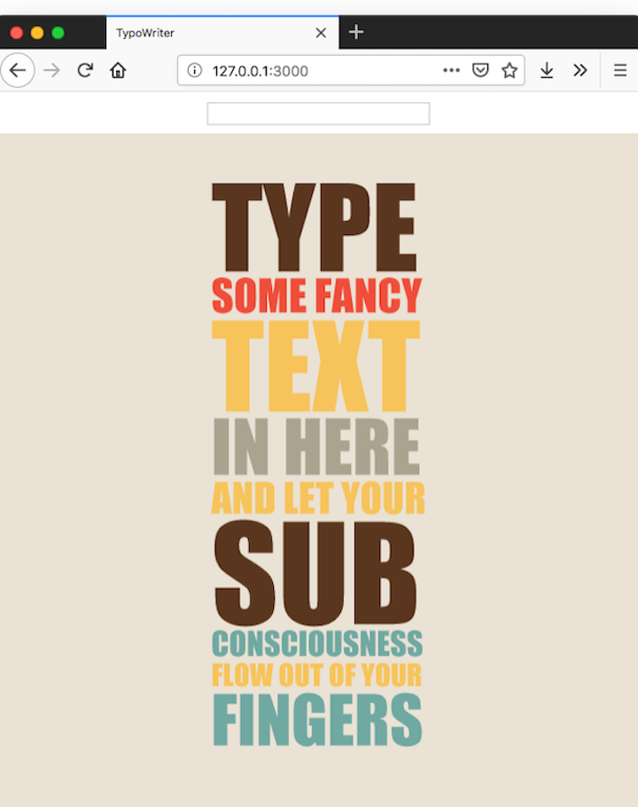

# Creative Coding I: Design & Communication

Jonathan Ho \| jonathangho@filmuniversitaet.de \| Film University Babelsberg KONRAD WOLF
Prof. Dr. Lena Gieseke \| l.gieseke@filmuniversitaet.de \| Film University Babelsberg KONRAD WOLF

---

# Script 01: Introduction

_Script Update History:_

| Date     | Change |
| -------- | ------ |
| 01-12-24 | Intro  |

---

- [Creative Coding I: Design \& Communication](#creative-coding-i-design--communication)
- [Script 01: Introduction](#script-01-introduction)
  - [Creative Coding](#creative-coding)
    - [Design and Communication](#design-and-communication)
    - [Examples](#examples)
      - [The Johnny Cash Project](#the-johnny-cash-project)
      - [Paper Planes](#paper-planes)
      - [Cinemetrics](#cinemetrics)
      - [Unnumbered Sparks](#unnumbered-sparks)
      - [Miro Boards](#miro-boards)
      - [Cloud-Based Systems](#cloud-based-systems)
    - [Learning Objectives](#learning-objectives)
  - [Tools and Environments](#tools-and-environments)
    - [Programming Languages](#programming-languages)
    - [Frameworks](#frameworks)
      - [Processing \& p5](#processing--p5)
      - [JavaScript](#javascript)
      - [C++](#c)
      - [Others](#others)
    - [Software](#software)
    - [Hardware](#hardware)
    - [Programming in this Class](#programming-in-this-class)
  - [Summary](#summary)
  - [Next](#next)
  - [Resources](#resources)

---

## Creative Coding

Think about the following questions for yourself for a moment:

_How would you define creativity?_

_What does it mean to you to be creative?_

<!-- ??? Discuss -->

_What do you understand as coding?_

<!-- ??? Discuss

 -->

There are actually no fixed definitions of what _creative coding_ means. Within CTech we understand creative coding as:

- producing something expressive rather than focussing on a practical use,
- developing software beyond its standard usage scenarios, and
- developing tools that help others to be creative.

The last aspect of developing tools is somewhat detached and not necessarily part of a common understanding of creative coding. However, to us it is an equally important topic. We would like to further integrate tool development into our portfolio with the goal of developing tools beyond the obvious and beyond practicability. When thinking about tool development in the context of web technologies, collaborative work and sharing ideas, content, etc. in the virtual space are exciting directions to go.

> Aesthetics, insight, joy, dialog, politics, collaboration, augmentation, emotion, perspectives, friendship,...

_How could you focus with a software project on the above mentioned terms, such as friendship?_

Well, the above is still pretty vague. What does it mean specifically? The following aspects of content creation, data and media formats describe in more detail what can be considered as creative coding:

1. Algorithms and generative systems to create graphics and sounds  
   → Procedural Generation and Simulation next term

2. The usage of smart, meaningful or unusual data sources

   - Images, video, sound
   - Camera and microphone
   - Online resources such as Twitter and Instagram
   - Mobile devices as sensors
   - ...

3. The employment of various output formats
   - Web
   - From large-scale such as buildings to small-scale such as smart watches
   - Multi-screen setups for example with mobile devices
   - ...

For your creative work, I would like to encourage you to use the following as guidance:

> What do we have available and what can we do with it beyond the obvious?

---

### Design and Communication

The main goal of the course _Creative Coding I: Design and Communication_ is for you to explore with text-based programming different forms of designs and communication, be it through visuals, audio, text or data. Applications focus on a creative context investigating aesthetics, human experiences and insight, rather than practicality. At the same time, you will strengthen your skills to solve complex problems in a structured manner and to advance your programming techniques.

As one of our main means of communication is the web, we will focus on web-based programming environments such as p5, three.js and JavaScript in general. This gives us the unique opportunity to share our work easily and potentially with the community of all web users.

_Who are all web users?_

### Examples

#### The Johnny Cash Project

  
[[Cash Project - Animation]](https://owncloud.gwdg.de/index.php/s/ZtWMVcHEpmrknE3)

<!--
???
Ich persönlich finde die Animation gelungen, sie spiegelt das Thema des Liedes über Sterblichkeit, Wiedergeburt und das ewige Leben.

Was Ihr hier gesehen habt ist aber nicht nur eine Animation. Es ist ein kollaboratives Projekt an dem bis heute über 250000 Menschen aus 172 Ländern teilgenommen haben. Es ist ein online Projekt mit dem jeder einen einzelnen Frame des originalen Video interpretieren kann. Darüber hinaus kann man auf der Webseite sich alle Frames einzeln anschauen, verschieden Konfigurationen des Video ansehen, Frames werden zum Bespiel nach Stil getackt. Des weiteren nimmt die Webseite den Prozess des Malens auf, so dass man sich hinterher anschauen kann, wie die einzelnen zu Ihrem Endergebnis gekommen sind.

Dazu hier ein Video in dem der Erschaffer der Seite, Medienkünstler Aaron Koblin, der die Benutzung der Webseite kurz erklärt…
 -->

<!--
???
Und durch diese mögliche Interaktion mit der Webseite, wird die Animation zu einer dynamischen sich kontinuierlich entwickelnden Datenbank an möglichen Outputs und die Website zu einem erzählenden und Menschen verbindenden Medium.

Dazu hier noch mal ein kurzes Video, in dem Teilnehmer ihre Erfahrung kommentieren.
 -->

  
[[Cash Project - Website]](https://owncloud.gwdg.de/index.php/s/IVvTrSu2GL4gTvX)

<!--
???
und für mich ist hier die Schlüsselaussage: die Webseite, also die Application erzeugt “A living, breathing memorial” an dem wir alle teilhaben können.

Dieses Projekt zeigt wie durch den durchdachten und künstlerischen Einsatz von Technik, die Technik selbst eine ganz besondere Bedeutung bekommt und wie in diesem Fall nicht nur eine interessante Animation produziert sondern eine tiefergehende und gemeinschaftliche Erfahrung für den User oder das Publikum geschaffen wird.

Und hier möchte ich mich eines Zitats des Mededientheoretikers McLuhan bedienen, das ich hier etwas dehne, was aber nichtsdestotrotz spiegelt, was ich sagen möchte. Und zwar sag McLuhan
 -->

  
[[Cash Project - Comments]](https://owncloud.gwdg.de/index.php/s/LYx9pV3hPcUzChu)

Website: [The Johnny Cash Project](http://www.thejohnnycashproject.com/)

#### Paper Planes

  
[[Paper Planes]](https://paperplanes.world/)

Website: [Paper Planes](https://paperplanes.world/)

<!--

[[Arms Globe]](https://armsglobe.chromeexperiments.com/)

[[deck.gl]](https://deck.gl/showcases/wind/)

-->

#### Cinemetrics

  
[[Cinemetrics by Frederic Brodbeck]](http://cinemetrics.fredericbrodbeck.de/)

Website: [Cinemetrics](https://paperplanes.world/)

#### Unnumbered Sparks

[]  
  
[[Unnumbered Sparks]](http://www.aaronkoblin.com/project/unnumbered-sparks/)

Website: [Unnumbered Sparks](http://www.aaronkoblin.com/project/unnumbered-sparks/)

#### Miro Boards

On of the most famous examples of an online tool for collaborative work are Miro boards. These are not really creative coding but maybe a good inspiration to start with.

How to make this system more fun or more interesting? Any ideas?

#### Cloud-Based Systems

[The Evolution of Media Creation - A 10-Year Vision for the Future of Media Production, Post and Creative Technologies](https://movielabs.com/):

  

> All assets are created or ingested straight into the cloud and do not need to be moved.

> Applications com to the data.

---

_Do you know of any creative coding examples? Please share!_

---

### Learning Objectives

With this course, you will

- advance your ability to write code,
- advance your ability to conceptualize and design,
- acquire fundamental knowledge of web technologies,
- use software development in a creative context, and
- implement specific design goals.

The individual learning objectives highly depend on the skill level you start with. Assignments will be flexible and should be challenging for everybody. Topic-wise, we are also somewhat flexible. If you want to focus more on developing tools, not as a creative but for creatives, let's get into a conversation and see how to make it work (meaning, come and talk to me!).

Here some impressions of student projects of the previous years:

  
[by Phil Clausen]  
  
[by Simon Stimberg]  
  
[by Simon Stimberg]  
  
[by Phil Clausen]  
  
[by Simon Detje]  
  
[by Simon Detje]  
  
[by Mathias Fontain]  
  
[by Markus Traber]  
  
[by Markus Traber]  
  
[by Zainab Tariq]  
  
[by Jacky Lai]  
  
[by Denise Bischof]  
  
[by Denise Bischof]  
  
[by Anna Eschenbacher & Zainab Tariq]  
  
[by Anna Eschenbacher & Zainab Tariq]

---

As part of the introduction, I would like to give you an overview of possible languages, tools and environments for creative coding. I classify these aspects into:

## Tools and Environments

1. Programming Languages and Frameworks
2. Software
3. Hardware

### Programming Languages

- JavaScript
- Python
- C++
- Java
- C#
- Scala
- Clojure
- Rust
- Kotlin

### Frameworks

> A software framework is a universal, reusable software environment that provides particular functionality as part of a larger software platform to facilitate development of software applications, products and solutions.

- A special case of software libraries
- Abstractions of code wrapped in a well-defined Application Programming Interface (API)
- Contain some key distinguishing features

[[Wikipedia: Software Framework]](https://en.wikipedia.org/wiki/Software_framework)  
[[Stack Overflow: What is a software framework]](https://stackoverflow.com/questions/2964140/what-is-a-software-framework)

#### Processing & p5

- Processing & p5 provide frameworks and IDEs to easily create and work with graphics, sound and interaction.
  - Processing: Java-based and standalone
  - p5: Javascript wrapper for Processing and web-based
- The holy grail for artists and creative coders.
- Focus on simplicity for beginners but also suitable for prototyping for experts.

> Our mission is to promote software literacy within the visual arts, and visual literacy within technology-related fields — and to make these fields accessible to diverse communities. Our goal is to empower people of all interests and backgrounds to learn how to program and make creative work with code, especially those who might not otherwise have access to these tools and resources.

[[The Processing Foundation]](https://processing.org/)[[Crouch, M. (2019). 6 ways to get into creative coding. Creative Bloq.]](https://www.creativebloq.com/features/6-ways-to-get-into-creative-coding)

_On A Side Note:_ Processing came first and still a bit better documented but to me it feels like as if the Processing Foundation is moving away from Processing and solely focus on p5 now. In this class we will only work with p5. You should chose between using Processing and p5 depending on the type of project, you are doing.

_When is it more suitable to use Processing, when p5?_

<!-- ??? Who has worked with Processing before? -->

#### JavaScript

JavaScript libraries directly relevant in the creative coding context (of course we will need base tools such as node.js as well):

- [p5.js](https://p5js.org/examples/)
- [sketch.js](http://soulwire.github.io/sketch.js/)
- [D3](https://d3js.org/)
- [PixiJS](http://www.pixijs.com/gallery)
- [Phaser](https://phaser.io/)
- [three.js](https://threejs.org/)
- [babylonjs](https://www.babylonjs.com/)
- [Modzilla Hubs](https://hubs.mozilla.com/)

<!-- ??? Any other suggestions? -->

#### C++

- [OpenFrameworks](https://openframeworks.cc/)
- [Cinder](https://libcinder.org/gallery)  
  → Creative Coding II next term: OpenFrameworks

#### Others

- [Nannou for Rust](https://nannou.cc/)
- [OpenRNDR for Kotlin](https://openrndr.org/)

### Software

- [Touch Designer](https://www.derivative.ca/), [vvvv](https://vvvv.org/), [Pure Data](https://puredata.info/), [Max/MSP](https://cycling74.com/)
- [MadMapper](https://madmapper.com/), [Millumin 2](https://www.millumin.com/v2/index.php), [VDMX](https://vidvox.net/), [Resolume](https://resolume.com/)
- [LUMOplay](https://www.lumoplay.com/)
- [Unity](https://unity3d.com), [Unreal](https://www.unrealengine.com)
- [Reaper](https://www.reaper.fm/), [Ableton](https://www.ableton.com)
- [Maya](https://www.autodesk.de/products/maya/overview), [Houdini](https://www.sidefx.com/), [3dsMax](https://www.autodesk.de/products/3ds-max/overview), [Cinema4D](https://www.maxon.net/de/produkte/cinema-4d/cinema-4d/), [ZBrush](https://pixologic.com/), [Allegorithmic](https://www.allegorithmic.com/)
- [Nuke](https://www.foundry.com/products/nuke), [After Effects](https://www.adobe.com/de/products/aftereffects.html), [Avid](https://www.avid.com/de/), [Premiere](https://www.adobe.com/products/premiere.html?promoid=PQ7SQBYQ&mv=other)
- [Flash](https://en.wikipedia.org/wiki/Adobe_Flash), [Director MX](https://en.wikipedia.org/wiki/Adobe_Director)
- [Photoshop](https://www.adobe.com/products/photoshop.html?promoid=PC1PQQ5T&mv=other), [Illustrator](https://www.adobe.com/products/illustrator.html?promoid=PGRQQLFS&mv=other), [InDesign](https://www.adobe.com/products/indesign.html)

...

Please refer to the [learning list about software](https://github.com/ctechfilmuniversity/ctech_resources/tree/master/learning) in the [ctech_resources](https://github.com/ctechfilmuniversity/ctech_resources) repo (and add to it if you know of something that is not included in the list)!

<!-- ??? Any other suggestions? -->

### Hardware

- Micro controllers
- Sensors, e.g. depth
- Projectors
- VR, AR, MR devices
- Displays
- Drone
- Eye, brain tracker  
  → Technology Introductions and Creative Technologies this term

### Programming in this Class

The focus of this class is not "learn how to program", however it is the goal that you all learn how to program with this class 😁. With this I mean that overall we do not cover language specifics in too much detail. Hopefully you build your programming skills through the practical assignments and looking into the details that you need for your assignment individually, making progress on your level.

<!--
The web development specifics I will cover as part of the class though such as:

* Web server, asynchrone execution, ...
* (Functional vs. Object Oriented programming)
-->

---

## Summary

As summary to this short introduction to creative coding, I like the following advertisements from Mercedes a lot. To me they represent us - Creative Technologists - very well.

  
[[I believe in ad]](http://www.ibelieveinadv.com/commons2/mercedes-benz-left-brain-right-brain-einstein.jpg)

_On A Side Note_: Please keep in mind though that the theories of the sides of our brains having the above characteristics are simply wrong. Our brains are much more complex and there is no scientific evidence for tests such as "are you a left or right brain person"?

## Next

Next, it is time to look a bit more into our specific coding environment and needed setup.

## Resources

[[1] Awesome Creative Coding](https://github.com/terkelg/awesome-creative-coding)  
[[2] Research essay: The History of Processing](https://maxoffsky.com/research/research-essay-the-history-of-processing/)  
[[3] A History of Creative Coding](https://medium.com/@laserpilot/a-history-of-creative-coding-8771524b9775)  
[[4] Awesome Design](https://github.com/gztchan/awesome-design)

---

The End  
🚀
