# Creative Coding I: Design & Communication

Jonathan Ho \| jonathangho@filmuniversitaet.de \| Film University Babelsberg KONRAD WOLF
Prof. Dr. Lena Gieseke \| l.gieseke@filmuniversitaet.de \| Film University Babelsberg KONRAD WOLF

---

# Script 03: Git & GitHub

_Script Update History:_

| Date     | Change      |
| -------- | ----------- |
| 01-12-24 | Git, GitHub |

---

- [Creative Coding I: Design \& Communication](#creative-coding-i-design--communication)
- [Script 03: Git \& GitHub](#script-03-git--github)
  - [Git](#git)
    - [Git Terminology](#git-terminology)
      - [Repository](#repository)
      - [Staging](#staging)
      - [Commit](#commit)
      - [Branch](#branch)
      - [Master](#master)
      - [Conflicts](#conflicts)
    - [Git Basic Workflow](#git-basic-workflow)
    - [Git Command Overview](#git-command-overview)
  - [GitHub](#github)
    - [GitHub Online Repositories](#github-online-repositories)
    - [GitHub Terminology](#github-terminology)
      - [Pull](#pull)
      - [Push](#push)
      - [Origin](#origin)
    - [GitHub Command Overview](#github-command-overview)
    - [GitHub Basic Workflow](#github-basic-workflow)
  - [How to Start Working With GitHub](#how-to-start-working-with-github)
    - [Install Git and Create a GitHub Account](#install-git-and-create-a-github-account)
    - [GitHub Environnement](#github-environnement)
    - [Configuring GitHub For The First Time](#configuring-github-for-the-first-time)
    - [Working With the Class Repository](#working-with-the-class-repository)
    - [Setting up GitHub in Visual Studio Code](#setting-up-github-in-visual-studio-code)
      - [Cloning the Class Repository](#cloning-the-class-repository)
      - [Usage Example](#usage-example)
  - [Workflow Hints](#workflow-hints)
    - [Committing](#committing)
    - [Log](#log)
    - [.gitignore](#gitignore)
  - [Collaboration](#collaboration)
  - [Summary](#summary)
  - [Additional Resources](#additional-resources)

GitHub is an online code hosting platform for _version control_ and _collaboration_.

It lets you and others work together on projects from anywhere. Nowadays GitHub is the largest online storage space of collaborative works that exists in the world.

Even if you aren’t collaborating with other people, automated [version control](https://en.wikipedia.org/wiki/Version_control) is always a good idea...

 [[source]](https://swcarpentry.github.io/git-novice/fig/phd101212s.png)  
 [[source]](http://smutch.github.io/VersionControlTutorial/)

In the following I will give you a brief introductions of the most relevant terms and functionality. As mentioned before, for accessing the material of most CTech classes you must - at the very least - be able to

- clone a repo to your computer,
- know how to `add` and `commit` files to git locally,
- know how to `pull` and `push` files from the online GitHub repo.

There are a zillion tutorials regarding Git and GitHub on the internet. Feel free to explore the topic further. However, as with so many technical topics, you will really only learn GitHub by using it and coming across real-world problems while doing so. I can tell you already, you will run into many problems that might at first feel unsolvable to you. We have all been there, it is part of the learning process. Just keep swimming 🐠😊.

## Git

[Git](https://git-scm.com/) is the software that runs at the heart of GitHub. At its core Git takes care of versioning your files _locally_ on your machine. For the time being forget all about GitHub and its online world - we will come back to it once I have explained Git's core versioning functionalities.

Thank famed software developer Linus Torvalds for Git (who is also responsible for the Linux operating system)!

 [[source]](http://pre05.deviantart.net/ef26/th/pre/f/2011/282/9/3/geniuses_by_anjunabeats9-d4c9sh1.jpg)

Git keeps _snapshots_ of points in time in a project’s history, so you can never lose or overwrite anything.

Automated version control systems are nothing new. Tools like RCS, CVS, or Subversion have been around since the early 1980s and are used by many large companies. However, many of these are now becoming considered as legacy systems due to various limitations in their capabilities. In particular, the more modern systems such as Git are distributed, meaning that they do not need a centralized server to host the repository. Git and GitHub are currently the most popular version control systems.

Learning Git and GitHub can feel daunting at times. Linus Torvalds, the creator of Git, once described the newly invented system as:

> ...a version control system which is expressly designed to make you feel less intelligent.
> [[source]](https://www.youtube.com/watch?v=4XpnKHJAok8&feature=youtu.be)

So be patient with yourself to learn it...

The most complicated features such as branching, merging and conflicts are mainly relevant when you work with other people on the same file, which is not relevant for this class.

Fear not! Git does get easier with practice.

---

### Git Terminology

#### Repository

A directory or storage space where your projects can live. It can be local to a folder on your computer, or it can be a storage space on GitHub or another online host.

For this part of the tutorial we only consider the repositories that git creates locally on your machine.

#### Staging

Putting your files into a repository and creating a version is actually a two-step process, consisting of _adding_ (_adding them to the stage_) and then _committing_ (_putting the staged files into the repository_) the files. This setup gives you better control over which files in your directory to commit and which not.

When you add files to the stage you are taking a _snapshot_ of the files in preparation for the commit.

If you don’t have anything staged when you `commit`, Git will prompt you to add all changes to the stage automatically and directly commits. It’s almost always better to explicitly add things to the staging area manually, because you might commit changes you forgot you made. Stage files manually, or you might find yourself searching for _git undo commit_ more than you would like!

#### Commit

A commit takes the staged snapshot of the files and permanently stores them in the repository.

#### Branch

Branches are the different life lines of code in a repository. Each branch has it own version history of commits. There is always the _master_ branch, which can be understood as the project itself. For enabling multiple people to work on a project at the same time, usually they _branch off_ of the main project with their own version of the project. The project is duplicated into their workspace and committed changes to that branch do not affect the master branch. After the work is done, the branch is _merged_ back with the _master_ (if there aren’t conflicts).

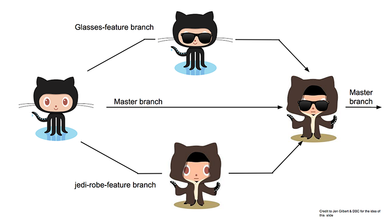 [[source]](https://www.teaching-materials.org/git/#/56)

Branches are reason for Git being complicated to work with at times. We are not working with different branches in this class, only the master branch.

#### Master

In Git, `'master'` is a naming convention for the main branch, which every repository starts with. The `master` can be seen as a repository's `'default'` branch.

#### Conflicts

Most of the time Git is pretty smart about managing code modifications and merging changes together into one document.

A conflict arises if two versions, for example the master and a branch worked on the same line of code. When the branch now tries to be merged back to the master, there will be a conflict.

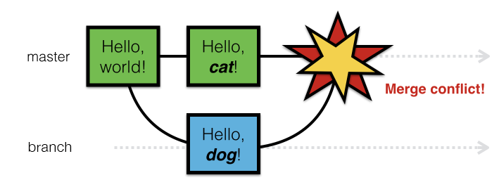 [[source]](https://www.teaching-materials.org/git/#/70)

All conflicts must be resolved before you can commit your work. Conflicts must be resolved manually by looking at both versions of the problematic line of code and choosing which version to keep. For resolving conflicts most GitHub tools offer previews that show the problematic lines of code and their different versions.

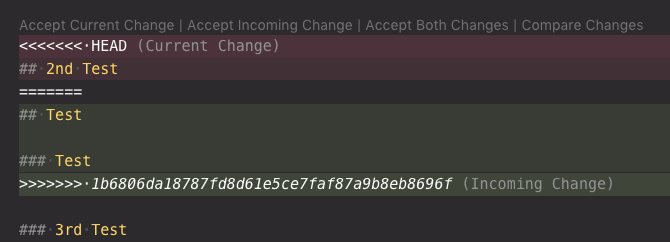

Syntax

- `'<<<<<<< HEAD'` indicates the start of the local changes
- `'========'` indicates the start of the incoming changes
- `'>>>>>>>>'` indicates the end of the conflicting area

You can then chose between the options (commands might vary from tool to tool, this following is VSCode):

- `Accept current changes`: keeping the local version, rejecting the incoming changes
- `Accept incoming changes`: rejecting the local version, overwriting everything with the the incoming changes
- `Accept Both Changes`: keeping both the local and incoming version in one file, potentially doubling lines
- `Compare Changes`: opening file compare view in which you can resolve conflicts line by line

---

### Git Basic Workflow

The _most basic_ git workflow for versioning your files locally looks like the following:

- `Initialize` a directory as git directory (this needs to be done only once)
- Work on files...
- `Add` the files that you want to commit to the stage
- `Commit` the staged files to the repository
- Work on files...

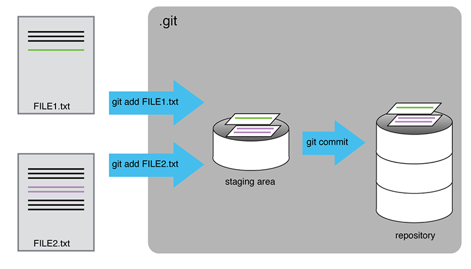 [[source]](https://swcarpentry.github.io/git-novice/fig/git-committing.svg)

Please keep in mind that this situation is only on your computer locally. We will come to working with GitHub in a minute.

---

### Git Command Overview

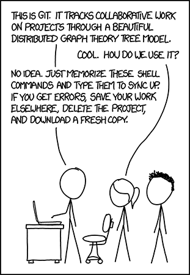 [[source]](https://xkcd.com/1597/)

(No worries, I list the terminal commands here mainly to explain Git's functionality. You can access the commands also through Visual Studio Code and you don't have to use the terminal for it.)

Even though git is super powerful, its main functionality only consists of a handful of [commands](https://services.github.com/on-demand/downloads/github-git-cheat-sheet.pdf):

- `git --help`
  - Shows and explains all commands available for git.
- `git config`
  - Configures Git when using it for the very first time.
- `git init`
  - Initializes a new Git repository. Until you run this command inside a folder, it’s just a regular folder. You can only run other Git commands in a folder after you initalized it.
- `git status`
  - Show you the status of your repository and its files. It indicates which changes still need to be committed, and which branch of the repository you’re currently working on.
- `git log`
  - Lists the version history and the commit messages for the current branch.
- `git add`
  - This does _not_ add new files to your repository but adds snapshots to the stage and prepares them for the commit.
- `git commit`
  - Git’s most important command. It saves the staged snapshots of the repository as a version. Usually it goes `'git commit -m “Message Here'`. The `-m` option enables a mandatory commit message.
- `git branch [branch-name]`
  - This command will let you build a new branch and creates a copy of the project that is completely your own. If you wanted a new branch called “cats,” you’d type `git branch cats`.
- `git checkout [branch-name]`
  - Switches to the specified branch and updates the working directory.
- `git merge`
  - When you’re done working on a branch, you can merge your changes back to the master branch, which is visible to all collaborators. `'git merge cats'` would take all the changes you made to the “cats” branch and add them to the master.
- `git diff`
  - Shows file differences, that not yet staged between your local files and the repository.

## GitHub

 [[source]](https://www.palermo.edu/Archivos_content/ingenieria/top/130712_git_github_topdenota1.jpg)

GitHub makes Git easier to use in two ways:

- It provides a visual interface for managing version-controlled projects
- It puts version-controlled projects _online_, and ties in social network features

GitHub is the most popular interface to Git and the standard. However, there are interesting competitors, such as [BitBucket](https://www.atlassian.com/software/bitbucket).

### GitHub Online Repositories

GitHub provides the option to save files and work with repositories _online_. The online GitHub repositories are separat repositories and need to be connected to your local Git repositories.

### GitHub Terminology

#### Pull

When your local repository is connected to an online one on GitHub, you _pull_ the recent version from the online repository into your local one.

#### Push

When your local repository is connected to an online one on GitHub, you _push_ your recent commits from your local repository into the online one.

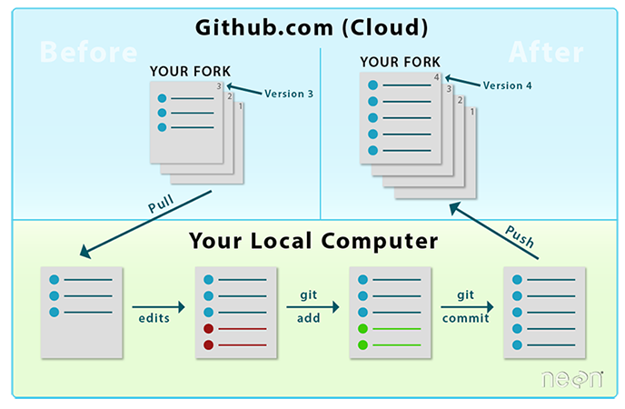 [[source]](https://www.neonscience.org/github-git-add)

#### Origin

_Origin_ can be understood as the default name for the connected remote GitHub repository where you want to publish (_push_) your commits to. Under the hood, origin is _not_ the remote repository name but rather a local alias in place of the remote repository URL. You could change this alias to any name you like. The alias avoids the user having to type the whole remote URL when prompting a push. For example the command

```
git push origin branch_name
```

Without branches, as in this class, the branch name is `main` (it used to be `master` hence these days you will still see both names in repos for a "default" branch)

```
git push origin master
```

<!--
This is the same as (this is not recommended - WHY NOT?)
```
git push git@github.com:username/repo_name.git branch_name
``` -->

---

### GitHub Command Overview

(strictly speaking these are also git commands - from now on I will only speak of GitHub, not differentiating whether I mean Git or GitHub)

- `git clone`
  - Downloads an online repository and its entire version history and connects and initializes a local repository for it.
- `git push`
  - If you are working on your local computer, and want your commits to be visible online on GitHub as well, you “push” the changes up to GitHub with this command.
- `git pull`
  - If you’re working on your local computer and want the most up-to-date version of the online repository, you “pull” the commits from GitHub with this command.

---

### GitHub Basic Workflow

Now that we know of the separate online repository on GitHub.com, we also want to integrate the push and pull into the most basic workflow (assuming that the folder is already initialized as git folder and connected to the online repository - we will come back to this):

- Retrieve possible changes from the online repository with `pull`
  - If you are absolutely certain that it is only you working on the repository and that there can not be any changes which you do not have in your local repository, you can skip the pulling (e.g. for your personal assignments folder).
- Work on files...
- `Add` the files that you want to commit to the stage
- `Commit` the staged files to your local repository
- `push` the commit to also save it in the online repository
- Work on files...

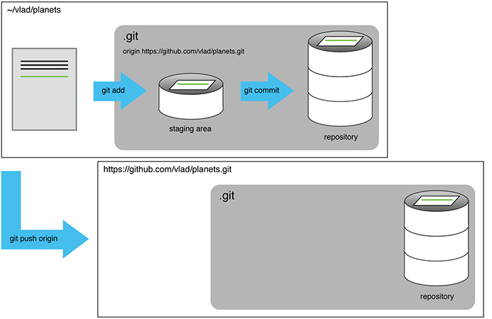 [[source]](http://swcarpentry.github.io/git-novice/fig/github-repo-after-first-push.svg)

## How to Start Working With GitHub

### Install Git and Create a GitHub Account

- Create a [GitHub account](https://github.com/join)
  - Accounts are free for public repositories, but there's a charge for private repositories
  - GitHub does everything in its power to ensure that you retain total ownership of any projects you upload to the site:
    > We claim no intellectual property rights over the material you provide to the Service. Your profile and materials uploaded remain yours.
- [Install Git](https://git-scm.com/downloads) on your machine

### GitHub Environnement

Within our setup there are three possible choices for of how to work with GitHub:

- Git command line tools
- Within your editor, e.g. Visual Studio Code,
- [GitHub Desktop Application](https://desktop.github.com/)
- [Sourcetree](https://www.sourcetreeapp.com/), which offers you a visualization of the version tree.

Here a preview of Sourcetree:

  
[[sourcetree]](https://www.sourcetreeapp.com/)

I personally use a mixture of the command line tools and Visual Studio Code. I like to use Visual Studio Code for GitHub because like this I can stay within one tool and don't have to switch between applications.

In the following I will explain how to work with GitHub through VSCode.

If you are interested in the [GitHub Desktop Application](https://desktop.github.com/) have a look yourself. It is straight-forward to use!

### Configuring GitHub For The First Time

When you use Git on a new computer for the first time, you need to configure a few things.

You can do it in the command line, for example. On Windows, that means starting the Git Bash app you just installed, and on OS X, it’s the regular Terminal.

    git config --global user.name "Your Name"
    git config --global user.email "your@email.com"
    git config --global color.ui "auto"

This user name and email will be associated with your Git activity. Make sure to user the same email you used when you signed up for a GitHub.com account!

<!-- If your are using Visual Studio Code and added the `code` command to your shell, you can set VSCode as default editor for Git:

    git config --global core.editor "code -n -w"

`-n` means open in a new window and `-w` that the command line will wait until the commit message is saved and closed. -->

**This configuration only needs to be done _once_.**

### Working With the Class Repository

There are two options for starting to work with GitHub

1. Initialize a local folder as git repository, work and commit to your local repository and [remote add](https://help.github.com/articles/adding-an-existing-project-to-github-using-the-command-line/) it to connect it to an online repository on GitHub.com
2. Clone an existing online repository from GitHub and create a local repository for it. Then start working on those files locally.

**As the repository [`lecture_creative_coding_1`](https://github.com/ctechfilmuniversity/lecture_ws2223_creative_coding_1) for the class already exists on GitHub, we need to use option 2.**

For now you only need to know how to pull the most recent versions from the online repository into your local repository and how to push files and changes from your local repository into the online repository.

### Setting up GitHub in Visual Studio Code

1. Open `Code -> Preferences -> Settings`
2. Search for `git`
3. Make sure that Git is enabled in your VSCode settings
   - Check `Git Enabled`
4. Make sure that VSCode finds the Git executable
   - Set under `Git Path` path and filename of the git executable (this needs to be done in the textfile version of the settings)
   - E.g. Windows (depending in your system):
   ```
   "git.path": "C:\Program Files\Git\bin\git.exe",
   ```
   - E.g. Mac (depending in your system):
   ```
   "git.path": "/usr/bin",
   ```

#### Cloning the Class Repository

##### Terminal

Navigate to the folder where you want to add the git repo to. Execute

```
git clone https://github.com/ctechfilmuniversity/lecture_creative_coding_1.git
```

This will create a folder `lecture_creative_coding_1`, which is your already properly initialized git folder.

##### Visual Studio Code

For organizing your folders you can choose any folder / workspace structure you like. The below setup is just a suggestion.

I personally like to have a workspace which contains separate folders for my local work (and which I do not want to upload to the GitHub repo) and for the GitHub repo.

Basic Setup

- Have as highest, overall level e.g. a `cc1` folder, which will contain both your local and you github folders.
- Open a new, empty VSCode window.
- Save a e.g. `cc1.code-workspace` file in `cc1` (`File -> Save Workspace As...`)
- Add the `cc1` folder to the workspace
- In `cc1` create a folder for your local work, e.g. `local`

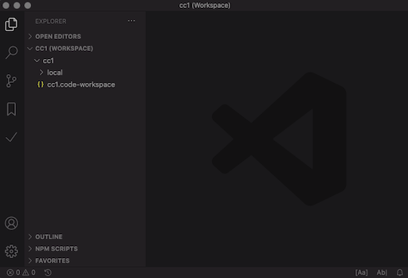  
 (the interface might look slightly different for you)

Cloning the GitHub repo (assuming that you did the initial git setup in VSCode)

- Open the command palette `View -> Command Palette...` (best to remember the hotkey for opening the command palette - or tattoo it into you hand, you decide on the better option...)
- Start typing `Git: Clone`, select that command
  1. This opens a text box which asks for the URL of the online repository you want to clone to your local machine
  2. Enter `https://github.com/ctechfilmuniversity/lecture_creative_coding_1.git`
  3. VSCode asks you to select the destination folder for the clone; select the `cc1` folder (this folder could actually be anywhere you like)
  4. VSCode asks you (with a textbox in the bottom right corner) whether you want to add the selected folder for the git clone to your workspace folder; this is not necessary if you chose a folder which is already part of the workspace (which `cc1` is), hence decline.

4. The folder with the github class repository (ws1920_cc1) should be visible and navigable in explorer on the left (you might need to first open the explorer `View -> Explorer`)

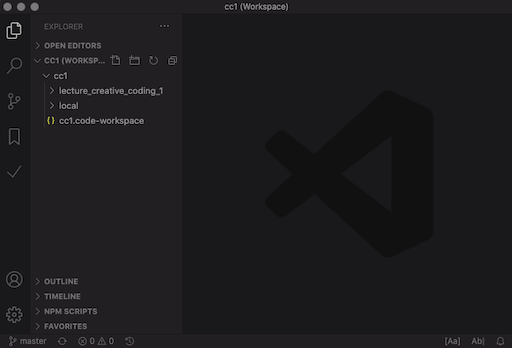

Now you have a fully functional local git repository which is connected to the online repository ws1920_cc1 on GitHub.com.

There is a whole tab dedicated to working with GitHub in VSCode. You open is with `View -> SCM` (Source Control Management). In that tab, clicking `...` in the top right corner gives access to the available git commands.

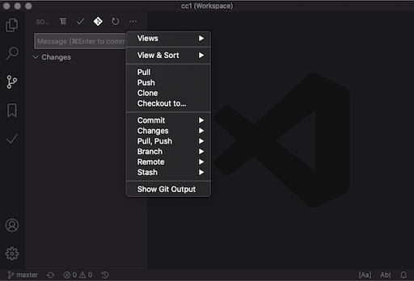

#### Usage Example

##### Pushing

1. Create in the github folder `lecture_creative_coding_1/03_assignments/` a new folder with your last name, e.g. `lecture_creative_coding_1/03_assignments/gieseke/`. All your assignments go into that folder.
2. For each assignment you should a folder with the number of that assignments, e.g. `lecture_creative_coding_1/03_assignments/gieseke/01`.
3. In that folder add a new test markdown file, e.g. `hello.md` and write some valid markdown in it (feel free to write something interesting).
4. In the SCM tab that file is now listed under `CHANGES`
5. Select the file and click on the `+` next to it in order add a snapshot of the file to the stage
6. The file is now listed under `STAGED CHANGES`
7. Add a commit message in the text box and commit the file
   - Now the commit is saved as a new version in your local repository
8. Also save the commit online in the GitHub repository by clicking in the `...` and selecting `Push`
   - Now your commit should be added to the online repository as well

##### Pulling

Just for demonstration purposes, make some changes to the file online (this is usually not part of a regular workflow)

1. Open online your `hello.md` and click on the `Edit this file` (the little pen on the top right)
2. Edit the file and make the commit online (below the file)
3. Go back to the `SCM` tab in VSCode and select in the `...` the `Pull` command - now you should have the changes you made online also locally

##### Conflict

1. Edit one line again online in the GitHub repository and commit your changes
2. Before you pull those changes, edit the very same line locally and commit those changes locally.
3. Pull the online changes - a text box should appear, telling you that there is a conflict; also the file will be marked with a `C` in the `SCM` tab
4. Select the file under `MERGE CHANGES`
5. Select from the given options the one you prefer, e.g. `Accept incoming changes`
6. Stage and commit your files

## Workflow Hints

- **Never** nest different git repositories as git will not be able to differentiate between them and your versioning will be inscrutable.
- Do not separately add sub-folders of your git repository into a Visual Studio Code workspace but only add the whole repository.

### Committing

- Use a short, descriptive, and specific comment that will help you to remember later on what you did and why
- Good commit messages start with a brief (<50 characters) summary of changes made in the commit.
- If you want to go into more detail, add a separate description.

For large projects with many collaborators there are [conventions](https://chris.beams.io/posts/git-commit/) on how to write commit messsage.

Avoid the following:

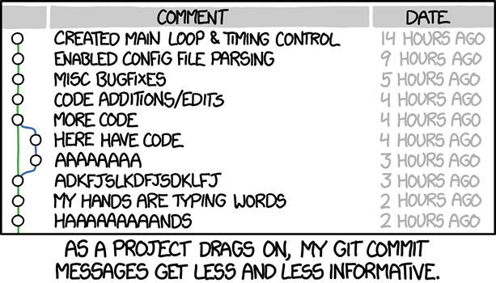 [[source]](https://imgs.xkcd.com/comics/git_commit_2x.png)

The seven rules of a great Git commit message are

1. Separate subject from body with a blank line
2. Limit the subject line to 50 characters
3. Capitalize the subject line
4. Do not end the subject line with a period
5. Use the imperative mood in the subject line
6. Wrap the body at 72 characters
7. Use the body to explain what and why vs. how

### Log

To view the commit history of a local repository in VSCode, I recommend the extension [Git History](https://marketplace.visualstudio.com/items?itemName=donjayamanne.githistory).

This is the same as using in the terminal

    $ git log

To avoid having `git log` cover your entire terminal screen, you can limit the number of commits that Git lists by using `-N`, where N is the number of commits that you want to view.

- Git log lists all commits made to a repository in reverse chronological order.
- The listing for each commit includes the commit’s full identifier (which starts with the same characters as the short identifier printed by the git commit command earlier), the commit’s author, when it was created, and the log message Git was given when the commit was created.

### .gitignore

For each git repo, you should setup a `.gitignore` file locally.

In a `.gitignore` file, saved in your repository (e.g. in `lecture_creative_coding_1`) you can list files and folders that git should always ignore. What to ignore can also be specified with wildcards such as `*.log`.

For example on a mac, you want to ignore the `.DS_Store` files, which are stored by default in each folder, and add these as `*.DS_Store` to `.gitignore` (the \* means those files anywhere).

As what to ignore highly depends on your personal file and folder structure, you should not push your `.gitignore` file to our GitHub repo. For that add `.gitignore` to your `.gitignore` file. Usually, every collaborator can have her or his own gitignore setup (unless this is otherwise agreed on with the team).

##### Resources

- [Documentation gitignore](https://git-scm.com/docs/gitignore)
- [Gitignore Explained: What is Gitignore and How to Add it to Your Repo](https://www.freecodecamp.org/news/gitignore-what-is-it-and-how-to-add-to-repo/)
- [Ignoring Files and Directories in Git (.gitignore)](https://linuxize.com/post/gitignore-ignoring-files-in-git/)

## Collaboration

As a next step in learning Git and GitHub, we would talk about

- Differences
- Merging
- Branches

But this is not really needed for this class and with that a topic for a later time...

## Summary

- Have an environment for working with Git and GitHub.
- Have your environment configured and ready.
- Know how to work with Git locally.
- Know how to sync your local repo with our only GitHub repository.
- Know how to work with a `.gitignore` file and have one setup for your repo locally.

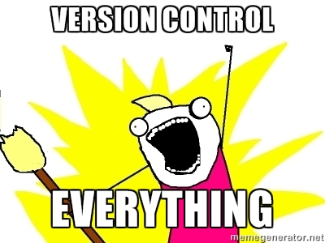  
[[awesome-vcs]](https://camo.githubusercontent.com/bbd2fecaa6c5bfdd681aed954ce482532339c09a/687474703a2f2f692e696d6775722e636f6d2f503061444249542e6a7067)

## Additional Resources

- [Understanding github a journey for beginners: Part 1](http://readwrite.com/2013/09/30/understanding-github-a-journey-for-beginners-part-1/)
- [Git Novice](https://swcarpentry.github.io/git-novice/)

---

The End

🗂 ⏱ 🔍
