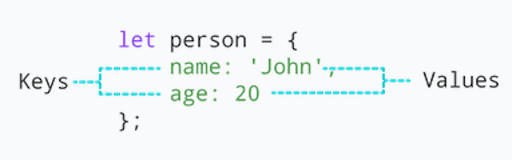
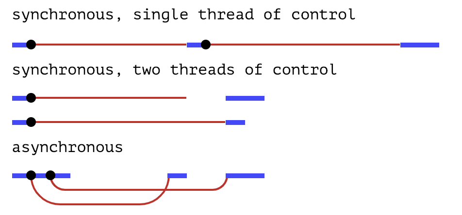
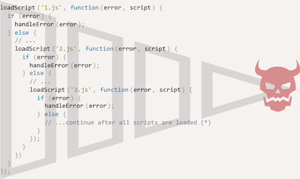
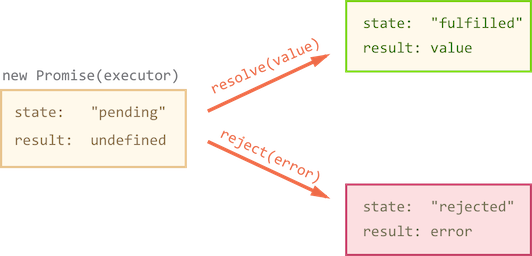
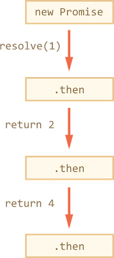

# Creative Coding I: Design & Communication

Jonathan Ho \| jonathangho@filmuniversitaet.de \| Film University Babelsberg KONRAD WOLF
Prof. Dr. Lena Gieseke \| l.gieseke@filmuniversitaet.de \| Film University Babelsberg KONRAD WOLF

---

# Script 04 - JavaScript

- [Creative Coding I: Design \& Communication](#creative-coding-i-design--communication)
- [Script 04 - JavaScript](#script-04---javascript)
  - [Introduction](#introduction)
  - [Tutorials and References](#tutorials-and-references)
  - [Strict Mode](#strict-mode)
  - [Semicolons](#semicolons)
  - [Variables](#variables)
    - [Dynamic Typing](#dynamic-typing)
    - [Variable Definition](#variable-definition)
  - [Data Types](#data-types)
    - [Equality Check](#equality-check)
  - [Data Structures](#data-structures)
    - [Objects](#objects)
      - [Definition](#definition)
      - [Accessing Properties](#accessing-properties)
      - [Nested Objects](#nested-objects)
      - [Values By Reference](#values-by-reference)
      - [Methods](#methods)
      - [`this`](#this)
    - [Classes](#classes)
    - [Arrays](#arrays)
      - [Internals](#internals)
    - [JSON](#json)
  - [Error Handling](#error-handling)
    - [The Error Object](#the-error-object)
  - [Functions](#functions)
    - [Optional Arguments](#optional-arguments)
    - [Rest Parameters](#rest-parameters)
    - [Pass by Reference vs. by Value](#pass-by-reference-vs-by-value)
  - [Higher Order Functions](#higher-order-functions)
    - [Anonymous Functions](#anonymous-functions)
    - [Arrow Functions](#arrow-functions)
    - [Closures](#closures)
      - [Global Variables](#global-variables)
      - [Variable Lifetime](#variable-lifetime)
      - [A Counter Dilemma](#a-counter-dilemma)
      - [Nested Functions](#nested-functions)
      - [Setup](#setup)
  - [Asynchronism](#asynchronism)
    - [Callbacks](#callbacks)
    - [Error-First Callbacks](#error-first-callbacks)
    - [Nesting Callbacks](#nesting-callbacks)
    - [Pyramid of Doom](#pyramid-of-doom)
  - [Promises](#promises)
    - [Understanding Promises](#understanding-promises)
    - [Creating a Promise](#creating-a-promise)
    - [Consumers: `then` and `catch`](#consumers-then-and-catch)
    - [Chaining Promises](#chaining-promises)
      - [Sequencing](#sequencing)
      - [Returning Promises](#returning-promises)
      - [Summary then \& catch](#summary-then--catch)
    - [Async/Await](#asyncawait)
      - [Async](#async)
      - [Await](#await)
      - [Example](#example)
      - [Summary](#summary)
  - [Modules](#modules)
    - [Export](#export)
      - [Named Exports](#named-exports)
      - [Default Exports](#default-exports)
    - [Import](#import)
      - [Import From Named Exports](#import-from-named-exports)
      - [Import From Default Exports](#import-from-default-exports)
  - [Style Guide](#style-guide)
    - [Spaces and Tabs](#spaces-and-tabs)

---

## Introduction

JavaScript, often abbreviated as JS, is an interpreted programming language (meaning it runs as is and you don't need to compile it to execute your code), which allows you to implement complex things on web pages. Every time a web page does more than just sit there and display static information for you to look at, e.g., displaying timely content updates, interactive maps, animated 2D/3D graphics, scrolling video jukeboxes, etc., you can bet that JavaScript is probably involved. Alongside HTML and CSS, JavaScript is one of the three core technologies of the World Wide Web (we will come back to this). The vast majority of websites use JS, and all major web browsers have a dedicated JavaScript engine to execute it.

As a multi-paradigm language, JavaScript supports event-driven, functional, object-oriented and prototype-based programming styles (don't worry about this if you don't understand). Although there are strong outward similarities between JavaScript and Java, including language name, syntax, and respective standard libraries, they are two distinct languages are and differ greatly in design.

Please note that in class we only use modern JavaScript based on ECMAScript 2015.

##### Resources

- [Wikipedia: JavaScript](https://en.wikipedia.org/wiki/JavaScript)
- [What is JavaScript](https://developer.mozilla.org/en-US/docs/Learn/JavaScript/First_steps/What_is_JavaScript)

## Tutorials and References

I mainly use two resources for Javascript:

- [The Modern JavaScript Tutorial](https://javascript.info/)
  - In detail, easy to follow explanations 😍
  - In my scripts I often just copy&paste from this tutorial (with the reference given, of course)
- [MDN JavaScript Reference](https://developer.mozilla.org/en-US/docs/Web/JavaScript/Reference)
  - As reference
  - There are also tutorials and explanations on specific example scenarios
  - A bit hard to navigate

An interesting read is also [Eloquent JavaScript](https://eloquentjavascript.net/). But it is lengthy and meant to be read as a whole.

## Strict Mode

[`"use strict";`](http://javascript.info/strict-mode)

This is a directive for using modern JavaScript. It has to be at the top of the script. Always use it as “modern” mode changes the behavior of some built-in features and not using strict mode might lead to unexpected behavior.

All examples in class assume strict mode, unless (very rarely) specified otherwise. In p5 we don't care about this for now.

## Semicolons

A semicolon should be present after each statement, even if it could possibly be skipped.


There are languages where a semicolon is truly optional and it is rarely used. In JavaScript, though, there are cases where a line break is not interpreted as a semicolon, leaving the code vulnerable to errors.

If you’re an experienced JavaScript programmer, you may choose a no-semicolon code style like StandardJS. Otherwise, it’s best to use semicolons to avoid possible pitfalls. The majority of developers put semicolons.

_On a side note:_ Once in while I might forget to put a semicolon. That doesn't mean that you should too.

##### Resources

- [Javascript.info - Coding Style](https://javascript.info/coding-style)

## Variables

### Dynamic Typing

JavaScript is a loosely typed or a dynamic language. Variables in JavaScript are not directly associated with any particular value type, and any variable can be assigned (and re-assigned) values of all types:

```js
let foo = 42; // foo is now a number
foo = "bar"; // foo is now a string
foo = true; // foo is now a boolean
```

### Variable Definition

There are three ways to declare a variable:

1. `let`
2. `const`
3. `var`

`let` and `const` behave exactly the same way, except that `const` variables cannot be reassigned.

But `var` is a very different beast, that originates from old times. It’s generally not used in modern scripts, but it actually just has a different functionality. For now just remember to use `let`.

There are two _main_ differences of `var`:

1. Variables have no block scope. They are either function-wide or global and are visible through blocks.
2. Variable declarations are always processed at function start.

[[The old "var"]](http://javascript.info/var) [[Using variable declarations to improve readability]](https://codepen.io/nominalaeon/post/using-variable-declarations-to-improve-readability)

## Data Types

There are 7 basic types in JavaScript.

- `number` for numbers of any kind: integer or floating-point
- `string` for strings. A string may have one or more characters, there’s no separate single-character type
- `boolean` for true/false
- `null` for unknown values – a standalone type that has a single value null
- `undefined` for unassigned values – a standalone type that has a single value undefined
- `object` for more complex data structures
  - All other types are called _primitive_ because their values can contain only a single thing (be it a string or a number or whatever). In contrast, objects are used to store collections of data and more complex entities.
- `symbol` for unique identifiers

The `typeof` operator allows us to see which type is stored in a variable.

- Two forms: `typeof x` or `typeof(x)`
- Returns a string with the name of the type, like "string".
- For null returns "object" – this is an error in the language, it’s not actually an object.

```js
console.log(typeof 42);
// expected output: "number"

console.log(typeof "blubber");
// expected output: "string"

console.log(typeof true);
// expected output: "boolean"

console.log(typeof declaredButUndefinedVariable);
// expected output: "undefined";
```

### Equality Check

A regular equality check `==` has a problem. It cannot differentiate `0` from `false`:

```js
console.log(0 == false); // true
```

The same thing happens with an empty string:

```js
console.log("" == false); // true
```

This happens because operands of different types are converted to numbers by the equality operator `==`. An empty string, just like false, becomes a zero.

What to do if we’d like to differentiate 0 from false?

A strict equality operator `===` checks the equality without type conversion.

In other words, if `a` and `b` are of different types, then `a === b` immediately returns false without an attempt to convert them.

```js
console.log(0 === false); // false, because the types are different
```

There is also a “strict non-equality” operator `!==` analogous to `!=`.

The strict equality operator is a bit longer to write, but makes it obvious what’s going on and leaves less room for errors.

[The Modern Javascript Tutorial: Data Types](http://javascript.info/types)

##### Resources

- [MDN web docs - JavaScript data types and data structures](https://developer.mozilla.org/en-US/docs/Web/JavaScript/Data_structures)

<!--

???

The BigInt type is a numeric primitive in JavaScript that can represent integers with arbitrary precision. With BigInts, you can safely store and operate on large integers even beyond the safe integer limit for Numbers. A BigInt is created by appending n to the end of an integer or by calling the constructor.

Symbols are new to JavaScript in ECMAScript 2015. A Symbol is a unique and immutable primitive value and may be used as the key of an Object property (see below). In some programming languages, Symbols are called atoms. For more details see Symbol and the Symbol object wrapper in JavaScript.

In JavaScript, objects can be seen as a collection of properties. With the object literal syntax, a limited set of properties are initialized; then properties can be added and removed. Property values can be values of any type, including other objects, which enables building complex data structures. Properties are identified using key values. A key value is either a String or a Symbol value.

There are two types of object properties which have certain attributes: The data property and the accessor property.

 -->

## Data Structures

In JavaScript mainly _objects_ and _arrays_ (which are a specific kind of object) provide ways to group several values into a single value.

### Objects

Objects are associative arrays with several special features. Most objects in JavaScript have _properties_, the exceptions being `null` and `undefined`.

#### Definition

Properties are stored as key:value pairs, where:

- Property keys must be strings or symbols (usually strings).
- Values can be of any type.

```js
let object_name = {
  key1: value1,
  key2: value2,
};
```

```js
let user = {
  // an object
  name: "Sully", // the key "name" stores the value "Sully"
  age: 30, // the key "age" stores the value 30
};
```

This is the same as:

```js
let user = { name: "Sully", age: 30 };
```

  
[[programiz]](https://www.programiz.com/javascript/object)

#### Accessing Properties

To access a property, we can use:

`obj.property`

- The dot notation  
  `user.name;`

`obj['property']`

- Square brackets notation  
  `user['name'];`

- Square brackets allow to take the key from a variable

```js
let currentKey = "name";
user[currentKey];
```

Additional operators

- To delete a property: `delete obj.prop`
- To check if a property with the given key exists: `'key' in obj`
- To iterate over an object: `for(let key in obj)` loop

```js
let user = { name: "Sully", age: 30 };

console.log("name" in user); //true

for (let key in user) {
  // keys
  console.log(key);
  // console output: name, age

  // values for the keys
  console.log(user[key]);
  // console output: Sully, 30
}
```

If you assign a value to a key that doesn't exist in the object, the property will be automatically added:

```js
let user = {
  // an object
  name: "Sully", // by key "name" store value "Sully"
  age: 30, // by key "age" store value 30
};

user.hobby = "singing";

// now user is { name: 'Sully', age: 30, hobby: 'singing' }
```

You can test for the existence of a key with:

```js
"key" in object; // true if property "key" exists in object
```

#### Nested Objects

```js
let user = {
  name: "John",
  age: 20,
  // nested object
  preferences: {
    color: "dark",
    tabs: 5,
  },
};

// accessing property of user object
console.log(user.preferences); // {color: 'dark', tabs: 5}

// accessing property of the preferences object
console.log(user.preferences.tabs); // 5
```

#### Values By Reference

Objects are assigned and copied _by reference_. In other words, a variable stores not the _object value_, but a _reference_ (address in memory) for the value. So copying such a variable or passing it as a function argument copies that reference, not the object. All operations via copied references (like adding/removing properties) are performed on the same single object.

```js
let user = { name: "Sully" };
let admin = user;
admin.name = "Pete"; // changed by the "admin" reference

console.log(user.name);
// console output: 'Pete' -> changes are seen from the "user" reference
```

To make a “real copy” (a clone) we can use for example

`Object.assign(dest[, src1, src2, src3...])`

- Arguments `dest`, and `src1`, ..., `srcN` (can be as many as needed) are objects.
- It copies the properties of all objects `src1, ..., srcN` into dest. In other words, properties of all arguments starting from the 2nd are copied into the 1st. Then it returns dest.

```js
let user = { name: "Sully" };

let permissions1 = { canView: true };
let permissions2 = { canEdit: true };

// copies all properties from permissions1 and permissions2 into user
Object.assign(user, permissions1, permissions2);
// now user = { name: "Sully", canView: true, canEdit: true }
```

If the receiving object (user) already has the same named property, it will be overwritten:

```js
let user = { name: "Sully" };

// overwrite name, add isAdmin
Object.assign(user, { name: "Pete", isAdmin: true });

// now user = { name: "Pete", isAdmin: true }
```

To copy all properties of user into the empty object and returning it

```js
let user = {
  name: "Sully",
  age: 30,
};

let clone = Object.assign({}, user);
```

Be aware of objects as property values

```js
let user = {
  name: "Sully",
  sizes: {
    height: 182,
    width: 50,
  },
};

let clone = Object.assign({}, user);

alert(user.sizes === clone.sizes); // true, same object

// user and clone share sizes
user.sizes.width++; // change a property from one place
alert(clone.sizes.width); // 51, see the result from the other one
```

To fix that, we should use the cloning loop that examines each value of `user[key]` and, if it’s an object, then replicate its structure as well. That is called a _deep cloning_.

There’s a standard algorithm for deep cloning that handles the case above and more complex cases, called the [Structured cloning algorithm](http://w3c.github.io/html/infrastructure.html#safe-passing-of-structured-data). In order not to reinvent the wheel, we can use a working implementation of it from the JavaScript library [lodash](https://lodash.com/), the method is called [\_.cloneDeep(obj)](https://lodash.com/docs#cloneDeep).

Objects in JavaScript are very powerful. Here we’ve just scratched the surface of a topic that is really huge.

[The Modern Javascript Tutorial: Objects](http://javascript.info/object)

#### Methods

(We will come back to this...)

The value of a key:value pair can be a function:

```js
let cat = {
  name: "Ernie",
  age: 5,
  // using function as a value
  makeSound: function () {
    console.log("meow");
  },
};

cat.makeSound(); // meow
```

#### `this`

To access a property of an object from within a method of the same object, you need to use the `this` keyword. `this` accesses itself.

```js
let cat = {
  name: "Ernie",
  age: 5,
  // using function as a value
  makeSound: function () {
    console.log("meow");
  },
  getName: function () {
    console.log("My name is", this.name);
  },
};

cat.getName();
```

[[programiz]](https://www.programiz.com/javascript/methods)

### Classes

If you want to work with several objects of the same type (meaning having the same key:value pairs), you can make as many copies of one object as you want (keep the copy by reference problematic in mind though).

Or you could create a template for an object and then derive object instances of that template.

The basic syntax is:

```js
class MyClass {
    // class methods
    constructor() { ... }
    method1() { ... }
    method2() { ... }
    method3() { ... }
  ...
}
```

```js
class Cat {
  constructor(name, age) {
    this.name = name;
    this.age = age;
  }
  makeSound() {
    console.log("meow");
  }
  getName() {
    console.log("My name is", this.name);
  }
}

let ernie = new Cat("Ernie", 5);
console.log(ernie); // -> Cat { name: 'Ernie', age: 5 }
ernie.makeSound(); // -> meow
```

- `new Cat()` creates a new object of the class template.
- The constructor() method is called automatically by `new`, so we can initialize the object there.
- Hence, when `new Cat('Ernie', age)` is called:
  - A new object is created.
  - The constructor runs with the given argument and assigns this.name to it.
- With the created object we can then call class methods, such as `ernie.makeSound()`.

Careful

- It is in the constructor that you create class variables by using `this.variablename=value`
- There is no `function` for class methods.
- There are no commas between class methods.

You can also already declare and initialize the class variables at the top of your class (these are then called _public instance fields_), which makes the class a bit more readable:

```js
class Cat {
  name = "catname";
  age = 0;

  constructor(name, age) {
    this.name = name;
    this.age = age;
  }
  makeSound() {
    console.log("meow");
  }
  getName() {
    console.log("My name is", this.name);
  }
}

let ernie = new Cat("Ernie", 5);
console.log(ernie.name); // -> Ernie
```

Careful

- There is no `let` keyword for creating the class variables
- To access these variable anywhere else inside of the class, you still must use 'this.'

[[javascript]](https://javascript.info/class)

### Arrays

For an ordered collection, where we have a 1st, a 2nd, a 3rd element and so on, arrays are used. An array can store elements of any type.

```js
let emptyArr = [];
let fruits = ["Apple", "Orange", "Plum"];

// mix of values
let arr = [
  "Apple",
  { name: "John" },
  true,
  function () {
    console.log("hello");
  },
];

// get the object at index 1 and then show its name
console.log(arr[1].name); // John

// get the function at index 3 and run it
arr[3](); // hello

fruits.pop(); // removes the last element, hence  "Plum"

// The call fruits.push(...) is equal to fruits[fruits.length] = ....
fruits.push("strawberry"); // appends the element to the end of the array
```

One of the oldest ways to cycle array items is the for loop over indexes:

```js
let fruits = ["Apple", "Orange", "Pear"];

for (let i = 0; i < fruits.length; i++) {
  console.log(fruits[i]);
}
```

But for arrays there modern form of loop, `for..of`:

```js
let fruits = ["Apple", "Orange", "Plum"];

// iterates over array elements
for (let fruit of fruits) {
  console.log(fruit);
}
```

_Question:_

```js
let fruits = ["Apples", "Pear", "Orange"];

// push a new value into the "copy"
let shoppingCart = fruits;
shoppingCart.push("Banana");

// what's in fruits?
console.log(fruits.length); //?
```

#### Internals

An array is a special kind of object. The square brackets used to access a property `arr[0]` actually come from the object syntax. Numbers are used as keys.

They extend objects providing special methods to work with ordered collections of data and also the length property. But at the core it’s still an object.

Remember, there are only 7 basic types in JavaScript. Array is an object and thus behaves like an object.

For instance, it is copied by _reference_:

```js
let fruits = ["Banana"];

let arr = fruits; // copy by reference (two variables reference the same array)

console.log(arr === fruits); // true

arr.push("Pear"); // modify the array by reference

console.log(fruits); // Banana, Pear - 2 items now
```

But what makes arrays really special is their internal representation. The engine tries to store its elements in the contiguous memory area, one after another, and there are other optimizations as well, to make arrays work really fast.

But they all break if we quit working with an array as with an “ordered collection” and start working with it as if it were a regular object.

For instance, technically we can do this:

```js
let fruits = []; // make an array

fruits[99999] = 5; // assign a property with the index far greater than its length

fruits.age = 25; // create a property with an arbitrary name
```

That’s possible, because arrays are objects at their base. We can add any properties to them.

But the engine will see that we’re working with the array as with a regular object. Array-specific optimizations are not suited for such cases and will be turned off, their benefits disappear.

The ways to misuse an array:

- Add a non-numeric property like `arr.test = 5`
- Make holes, like: add `arr[0]` and then `arr[1000]` (and nothing between them).
- Fill the array in the reverse order, like `arr[1000]`, `arr[999]` and so on.

Please think of arrays as special structures to work with the ordered data. They provide special methods for that. Arrays are carefully tuned inside JavaScript engines to work with contiguous ordered data, please use them this way. And if you need arbitrary keys, chances are high that you actually require a regular object `{}`.

[The Modern Javascript Tutorial: Arrays](http://javascript.info/array)

### JSON

JSON stands for _JavaScript Object Notation_ and is widely used as a data storage and communication format on the Web, even in languages other than JavaScript. JSON is a data format that has its own independent standard and libraries.

JSON looks similar to JavaScript’s way of writing arrays and objects, with a few restrictions. All property names have to be surrounded by double quotes, and only simple data expressions are allowe:no function calls, bindings, or anything that involves actual computation. Comments are not allowed in JSON.

A journal entry might look like this when represented as JSON data:

```js
{
  "squirrel": false,
  "events": ["running", "climbing", "digging", "being cute"]
}


let json = `{
  name: "John",                     // mistake: property name without quotes
  "surname": 'Smith',               // mistake: single quotes in value (must be double)
  'isAdmin': false                  // mistake: single quotes in key (must be double)
  "birthday": new Date(2000, 2, 3), // mistake: no "new" is allowed, only bare values
  "friends": [0,1,2,3]              // here all fine
}`;
```

JavaScript gives us the functions `JSON.stringify` and `JSON.parse` to convert data to and from this format. The first takes a JavaScript value and returns a JSON-encoded string. The second takes such a string and converts it to the value it encodes. If an object has `toJSON`, then it is called by JSON.stringify.

```js
let string = JSON.stringify({ squirrel: false, events: ["weekend"] });
console.log(string);
// console output:  {"squirrel":false,"events":["weekend"]}
console.log(JSON.parse(string).events);
// console output:  ["weekend"]
```

[Eloquent JavaScript: Data](https://eloquentjavascript.net/04_data.html)

## Error Handling

The `try..catch`syntax allows us to “catch” errors so the script can, instead of dying, do something more reasonable.

```js
try {
  // code...
} catch (err) {
  // error handling
}
```

It works like this:

1. First, the code in `try {...}` is executed.
2. If there were no errors, then `catch(err)` is ignored: the execution reaches the end of `try` and goes on, skipping catch.
3. If an error occurs, then the try execution is stopped, and control flows to the beginning of `catch(err)`. The `err` variable (we can use any name for it) will contain an error object with details about what happened.

Keep in mind that `try..catch` works synchronously, meaning directly after each other. The following error catching doesn't work:

```js
try {
  setTimeout(() => noSuchName, 1000); // script will die here
} catch (err) {
  alert("No error here");
}
```

The function parameter for `setTimeout` is executed later, when the engine has already left the `try..catch` construct and not in "catching mode" anymore.

### The Error Object

When an error occurs, JavaScript generates an object containing the details about it. The object is then passed as an argument to catch:

```js
try {
} catch (
  err // <-- the "error object", could use another name instead of err
) {
  // error handling
}
```

For all built-in errors, the error object has two main properties:

- `name`: Error name. For instance, for an undefined variable that’s "ReferenceError".
- `message`: Textual message about error details.

There are other non-standard properties such as `stack` available in most environments but we will not look into that.

```js
try {
  lalala; // error, variable is not defined!
} catch (err) {
  alert(err.name); // ReferenceError
  alert(err.message); // lalala is not defined

  // Can also show an error as a whole
  // The error is converted to string as "name: message"
  alert(err); // ReferenceError: lalala is not defined
}
```

Example

```js
let json = "{ bad json }";

try {
  let user = JSON.parse(json); // <-- when an error occurs...
  alert(user.name); // doesn't work
} catch (e) {
  // ...the execution jumps here
  alert("Our apologies, the data has errors.");
  alert(e.name);
  alert(e.message);
}
```

[[javascript.info]](https://javascript.info/try-catch)

## Functions

Functions in JavaScript can be quite special when for example created by a function expression or the function being anonymous. For now we only care about the most basic function declarations.

You declare functions in JavaScript as in the following examples (the [`alert()`](https://developer.mozilla.org/en-US/docs/Web/API/Window/alert) method displays an alert dialog in your browser):

```js
function showMessage() {
  alert("Hello everyone!");
}

showMessage();
```

```js
function showMessage(from, text) {
  // arguments: from, text
  alert(from + ": " + text);
}

showMessage("Ann", "Hello!"); // Ann: Hello! (*)
showMessage("Ann", "What's up?"); // Ann: What's up? (**)
```

```js
function showMessage(from, text = "no text given") {
  alert(from + ": " + text);
}

showMessage("Ann"); // Ann: no text given
```

```js
function sum(a, b) {
  return a + b;
}

let result = sum(1, 2);
alert(result); // 3
```

### Optional Arguments

The following code is allowed and executes without any problem:

```js
function square(x) {
  return x * x;
}

console.log(square(4, true, "kittens"));

// console output:  16
```

We defined `square` with only one parameter. Yet when we call it with three, the language doesn’t complain. It ignores the extra arguments and computes the square of the first one.

JavaScript is _extremely_ open-minded about the number of arguments you pass to a function. If you pass too many, the extra ones are ignored. If you pass too few, the missing parameters get assigned the value `undefined`.

The downside of this is that it is possibl:likely, eve:that at some point you’ll accidentally pass the wrong number of arguments to functions. And no one cares.

The upside is that this behavior can be used to allow a function to be called with different numbers of arguments. For example, this minus function tries to imitate the `-` operator by acting on either one or two arguments:

```js
function minus(a, b) {
  if (b === undefined) return -a;
  else return a - b;
}

console.log(minus(10));
// console output: -10
console.log(minus(10, 5));
// console output: 5
```

If you write an = operator after a parameter, followed by an expression, the value of that expression will replace the argument when it is not given.

For example, this version of power makes its second argument optional. If you don’t provide it or pass the value undefined, it will default to two, and the function will behave like square.

```js
function power(base, exponent = 2) {
  let result = 1;
  for (let count = 0; count < exponent; count++) {
    result *= base;
  }
  return result;
}

console.log(power(4));
// console output:  16

console.log(power(2, 6));
// console output:  64
```

### Rest Parameters

The following is a fairly new feature, introduced with ECMAScript 2018.

It can be useful for a function to accept any number of arguments. For example, `Math.max` computes the maximum of all the arguments it is given.

To write such a function, you put three dots before the function’s last parameter, as the following.

```js
function max(...numbers) {
  let result = -Infinity;
  for (let number of numbers) {
    if (number > result) result = number;
  }
  return result;
}
console.log(max(4, 1, 9, -2));
// console output: 9
```

When such a function is called, the rest parameter _is bound to an array_ containing all further arguments. If there are other parameters before it, their values aren’t part of that array. When, as in max, it is the only parameter, it will hold all arguments.

You can use a similar three-dot notation to call a function with an array of arguments.

```js
let numbers = [5, 1, 7];
console.log(max(...numbers));
// console output: 7
```

This “spreads” out the array into the function call, passing its elements as separate arguments. It is possible to include an array like that along with other arguments, as in `max(9, ...numbers, 2)`.

Square bracket array notation similarly allows the triple-dot operator to spread another array into the new array.

```js
let words = ["never", "fully"];
console.log(["will", ...words, "understand"]);
// console output: ["will", "never", "fully", "understand"]
```

##### Resources

- [Eloquent JavaScript: Functions](https://eloquentjavascript.net/03_functions.html)
- [JavaScript.info Functions](https://javascript.info/function-basics)

### Pass by Reference vs. by Value

Javascript is pass-by-value for primitive datatype. This means that when you pass arguments to a function, JavaScript makes a copy of their values and works inside of the function with those copies. In case of arrays and objects, Javascripts _mimics_ the behavior of pass-by-reference, which is under the hood again pass-by-value.

## Higher Order Functions

In mathematics and computer science, a higher-order function is a function that does at least one of the following:

- takes one or more functions as arguments,
- returns a function as its result.

This means that _functions operate on other functions_, either by taking them as arguments or by returning them. As functions are regular values in JavaScript, they can be handled almost the same way.

Higher-order functions allow us to abstract over _actions_, not just _values_. They come in several forms. For example, we can have a function that creates a new function.

We actually have already used a higher order function by adding a function as callback to an event listener:

```js
function setup() {
  button = createButton("submit");
  button.mousePressed(greet);
}

function greet() {
  // ...
}
```

[[Wikipedia: Higher-order Function]](https://en.wikipedia.org/wiki/Higher-order_function)

Three classical exemplary higher-order functions are `map`, `filter`, and `reduce` for working with arrays.

Each programming language supporting programming in the functional style supports at least the three functions map, filter, and reduce. The names of the three functions have variations in the different programming languages.

- `map` applies a function to each element of its list
- `filter` removes all elements of a list not satisfying a condition
- `reduce` successively applies a binary operation to pairs of the list and reduces the list to a value.

```js
let lengths = ["Bilbo", "Gandalf", "Nazgul"].map(getLength);

function getLength(item) {
  return item.length;
}

console.log(lengths); // 5,7,6
```

Reduce syntax:  
`array.reduce(function(total, currentValue, currentIndex, arr), initialValue)`

```js
let sum = [15.5, 2.3, 1.1, 4.7].reduce(getSum, 0);

function getSum(total, num) {
  return total + Math.round(num);
}
console.log(sum); // 24
```

  
[[Modernes Cpp]](http://www.modernescpp.com/index.php/higher-order-functions)

There are two ways to make this code much more compact: _anonymous_ functions and the most modern way: _arrow_ functions.

### Anonymous Functions

<!-- Anonymous functions are functions that are dynamically declared at runtime.  -->

Anonymous functions are called anonymous because they aren’t given a name in the same way as normal functions. As the name is missing as connector to the function we can not refer to it from another place in the code. Hence, anonymous functions are directly placed, where they are needed (or stored in a variable, we come back to this).

_An anonymous function is a function without a name._

This example:

```js
function setup() {
  let canvas = createCanvas(512, 512);
  canvas.doubleClicked(changeColor);

  background(240);
}

function changeColor() {
  background(random(255), random(255), random(255));
}
```

can be rewritten to using an anonymous function as follows:

```js
function setup() {
  let canvas = createCanvas(512, 512);

  // The callback as anonymous function
  canvas.doubleClicked(function () {
    background(random(255), random(255), random(255));
  });

  background(240);
}
```

The above makes use of this principle. The value of the first argument of the `.doubleClicked()` event is a function.

Using an anonymous function with `map`:

```js
let lengths = ["Bilbo", "Gandalf", "Nazgul"].map(function (item) {
  return item.length;
});
console.log(lengths); // 5,7,6
```

Anonymous function can also be stored in and invoked (called) by using a variable name.

```js
const greatMath = function (a, b) {
  return a * b;
};
let result = greatMath(4, 3);

console.log(result);
```

This is also called a _function expression_. Function expressions stored in variables do not need function names. They are always invoked (called) using the variable name.

Function expressions and functions as arguments are possible because functions in Javascript are just a special type of object. This means they can be used in the same way as any other object. They can be stored in variables, passed to other functions as parameters or returned from a function using the return statement. Functions are always objects, no matter how they are created.

The subtle difference between a functions declaration (the "normal" way of declaring functions) and a function expression is when a function is created by the JavaScript engine:

- A function expression is created when the execution reaches it and is usable only from that moment on.
- A function declaration can be called earlier than it is defined as the function was stored in a pre-processing step.

For example, a global function declaration is visible in the whole script, no matter where it is. That’s due to internal algorithms. When JavaScript prepares to run the script, it first looks for global function declarations in it and creates the functions. We can think of it as an “initialization stage”.

And after all function declarations are processed, the code is executed. So it has access to these functions.

For example, this works:

```js
//Function Declaration

sayHi("Hans"); // Hello Hans

function sayHi(name) {
  console.log("Hello " + name);
}
```

The Function Declaration `sayHi` is created when JavaScript is preparing to start the script and is visible everywhere in it.

If it were a Function Expression, then it wouldn’t work:

```js
//Function Expression

sayHi("Hans"); // error!

const sayHi = function (name) {
  console.log("Hello " + name);
};
```

[[javaScript.info]](https://www.w3schools.com/js/js_function_definition.asp)
[[javascript.info]](https://javascript.info/function-expressions)

### Arrow Functions

Arrow functions allow an even shorter syntax for writing function expressions (starting with ECMAScript 2015) by eliminating in certain cases the function keyword, the return keyword, and even the curly brackets... whhhhaaat? 😱

```js
// ES5
const myFunction = function (param1, param2) {
  // do something
};
```

becomes

```js
// ECMAScript 2015
const myFunction = (param1, param2) => {
  // do something
};
```

An arrow comes after the list of parameters and is followed by the function’s body. It expresses something like

_this input (the parameters) produces this result (the body)_ in short as  
_this input => this result_.

If there are no parameters, the `()` just stay empty:

```js
// ES5
const myFunction = function () {
  // do something
};

// ECMAScript 2015
const myFunction = () => {
  // do something
};
```

With this, we can make the anonymous function for changing the canvas color in a p5 sketch even more compact:

```js
// ES5
canvas.doubleClicked(function () {
  background(random(255), random(255), random(255));
});

// ECMAScript 2015
canvas.doubleClicked(() => background(random(255), random(255), random(255)));
```

If there is only one parameter, we can omit the `()`.

```js
// ES5
const myFunction = function (param1) {
  // do something
};

// ECMAScript 2015
const myFunction = (param1) => {
  // do something
};
```

```js
// ES5
let lengths = ["Bilbo", "Gandalf", "Nazgul"].map(function (item) {
  return item.length;
});
console.log(lengths); // 5,7,6

// ECMAScript 2015
let lengths = ["Bilbo", "Gandalf", "Nazgul"].map((item) => item.length);
```

One more function expression example:

```js
// ES5
const result = function (x, y) {
  x += 100;
  return x * y;
};

// ECMAScript 2015
const result = (x, y) => {
  x += 100;
  return x * y;
};
```

Also, when there is only one line of code, you can omit the return and the {}.

```js
// ES5
const result = function (x, y) {
  return x * y;
};

// ECMAScript 2015
const result = (x, y) => x * y;
```

Once again, when there is only one parameter, you can also omit the parentheses around the parameter list.

```js
// ES5
const result = function (x) {
  return x * x;
};

// ECMAScript 2015
const result = (x) => x * x;
```

For now you can remember that functions, anonymous functions, function expression and arrow functions do the same thing (they do have slight differences but nothing we need to be bothered about at this point). Arrow functions were added in 2015, mostly to make it possible to write function expressions more compactly.

[[javaScript.info]](https://www.w3schools.com/js/js_function_definition.asp) [[Eloquent JavaScript]](https://eloquentjavascript.net/03_functions.html)

<!-- ### When Is The Arrow Function Helpful? -->

<!-- Arrow functions do not have their own this. They are not well suited for defining object methods.

Arrow functions are not hoisted. They must be defined before they are used.

Using `const` is safer than using `let`, because a function expression is always constant value.

You can only omit the return keyword and the curly brackets if the function is a *single statement*. Because of this, it might be a good habit to always keep them: -->

### Closures

_On a Side Note_: this section about closures is advanced and optional!

The ability to treat functions as values brings up an interesting question. What happens to the (local) bindings or scope when the function call that created them is no longer active?

JavaScript variables can belong to the _local_ or _global_ scope. Global variables can be made local (private) with _closures_.

To understand this let's take a bit of a detour.

#### Global Variables

A function can access all local variables defined inside the function:

```js
function myFunction() {
  let a = 4;
  return a * a;
}
```

But a function can also access variables defined outside the function:

```js
let a = 4;
function myFunction() {
  return a * a;
}
```

In the last example, a is a global variable. In a web page, global variables belong to the window object.

A local variable can only be used inside the function where it is defined. It is hidden from other functions and other scripting code.

Global and local variables with the same name are different variables. Modifying one, does not modify the other.

Variables created without the keyword `let`, are always global, even if they are created inside a function.

#### Variable Lifetime

Global variables live as long as your application (your window / your web page) lives.

Local variables have short lives. They are created when the function is invoked, and deleted when the function is finished.

#### A Counter Dilemma

Suppose you want to use a variable for counting something, and you want this counter to be available to all functions.

You could use a global variable, and a function to increase the counter:

```js
// Initiate counter
let counter = 0;

// Function to increment counter
function add() {
  counter += 1;
}

// Call add() 3 times
add();
add();
add();

// The counter is now 3
```

There is a problem with the solution above: Any code on the page can change the counter, without calling add().

The counter should be local to the add() function, to prevent other code from changing it:

```js
// Initiate counter
let counter = 0;

// Function to increment counter
function add() {
  let counter = 0;
  counter += 1;
}

// Call add() 3 times
add();
add();
add();

// However, now the counter is 0
```

It did not work because we display the global counter instead of the local counter.

We can remove the global counter and access the local counter by letting the function return it:

```js
// Function to increment counter
function add() {
  let counter = 0;
  counter += 1;
  return counter;
}

// Call add() 3 times
add();
add();
add();

// Now the counter is 1.
```

It did not work because we reset the local counter every time we call the function.

A JavaScript inner function can solve this.

#### Nested Functions

All functions have access to the global scope. In fact, in JavaScript, all functions have access to the scope _above_ them.

JavaScript supports nested functions. Nested functions have access to the scope _above_ them.

In this example, the inner function `plus()` has access to the counter variable in the parent function:

```js
function add() {
  let counter = 0;

  function plus() {
    counter += 1;
  }
  plus();

  return counter;
}
```

This could have solved the counter dilemma, if we could reach the plus() function from the outside.

We also need to find a way to execute `counter = 0` only once.

We need a _closure_.

#### Setup

```js
let add = function () {
  let counter = 0;
  return function () {
    counter += 1;
    return counter;
  };
};

let result = add();
console.log(result);

console.log(result());
console.log(result());
console.log(result());

// the counter is now 3
```

The function `add` returns not a value but a function expression.

This way `result` becomes a function. The miraculous part is that the function saved in `result` can access the `counter` in the parent scope.

The `counter` is protected by the scope of the anonymous function.

This is called a JavaScript _closure_. A closure is a function having access to the parent scope, even after the parent function has closed.

The key to remember is that when a function gets declared, it contains a function definition and a closure.

**The closure is a collection of all the variables in scope at the time of creation of the function.**

A good mental model is to think of function values as containing both the code in their body and the _environment_ in which they are created. When called, the function body sees the _environment in which it was created_, not the environment in which it is called. Or imagine this as a backpack. A function definition comes with a little backpack. And in its pack it stores all the variables that were in scope at the time that the function definition was created.

The following code shows another example of this. It defines a function, `wrapValue`, that creates a local binding. It then returns a function that accesses and returns this local binding.

```js
function wrapValue(n) {
  let local = n;
  return () => local;

  //   return function()
  //   {
  //       return local;
  //   }
}

let wrap1 = wrapValue(1);
let wrap2 = wrapValue(2);

console.log(wrap1());
// console output:  1

console.log(wrap2());
// console output:  2
```

This works as you’d hope—both instances of the binding can still be accessed. This situation is a good demonstration of the fact that local bindings are created anew for every call, and different calls can’t trample on one another’s local bindings.

With a slight change, we can turn the previous example into a way to create functions that multiply by an arbitrary amount.

```js
function multiplier(factor) {
  return (number) => number * factor;

  // return function(number)
  // {
  //     return number * factor;
  // }
}

let twice = multiplier(2);
console.log(twice(5));
// console output:   10

let triple = multiplier(3);
console.log(triple(5));
// console output:   15
```

In the example, multiplier is called and creates an environment in which its factor parameter is bound to 2. The function value it returns, which is stored in twice, remembers this environment. So when that is called, it multiplies its argument by 2.

Thinking about programs like this takes some practice.

[[Eloquent JavaScript: Functions]](https://eloquentjavascript.net/03_functions.html) [[w3schools.com: JavaScript Closures]](https://www.w3schools.com/js/js_function_closures.asp)

## Asynchronism

In a _synchronous_ programming model, things happen one at a time. When you call a function that performs a long-running action, it returns only when the action has finished and it can return the result. This stops your program for the time the action takes.

An _asynchronous_ model allows multiple things to happen at the same time. When you start an action, your program continues to run. When the action finishes, the program is informed and gets access to the result (for example, the data read from disk).

[[source]](https://eloquentjavascript.net/11_async.html)

### Callbacks

One approach to asynchronous programming is to make functions that perform a slow action take an extra argument, called a _callback_ function. The action is started, and when it finishes, the callback function is called _with the result_.

Or, you can use callbacks to create dependencies between functions (_if this, then that..._):

```js
function setup() {
  let canvas = createCanvas(512, 512);
  canvas.doubleClicked(changeColor);

  background(240);
}

function changeColor() {
  background(random(255), random(255), random(255));
}
```

Or better (see the [arrow function syntax](#arrow-functions)):

```js
function setup() {
  let canvas = createCanvas(512, 512);
  canvas.doubleClicked(() => background(random(255), random(255), random(255)));
  background(240);
}
```

  
[[pinterest]](https://www.pinterest.com/pin/143059725641565518/)

### Error-First Callbacks

Functions have not only the option to hand data back and forth but also errors. This means that callback functions get both, an error and data as input arguments.

Error first callbacks is a convention common to many JavaScript libraries. For example, most asynchronous methods exposed by the server environment Node.js core API follow the error-first callback pattern. However, the language JavaScript itself does not enforce this pattern.

In the error-first callback pattern is:

1. the first argument of the callback reserved for an error object. If an error occurred, it will be returned by the first `err` argument.
2. the second argument of the callback reserved for any successful response data.

If no error occurred, err will be set to null and any successful data will be returned in the second argument.

[[Fred Schott]](http://fredkschott.com/post/2014/03/understanding-error-first-callbacks-in-node-js/) [[nodejs.org]](https://nodejs.org/api/errors.html#errors_error_first_callbacks)

```js
const fs = require("fs");

function errorFirstCallback(err, data) {
  if (err) {
    console.error("There was an error", err);
    return;
  }
  console.log(data);
}

fs.readFile("./does_not_exist", "utf8", errorFirstCallback);
fs.readFile("./does_exist", "utf8", errorFirstCallback);
```

Keep in mind that the above is not a client side function, recognized by the browser, but it is server side NodeJS code (we will come back to this).

<!-- Keep in mind that most ml5.js methods and functions are asynchronous (machine learning models can take significant amounts of time to process inputs and generate outputs!).   -->

The callback functionality is based on the principle of [_higher order functions_](<(#higher-order-functions)>).

### Nesting Callbacks

Let's say we have a function for loading a script with a callback function, which is executed with the script is loaded:

```js
loadScript("script1.js", () => {
  console.log("ho ho ho, happy holidays");
});
```

Now, we want to load to scripts sequentially, meaning one after the other. The natural solution would be to put the second loadScript call inside the callback, like this:

```js
loadScript("script1.js", () => {
  console.log("ho ho ho, happy holidays");

  // Loading a second script
  loadScript("script2.js", () => {
    console.log("...and a happy new year!");
  });
});
```

After the outer `loadScript` is complete, the callback initiates the inner one.

What if we want one more script…?

```js
loadScript("script1.js", () => {
  console.log("ho ho ho, happy holidays");

  // Loading second script
  loadScript("script2.js", () => {
    console.log("...and a happy new year!");

    // Loading a third script
    loadScript("script3.js", () => {
      console.log("Now it is back to work.");
    });
  });
});
```

_Can this be good?_

[[javascript.info]](https://javascript.info/callbacks)

### Pyramid of Doom

At a first glance, nesting callbacks is a viable way of asynchronous coding. And indeed it is. For one or maybe two nested calls it is just fine.

But let's image the above example as error-first callbacks:

```js
loadScript('script1.js', (err, script) => {

    if (err)
    {
        handleError(err);
    }
    else
    {
        console.log("ho ho ho, happy holidays")

        // Loading second script
        loadScript('script2.js', (err, script) => {
        if (err)
        {
            handleError(err);
        }
        else
        {
            console.log("...and a happy new year!")

            // Loading a third script
            loadScript('script3.js', (err, script) => {
            if (err)
            {
                handleError(err);
            }
            else
            {
                console.log("Now it is back to work.");
            }
        }
    }
});
```

Ahhhh... 😳

As calls become more nested, the code becomes deeper and increasingly more difficult to manage. This ultimately might lead to a so-called _pyramid of doom_. The pyramid of nested calls grows to the right with every asynchronous action. Soon it spirals out of control.

This way of coding isn’t very good ☝🏻

  
[[javascript.info]](http://javascript.info/callbacks)

For this example it would actually be worthwhile to go back to making every action a standalone function once again, which is more readable and easier to handle:

```js
loadScript("script1.js", step1);

function step1(error, script) {
  if (error) {
    handleError(error);
  } else {
    // ...
    loadScript("script2.js", step2);
  }
}

function step2(error, script) {
  if (error) {
    handleError(error);
  } else {
    // ...
    loadScript("script3.js", step3);
  }
}

function step3(error, script) {
  if (error) {
    handleError(error);
  } else {
    // ...continue after all scripts are loaded (*)
  }
}
```

Luckily, there are other ways to avoid such pyramids. One of the best ways is to use _promises_.

[[javascript.info]](https://javascript.info/callbacks)

## Promises

_On a Side Note:_ The following chapter is a tiny bit advanced in its level of detail. Make sure that **you understand the general concept of promises** and **how to use [`then` & `catch`](#consumers-then-and-catch) and [`async` & `await`](#asyncawait)** (as they might becoming from a given library or framework). As a beginner you do not need to know how to write `Promise` objects yourself.

A _promise_ is an asynchronous action that _may complete at some point_ and _produce a value_. A promise object is able to notify anyone who is interested when its value is available.

Promises provide a clean and elegant syntax and methodology to handle async calls.

### Understanding Promises

> I promise to bring you cake by next week.

You don't know if you will actually get that cake by next week or not. I can either really bring cake, or stand you up and withhold the cake if I don't feel like it.

That is a promise. A promise has 3 states. They are:

- _Pending_: You know about the promise but don't know if you will get that cake.
- _Fulfilled_: I brought you cake.
- _Rejected_: I didn't feel like baking and I didn't bring any cake afterall.

### Creating a Promise

The general constructor syntax for a promise object is:

```js
let promise = new Promise((resolve, reject) => {
  // executor (the producing code, "promise of cake")
});
```

The function passed to `new Promise` is called the _executor_. When the promise is created, this executor function runs automatically. It contains the producing code, that should eventually produce a result. In terms of the analogy above, the executor is _me bringing you cake_.

The resulting promise object has two internal properties:

- `state`: initially _pending_, then changes to either _fulfilled_ or _rejected_,
- `result`: an arbitrary value of your choosing, initially `undefined`.

When the executor finishes the job, it should call one of the functions that it gets as arguments:

- `resolve(value)`: to indicate that the job finished successfully
  - sets `state` to `fulfilled`
  - sets `result` to `value`
- `reject(error)`: to indicate that an error occurred
  - sets `state` to `rejected`
  - sets `result` to `error`

 [[source]](https://javascript.info/promise-basics)

In the following, an example of a Promise constructor and a simple executor function with its producing code.

_On a Side Note_: The `setTimeout` function, available both in Node.js and in browsers, waits a given number of milliseconds (a second is a thousand milliseconds) and then calls a function.

```js
let lenaFeelsLikeBacking = true;

// Promise
let promiseOfCake = new Promise((resolve, reject) => {
  if (lenaFeelsLikeBacking) {
    let cake = {
      type: "chocolate",
      taste: "superdelicious",
    };
    // this emulates that the baking takes some time...
    setTimeout(() => resolve(cake), 1000);
  } else {
    let reason = new Error("Lena didn't feel like baking");
    reject(reason);
  }
});
```

There can be only a single result or an error.

The executor must call _only one_ resolve or reject. The promise’s state change is final.

All further calls of resolve and reject are ignored:

```js
let promise = new Promise((resolve, reject) => {
  resolve("done");

  reject(new Error("…")); // ignored
  setTimeout(() => resolve("…")); // ignored
});
```

Also, `resolve`/`reject` expect only one argument and will ignore additional arguments.

### Consumers: `then` and `catch`

A Promise object serves as a link between the executor (the “producing code” or "Lena might bake") and the consuming functions (you, waiting for cake), which will receive the result or error.

Consumer functions can be registered (subscribed) using the methods `.then` and `.catch`.

The syntax of `.then` is:

```js
promise.then(
  (result) => {
    /* handle a successful result */
  },
  (error) => {
    /* handle an error */
  }
);
```

The first argument of `.then` is a function that:

1. runs when the Promise is resolved, and
2. receives the result.

The second argument of `.then` is a function that:

1. runs when the Promise is rejected, and
2. receives the error.

```js
let lenaFeelsLikeBacking = true;

// Promise
let promiseOfCake = new Promise((resolve, reject) => {
  if (lenaFeelsLikeBacking) {
    let cake = {
      type: "chocolate",
      taste: "superdelicious",
    };
    setTimeout(() => resolve(cake), 1000);
  } else {
    let reason = new Error("Lena didn't feel like baking");
    reject(reason);
  }
});

// Call the promise
promiseOfCake.then(
  (result) => console.log(result),
  (error) => console.error(error)
);
```

If we’re interested only in successful completions, then we can skip the error function argument to `.then`:

```js
promiseOfCake.then((result) => console.log(result));
```

If we’re interested only in errors, then we can use null as the first argument:

`.then(null, errorHandlingFunction)`

```js
promiseOfCake.then(null, (error) => console.error(error));
```

Or we can use `catch`, which is exactly the same:  
`.catch(errorHandlingFunction)`

```js
promiseOfCake.catch((error) => console.error(error));
```

The call `.catch(f)` is a completely the same to `.then(null, f)` - it’s just a shorthand.

What you will see most is the following syntax:

```js
promiseOfCake
  .then((result) => console.log(result))
  .catch((error) => console.error(error));
```

### Chaining Promises

#### Sequencing

Let’s return to the problem mentioned in the section about callbacks. We have a sequence of tasks to be done one after another.

```js
new Promise((resolve, reject) => {
  setTimeout(() => resolve(1), 1000);
})
  .then((result) => {
    // (**)

    console.log(result); // 1
    return result * 2;
  })
  .then((result) => {
    // (***)

    console.log(result); // 2
    return result * 2;
  })
  .then((result) => {
    console.log(result); // 4
    return result * 2;
  });
```

The idea is that the _result_ is passed through the chain of `.then` handlers.

Here the flow is:

1. The initial promise resolves and returns the value 1 (\*),
2. Then the `.then` handler is called (\*\*).
3. The value that it returns is passed to the next `.then` handler (\*\*\*)
4. …and so on.

As the result is passed along the chain of handlers, we can see a sequence of logs: 1 → 2 → 4.

  
[[javascript.info]](https://javascript.info/promise-basics)

On the return of a call to `promise.then` it returns an arbitrary _thenable_ object, which is treated the same way as a _promise_. On that _thenable_ object we can call `.then` again.

When a promise becomes resolved and returns a value, the next `.then` is called with that value.

#### Returning Promises

Let's say you are promising your friends some of the cake I promised to bring to class. For this we need to create an _additional_ promise.

Multiple promises can be chained if the _returned value_ of a `.then` handler is once again a promise.

If the returned value is a _promise_, then the further execution is suspended until that returned promise settles. After that, the result of that promise is given to the next `.then` handler.

For instance:

```js
new Promise((resolve, reject) => {
  setTimeout(() => resolve(1), 1000);
})
  .then((result) => {
    console.log(result); // 1

    return new Promise((resolve, reject) => {
      // (*)
      setTimeout(() => resolve(result * 2), 1000);
    });
  })
  .then((result) => {
    // (**)

    console.log(result); // 2

    return new Promise((resolve, reject) => {
      setTimeout(() => resolve(result * 2), 1000);
    });
  })
  .then((result) => {
    console.log(result); // 4
  });
```

Here

- the first `.then` logs 1 and returns `new Promise(…)` in the line (\*).
- After one second it resolves, and the result (the argument of `resolve`, here it’s `result*2`) is passed on to the handler of the second `.then` in the line (\*\*). It logs 2 and does the same thing.

So the output is again 1 → 2 → 4, but now with 1 second delay between alert calls.

Returning promises allows us to build chains of _asynchronous_ actions.

##### Example Promising Cake

You can only fullfil your promise of cake to your friends after the `promiseOfCake` is fulfilled by me.

```js
let youGiveOutCake = true;
// let youGiveOutCake = false;

let promiseOfPassingOnCake = (cake) => {
  let promise = new Promise((resolve, reject) => {
    if (youGiveOutCake) {
      let message =
        "Hey friend, I have " + cake.taste + " " + cake.type + " cake for you.";
      setTimeout(() => resolve(message), 1000);
    } else {
      let reason = new Error("You are selfish.");
      reject(reason);
    }
  });
  return promise;
};

// Chain multiple promises
promiseOfCake
  .then(promiseOfPassingOnCake)
  .then((fulfilled) => console.log(fulfilled))
  .catch((error) => console.log(error.message));
```

Promise chaining is great at error handling. When a promise rejects, the control jumps to the closest rejection handler down the chain. That’s very convenient in practice.

There is even an implicit error handling. The code of the executor and promise handlers has an _invisible try..catch_ around it. If an error happens, it gets caught and treated as a rejection.

We may have as many `.then` as we want, and then use a single `.catch` at the end to handle errors in all of them.

For instance, this code:

```js
new Promise((resolve, reject) => {
  throw new Error("Whoops!");
}).catch(error); // Error: Whoops!
```

…Works the same way as this:

```js
new Promise((resolve, reject) => {
  reject(new Error("Whoops!"));
}).catch(error); // Error: Whoops!
```

The _invisible try..catch_ around the executor automatically catches the error and treats it as a rejection.

Similarly, if we throw inside `.then` handler an error, meaning we reject a promise, the control jumps to the nearest error handler.

```js
new Promise((resolve, reject) => {
  resolve("ok");
})
  .then((result) => {
    throw new Error("Whoops!"); // rejects the promise
  })
  .catch(error); // Error: Whoops!
```

That’s so not only for throw, but for any errors, including programming errors as well:

```js
new Promise((resolve, reject) => {
  resolve("ok");
})
  .then((result) => {
    blabla(); // no such function
  })
  .catch(error); // ReferenceError: blabla is not defined
```

The final .catch not only catches explicit rejections, but also occasional errors in the handlers above.

##### Example loadScript

Let's come back to the example of loading three scripts after each other.

```js
function loadScript(src)
{
    return new Promise((resolve, reject) =>
    {
        let script = ...

        if(script) resolve(script)
        else reject(new Error("Script load error.");
    });
}

loadScript("script_one.js")
    .then(script => loadScript("script_two.js"))
    .then(script => loadScript("script_three.js"))
    .then(script =>
    {
        // use functions declared in the scripts
        one();
        two();
        three();
    })
    .catch((error) => console.log(error.message));
```

Here each `loadScript` call returns a promise, and the next `.then` runs when it resolves. Then it initiates the loading of the next script. So scripts are loaded one after another.

We can add more asynchronous actions to the chain. Please note that this code is _flat_, it grows _down_, not to the _right_. There are no signs of a _pyramid of doom_, which is what we want.

Please also note that technically it is possible to write `.then` directly after each promise, without returning them, like this:

```js
loadScript("script_one.js").then((script1) => {
  loadScript("script_two.js").then((script2) => {
    loadScript("script_three.js").then((script3) => {
      // this function has access to variables script1, script2 and script3
      one();
      two();
      three();
    });
  });
});
```

This code does the same: it loads 3 scripts in sequence. But it _grows to the right_. So we have the same problem as with callbacks. Use chaining (return promises from .then) to evade it.

There are cases where it’s ok to write `.then` directly, but that’s an exception rather than a rule.

[[javascript.info]](https://javascript.info/promise-chaining)

#### Summary then & catch

  
[[javascript.info]](https://javascript.info/promise-chaining)

Once again, if this was confusing, focus for now on knowing what `then` and `catch` are and how to use them. You will need this for working with given functions returning promises, coming from a library or a framework. However, you will not need to write promises yourself any time soon.

### Async/Await

Now that I tortured you with the core functionality of promises, I am also telling you that there is actually an easier syntax for working with promises... because that is just how I am 😎. However, this is fairly new syntax and not that widespread in the world of web developments yet.

#### Async

When placing the keyword `async` in front of a function, the function automatically returns a promise. Specifically, whatever the function returns, becomes wrapped in a resolved promise.

_On a Side Note_: `alert` shows a message and waits for the user to press the ok-button. Used as in the example below, it automatically shows the return value passed from `myFunc`.

```js
async function myFunc() {
  return 1;
}
myFunc().then(alert); // 1
```

The above is the same as:

```js
function myFunc() {
  return Promise.resolve(1);
}
myFunc().then(alert); // 1
```

#### Await

With the keyword `await` you can postpone the execution of code in an async function until a promise returns its result.

```js
async function myFunc() {
  let promise = new Promise((resolve, reject) => {
    setTimeout(() => resolve("done!"), 1000);
  });

  let result = await promise; // wait until the promise resolves (*)
  alert(result); // "done!"
}

myFunc();
```

The function execution “pauses” at the line (\*) and resumes when the promise settles, with `result` becoming its result. So the code above shows “done!” in one second.

`await` suspends the function execution until the promise settles, and then resumes it with the promise result.

Keep in mind that `await` only works inside of a `async` function!

If a promise resolves normally, then `await promise` returns the result. But in the case of a rejection, it throws the error, just as if there were a throw statement at that line.

```js
async function myFunc() {
  throw Error("Whoops!");
}
```

The above is the same as:

```js
function myFunc()
{
    await Promise.reject(Error("Whoops!"));
}
```

In real-world situations, the promise may take some time before it rejects. In that case there will be a delay before await throws an error.

We can catch that error using `try..catch`, the same way as a regular `throw` inside of the function:

```js
async function myFunc() {
  try {
    let response = await Error("Whoops!");
  } catch (err) {
    alert(err); //Whoops!
  }
}
```

In the case of an error, the control jumps to the catch block. We can also wrap multiple lines:

```js
async function myFunc() {
  try {
    let response1 = await Error("Whoops!");
    let response2 = await Error("Whoops Again!");
  } catch (err) {
    alert(err); // catches both errors
  }
}
```

Or, if we don't do the error catching inside of the function, we can catch the return of the function:

```js
async function myFunc() {
  return await Error("Whoops!");
}
myFunc().catch(alert); //Whoops!
```

[[javascript.info]](https://javascript.info/async-await)

#### Example

We can re-write the following example code, which is chaining Promises to using async/await instead of .then/catch:

_On a Side Note:_ [`fetch()`](https://www.javascripttutorial.net/javascript-fetch-api/) allows you to make (HTTP) requests to servers from web browsers and returns a promise. E.g. `let response = fetch(url);`.

```js
function loadJson(url) {
  return fetch(url).then((response) => {
    if (response.status == 200) {
      return response.json();
    } else {
      throw Error(response.status);
    }
  });
}

loadJson("no-such-user.json").catch(alert); // Error: 404
```

As async function the above becomes:

```js
async function loadJson(url) {
  // (1.)
  let response = await fetch(url); // (2.)

  if (response.status == 200) {
    return response.json(); // (3)
  }

  throw Error(response.status);
}

loadJson("no-such-user.json").catch(alert); // Error: 404 (4.)
```

1. The function `loadJson` becomes `async`.
2. All `.then` inside are replaced with `await`.
3. The `if` statement waits for the promise from `fetch` to resolve before it is executed.
4. The error thrown from `loadJson` is handled by `.catch`. We can’t use `await loadJson(…)` there, because we’re not in an `async` function.

#### Summary

The `async` keyword before a function has two effects:

1. Makes it always return a promise.
2. Allows `await` to be used in it.

The `await` keyword before a promise makes the JavaScript engine wait until that promise settles, and then:

1. If it’s an error, the exception is generated — same as if throw error were called at that very place.
2. Otherwise, it returns the result.

Together they provide a great framework to write asynchronous code that is easy to both read and write.

With `async/await` we rarely need to write `promise.then/catch`, but we still shouldn’t forget that they are based on promises, because sometimes, when not inside of an `async` function, we have to use these methods.

[[javascript.info]](https://javascript.info/async-await)

## Modules

JavaScript modules allow you to break up your code into separate files. This makes it easier to maintain the code-base. JavaScript modules rely on the `import` and `export` statements.

Keep in mind, that modules only work with the HTTP(s) protocol. A web-page opened via the file:// protocol cannot use import / export.

### Export

You can export a function or variable from any file. Exported values can then be imported into other programs with the import declaration.

There are two types of exports, _named_ exports and _default_ exports. You can have multiple named exports per module but only one default export.

#### Named Exports

You can create named exports for specific lines individually, or all at once at the bottom of a file.

For an in-line individual export, after the `export` keyword, you can use `let`, `const`, and `var` declarations, as well as `function` or `class` declarations:

```js
// person.js
export const name = "Jesse";
export const age = 40;
```

For exporting all at once at the bottom, you can also use the `export { name1, name2 }` syntax to export a list of names declared elsewhere:

```js
// person.js
const name = "Jesse";
const age = 40;

export { name, age };
```

#### Default Exports

You can only have one default export in a file.

```js
// message.js
const message = () => {
  const name = "Jesse";
  const age = 40;
  return name + " is " + age + "years old.";
};

export default message;
```

Named exports are useful when you need to export several values. When importing this module, named exports must be referred to by the exact same name (optionally renaming it with as), but the default export can be imported with any name. For example:

```js
// file test.js
const k = 12;
export default k;
```

```js
// some other file
import m from "./test"; // note that we have the freedom to use import m instead of import k, because k was default export
console.log(m); // will log 12
```

You can also rename named exports to avoid naming conflicts:

```js
export { myFunction as function1, myVariable as variable };
```

### Import

You can read-only import modules into a file in two ways, based on if they are _named_ exports or _default_ exports. Named exports are constructed using curly braces. Default exports are not.

In total there are four forms of [import declarations](https://developer.mozilla.org/en-US/docs/Web/JavaScript/Reference/Statements/import):

- Named import: import { export1, export2 } from "module-name";
- Default import: import defaultExport from "module-name";
- Namespace import: import \* as name from "module-name";
- Side effect import: import "module-name";

`import` declarations can only be present in modules, and only at the top-level (i.e. not inside blocks, functions, etc.).

#### Import From Named Exports

Import named exports from the file `person.js`:

```js
import { name, age } from "./person.js";
```

#### Import From Default Exports

Import a default export from the file `message.js`:

```js
import message from "./message.js";
```

## Style Guide

I highly recommend to early on pick a style you want to follow when developing code. This is a personal choice but there are several standards developed by JavaScript communities. It is alway a good idea to follow a standard.

- [JavaScript Standard Style](https://standardjs.com/)
- [Google JavaScript Style Guide](https://google.github.io/styleguide/javascriptguide.xml)
- [Principles of Writing Consistent, Idiomatic JavaScript](https://github.com/rwaldron/idiomatic.js)
- [Airbnb JavaScript Style Guide()](https://github.com/airbnb/javascript)

As an example on what people can become hang up upon in the following the _spaces vs. tabs_ discussion.

### Spaces and Tabs

The tabs vs. space discussion is as long as time itself.

Here the evaluation of 400,000 GitHub repositories, 1 billion files, 14 terabytes of code:


[[400,000 GitHub repositories, 1 billion files, 14 terabytes of code: Spaces or Tabs?]](https://medium.com/@hoffa/400-000-github-repositories-1-billion-files-14-terabytes-of-code-spaces-or-tabs-7cfe0b5dd7fd)

Arguments for tabs

- If you use tabs instead of spaces, you can configure in most IDEs how much indentation each space; you can set the value to four spaces, while someone who insists on two spaces can also be satisfied.

Arguments for spaces

- With only two spaces more code can be fit on to one line and still fit within the screen, without horizontal scrolling.
  - "Callback hell" is real in JavaScript and the average program have many more indents than the average C or PHP program.
- Keeps the file size down by 4%, since unlike many other languages, JavaScript typically isn't compiled and often not compressed before being sent to the user.
- Other languages have a standard with four spaces, and for this reason, many developers still use four spaces in JavaScript as a habit.

[[Stackoverflow: Coding Style in JavaScript - Why prefer 2 spaces not 4 spaces?]](https://stackoverflow.com/questions/22782677/coding-style-in-javascript-why-prefer-2-spaces-not-4-spaces)

##### Resources

- [Javascript Passing by Value vs. Reference Explained in Plain English](https://codeburst.io/javascript-passing-by-value-vs-reference-explained-in-plain-english-8d00fd06a47c)

---

The End

💪🏼 🗓 🔎
