# Creative Coding I: Design & Communication

Jonathan Ho \| jonathangho@filmuniversitaet.de \| Film University Babelsberg KONRAD WOLF
Prof. Dr. Lena Gieseke \| l.gieseke@filmuniversitaet.de \| Film University Babelsberg KONRAD WOLF

# Script 05 - The Web

- [Creative Coding I: Design \& Communication](#creative-coding-i-design--communication)
- [Script 05 - The Web](#script-05---the-web)
  - [The Opte Internet Map](#the-opte-internet-map)
  - [How the Web Works](#how-the-web-works)
  - [A Brief History of the Web](#a-brief-history-of-the-web)
  - [Ingredients For The Web](#ingredients-for-the-web)
    - [Overview](#overview)
  - [Dynamic Websites](#dynamic-websites)
    - [Server](#server)
    - [Web Server](#web-server)
  - [HTML](#html)
    - [HTML5](#html5)
    - [Document Structure](#document-structure)
      - [Resources](#resources)
    - [Browser Support](#browser-support)
  - [CSS](#css)
    - [Syntax Selectors](#syntax-selectors)
      - [The CSS element Selector](#the-css-element-selector)
      - [The CSS id Selector](#the-css-id-selector)
      - [The CSS class Selector](#the-css-class-selector)
      - [The CSS Universal Selector](#the-css-universal-selector)
    - [The CSS Grouping Selector](#the-css-grouping-selector)
      - [All CSS Simple Selectors](#all-css-simple-selectors)
    - [Priorities](#priorities)
    - [Responsiveness](#responsiveness)
      - [Mobile-First](#mobile-first)
    - [Media Queries](#media-queries)
      - [Syntax](#syntax)
      - [Breakpoints](#breakpoints)
  - [JavaScript](#javascript)
    - [Dynamic Values](#dynamic-values)
    - [DOM](#dom)
      - [Resources](#resources-1)
  - [Fontend vs. Backend Development](#fontend-vs-backend-development)
    - [Front End](#front-end)
    - [Backend](#backend)
  - [Summary](#summary)
  - [References](#references)

---

The internet became a mysterious place, almost beyond our capabilities of comprehension.

  
[[Extreme Tech]](https://www.extremetech.com/extreme/172099-beautiful-internet-maps-visualize-the-striking-interconnectedness-of-the-web)

> If Google were an artist what would it paint? The Google eye view of the world would be of a vast landscape of connections; in the words of William Gibson in Neuromancer, a world of:

> _Unthinkable complexity. Lines of light ranged in the nonspace of the mind, clusters and constellations of data. Like city lights, receding?_

> But this is a world we never see other than in fleeting glimpses through the narrow portal of our web browser's window...until now.

[[Data Portraits]](http://www.dataportraits.co.uk/)

These maps, created by Martin Dade-Robertson, originated as a research project “that sort of went wrong.” The research originally intended to explore how various resources on a website or web page are linked together. The end result, though, turned out to be of little scientific use — but, as luck would have it, incredibly beautiful. In the image above, you see the map for Google — below is the map for Net Park, a UK science and technology park.

  
[[Extreme Tech]](https://www.extremetech.com/extreme/172099-beautiful-internet-maps-visualize-the-striking-interconnectedness-of-the-web)

Basically, Dade-Robertson uses some special software (it sounds like a text parser combined with a web crawler) to analyze a single web page. This software scans a web page for the various resources contained therein (text, images, JavaScript), and also for links out to other pages/resources. The links between various elements on a page, and to external resources, are then visualized. The exact details of how the maps area drawn — where the dots are placed relative to each other — is somewhat secret. Dade-Robertson says that pages that are linked together tend to be closer together, with relatively unrelated pages finding their way to the edge of the map.

  
[[Extreme Tech]](https://www.extremetech.com/extreme/172099-beautiful-internet-maps-visualize-the-striking-interconnectedness-of-the-web)  
  
[[Extreme Tech]](https://www.extremetech.com/extreme/172099-beautiful-internet-maps-visualize-the-striking-interconnectedness-of-the-web)

[[Sebastian Anthony - Beautiful internet maps visualize the striking interconnectedness of the web]](https://www.extremetech.com/extreme/172099-beautiful-internet-maps-visualize-the-striking-interconnectedness-of-the-web)

In [The Map of the Internet](http://internet-map.net/) every site is a circle on the map, and its size is determined by website traffic, the larger the amount of traffic, the bigger the circle. Users’ switching between websites forms links, and the stronger the link, the closer the websites tend to arrange themselves to each other.


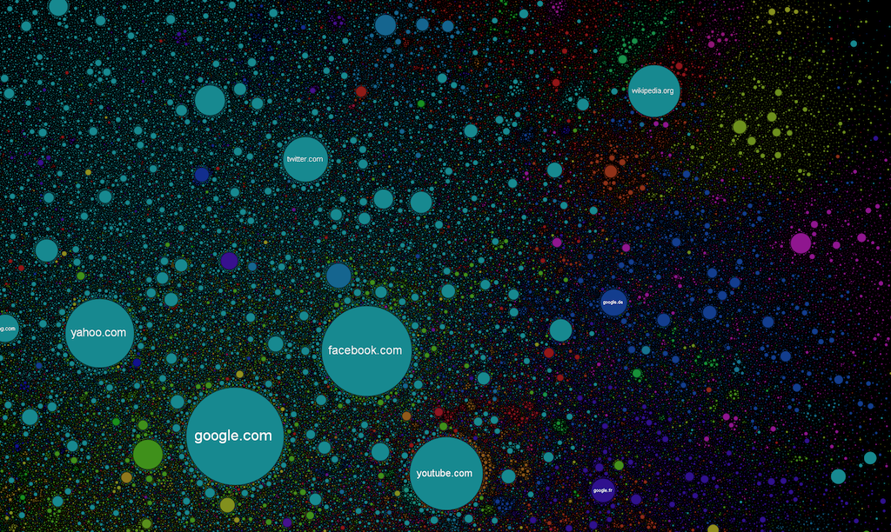

The most famous visualization of the world wide web ist the [Opte Internet Map](https://www.opte.org/). The following image is called _The Internet 2003_:

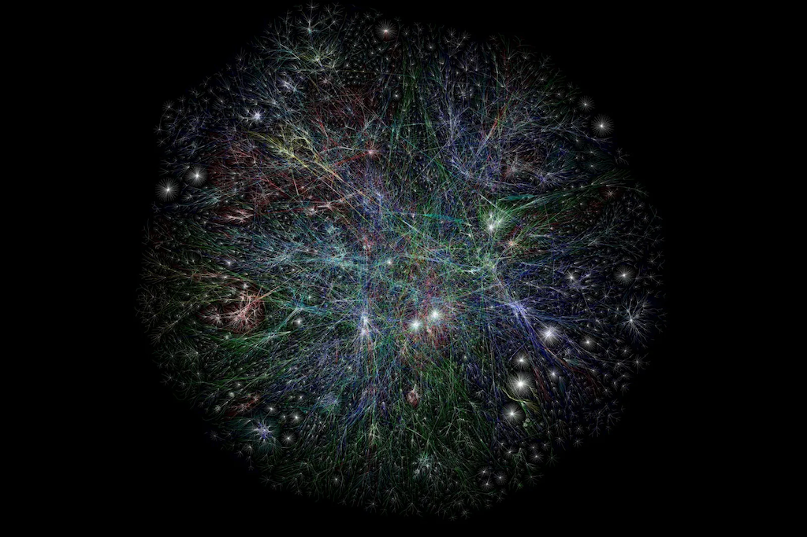

[[Nab amplify]](https://amplify.nabshow.com/articles/a-trippy-visualization-charts-the-internets-growth-since-1997-source-wired/), [[Opte]](https://www.opte.org/)

The image is on the [[Opte]](https://www.opte.org/) site described as follows:

> This is our first full Internet map with color and other graphing logic. RFC1918 addresses have been hashed into a unique checksum so they do not incorrectly overlap with other routers or hosts. The checksums resolve to the same host each time to be sure that all routes connect correctly. Another bit of code also removed the routing loops that made a rather large mess out of previous maps. The colors were based on Class A allocation of IP space to different registrars in the world.

Graph Colors:

- Red: Asia Pacific
- Green: Europe/Middle East/Central Asia/Africa
- Blue: North America
- Yellow: Latin American and Caribbean
- Light blue: RFC1918 IP Addresses
- White: unknown

Furthermore, from the [Opte website](https://www.opte.org/):

> The Internet is one of humanity's most important creations. This [following] video takes you through a journey of incredible engineering. Starting from the first routing table captures (provided by the University of Oregon's RouteViews project) in 1997, we walk through the first Internet's astonishing growth to 2021.

> The dominant network names on the lower-left corner are updated as mergers, acquisitions, and brand changes happen.

The video:

<iframe width="860" height="512" src="https://www.youtube.com/embed/-L1Zs_1VPXA?si=hGSt8RnbUFdd5qch" title="YouTube video player" frameborder="0" allow="accelerometer; autoplay; clipboard-write; encrypted-media; gyroscope; picture-in-picture; web-share" allowfullscreen></iframe>  
[[Opte]](https://www.opte.org/)

<iframe width="860" height="512" src="https://www.youtube.com/embed/BUtlP1kVo-4?si=o0wJNu7AulAGsKPb" title="YouTube video player" frameborder="0" allow="accelerometer; autoplay; clipboard-write; encrypted-media; gyroscope; picture-in-picture; web-share" allowfullscreen></iframe>  
[[Opte]](https://www.opte.org/)

---

## The Opte Internet Map

<iframe width="860" height="512" src="https://www.youtube.com/embed/DdaElt6oP6w?si=ftyF4TON9EQjLMqz" title="YouTube video player" frameborder="0" allow="accelerometer; autoplay; clipboard-write; encrypted-media; gyroscope; picture-in-picture; web-share" allowfullscreen></iframe>  
[[Opte]](https://www.opte.org/)

---

_How did the omnipresence of the world wide web change us?_

---

## How the Web Works

The three main ingredients of the web are:

- _displaying_ with HTML,
- _styling_ with CSS, and
- _interacting_ with JavaScript.

## A Brief History of the Web

The internet has only been around since the '80s, and the web since the '90s. This is an incredibly short time for a technology to take over the world.

- 1989: the idea and the term World Wide Web was proposed
  - An open information system that was populated with documents that you could reach through URLs
- 1990: first tools for the web, including a web browser
  - HTML documents that could be enriched with images and styles
- 1994: Styling with Cascading HTML Style Sheets
  - Many more web browsers available
- 1995: JavaScript was introduced, allowing programmable actions
  - People started using mobile phones
- 1999: Mobile phones had simple access to the internet
- 2000: 414 million people were connected to the internet and were using the World Wide Web
- 2008: Google Chrome was released
  - The browser wars were in full swing
- 2017: 3.9 billion people had access to the internet and the World Wide Web
- 2019: 53% of all web traffic came from mobile devices

Web technology has been decentralized from the start, not just technically but also in the way it evolved. Various browser vendors have added new functionality in ad hoc and sometimes poorly thought-out ways, which then, sometimes, ended up being adopted by others — and finally set down in standards.

This is both a blessing and a curse. On the one hand, it is empowering to not have a central party control a system but have it be improved by various parties working in loose collaboration (or occasionally open hostility). On the other hand, the haphazard way in which the Web was developed means that the resulting system is not exactly a shining example of internal consistency. Some parts of it are downright confusing and poorly conceived.

[[1]](https://www.pluralsight.com/courses/html-css-javascript-big-picture) [[2]](https://eloquentjavascript.net) [[3]]([Mobile vs Desktop Usage Statistics for 2021/202](https://research.com/software/mobile-vs-desktop-usage)2)

## Ingredients For The Web

### Overview

The internet is a massive network of networks, a networking infrastructure.

The World Wide Web can be understood as a sub-part of the internet and is a set of certain protocols and formats that allow us to visit web pages in a browser. The “Web” part in the name refers to the fact that such pages can easily link to each other, thus connecting into a huge mesh that users can move through.

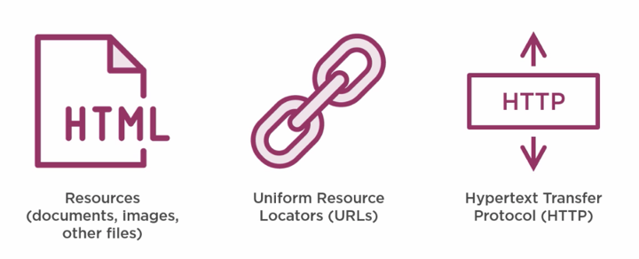  
[[1]](https://www.pluralsight.com/courses/html-css-javascript-big-picture)

- _Resources_, like HTML documents, images, or other files are the content that we want to use, websites that we want to browse, images to look at, files that we want to share.
- _URLs_ uniquely identify the resources so that your web browser can ultimately show them to you or download them. Every resource on the web has a unique URL.

  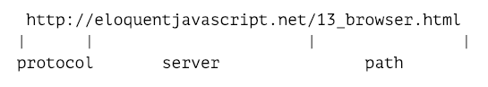 [[2]](https://eloquentjavascript.net)

  - If you type this URL into your browser’s address bar, the browser will try to retrieve and display the document at that URL. First, your browser has to find out what address eloquentjavascript.net refers to. Then, using the HTTP protocol, it will make a connection to the server at that address and ask for the resource /13_browser.html. If all goes well, the server sends back a document, which your browser then displays on your screen.
  - Machines connected to the Internet get an IP address, which is a number that can be used to send messages to that machine, and looks something like 149.210.142.219 or 2001:4860:4860::8888. But lists of more or less random numbers are hard to remember and awkward to type, so you can instead register a domain name for a specific address or set of addresses.

- The _Hypertext Transfer Protocol_, or HTTP, is the magic that can retrieve documents and communicate them to your web browser. I'm not going to go into HTTP in this course, you just need to know that it exists and that it is very important to the web as we know.

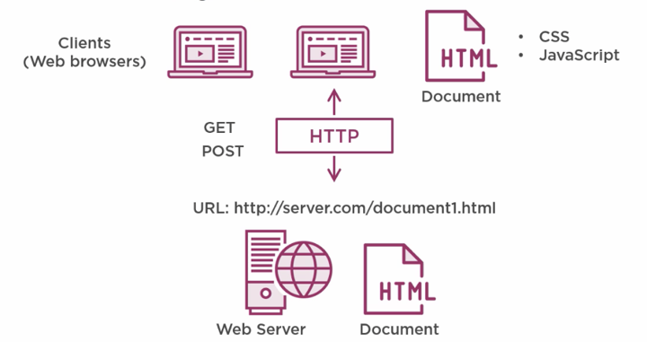  
[[1]](https://www.pluralsight.com/courses/html-css-javascript-big-picture)

- A _web server_ hosts documents, like HTML documents and other resources like images (for more explanations, see the [next section](#dynamic-websites)). The web server will have a unique address on the internet, a URL.
  - All resources will have unique names so that they can be identified on the internet and are hosted on web server that hosts resources.
- A _web browser_ gives you access to the resources a webserver hosts. You run a web browser on a _client computer_. A web browser asks the internet to serve up a specific document that lives at the address of a given URL.
- The HTTP protocol takes care of the information _communication_ between the web browser and the web server to actually get the document so that the web browser can render it on the screen. Whilst painting an HTML document on the screen, a web browser uses CSS and JavaScript to style the document and give it functionality.
- A web browser sometimes also sends documents back. It can alter the HTML that is on the client PC, by for instance, entering address information in text boxes and send that back to the server for processing (using an HTTP POST operation). The HTTP protocol takes care of this and can perform many operations like this.

This is a _simplified_ view of how the web works. There is much more going on, like domain name server calls and TCP/IP protocol handshakes, but that is beyond the scope of our class.

[[1]](https://www.pluralsight.com/courses/html-css-javascript-big-picture) [[2]](https://eloquentjavascript.net)

## Dynamic Websites

_Dynamic_ refers here to a web application that can change its content, appearance, and functionality in response to user input, system or external events, and information, e.g., from a databases [[3]](https://www.ramotion.com/blog/dynamic-web-application-development/). Such a web application must be run by a web server.

### Server

A server is a computer program or device that provides a service to another computer program and its user, also known as the client. In a data center, the physical computer that a server program runs on is also frequently referred to as a server. That machine might be a dedicated server or it might be used for other purposes.

In the client/server programming model, a server program awaits and fulfills requests from client programs, which might be running in the same, or other computers. A given application in a computer might function as a client with requests for services from other programs and as a server of requests from other programs.

The term server can refer to a physical machine, a virtual machine or to software that is performing server services. The way that a server works varies considerably depending on how the word server is being used.

[[4]](https://www.techtarget.com/whatis/definition/server)

### Web Server

The term _web server_ can refer to hardware or software, or both of them working together.

- On the hardware side, a web server is a computer that stores web server software and a website's component files (for example, HTML documents, images, CSS stylesheets, and JavaScript files). A web server connects to the Internet and supports physical data interchange with other devices connected to the web.
- On the software side, a web server includes several parts that control how web users access hosted files. At a minimum, this is an HTTP server. An HTTP server is software that understands URLs (web addresses) and HTTP (the protocol your browser uses to view webpages). An HTTP server can be accessed through the domain names of the websites it stores, and it delivers the content of these hosted websites to the end user's device.

At the most basic level, whenever a browser needs a file that is hosted on a web server, the browser requests the file via HTTP. HTTP is basically a set of rules for transferring files (text, graphic images, sound, video, and other multimedia files) within the world wide web. When the request reaches the correct (hardware) web server, the (software) HTTP server accepts the request, finds the requested document, and sends it back to the browser, also through HTTP. (If the server doesn't find the requested document, it returns a 404 response instead.)

[[7]](https://developer.mozilla.org/en-US/docs/Learn/Common_questions/What_is_a_web_server)

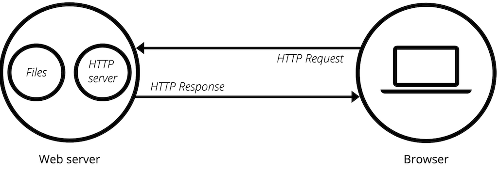 [[7]](https://developer.mozilla.org/en-US/docs/Learn/Common_questions/What_is_a_web_server)

## HTML

HTML is a standard markup language (a markup language is a system for annotating a document in a way that is syntactically distinguishable from the text) for creating web pages and controls the presentation of data.

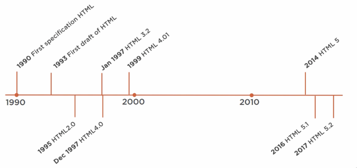  
[[1]](https://www.pluralsight.com/courses/html-css-javascript-big-picture)

- Originally specified in 1990 together with the web browser and the World Wide Web, it wasn't until 1993 that the first official draft proposal of an HTML specification was defined by the Internet Engineering Task Force. This was a proposal for an actual standard, something that should be used by all web browsers.
- Around the same time, another rivalling specification called HTML Plus was proposed that suggested standardizing already implemented features like tables and fill out forms. After these drafts expired in early 1994, the Internet Engineering Task Force created a working group that created the HTML 2.0 specification that would serve as the standard for web browsers.
- After that, the HTML specification was further developed by the World Wide Web Consortium, or W3C, that proposed the HTML 3.2 specification in January of 1997. Later that year, in December of 1997, the W3C published a recommendation for HTML 4.0. Then, in 1999, a revision called HTML 4.01 was published by the W3C. And aside from drafts and minor versions, no new versions were published for a long time.
- 2014 HTML5 was finally published by the W3C after being developed by the Web Hypertext Application Technology Working Group, which later became a joint deliverable with the W3C. HTML5 offers a large number of new HTML elements that allow for more expressive markup and more interactive web pages. In 2016, the W3C delivered HTML 5.1, and in 2017 HTML 5.2.

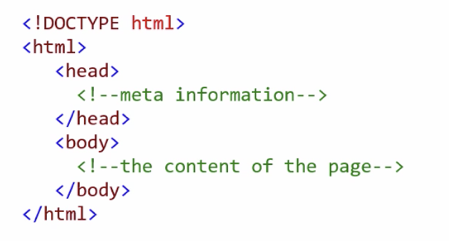

- The things that you see in websites and web applications are rendered by the web browser from HTML documents. These are documents with the HTM or HTML extension that are served by web servers on unique URLs. HTML documents contain various elements that are specified in the HTML specification and can be understood by all web browsers.
- The first element in any HTML document is the DOCTYPE element. This is strictly not an element that is part of the HTML standard, but it does tell the browser that this is an HTML document and tells it which version of HTML it is written in. The DOCTYPE element here is for HTML5.
- Next are the HTML elements. Every element has an open and a close element. This tells the browser that everything in here is HTML.
  - Then there is the head element. This can include a title for the document, scripts, styles, metainformation, and more.
  - And finally, there is the body element that contains everything that you want to be displayed on the screen.
  - These are all the elements that are necessary in an HTML document. All web browsers understand these elements and use them to display content on the screen.

### HTML5

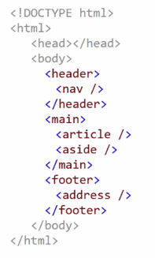

- With the introduction of HTML5, elements have become much more expressive. They explain what they are used for so that the browser can understand them better and search engines know better which parts of the document are actual data and which parts are metainformation.
  - A header element, which represents a container for introductory content or a set of navigational links. This can contain a nav tag that defines a set of navigation links.
  - There is the main tag that specifies the main content of a document, and inside the main tag you can find things like an article tag that specifies independent, self-contained content, and an aside tag that defines some content aside from the content it is placed in.
  - And finally, just like there is a header element, there is also a footer tag that contains things like copyright or the address of your company.
  - These types of tags are geared towards providing more nuance to the HTML markup language.

### Document Structure

You can imagine an HTML document as a nested set of boxes. Tags such as `<body>` and `</body>` enclose other tags, which in turn contain other tags or text.

```html
<!DOCTYPE html>
<html>
  <head>
    <title>My home page</title>
  </head>
  <body>
    <h1>My home page</h1>
    <p>Hello, I am Marijn and this is my home page.</p>
    <p>
      I also wrote a book! Read it
      <a href="http://eloquentjavascript.net">here</a>.
    </p>
  </body>
</html>
```

This page has the following structure:

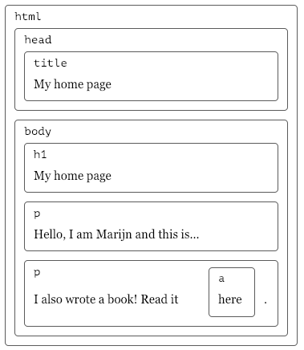

For each box, there is an object, which we can interact with to find out things such as what HTML tag it represents and which boxes and text it contains. The default behavior is that any property of a parent box (e.g., a CSS property) is handed down to it children, meaning the "boxes inside".

This representation is called the **_Document Object Model_**, or DOM for short.

More precisely, this data structure is actually a tree as it has a branching structure, has no cycles (a node may not contain itself, directly or indirectly), and has a single, well-defined root.

In the case of the DOM, **`document.documentElement`** serves as the root in JavaScript. The `documentElement` property refers to the object representing the `<html>` tag.

The above html markup looks as follows, with nodes for elements, which represent HTML tags:

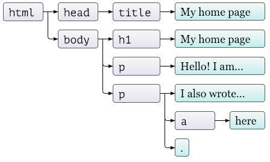

The objects representing elements have properties such as parentNode and childNodes, which can be used to navigate through this tree. Yes, moving through the tree and finding elements can be cumbersome...

#### Resources

- [javascript.info - DOM tree](https://javascript.info/dom-nodes)
- [JavaScript HTML DOM](https://www.w3schools.com/js/js_htmldom.asp)

### Browser Support

Not all web browsers support all elements. On the site [caniuse.com](https://caniuse.com/), you can find out which browsers understand a specific element.

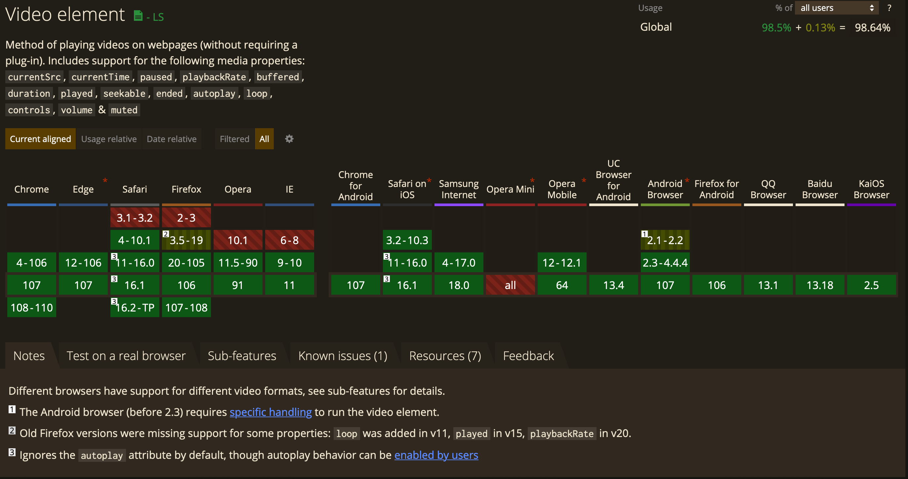

[[1]](https://www.pluralsight.com/courses/html-css-javascript-big-picture) [[2]](https://eloquentjavascripnet)

## CSS

Displaying text and images on the web is nice, but we need to be able to style the content so that it is readable and useable.

- CSS is a style sheet language that describes the presentation of a document
- It enables the separation of content and style
- Styling HTML in a web browser is still difficult...

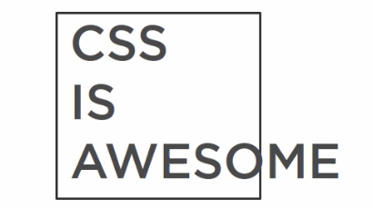

- To work with CSS, all we need to do is to indicate in the HTML which CSS file to use and to host that file on a web server.
- It is important to keep in mind is that it is the web browser that does all the work when it styles HTML! It takes the HTML file, interprets it, and applies the styles to it that are described in the CSS document.

You can add css also directly to the `.html` file:  
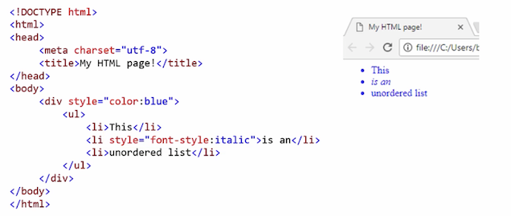

However, having a separate `.css` file is is mandatory for professional web development:  
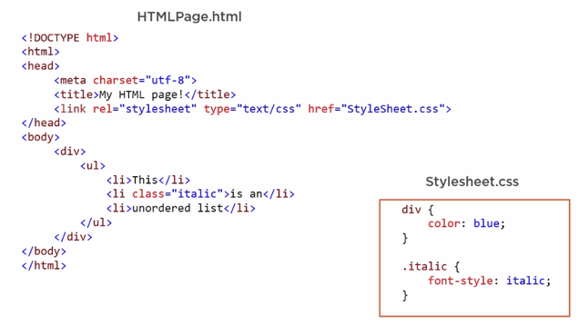

Using CSS like the above in an external style sheet files provides maximum maintainability and reusability.

### Syntax Selectors

CSS selectors indicate to what html elements a property should be applied to. There are different types of selectors. You can find all possible selector in this [CSS Selector Reference](https://www.w3schools.com/cssref/css_selectors.php). However, we are only going to have a look at the most common selectors to get started.

#### The CSS element Selector

The element selector selects HTML elements based on the element name.

Example: all <p> elements on the page will be center-aligned, with a red text color:

```css
p {
  text-align: center;
  color: red;
}
```

#### The CSS id Selector

The id selector uses the id attribute of an HTML element to select a specific element. The id of an element is unique within a page, so the id selector is used to select one unique element!

To select an element with a specific id, write a hash (#) character, followed by the id of the element.

Example: the CSS rule below will be applied to the HTML element with id="para1":

```css
#para1 {
  text-align: center;
  color: red;
}
```

#### The CSS class Selector

The class selector selects HTML elements with a specific class attribute.

To select elements with a specific class, write a period (.) character, followed by the class name.

Example: in this example all HTML elements with class="center" will be red and center-aligned:

```css
.center {
  text-align: center;
  color: red;
}
```

You can also specify that only specific HTML elements should be affected by a class.

Example: in this example only <p> elements with class="center" will be red and center-aligned:

```css
p.center {
  text-align: center;
  color: red;
}
```

HTML elements can also refer to more than one class.

Example: in this example the <p> element will be styled according to class="center" and to class="large":

```html
<p class="center large">This paragraph refers to two classes.</p>
```

#### The CSS Universal Selector

The universal selector (\*) selects all HTML elements on the page.

Example: the CSS rule below will affect every HTML element on the page:

```css
* {
  text-align: center;
  color: blue;
}
```

### The CSS Grouping Selector

The grouping selector selects all the HTML elements with the same style definitions.

Look at the following CSS code (the h1, h2, and p elements have the same style definitions):

```css
h1 {
  text-align: center;
  color: red;
}

h2 {
  text-align: center;
  color: red;
}

p {
  text-align: center;
  color: red;
}
```

It will be better to group the selectors, to minimize the code.

To group selectors, separate each selector with a comma.

Example: in this example we have grouped the selectors from the code above:

```css
h1,
h2,
p {
  text-align: center;
  color: red;
}
```

#### All CSS Simple Selectors

| Selector                | Example      | Example description                             |
| ----------------------- | ------------ | ----------------------------------------------- |
| `#id`                   | `#firstname` | Selects the element with id="firstname"         |
| `.class`                | `.intro`     | Selects all elements with class="intro"         |
| `element.class`         | `p.intro`    | Selects only <p> elements with class="intro"    |
| `*`                     | `*`          | Selects all elements                            |
| `element`               | `p`          | Selects all <p> elements                        |
| `element`, `element`,.. | `div, p`     | Selects all <div> elements and all <p> elements |

Reference: [W3 Schools - CSS Selectors](https://www.w3schools.com/CSS/css_selectors.asp)

### Priorities

CSS is called cascading, as in Cascading Style Sheets, because properties are applied in a specific order based on priority. This is the ascending order of priorities:

- Element selectors
- Class attributes
- ID attributes
- The important tag

How will the following look like?


Yes, you are right. Like this:


You can create large and complex hierarchies within CSS, which can be very useful and can also make your CSS difficult to read and maintain.

### Responsiveness

The idea of responsive design is that the webpage adapts itself to be as accessible and easy to navigate as possible on any device the user may use. This means that a webpage might look quite differently depending on the device with which it is looked at. Responsive web design is also often described as _fluid_ design as "it is like transforming the content into water, mimicking the liquid’s ability to fill any type of glass" ([uxplanet](https://uxplanet.org/what-is-responsive-design-an-introduction-5fe1775aa9ec)). Hence, a responsive webpage can be viewed on anything from a large screen to a smart phone to an watch and might look slightly different on each device:

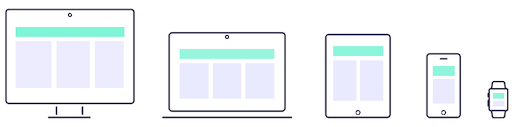  
[[uxplanet]](https://uxplanet.org/what-is-responsive-design-an-introduction-5fe1775aa9ec)

With the requirement of responsivenss there are many, many aspects to consider for the development of a web page (e.g., navigation, layout, sizings and the visual hierarchy, images). We will practice setting up a responsive site a litte in the exercise. For now, keep in mind that responsiveness is crucial for modern web development and you will need to look into it further if you ever want to develop a professional webpage.

#### Mobile-First

Hand in hand with the idea of responsiveness came a paradigm shift in webdesign. Even if you want to develop a webpage that looks good on any device you have to start somewhere. In the old days, the development would start with the desktop version, as that would be the most viewed layout. However, nowadays most web traffic comes from mobile devices (e.g., see [Mobile vs Desktop Usage Statistics for 2021/2022](https://research.com/software/mobile-vs-desktop-usage)) and with that the mobile layout is the most viewed version! Hence, web development shifted to a _mobile-first_ paradigm. This means that one starts with the development of the mobile page and then derives all other versions from the mobile layout.

### Media Queries

As first step, you should always adjust the look of a webpage depending on the device it is view at. For that you adjust the css of the page, for example with the help of css _media queries_. Modern media queries (CSS3) let you detect the capabilities of the display device and let you define different style rules for the different capabilities of devices. Media queries can be used to check, e.g.:

- width and height of the viewport
- width and height of the device
- orientation (is the tablet/phone in landscape or portrait mode?)
- resolution

Reference: [[CSS Media Queries]](https://www.w3schools.com/css/css3_mediaqueries.asp)

#### Syntax

A media query consists of a media type and can contain one or more expressions, which resolve to either true or false.

```css
@media not|only mediatype and (expressions)
{
    CSS-Code;
}
```

The result of the query is true if the specified media type matches the type of device the document is being displayed on and all expressions in the media query are true. When a media query is true, the corresponding style sheet or style rules are applied, following the normal cascading rules.

##### Examples

The following example changes the background-color to lightgreen if the viewport is 480 pixels wide or wider (if the viewport is less than 480 pixels, the background-color will be pink):

```css
body {
  background-color: pink;
}

@media screen and (min-width: 480px) {
  body {
    background-color: lightgreen;
  }
}
```

[Test it online!](https://www.w3schools.com/Css/tryit.asp?filename=trycss3_media_queries1)

The following example shows a menu that will float to the left of the page if the viewport is 480 pixels wide or wider (if the viewport is less than 480 pixels, the menu will be on top of the content):

```css
#main {
  margin-left: 4px;
}

#leftsidebar {
  float: none;
  width: auto;
}
... @media screen and (min-width: 480px) {
  #leftsidebar {
    width: 200px;
    float: left;
  }
  #main {
    margin-left: 216px;
  }
}
```

[Test it online!](https://www.w3schools.com/Css/tryit.asp?filename=trycss3_media_queries2)

Hence, for different layouts for different devices, you define multiple media queries:


```css
/* Set the background color of body to tan */
body {
  background-color: tan;
}

/* On screens that are 992px or less, set the background color to blue */
@media screen and (max-width: 992px) {
  body {
    background-color: blue;
  }
}

/* On screens that are 600px or less, set the background color to olive */
@media screen and (max-width: 600px) {
  body {
    background-color: olive;
  }
}
```

[Test it online!](https://www.w3schools.com/Css/tryit.asp?filename=trycss_mediaqueries_ex1)

Reference: [[CSS Media Queries]](https://www.w3schools.com/css/css3_mediaqueries.asp)

#### Breakpoints

So called CSS _breakpoints_ help you to divide your webpage into manageable elements and establish common sizes:

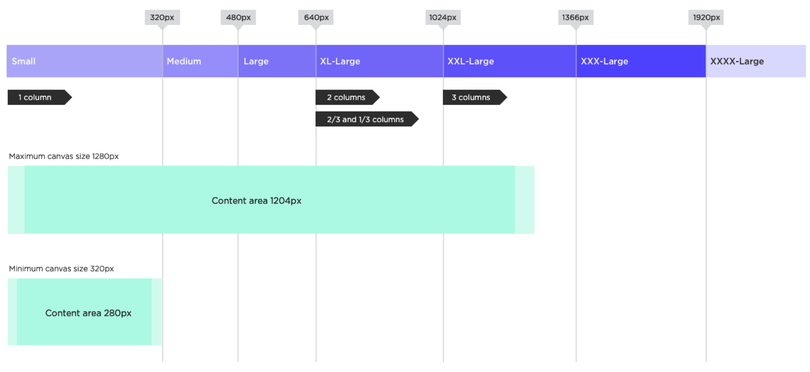  
[[uxplanet]](https://uxplanet.org/what-is-responsive-design-an-introduction-5fe1775aa9ec)

Breakpoints are a topic to investigate further if you continue your web development journey beyond this class.

## JavaScript

- High-level interpreted programming language
- JavaScript is not Java
- Implementation of ECMAScript
- The vast majority of websites use JS for non-static content
- All major web browsers have a dedicated JavaScript engine to execute it
- As a multi-paradigm language, JavaScript supports event-driven, functional, object-oriented and prototype-based programming styles

### Dynamic Values

JavaScript can be used to manipulate HTML, the browser, and to talk with services like APIs that live on other servers.

[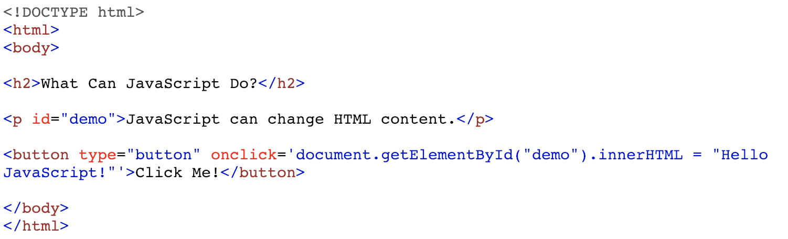](https://www.w3schools.com/Js/tryit.asp?filename=tryjs_intro_inner_html)

- JavaScript is used here to select an HTML element and alter one of its properties.
- When you click the button, the onclick event will execute, and that executes this line of code, which is JavaScript.
  - This is inline JavaScript. You can basically write it anywhere in HTML, just like you can have inline CSS.
- This particular JavaScript code first selects an element with the ID of demo, and that is this paragraph element here, and it then sets the innerHTML property of that element to the given new value.

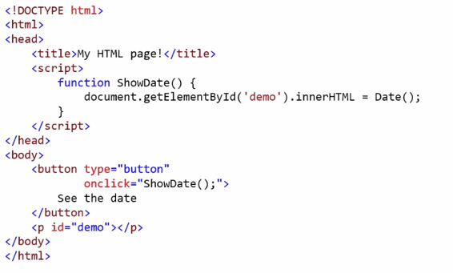

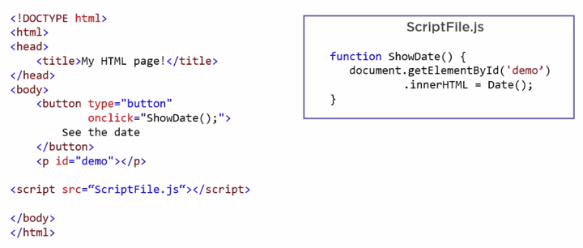

JavaScript can also interact with the browser that it runs in.

```js
function PromptUser() {
  let txt;
  let name = window.prompt("What is your name?");
  if (name != null || name == "") {
    txt = "Hello my friend " + name;
  }
  document.getElementById("greeting").innerHTML = name;
}
```

- This prompt is no longer HTML, but is a part of the web browser.
- As you see there, JavaScript provides are all typical features of a programming language.

### DOM

JavaScript programs may inspect and interfere with the document that the browser is displaying through the DOM. This data structure represents the browser’s model of the whole document and a JavaScript program can access and modify it to change the visible document.

With the document object model, JavaScript gets all the power it needs to create dynamic HTML (we will come back to this):

- JavaScript can change all the HTML elements in the page
- JavaScript can change all the HTML attributes in the page
- JavaScript can change all the CSS styles in the page
- JavaScript can remove existing HTML elements and attributes
- JavaScript can add new HTML elements and attributes
- JavaScript can react to all existing HTML events in the page
- JavaScript can create new HTML events in the page

#### Resources

- [javascript.info - DOM tree](https://javascript.info/dom-nodes)
- [JavaScript HTML DOM](https://www.w3schools.com/js/js_htmldom.asp)

[[1]](https://www.pluralsight.com/courses/html-css-javascript-big-picture)

## Fontend vs. Backend Development

The most common frontend and back-end scenario is based on a client-server model, which describes the relationship of cooperating programs in an application. In such a relationship, the server provides a function or service to one or many clients, which initiate requests for such services [[1]](https://en.wikipedia.org/wiki/Client%E2%80%93server_model). The client-server model is not limited to the context of web development but has many different application scenarios.

In the web development context, the client is usually considered the frontend and the server the backend [[9]](https://en.wikipedia.org/wiki/Frontend_and_backend). For a bit more information on servers and web server, read the section about [Dynamic Websites](#dynamic-websites).

<!-- Here, client and servers talk to each other through the World Wide Web, most often via Http requests. The client will, for example, send to the server (or better *requests from the server*) a character string called uniform resource locator (URL), which identifies specific data, e.g. .html & .css, which the server sends back to the client as response. The data is transferred using the Hypertext Transfer Protocol (HTTP).  -->

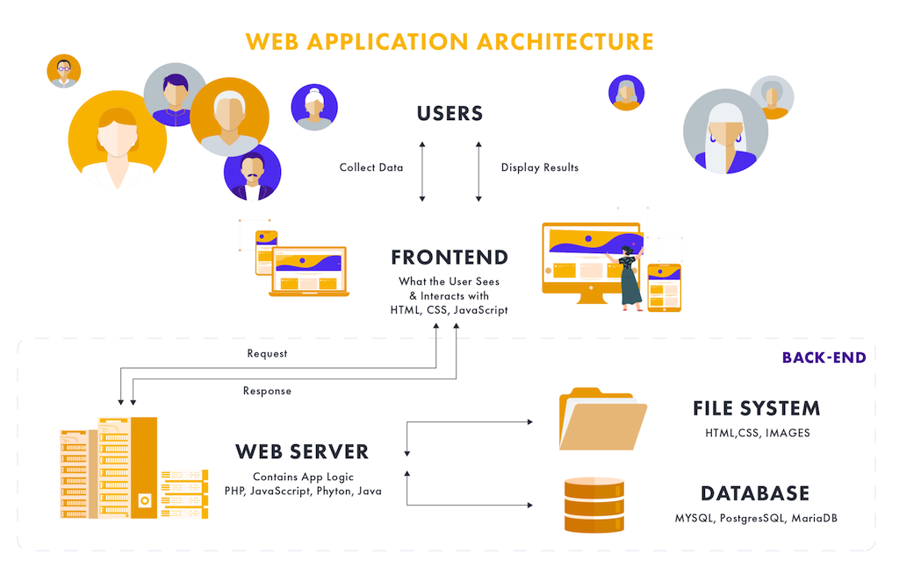  
[[evertop]](https://www.evertop.pl/en/frontend-vs-backend/)

Turns out, the internet has quite some fun describing visually the differences between front- and back-end...

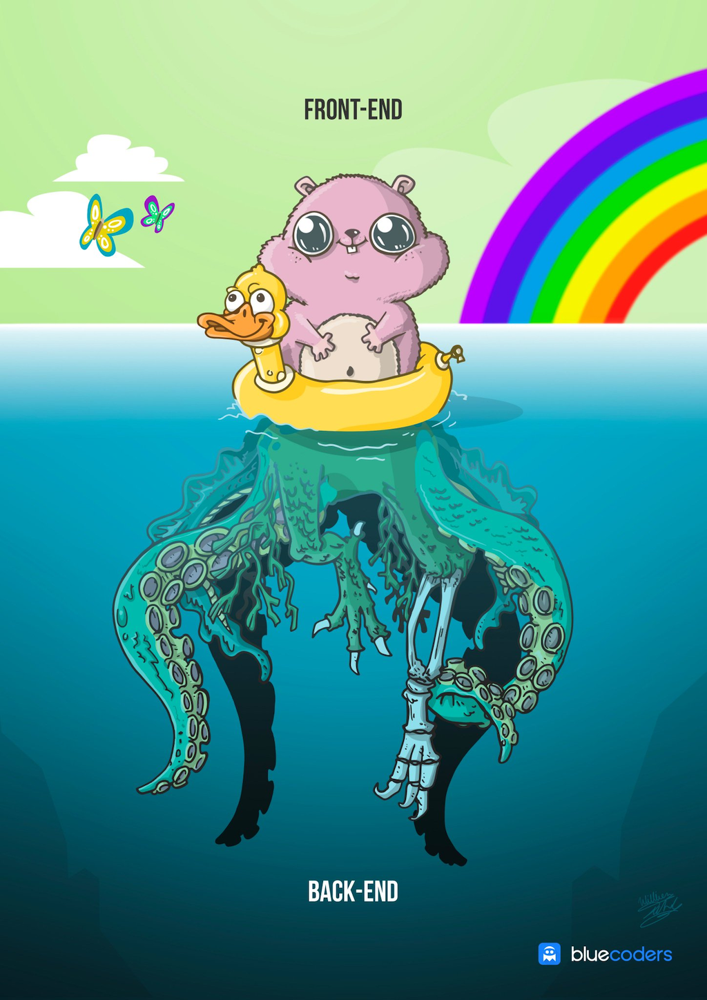  
[[bluecoders]](https://twitter.com/bluecoders/status/966624401172123649)

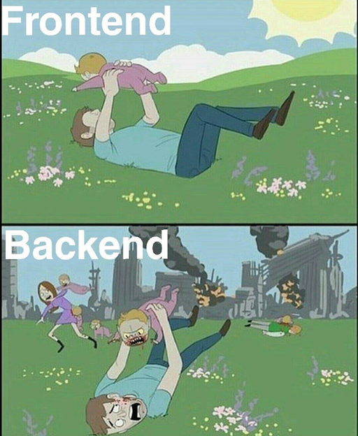  
[[iteachrecruiters]](https://www.iteachrecruiters.com/blog/frontend-vs-backend-developers-for-recruiters/)

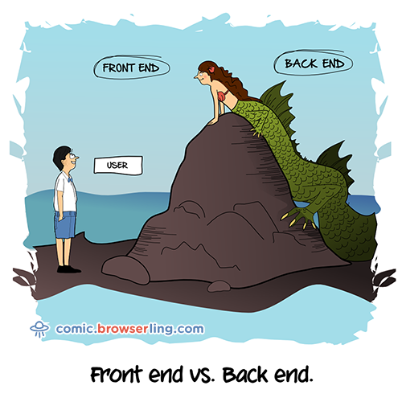  
[[comic.browserling]](https://comic.browserling.com/15)

Keep in mind that this frontend vs. backend structure is highly dynamic and it is constantly changing where what is done by whom...

### Front End

The “frontend” of the web is the part of the web that you can see and interact with. The frontend usually consists of two parts: the web design and front end web development. Hence, the task can range from work done in Photoshop to coding using HTML, CSS, JavaScript.

> Front end development manages everything that users visually see first in their browser or application. Front end developers are responsible for the look and feel of a site.

### Backend

The backend usually consists of three parts: a server, an application, and a database. If you book a flight or buy concert tickets, you usually open a website and interact with the frontend. Once you’ve entered that information, the application stores it in a database that was created on a server.

Backend technologies usually consist of languages like PHP, Ruby, Python, etc. To make them easier to use they’re usually enhanced by frameworks like Ruby on Rails, Cake PHP, and Code Igniter that all make development faster and easier to collaborate on.

Many web professionals that are just getting into the field may have heard a lot of people talking about WordPress. WordPress is a good example of the frontend and backend working together because WordPress is an open-sourced framework built on PHP that you have to install on your server with a database.

> Back end development refers to the server side of an application and everything that communicates between the database and the browser.

[[3]](https://blog.teamtreehouse.com/i-dont-speak-your-language-frontend-vs-backend) [[4]](https://www.coursereport.com/blogfront-end-development-vs-back-end-development-where-to-start)

## Summary

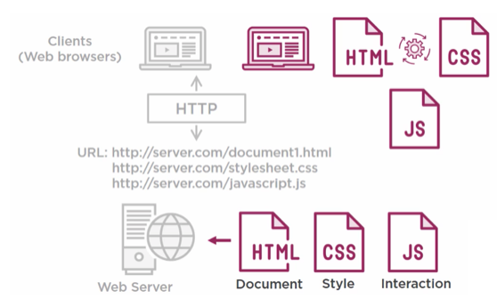

- Any web page or application consists out of three main documents, HTML that contains content like text and images, CSS to style the HTML, and JavaScript to make it interactive.
- These documents are hosted on a web server that exposes them to the internet using unique URLs.
- Then, web browsers that are used from client computers can access these documents to the HTTP, or Hypertext Transfer Protocol.
- As a frontend developer, you just need to worry about creating the documents and putting them on the web server. Once the documents are on the client machine, the web browser interprets them and styles the HTML with CSS and loads the JavaScript to be executed.
- The web browsers are the main ingredient that actually run the code that you write in your HTML, CSS, and JavaScript documents.

[[1]](https://www.pluralsight.com/courses/html-css-javascript-big-picture)

---

## References

[[1] Barry Luijbregts, Pluralsight](https://www.pluralsight.com/courses/html-css-javascript-big-picture)  
[[2] Eloquent Javascript](https://eloquentjavascript.net)  
[[3] Team Tree House](https://blog.teamtreehouse.com/i-dont-speak-your-language-frontend-vs-backend)  
[[4] Course Report](https://www.coursereport.com/blog/front-end-development-vs-back-end-development-where-to-start)

---

The End

💻 🕸 🕷
