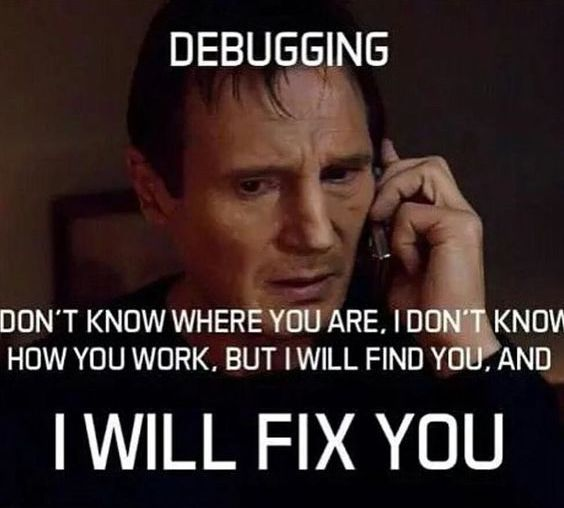
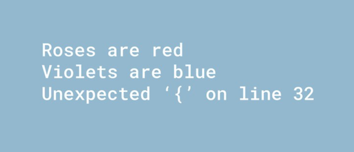
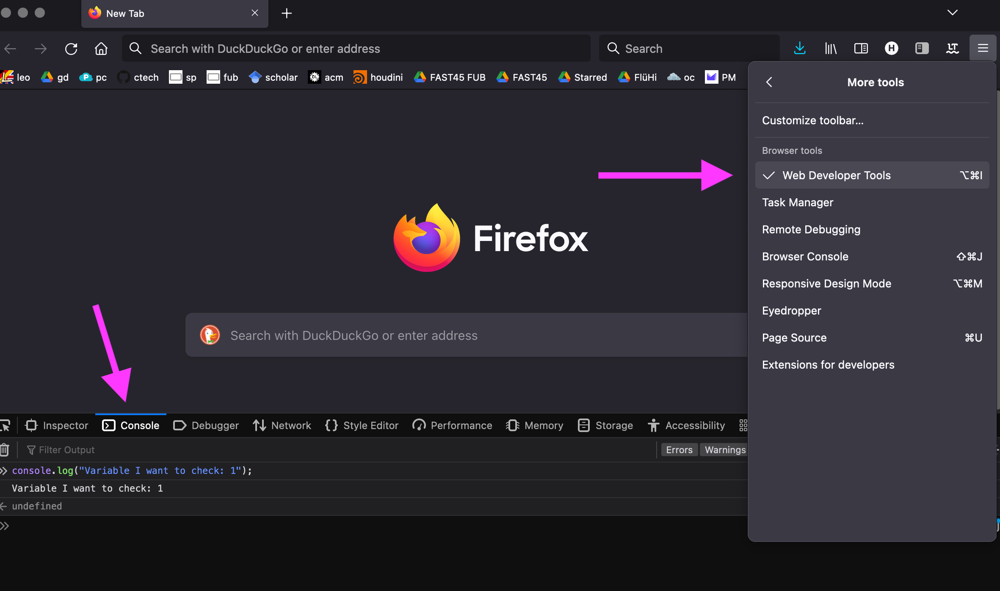
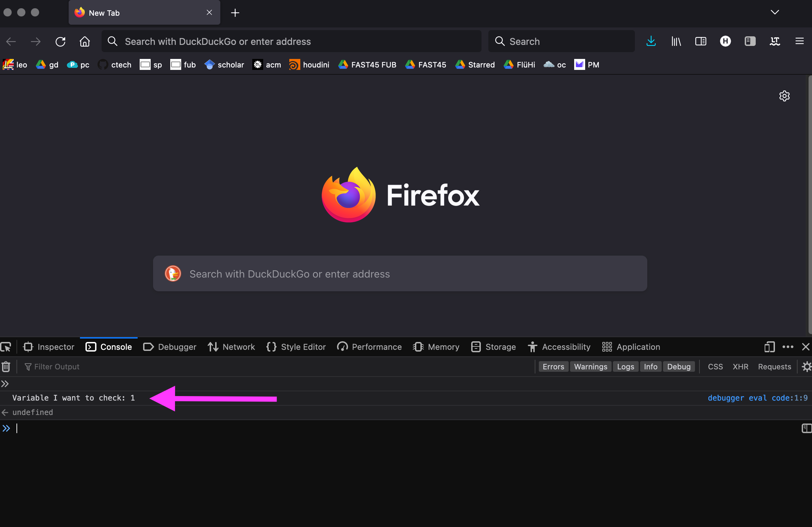
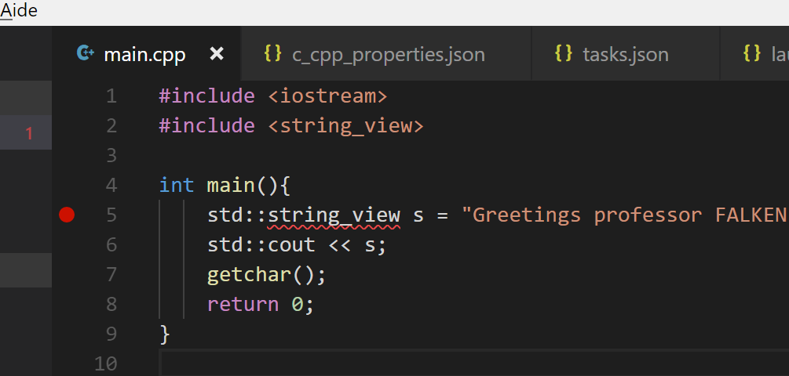
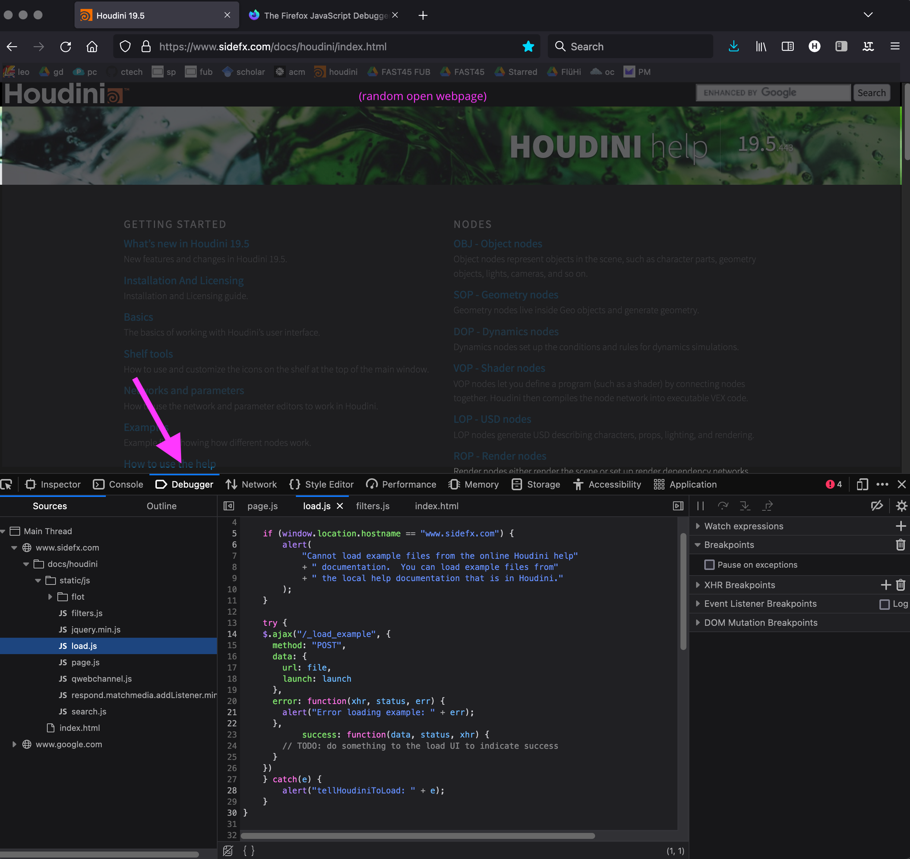
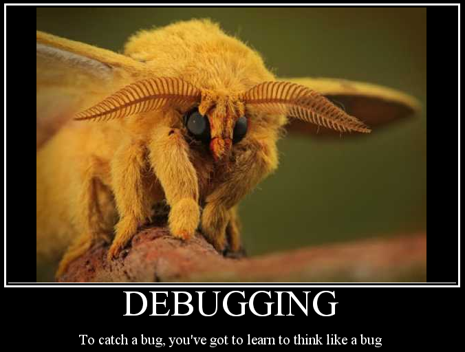

# Creative Coding I: Design & Communication

Jonathan Ho \| jonathan.g.ho@filmuniversitaet.de
Prof. Dr. Lena Gieseke \| l.gieseke@filmuniversitaet.de \| Film University Babelsberg KONRAD WOLF

---

# Script 07 - Debugging

This script is written by

Malte Hillebrand \| malte.a.hillebrand@filmuniversitaet.de \| Film University Babelsberg KONRAD WOLF

(with modifications and more emojis from Lena 😊)

---

- [Creative Coding I: Design \& Communication](#creative-coding-i-design--communication)
- [Script 07 - Debugging](#script-07---debugging)
  - [Error Types](#error-types)
    - [Syntax Errors](#syntax-errors)
      - [Spelling Error](#spelling-error)
      - ["Grammar" Error](#grammar-error)
    - [Logical Errors](#logical-errors)
  - [Steps For Debugging - Identify The Problem!](#steps-for-debugging---identify-the-problem)
    - [Finding The Problematic Code Area](#finding-the-problematic-code-area)
    - [Review Differences From Desired Output](#review-differences-from-desired-output)
    - [Examining The Program's Behavior](#examining-the-programs-behavior)
      - [Console Logging](#console-logging)
      - [Breakpoints](#breakpoints)
      - [Building Your Custom Debug Environment](#building-your-custom-debug-environment)
  - [Solving The Problem](#solving-the-problem)
    - [Developing A Hypothesis](#developing-a-hypothesis)
    - [Isolation \& Testing](#isolation--testing)
  - [Slow Down](#slow-down)
  - [Debugging Tools For Web Development](#debugging-tools-for-web-development)
    - [DevTools](#devtools)
      - [Console](#console)
      - [DOM Inspector](#dom-inspector)
      - [JavaScript Debugger](#javascript-debugger)
      - [Network](#network)
    - [HTML Validators](#html-validators)
    - [Site Analyzers](#site-analyzers)
  - [Web Development Environments](#web-development-environments)

Debugging is the process in programming of identifying a problem and finding the appropriate fix.

  
[[dailymoss]](https://www.dailymoss.com/15-funny-programming-memes-real-computer-programmers-can-decode/)

The difficulty of it depends on various factors, the size of the project, the type of problem, your familiarity with the codebase, your programming knowledge and more. Also programmers tend to develop their own "style of debugging" over time.

However, there are certain, generally applicable steps that will help you identifying problems reliably. In the following we will guide you through these steps.

## Error Types

There are two main types of errors in programming. Understanding what the type of your problem is, is the first step towards solving the issue.

### Syntax Errors

Programming languages are formal languages. Therefore it is necessary to communicate precisely in the required form with the compiler or interpreter when writing your code. There is almost no flexibility in how the syntax must be. Syntactic rules are rules that must be followed.

A syntactic error occurs when you are asking the computer something it doesn't understand. This could be because of spelling errors or your use of a unknown command (unknown because, e.g., a library is not loaded, it doesn't exist in that specific coding language).

  
[[dailymoss]](https://www.dailymoss.com/15-funny-programming-memes-real-computer-programmers-can-decode/)

When you are working with a [compiled](https://www.wikiwand.com/en/Compiled_language) language (C#, C++, Java etc.), a syntactic error will cause the compiler to stop the compilation process and your program won't execute. In an [interpreted](https://www.tutorialandexample.com/what-is-interpreted-language) language (Python, JavaScript, PHP etc.) the executing will stop because of the syntax error.

Luckily, compilers and interpreters will try to help as best as they can. A error message you would see when a syntax error occurs could be something like this:

```
Cannot resolve symbol 'name'
```

```
Uncaught ReferenceError: name is not defined
```

In this example, the compiler tells us that he doesn't know what "name" should be. It could be a variable, a function, basically any type of identifier that the program can't find. The fix for this depends on the specific problem in your code, but most of the time it's simple and either one of the following.

#### Spelling Error

You might have misspelled a variable of function. If it's your own variable or function, check the specific line and the correct reference. If you are using a given variable or function, check the language or API documentation for the correct spelling.

#### "Grammar" Error

The compiler might _think_ that you want to reference something, but you are actually not intending to reference something. For example, if we would want to print "name" into the console in JavaScript, we would have to write

```js
console.log("name");
```

If we forget the quotation marks and write

```js
console.log(name);
```

the interpreter will tell us that it is looking for the variable name, but we actually want to just print text and have used the wrong syntax.

It is also a good rule of thumb to always check for the right **punctuation**, missing **semicolons** or look for the right amount of **brackets** and **parentheses** first.

  
[[redbubble]](https://www.redbubble.com/i/t-shirt/Syntax-error-poem-by-itsmarsu/22863887.M4A2N)

It sounds silly but it is crucial that you read each error message carefully and think about it what it could mean! While programming one gets easily sloppy with listing to what the computer is trying to tell you.

### Logical Errors

Logical errors are more often a cause for severe headaches than syntax errors.

A logical error means that the program executes perfectly, but the output is not as expected. Therefore, you need to review your code and figure out what is going wrong and what you need to do to get to the desired result.

Again, there is no given fix for logical errors as they are individual problems and they are all different from each other. However, we can go about fixing a logical error with a systematic approach and get to the problem faster than just randomly trying to brute-force a solution.

## Steps For Debugging - Identify The Problem!

The first step when you have to debug a problem in your code is to identify what exactly is going wrong.

### Finding The Problematic Code Area

Try to get as close to the problem as you can and isolate it. E.g. divide your program into pieces and evaluate each piece individually (divide & conquer 😎). This can be done by simply commenting out code, or not calling certain functions, etc.

### Review Differences From Desired Output

This might sound obvious, but when you are "in the zone" or have just been working on a program for a long time, you tend to lose sight of the exact goal. When an error occurs, it is best to take a step back first and remind yourself of what exactly it is that you are planning to do and want to achieve. Try to just relax, everything is fixable and there is no need to immediately rush into your functions and potentially do more harm.

Think about your logic, what each function _should_ be doing and remind yourself of the steps you planned to reach your goal.

### Examining The Program's Behavior

After you have established once again your desired output, you have to examine the actual behavior of your program in order to figure out where exactly something is going wrong. This means examining the values of variables throughout runtime until you find out when a value occurs that is incorrect.

Depending on your programming environment, you have multiple options to track your programs behavior:

#### Console Logging

Logging values is the most straight-forward way to show what is going on under the hood. Logging values really means nothing more than printing out the variable values in question to a console or where ever your program outputs to. Printing some form of output is possible every development environment. In p5 you have a console into which you can print or as another example, most browsers have a console (also see the [DevTools](#debugging-tools-for-web-development) section), which you can use for logging:



In JavaScript we can use:

```JavaScript
console.log("Variable I want to check: ", variableName);
```



This log contains two important rules for debugging with console logs:

1. Always label your console output. For quickly checking variables, one can tend to simply throw a log in here and there in critical parts of the program and you easily lose sight of what is actually now displayed in the console.
2. Try to not format your variable into another output whenever possible. In JavaScript, notice how we use a comma within the log (keeping the original data type) and **not** a "+", which would try to convert the value to string in order to concatenate strings for a single line output. Keeping the original value by using `,` has the advantage that when looking at the code line in our program code, we might be able to identify the variable's type by its color through syntax highlighting at first sight. Also, depending on the variable type, we might get further information or debugging functionality in the console output. Not every programming language will have this possibility, but whenever you can, try to keep types and display the original types in the console. In general, you must keep in mind while debugging, that there might potential issues with _how you output values_ and you need to make sure that you log values correctly.

Another good idea is to log not only variables, but function execution. Something like `console.log("If my condition is true, I reach this point!")` can often help understanding what is happening exactly.

#### Breakpoints

A breakpoint will tell the program to stop its execution as soon as it has reached the breakpoint in the source code.

When working with compiled languages, it is usually possible to set such breakpoints when executing the program. In Visual Studio Code a breakpoint looks like this:



That red point on the left is created by clicking on the margin left from the line number. Now, when the computer executes our program it will pause the execution at this line and give us the ability to look at every variable it is using at this point and at its values.

Most IDEs will have functionality on how to navigate breakpoints, e.g. how to continue the execution normally or "step" ahead line-by-line to show you exactly how these variables are behaving throughout execution.

Breakpoints are a powerful tool to have in your debugging arsenal and you should get familiar with how to use them in your IDE.

#### Building Your Custom Debug Environment

When working on larger projects, it might be helpful (and is quite common) to build your own debug solution. In games, a constant screen display of your character's speed, location or other attributes can become helpful when having to debug (removing that screen display before shipping the game 😁). Or you might want to write your own log files. In more low-level languages this becomes easier and sometimes it can help to dump a whole array of numbers into a .txt file to look for weird quirks.

## Solving The Problem

Assuming you've have found unintended behavior. Great!

Now what do you do?

Look at your plan again:

- What function should do what?
- What is the value you _would_ want to have and why is it something else?

### Developing A Hypothesis

Every mind works differently, but what I tend to do is get a pen and just write down the value I want to have or expect and the value I got. Then I try to calculate backwards, until I arrive at a "starting" value where everything was going well. At one point both calculations will differ from each other. Maybe I forgot to clamp a value? Maybe I'm using a false variable for multiplication?

Take your time, use the internet and look at documentation. Keep in mind: **You will find the problem!**. I still once in a while have a bug where I think "This is it. This one I am not solving. This one will break me." But in the end, I have always figured it out. And so will you!

Once you have found the error, think about a possible solution, build your hypothesis. What is the step you are missing? What is the value that you need to actually use?

### Isolation & Testing

After you developed your hypothesis, it's important of course to test it out.

The more complex your project is, once again, the more important it is **to isolate as much of the problem as possible**. Think about what the closest starting point can be and build a smaller program to test your hypothesis on. In web development this could mean isolating a navigation, when building a VR game you might want to build a custom level to just test the teleport functionality.

Isolation is important because it unclutters your mind when testing a solution. Compilation time, a long runtime until you arrive at the problem or just a multitude of things going on will lead to you becoming frustrated more easily. Debugging is really not a race and requires a clear head and peace of mind.

Did your fix work? Great! Now just implement it in your project's codebase and go on 🐠.

It didn't? Don't worry! Go back one step, think about a new hypothesis. You will find it.

## Slow Down

I've said this multiple times now, but I still want to say it again: **Slow down!**

Rushing through debugging does never lead to anything. A quick fix often causes more problems down the line. Nobody likes this process, we all just want things to work. That is why this mantra is so important.

More times than I can count, I've went to bed after trying to debug something for more than an hour. I woke up the next day, got myself a coffee and started up my PC again. And while still taking my first sips, the solution suddenly came to me. Just because I rested enough and had a clear head space.

It sounds like something obvious, but we have all been there and will all be there again: Frustrated and just hammering in lines of codes in hopes that something will magically provide a fix. It's not worth it. Go out, take a walk, eat something. When you come back and are ready to tackle a problem, it will be the right time.

## Debugging Tools For Web Development

### DevTools

[Firefox](https://developer.chrome.com/docs/devtools/) and [Chrome](https://developer.chrome.com/docs/devtools/) both provide a very well documented set of development tools right in your browser:

#### Console

You can use it to display your own console.logs, but also to display and manipulate variables right in your browser. It can be a powerful tool. And quite frankly, for many developers it is the only debugging tool 🙃.

#### DOM Inspector

The DOM inspector will show you the DOM structure of your site. Often you can find problems like a missing closing bracket here at first glance. But you can also use it to take a look at the styles of an element and manipulate it right in the browser. When writing CSS is can help a lot to try around a couple of stylings solutions to immediately see what works and what doesn't.

#### JavaScript Debugger

The Debugger tool enables you to set [breakpoints](#breakpoints) for your JavaScript code right within the browser! As the specific functionality depends on the browser you are using, you will need to read your browser's documentation for learning how it works.

For [Firefox](https://firefox-source-docs.mozilla.org/devtools-user/debugger/index.html), it looks as follows:



#### Network

The network tab provides you with information about what the browser needs to download, what files take the longest and their order. This can help you when your site seems slow, it could be a slow CDN from where you are importing a library and might be faster to host it yourself.

### HTML Validators

HTML validators shockingly validate HTML 😆.

There are couple of validators for HTML markup. The [W3C provides a good one](https://validator.w3.org/). You can either upload your code, paste it in a text box or provide a link to your site. The validator can then tell you what problems your HTML markup might have to trys to help you figure out what's going wrong.

There are also [other web development tools](https://w3c.github.io/developers/tools/) to validate CSS, look for broken links and much more.

### Site Analyzers

Site analyzer offer different functionalities to analyze your site. Online site testers are also pretty common. Some provide more features than others, most will want some form of payment for really advanced features, but in general they are a good start when you want to test your website in all sorts of metrics. A page like [WebPageTest](https://www.webpagetest.org/) or [Pingdom](https://tools.pingdom.com/) will provide lots of insight on your page's performance as well as tips to improve it.

Keep in mind that, unlike the W3C organization, these are private companies that need to make money in some way - even if the site analysis is "for free". They potentially sell your data, so its best to not use them when working with sensitive information.

## Web Development Environments

If you are planning to do web development more seriously and for a longer period of time, I recommend to get a specialized development environment (IDE) for that. You can, e.g., pimp Visual Studio Code with extensions or use a single-purpose environment such as JetBrains [WebStorm](https://www.jetbrains.com/webstorm/).

---



By the way, the above is a [Venezuelan Poodle Moth](https://duckduckgo.com/?q=Poodle+moth&t=newext&atb=v247-1&iax=images&ia=images), which was photographed for the first time only in 2009 and seems to be quite a [remarkable creature](https://factanimal.com/venezuelan-poodle-moth/)!

---

The End

🐞 🪲 🪳
