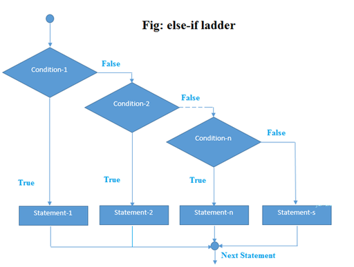

# Creative Coding For Beginners
  
Prof. Dr. Lena Gieseke \| l.gieseke@filmuniversitaet.de  
  


# Script 06 - Conditionals

* [Creative Coding For Beginners](#creative-coding-for-beginners)
* [Script 06 - Conditionals](#script-06---conditionals)
    * [Topics](#topics)
    * [Learning Objectives](#learning-objectives)
    * [Example - How to Clear the Screen?](#example---how-to-clear-the-screen)
        * [Problem 1 - If the ‘c' key is pressed](#problem-1---if-the-c-key-is-pressed)
        * [Problem 1.1: *If…*](#problem-11-if)
    * [The `if` Statement](#the-if-statement)
        * [Problem 1.2 - Identify the ‘c' key…](#problem-12---identify-the-c-key)
    * [The == operator](#the--operator)
        * [Comparison Operators](#comparison-operators)
        * [Logical Operators](#logical-operators)
        * [Problem 1.1 - If the ‘c' key is pressed](#problem-11---if-the-c-key-is-pressed)
    * [Code Testing](#code-testing)
    * [Problem 2 - Clear the Screen](#problem-2---clear-the-screen)
    * [The `else` Statement](#the-else-statement)
    * [Summary](#summary)
    * [References](#references)


## Topics

* Flow of a program: the`if`-condition
* Operators


## Learning Objectives

With this session you learn a new way to modify the execution flow of a program.  
Specifically you

* know how to implement if, if..else, and while conditional statements, and
* with that understand how you can control the flow of a program.


## Example - How to Clear the Screen?

Idea: Pressing the key ‘c' should clear the screen.

*How to do this?* 😱

> Again: divide and conquer!  

**Break the problem into subproblems!**

* Problem 1: *If the ‘c' key is pressed...*  
* Problem 2: *...clear the screen.*


### Problem 1 - If the ‘c' key is pressed

**Break the problem into subproblems!**

* Problem 1.1: *If…* 
* Problem 1.2: *Identify the ‘c' key…*
* Problem 1.3: *...do something if a certain key is pressed.*

Problem 1.3 we already know how to do!

```js
function keyPressed() {

}
```

Hence: Problem 1.3: *...do something if a certain key is pressed.*  ✔️

### Problem 1.1: *If…* 

## The `if` Statement

*If… do something.*

This is called a **conditional** statement. It structures the flow of a program.


We check for a condition to be true:

```js
// Pseudo code

if(condition is true) {

    // do this…
}
```

Notice that this is a code block with curly brackets, hence no semicolon afterwards.

Once again we have the structure:

```js
// Pseudo code

if(condition is true) { // title line with opening bracket

    // Code
} // Closing bracket without a ;
```


Next, we need to figure out how to check, if the condition "key c is pressed" is true.


### Problem 1.2 - Identify the ‘c' key…


When developing code, it might be helpful to think about the logic first and then worry about the syntax of the code. You could you plain language to describe what your code should do, so called pseudocode. [Wiki says:](https://en.wikipedia.org/wiki/Pseudocode) "In computer science, pseudocode is a plain language description of the steps in an algorithm [...]." Hence, pseudo code is meant for humans and can not be executed by a computer.

For our problem statement, we could plan our code as follows:

```
// Pseudo code

if(key ‘c' is pressed) {

    Clear the screen…
}
```


For knowing which key is pressed, we can use the system variable[ `key`](https://p5js.org/reference/#/p5/key), kindly provided by p5.

```js
key
```

We can compare the variable's value with a specific character

```js
key == 'c'
```

What is going on here?

## The == operator

This operator tests ***"Is equal?"*** and results in `true` or `false`.


```
// Pseudo code

1 == 2 -> false
1 == 1 -> true
'hello' == 'hello' -> true
'hello' == 'Hello' -> false
```

There are several other comparison operators to construct, e.g., conditional statements to be evaluated within a if-condition.

### Comparison Operators


| Comparison           | Operator |
|----------------------|----------|
| Is equal?            | `==`     |
| Is not equal?        | `!=`     |
| Is larger?           | `>`      |
| Is larger or equal?  | `>=`     |
| Is smaller?          | `<`      |
| Is smaller or equal? | `<=`     |


```
// Pseudo code

1 != 2 -> true
1 > 1 -> false
10 <= 120 -> true
```

There are also so-called logical operators.

### Logical Operators

Logical operators are used to combine statements.

| Logic  | Operator |
|--------|----------|
| and    | `&`     |
| or     | `|`     |
| negate | `!`      |


With `&` you can chain conditions together:

```js
// Pseudo Code

if(condition1 is true & condition2 is true & condition2 is true) {

}
```

Only if all conditions are true the if-code is entered!

```js
// Pseudo Code

if(condition1 is true | condition2 is true) {

}
```
In the above example, only one of the conditions needs to be true (read "if condition 1 or condition 2 is true do the following...") for the if-code to be executed.


### Problem 1.1 - If the ‘c' key is pressed

Finally, we have everything in place to solve problem 1.1 "If the c key is pressed"

```js
if(key == 'c') {

    //Clear the screen…
}
```

## Code Testing
  
☝🏻 Always test each newly added code snippet individually!☝🏻

Whenever you made progress with your code, you should test that code, even if the functionality you want to archive is not complete yet. One approach to test sub-steps is to create print outs for certain situations. E.g., we could simply add a [`print`](https://p5js.org/reference/#/p5/print) command for the case that the ‘c' key is pressed:


```js
function setup() {
    createCanvas(300, 300);
    
    colorMode(HSB, 300, 100, 100);
    background(100);
    strokeWeight(20);
}

function draw() {}

function keyPressed() {
    
    if(key == "c"){
        print("It's a c!");
    }
}

function mousePressed() {
    stroke(mouseX, 100, 100);
    line(mouseX, 0, mouseX, 300);
}
```

Whenever you press the key , you should see the print out "It's a c!" in the console of the editor.


Now we have completed all sub-parts of problem 1!


* Problem 1: *If the ‘c' key is pressed...*   ✔️
    * Problem 1.1: *If…* 
    * Problem 1.2: *Identify the ‘c' key…*
    * Problem 1.3: *...do something if a certain key is pressed.*
* Problem 2: *...clear the screen.*


## Problem 2 - Clear the Screen

*Any ideas?*

Let's just fill the background again...

```js
if(key == 'c') {
    background(100);
}
```

Problem 1: Do something when the ‘c' key is pressed ✔️  
Problem 2: Clear the screen ✔️

🥳


With all of the above, we have now in total:


```
function setup() {
    createCanvas(300, 300);
    
    colorMode(HSB, 300, 100, 100);
    background(100);
    strokeWeight(20);
}

function draw() {}

function keyPressed() {
    
    if(key == 'c'){
        background(100);
    }
}

function mousePressed() {
    stroke(mouseX, 100, 100);
    line(mouseX, 0, mouseX, 300);
}
```


## The `else` Statement


You can also define what should happen if the condition in the `if` statement is not true. For that you need to use `else`.

  
[[ems]](http://mycours.es/ems2/conditionals-if/)]

```js
function setup() {
    createCanvas(300, 300);
    
    colorMode(HSB, 300, 100, 100);
    background(100);
    strokeWeight(20);
}

function draw() {}

function keyPressed() {
    
    if(key == 'c'){
        background(100);
    } else {
        background(random(100), 100, 100);
    }
}

function mousePressed() {
    stroke(mouseX, 100, 100);
    line(mouseX, 0, mouseX, 300);
}
```

You can also create a chain of conditions with adding `else if` blocks:

```js
function setup() {
    createCanvas(300, 300);
    
    colorMode(HSB, 300, 100, 100);
    background(100);
    strokeWeight(20);
}

function draw() {}

function keyPressed() {
    
    if(key == 'c'){

        background(100);

    } else if(key == 'b') {

        background(0);

    } else {

        background(random(100), 100, 100);
    }
}

function mousePressed() {
    stroke(mouseX, 100, 100);
    line(mouseX, 0, mouseX, 300);
}
```


You can have as many else if statements as you want…

```js
if(value < 10) {

    // For 0, 1, 2, 3, 4, 5, 6, 7, 8, 9

} else if(value < 15) {

    // For 10, 11, 12, 13, 14

} else if(value < 18) {

    // For 15, 16, 17

} else if(value < 20) {

    // For 18, 19

} else {
    // For all values >= 20
}
```


  
[[quora]]([https://www.quora.com/Can-if-else-be-considered-as-a-loop])
  
  
*On A Side Note:* For a detailed and slow tutorial, see The Coding Train's [3.1: Introduction to Conditional Statements - p5.js Tutorial](https://www.youtube.com/watch?v=1Osb_iGDdjk&t=434s).


## Summary


* We can structure the program flow within the code with a conditional statement
    * `if(condition is true)`


* To create conditions, we use operators
    * Comparison
        * `>`, `>=`, `<`, `<=`, `==`, `!=`
    * Logical Operators
        * `&`, `|`, `!`


Use the [reference](https://p5js.org/reference/) 🚒

---


## References

[[1] C. Reas, B. Fry (2014): Interactivity. Processing: A Programming Handbook for Visual Designers and Artists. MIT Press.](https://www.processing.org/tutorials/interactivity/)  
[[2] MDN web docs - JavaScript data types and data structures](https://developer.mozilla.org/en-US/docs/Web/JavaScript/Data_structures)  
[[3] Programiz - JavaScript Data Types](https://www.programiz.com/javascript/data-types)  

---

The End  
  
⛵️  🎢  🎡 
