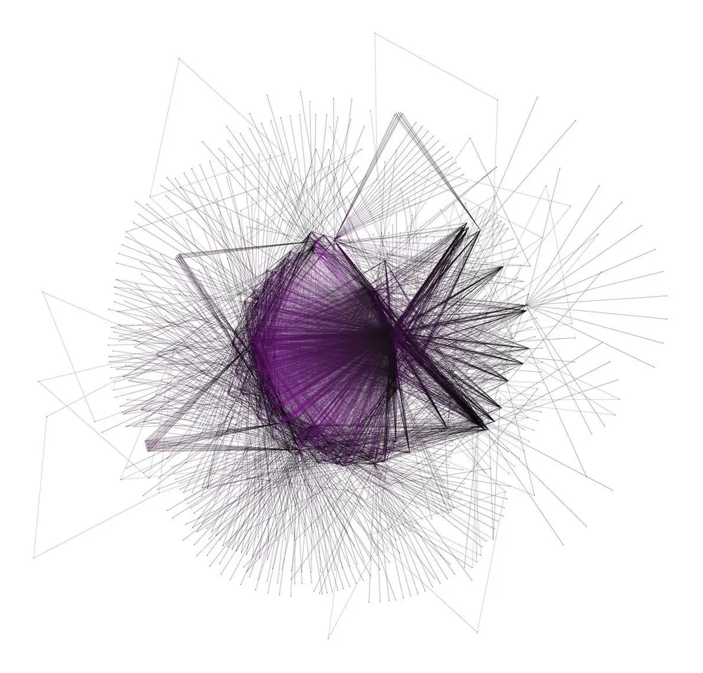
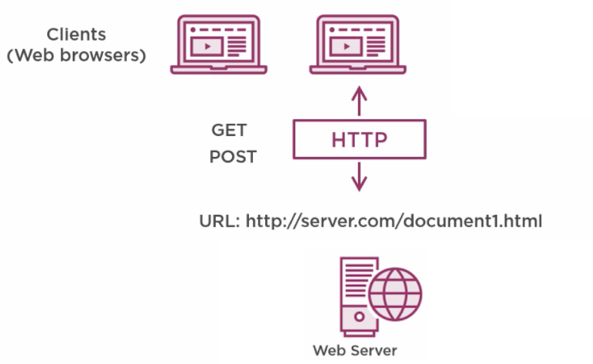
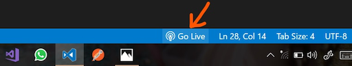

name: inverse
layout: true
class: center, middle, inverse

---

# Creative Coding I

### Jonathan Ho | jonathan.g.ho@filmuniversitaet.de

<br />
#### Film University Babelsberg KONRAD WOLF

---

# Last Session

---

layout: false

.header[Last Session]

## Creative Coding

> What do I have available and what can I do with that beyond the obvious?

- Producing something expressive rather than focusing on a practical use
- Developing software beyond its standard usage scenarios
- Developing tools that help others to be creative

???
Reminder from last session: Creative coding is about exploration and expression, not just solving practical problems.

---

.header[Last Session]

## Practical Approaches

- **Algorithms** to create graphics and audio
- **Smart, meaningful or unusual data sources** (images, video, sensors, APIs...)
- **Diverse output formats** (web, large-scale installations, mobile devices...)

???
The three pillars of creative coding practice we discussed.

---

.header[Last Session]

## Tools and Environments

- Programming Languages (JavaScript, Python, C++, GLSL...)
- Frameworks & Libraries (p5.js, three.js, OpenFrameworks...)
- Software (TouchDesigner, Unity, Unreal, Houdini...)
- Hardware (microcontrollers, sensors, projectors, VR/AR...)

???
Brief overview of the landscape. We'll focus on JavaScript + p5.js in this course.

---

## Today

--

- Algorithmic Thinking

--

- Programming Fundamentals

--

- Artistic Interpretation of Instructions

--

- The Web

???
These topics build on each other: thinking → coding → art → deployment.

---

template:inverse

# Algorithmic Thinking

---

.header[Algorithmic Thinking]

## What is an Algorithm?

--

> An algorithm is a set of instructions, **typically to solve a class of problems** or perform a computation.

--

<br >

> Algorithms are **unambiguous** specifications for performing calculation, data processing, automated reasoning, and other tasks.

???
Think of cooking recipes, knitting patterns, or IKEA instructions - these are all algorithms in the analog world!

An algorithm converts information from one form into another following a system of rules.

---

.header[Algorithmic Thinking]

## The Goal

--

The goal is an **algorithm**, which can also be understood as defining a list of steps to finish a task.

.footnote[[[code.org]](https://code.org/curriculum/course3/1/Teacher)]

--

<br>

Algorithmic thinking applies:

--

- **Decomposition**: Breaking a large problem into smaller, manageable parts.

--

- **Pattern Matching**: Identifying similarities in problems to reuse solutions.

--

- **Abstraction**: Simplifying a problem by focusing on important details.

???
These three concepts are fundamental to programming. We'll practice each one.

**Decomposition example**: Building a website = design UI + create backend + store data + handle users...

**Pattern matching example**: Add, edit, delete in a todo app all follow similar patterns.

**Abstraction example**: Instead of writing separate functions, create one general function that handles multiple cases.

---

.header[Algorithmic Thinking]

## Divide and Conquer

--

Into which parts can we subdivide a problem?

--

1. What do we see?

--

2. Which sub-problems can we derive?

--

3. How can we implement each sub-problem?

???
Always go from the easiest to the hardest sub-problem.

This is THE core skill in programming - breaking big problems into small, manageable pieces.

---

.header[Algorithmic Thinking]

## Example: Washing Dishes

.left-even[
_Give instructions for cleaning the dishes._

<br >
  
 
]

--

.right-even[

- With what are we working?

  - Inputs, data
  - Given functions

- What is the process?
  ]

???
Think like you're explaining to an alien who has never seen dishes before!

**Inputs/data**: plate, sponge, water, tap, soap, dirt

**Given functions**: turn_on_tap(), apply_soap(), scrub(), rinse(), dry()

**Process**:

1. Pick up dirty plate
2. Turn on water
3. Apply soap to sponge
4. Scrub plate with sponge
5. Rinse under water
6. Dry and set aside

The level of detail depends on who is executing the algorithm!

---

.header[Algorithmic Thinking]

## Example: Sum 1 to 200

> Sum up all numbers between 1-200.

???
Classic example attributed to young Carl Friedrich Gauss.

Ask students: How would you approach this?

---

.header[Algorithmic Thinking | Example]

## Sum Up All Numbers Between 1-200

**Decomposition**

--

.left-even[
Let's start at the two ends:

- 1 + 200
- 2 + 199
- 3 + 198
- 4 + 197
- ...

**Pattern matching:** Each pair = 201!
]

--

.right-even[
How many pairs?

- The last pair is 100 + 101
- We have **100 pairs in total**

<br>

> **100 × 201 = 20,100**
> ]

???
This is a beautiful example of pattern matching in action!

The young Gauss supposedly solved this in seconds while his classmates were still adding one by one.

---

.header[Algorithmic Thinking | Example]

## Sum Up All Numbers Between 1-n

**Abstraction**

--

_Solution n=200_: 100 × 201 = 20,100

--

_Solution n=20,000_: 10,000 × 20,001 = 200,010,000

--

_Solution n=10_: 5 × 11 = 55

--

<br >

_General Solution_: **(n × 0.5) × (n + 1)**

???
This is abstraction: We found a general formula that works for ANY n!

The formula `(n × 0.5) × (n + 1)` or equivalently `n(n+1)/2` is one of the most famous in mathematics.

For more practice: [Techniques for Adding the Numbers 1 to 100](https://betterexplained.com/articles/techniques-for-adding-the-numbers-1-to-100/)

---

template:inverse

# Programming Fundamentals

???
Now let's apply algorithmic thinking to actual code.

---

.header[Programming Fundamentals]

## You Have to Learn

--

1. **The formal language** (syntax)

--

2. **Algorithms** (logic and problem-solving)

???
Syntax you can look up. Problem-solving skills take practice!

JavaScript is "loosely typed" - variables can hold any type of data and can change types.

**See example**: `05_examples/01_basic_setup/` for basic p5.js syntax
**See example**: `05_examples/02_variables/` for working with variables

---

.header[Programming Fundamentals]

## A Basic Grid

```js
function draw() {
  for (let y = 0; y < height; y += cellSize) {
    for (let x = 0; x < width; x += cellSize) {
      fill(255);
      rect(x, y, cellSize, cellSize);
    }
  }
}
```

???
https://editor.p5js.org/legie/sketches/-WvKYxepm

This is a **nested loop** - one loop inside another. Essential for creating 2D grids!

- Outer loop: rows (y position)
- Inner loop: columns (x position)

**See example**: `05_examples/03_for_loops/` for loop basics
**See example**: `05_examples/04_grid_pattern/` for nested loops creating grids

---

.header[Programming Fundamentals]

## Controlling the Grid

> How do you need to control the fill command to create different patterns?

???
Now we'll add conditionals (if statements) to create patterns.

The key insight: We can use the row/column position to determine what color each cell should be!

---

.header[Programming Fundamentals | Grid Patterns]

## Diagonal

.left-quarter[

]

--

.right-quarter[

```js
// Fill only the cell on the diagonal
if (row == col) {
  fill(0);
} else {
  fill(255);
}

rect(x, y, cellSize, cellSize);
```

]

???
The diagonal is where row index equals column index: (0,0), (1,1), (2,2), etc.

**See example**: `05_examples/05_conditionals_modulo/` shows this pattern

---

.header[Programming Fundamentals | Grid Patterns]

## Triangle

.left-quarter[

]

--

.right-quarter[

```js
stroke(0);
fill(255);

if (col > row) {
  stroke(255);
  fill(0);
}

rect(x, y, cellSize, cellSize);
```

]

???
The triangle pattern: all cells where column > row are filled black.

This creates an upper-right triangle!

Try: What would `col < row` produce? (lower-left triangle)

**See example**: `05_examples/05_conditionals_modulo/`

---

.header[Programming Fundamentals | Grid Patterns]

## Checkerboard

.left-even[

]

???
The classic checkerboard! How would you approach this?

Think about it:

- In even rows (0, 2, 4...), even columns are black
- In odd rows (1, 3, 5...), odd columns are black

How do we test if a number is even?

---

.header[Programming Fundamentals]

## The Modulo Operator

--

The [modulo](https://www.computerhope.com/jargon/m/modulo.htm) operator returns the **remainder** of a division:

```js
5 % 2 = 1    // 5 divided by 2 is 2, remainder 1
7 % 5 = 2    // 7 divided by 5 is 1, remainder 2
8 % 2 = 0    // 8 divided by 2 is 4, remainder 0
```

--

<br>

This comes in handy for testing **even numbers**:

```js
if (number % 2 == 0) {
  print("even");
}
```

???
The modulo operator `%` is incredibly useful in creative coding!

Uses:

- Check even/odd: `n % 2`
- Cycle through colors: `i % 3` gives 0, 1, 2, 0, 1, 2...
- Wrap around: `x % width` keeps x within canvas
- Create repeating patterns

**See example**: `05_examples/05_conditionals_modulo/` has detailed modulo examples

---

.header[Programming Fundamentals | Grid Patterns]

## Checkerboard Solution

.left-quarter[

]

.right-quarter[

```js
// The elegant solution!
if ((row + col) % 2 == 0) {
  fill(0);
} else {
  fill(255);
}
```

Why does this work?

- even + even = even
- odd + odd = even
- even + odd = odd
  ]

???
This is beautiful algorithmic thinking!

Instead of checking row AND column separately, we add them together.

- (0,0): 0+0=0, even → black
- (0,1): 0+1=1, odd → white
- (1,0): 1+0=1, odd → white
- (1,1): 1+1=2, even → black

**See example**: `05_examples/06_checkerboard/` for interactive checkerboard demo

---

.header[Programming Fundamentals]

## An Animated Algorithm

<iframe src="https://editor.p5js.org/legie/full/-HB6nto44" width="1100" height="500" ></iframe>

???
Now let's analyze a more complex example!

https://editor.p5js.org/legie/full/-HB6nto44

Watch it for a moment. What do you observe?

---

.header[Programming Fundamentals | What do we see?]

## Lines Algorithm

.left-quarter[

<iframe src="https://editor.p5js.org/legie/full/-HB6nto44" width="300" height="300" ></iframe>
]

.right-quarter[

- In equal time steps a line is drawn
- The first line is randomly placed
- Start and end points move in a direction with random variation
- Points remain within the canvas
- Direction reverses at borders
- Color slowly changes over time
  ]

???
This is decomposition in action! We identified 6 distinct behaviors.

**See example**: `05_examples/10_animation_lines/` implements this algorithm

---

.header[Programming Fundamentals]

## Sub-Problems

--

1. **Line Drawing**: Each frame, draw a line between two points.

--

2. **Movement**: Move endpoints in a fixed direction.

--

3. **Border collision**: Reverse direction when hitting a border.

--

4. **Color**: Slowly change the line's color over time.

???
Each sub-problem can be solved independently!

1. Line Drawing: `line(x1, y1, x2, y2)`
2. Movement: `x1 += dirX1 * speed`
3. Border collision: `if (x1 <= 0 || x1 >= width) dirX1 *= -1`
4. Color: Use HSB mode, increment hue each frame

Links to example sketches:

- A. https://editor.p5js.org/legie/sketches/PwBLEu8pn7
- B. https://editor.p5js.org/legie/sketches/9i2kF3Be6
- C. https://editor.p5js.org/legie/sketches/H-2RPs_jN
- D. https://editor.p5js.org/legie/sketches/LjBZTapQa

**See example**: `05_examples/10_animation_lines/` for the complete implementation

---

template:inverse

Programming Fundamentals ✓

# Artistic Interpretation

---

.header[Artistic Interpretation]

## Instructions as Art

???
Algorithms in the analog world: cooking recipes, knitting patterns, sewing instructions...

All are systems of rules to convert information from one form into another.

--

> We can explore creatively the imprecision of algorithms — or the space between precision and imprecision.

???
What happens when instructions are followed by different people?
What if the instructions are intentionally vague?

---

.header[Artistic Interpretation]

## Sol LeWitt - Wall Drawing #122, 1972

> ...all combinations of two lines crossing, placed at random, using arcs from corners and sides, straight, not straight and broken lines.

.footnote[[R. Eperjesi. 2023. Decode - A friendly introduction to creative coding.]]

???
Sol LeWitt (1928-2007) was a pioneer of conceptual art and minimalism.

He created "instructions" that others would execute. The artwork is the IDEA, not the physical result.

Each execution is unique, even following the same instructions!

---

.header[Artistic Interpretation | Sol LeWitt]

.center[]

.footnote[[A. Adler. 2017. [*Sol LeWitt: 'Arcs and Lines' At Paula Cooper Gallery, NYC.*](https://www.huffpost.com/entry/sol-lewitt-arcs-and-lines_b_870641). Huffpost.]]

???
Wall Drawing #122 resulted in 150 unique pairings of line combinations.

The instructions are precise enough to be followed, but open enough to allow variation.

---

.header[Artistic Interpretation | Sol LeWitt]

.center[]

.footnote[[A. Adler. 2017. [*Sol LeWitt: 'Arcs and Lines' At Paula Cooper Gallery, NYC.*](https://www.huffpost.com/entry/sol-lewitt-arcs-and-lines_b_870641). Huffpost.]]

???
Different installations look different - that's intentional!

The human element introduces controlled randomness.

---

.header[Artistic Interpretation | Sol LeWitt]

<br >
.center[<iframe width="860" height="500" src="https://www.youtube.com/embed/fyxIfw_VZWA?si=Z94BwAnC0cli_3mi" title="YouTube video player" frameborder="0" allow="accelerometer; autoplay; clipboard-write; encrypted-media; gyroscope; picture-in-picture; web-share" allowfullscreen></iframe>]

???
Watch how the team executes the instructions.

Notice: precision tools, careful measurement, but still human variation.

Connection to code: Our algorithms are like LeWitt's instructions!

---

.header[Artistic Interpretation]

## Yoko Ono - Grapefruit, 1964

> ...an early example of conceptual art, containing a series of "event scores" that replace the physical work of art with instructions that an individual may, or may not, wish to enact.

.footnote[[Wikipedia. 2023. [*Grapefruit (book)*](https://en.wikipedia.org/wiki/Grapefruit_(book)).]]

???
Yoko Ono's "Grapefruit" contains poetic instructions - some impossible, some meditative.

David Bourdon: "Grapefruit is one of the monuments of conceptual art of the early 1960s. She has a lyrical, poetic dimension that sets her apart."

---

.header[Artistic Interpretation | Yoko Ono - Grapefruit, 1964]

## Cloud Piece

> Imagine the clouds dripping.  
> Dig a hole in your garden to  
> put them in.

— 1963 Spring

.footnote[[Wikipedia. 2023. [*Grapefruit (book)*](https://en.wikipedia.org/wiki/Grapefruit_(book)).]]

???
This instruction is impossible to execute literally, but creates a mental image.

The "algorithm" runs in your imagination, not on a computer!

---

.header[Artistic Interpretation | Yoko Ono - Grapefruit, 1964]

## Snow Piece

> Think that snow is falling. Think that snow is falling everywhere all the time. When you talk with a person, think that snow is falling between you and on the person. Stop conversing when you think the person is covered by snow.

— 1963

.footnote[[Wikipedia. 2023. [*Grapefruit (book)*](https://en.wikipedia.org/wiki/Grapefruit_(book)).]]

???
This is an algorithm for human behavior - with a conditional!

`while (person.visible) { converse(); snowfall++; }`
`if (person.covered) { stop(); }`

Connection: Our code can be poetic too. The `random()` function adds unpredictability like imagination.

**See example**: `05_examples/07_random/` for controlled randomness in code

---

template: inverse

# The Web

???
Now let's understand where our p5.js sketches actually run!

---

layout: false

## The Web

The World Wide Web is:

--

- a set of protocols and files that

--

- allow us to visit web pages in a browser

--

The _web_ part refers to the fact that **pages can easily link to each other**, connecting into a huge mesh.

--

<br >
  
> The internet is the underlying networking infrastructure. The web is built on top of it.

???
Important distinction:

- **Internet**: The physical network infrastructure (cables, routers, servers)
- **Web**: The system of linked documents that runs ON the internet

The web is just ONE application of the internet. Email, streaming, gaming are others.

Brief history:

- 1989: Tim Berners-Lee proposes the World Wide Web
- 1990: First web browser
- 1995: JavaScript introduced
- 2008: Chrome released
- Today: 5+ billion internet users

---

template:inverse

## Portraits of The Web

---

.center[  
[[wired]](https://www.wired.co.uk/article/internet-artworks)]

???
These visualizations by Martin Dade-Robertson show website interconnections.

Each dot is a resource (page, image, script). Lines show links between them.

The layout algorithm places linked pages closer together.

---

## The Map of The Internet

.center[  
[[Internet Map]](http://internet-map.net/)]

???
In [The Map of the Internet](http://internet-map.net/):

- Each circle = one website
- Size = traffic volume
- Position = linking patterns (similar sites cluster together)

You can explore it interactively!

---

## The Opte Internet Map

<iframe width="860" height="500" src="https://www.youtube.com/embed/-L1Zs_1VPXA?si=hGSt8RnbUFdd5qch" title="YouTube video player" frameborder="0" allow="accelerometer; autoplay; clipboard-write; encrypted-media; gyroscope; picture-in-picture; web-share" allowfullscreen></iframe>

.footnote[[[Opte]](https://www.opte.org/)]

???
The Opte project visualizes internet routing tables from 1997 to today.

Colors by region:

- Red: Asia Pacific
- Green: Europe/Middle East/Africa
- Blue: North America
- Yellow: Latin America

Watch the explosive growth!

---

template:inverse

# Ingredients For The Web

---

## Ingredients For The Web



.footnote[[B. Luijbregts. 2020. [*HTML, CSS, and JavaScript: The Big Picture*](https://www.pluralsight.com/courses/html-css-javascript-big-picture). Pluralsight]]

???
Three key components:

1. **Resources**: HTML, CSS, JS files, images, videos
2. **URLs**: Unique addresses for each resource
3. **HTTP**: Protocol for transferring files

---

.header[Ingredients For The Web]

## URL (Uniform Resource Locator)

Unique identification of resources, used by the browser to access files:


.footnote[[M. Haverbeke. 2018. [*HTTP and Forms*](https://eloquentjavascript.net/18_http.html). Eloquent Javascript.]]

???
URL breakdown:

- **Protocol**: `http://` or `https://` (secure)
- **Domain**: `eloquentjavascript.net` (human-readable address)
- **Path**: `/13_browser.html` (specific resource on server)

The domain maps to an IP address (like 149.210.142.219).

---

.header[Ingredients For The Web]

## How It Works

The browser:

--

1. Identifies the server address from the URL

--

2. Makes a connection using HTTP protocol

--

3. Asks for the resource (e.g., `index.html`)

--

4. Displays the document the server responds with

???
This happens in milliseconds!

If something goes wrong, you get error codes:

- 404: Resource not found
- 500: Server error
- 403: Access forbidden

---

.header[Ingredients For The Web]

## Server

> A server is a computer program or device that provides a service to another computer program and its user (the client).

--

<br>

A **webserver** serves up HTML documents and other resources upon request from a browser.

???
Server can mean:

- The physical machine (hardware)
- The software running on it

A web server:

- Stores files (HTML, CSS, JS, images)
- Listens for requests
- Sends files back via HTTP

When we use Live Server in VSCode, we're running a mini web server on our own computer!

---

## Ingredients For A Webpage

--

- **HTML** — Displaying (structure)

--

- **CSS** — Styling (presentation)

--

- **JavaScript** — Interacting (behavior)

???
The three pillars of web development:

1. **HTML** (HyperText Markup Language): Content and structure
2. **CSS** (Cascading Style Sheets): Visual presentation
3. **JavaScript**: Dynamic behavior and interactivity

p5.js is a JavaScript library that makes drawing easy!

---

.header[Ingredients For A Webpage]

## HTML

.left-even[

```html
<!DOCTYPE html>
<html>
  <head>
    <title>My home page</title>
  </head>
  <body>
    <h1>My home page</h1>
    <p>Hello, I am Marijn and this is my home page.</p>
    <p>I also wrote a book! Read it <a href="...">here</a>.</p>
  </body>
</html>
```

]

.right-even[

]

???
HTML is a **markup language** - it annotates content with tags.

Key elements:

- `<!DOCTYPE html>`: Tells browser this is HTML5
- `<html>`: Root element
- `<head>`: Metadata (title, links to CSS/JS)
- `<body>`: Visible content

The browser builds a **DOM** (Document Object Model) - a tree structure that JavaScript can manipulate.

---

.header[Ingredients For A Webpage]

## CSS


???
CSS separates content from presentation.

Selectors target elements:

- `p { }` - all paragraphs
- `.classname { }` - elements with that class
- `#idname { }` - element with that ID

Properties control appearance:

- `color`, `background-color`
- `font-size`, `font-family`
- `margin`, `padding`
- `width`, `height`

**See example**: All examples in `05_examples/` have a `style.css` file

---

.header[Ingredients For A Webpage]

## JavaScript

.center[]

.footnote[[[W3 Schools]](https://www.w3schools.com/Js/tryit.asp?filename=tryjs_intro_inner_html)]

???
JavaScript makes pages interactive!

In this example:

- `document.getElementById("demo")` - finds an HTML element
- `.innerHTML = "..."` - changes its content

p5.js uses JavaScript under the hood. When you write `circle(100, 100, 50)`, that's JavaScript!

Key JS concepts we'll use:

- Variables: `let x = 100;`
- Functions: `function draw() { }`
- Conditionals: `if (mouseIsPressed) { }`
- Loops: `for (let i = 0; i < 10; i++) { }`

---

## All Together

.center[]

.footnote[[B. Luijbregts. 2020. [*HTML, CSS, and JavaScript: The Big Picture*](https://www.pluralsight.com/courses/html-css-javascript-big-picture). Pluralsight]]

???
The complete picture:

1. HTML, CSS, JS files live on a **web server**
2. Browser requests them via **HTTP**
3. Browser **renders** HTML, applies CSS, executes JS
4. User sees and interacts with the page

This is how ALL websites work - from simple pages to complex apps!

---

template:inverse

# A Local Web

???
Now let's set up our own local development environment!

---

## Local Setup

For imitating the web locally you need:

--

- `.html`, `.css` and `.js` file(s)

--

- JavaScript library files (p5.js, three.js, etc.)

--

- A webserver

???
Why do we need a webserver locally?

Some features (like loading images, using libraries) only work over HTTP, not with `file://` protocol.

The webserver creates a proper HTTP environment on your computer.

---

.header[Local Setup]

## Library Files

Two options:

--

**Local** — Download the library file

```html
<script src="../lib/p5.js"></script>
```

--

**Online (CDN)** — Link to hosted version

```html
<script src="https://cdnjs.cloudflare.com/ajax/libs/p5.js/1.9.0/p5.js"></script>
```

???
**Local**:

- Works offline
- You control the version
- Need to download and organize files

**CDN** (Content Delivery Network):

- Always up-to-date
- Faster (cached globally)
- Requires internet connection

For learning, CDN is easier. For production, local is safer.

**See**: All examples in `05_examples/` use CDN links

---

.header[Local Setup]

## Folder Structure

```js
- projects
    - lib
        - p5.js
    - proj1
        - index.html
        - sketch.js
        - style.css
    - proj2
        - index.html
        - sketch.js
    - ...
```

???
Recommended structure:

- One folder per project
- `index.html` is the main file (browsers look for this by default)
- `sketch.js` contains your p5.js code
- `style.css` for any custom styling

Shared libraries can go in a `lib` folder at the root.

**See**: `05_examples/` folder demonstrates this structure

---

.header[Local Setup]

## The HTML File

```html
<!DOCTYPE html>
<html>
  <head>
    <meta charset="UTF-8" />
    <link rel="stylesheet" href="style.css" />
    <title>My Sketch</title>
  </head>
  <body>
    <script src="../lib/p5.js"></script>
    <script src="sketch.js"></script>
  </body>
</html>
```

???
Important points:

- `<meta charset="UTF-8">` ensures special characters work
- CSS link goes in `<head>`
- Scripts go at the END of `<body>` (so HTML loads first)
- Order matters! p5.js must load BEFORE sketch.js

**See example**: Any `index.html` in `05_examples/`

---

.header[Local Setup]

## Paths to Resources

**Relative paths** (recommended for local files):

```html

<!-- same folder -->

<!-- subfolder -->

<!-- parent folder -->
```

--

<br>

**Absolute paths** (for external resources):

```html

```

???
Path shortcuts:

- `./` = current folder (can be omitted)
- `../` = go UP one folder
- `../../` = go UP two folders

With a webserver, you can never go above the server root!

Common mistake: Wrong path = resource not found = broken page.

---

.header[Local Setup]

## Running a Local Server

VSCode extension: **Live Server**



.footnote[[[vscode-live-server]](https://github.com/ritwickdey/vscode-live-server)]

--

- Click "Go Live" → opens browser at localhost

--

- Changes auto-refresh in browser

???
Live Server is magical for development!

1. Install the extension in VSCode
2. Open your project folder
3. Click "Go Live" in the status bar
4. Browser opens automatically
5. Save a file → browser refreshes instantly

Alternative: "Live Server (Five Server)" extension has similar features.

---

.header[Local Setup]

## Localhost

`http://127.0.0.1` = `localhost` = "this computer"

--

<br>

**Ports** enable multiple servers from one machine:

- `localhost:3000`
- `localhost:8080`
- `localhost:5500`

> Like apartments in a building: one address, multiple mailboxes.

???
`127.0.0.1` is the "loopback" IP - always points to your own machine.

Ports are like apartment numbers:

- Port 80: Default HTTP
- Port 443: Default HTTPS
- Port 5500: Live Server default
- Port 3000: Common for Node.js

If a port is busy, Live Server picks another automatically.

---

.header[Local Setup]

## Workflow

1. Write code in VSCode (sketch.js)

--

2. Make sure webserver is running (Go Live)

--

3. See results in browser (auto-refreshes)

--

4. Check browser console for errors (F12)

???
The development loop:

1. Code
2. Save (Ctrl+S / Cmd+S)
3. Check browser (auto-refreshes with Live Server)
4. If something's wrong, open DevTools (F12) → Console tab
5. Fix errors, repeat

The browser console shows JavaScript errors with line numbers!

---

.header[Local Setup]

## Important!

**Do NOT** use `File → Open` in browser

--

- It might look the same, but it's not!

--

- No data goes back and forth between server and browser

--

- Some features (like loading external files) won't work

--

<br>

> Always use a local server for development.

???
Opening an HTML file directly uses `file://` protocol, not `http://`.

Problems with `file://`:

- Can't load external files (security restriction)
- Some JavaScript features don't work
- Doesn't match how the site will work when deployed

When in doubt: Look at the URL bar. Should say `localhost:XXXX`, not `file://...`

---

## Summary

--

- **Algorithmic Thinking**: Decomposition, Pattern Matching, Abstraction

--

- **Programming**: Variables, loops, conditionals, modulo operator

--

- **Instructions as Art**: Sol LeWitt, Yoko Ono

--

- **The Web**: HTML + CSS + JavaScript

--

- **Local Setup**: Libraries, folder structure, webserver

???
Key takeaways:

1. Break problems into small pieces
2. Look for patterns you can reuse
3. Abstract to create general solutions
4. Code is just instructions - like art instructions!
5. The web is HTML + CSS + JS served over HTTP

**Practice with examples**: `05_examples/` folder has working code for all these concepts!

---

## Next Session

- Hands-on with p5.js

- Creating your first sketches

- JavaScript fundamentals

???
Next time we'll dive deep into p5.js!

Homework:

- Set up your local development environment
- Try running examples from `05_examples/`
- Experiment with changing values in the code!

---

template: inverse

## The End

💻 🔗 📚
