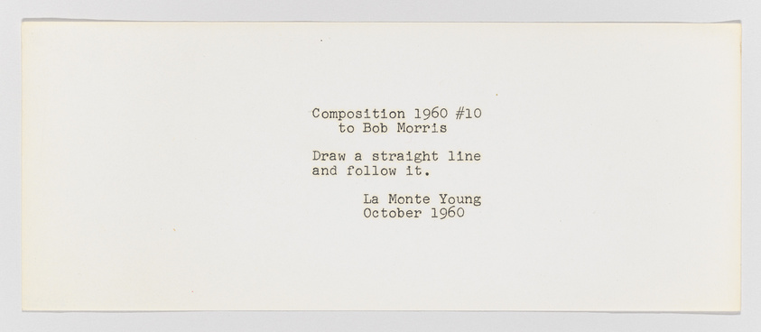
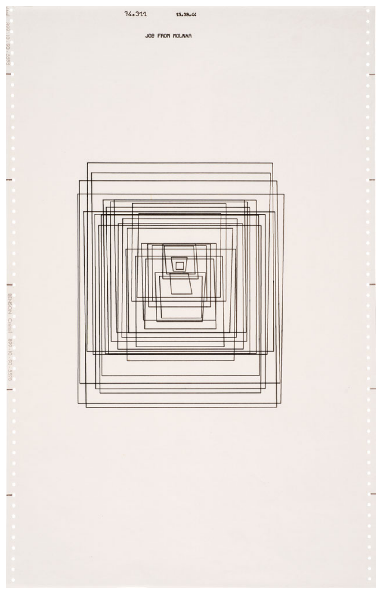
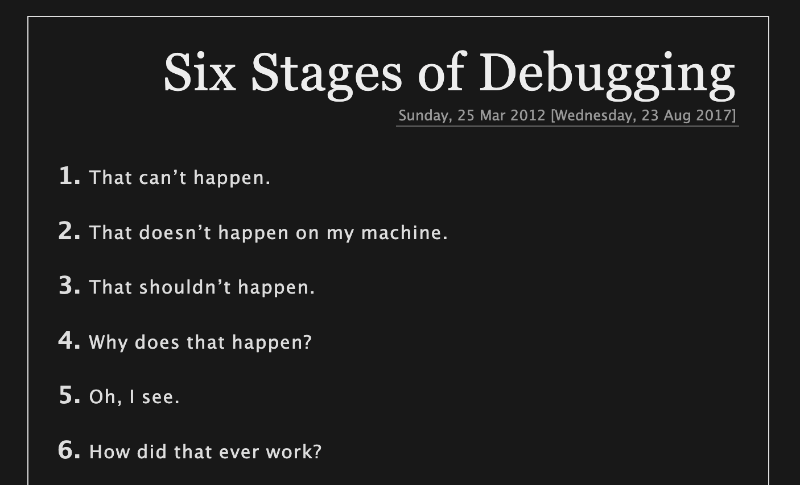
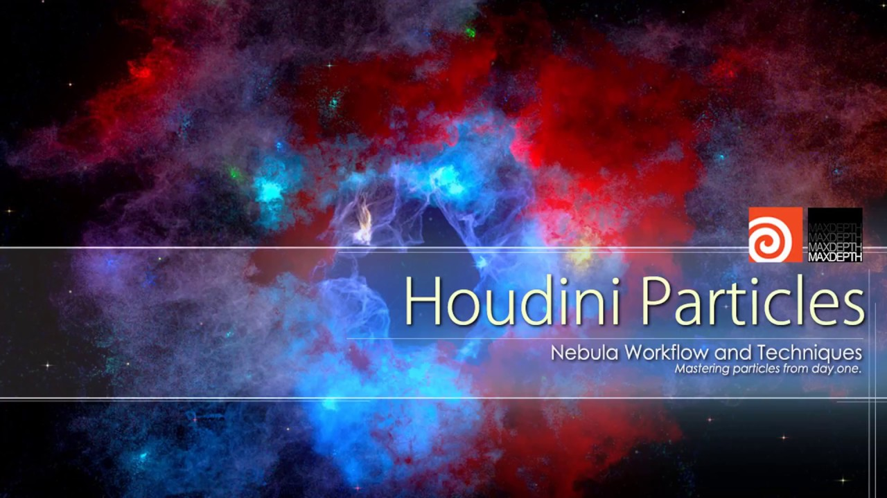
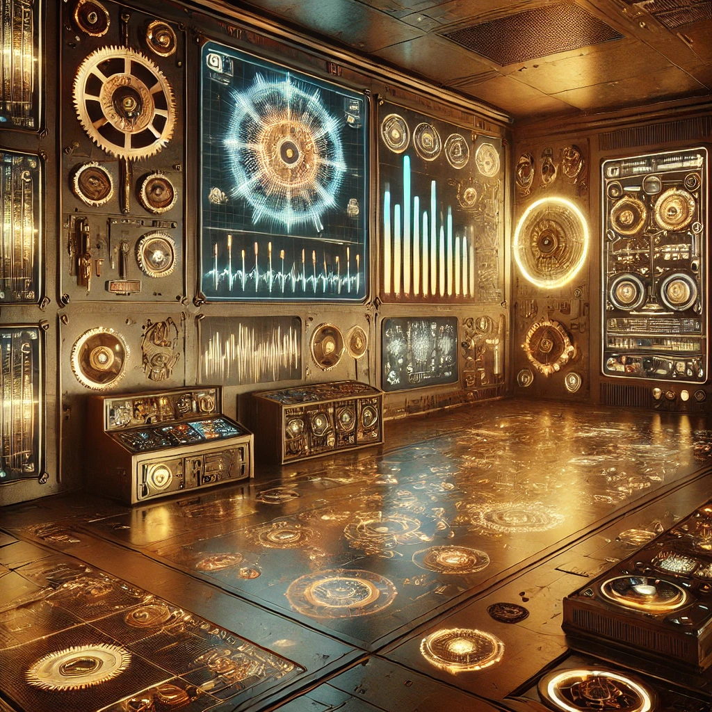
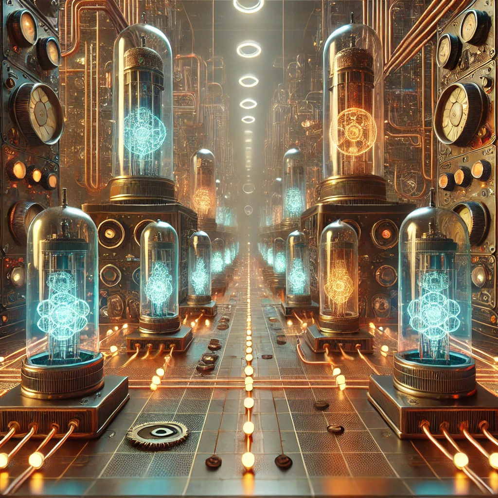
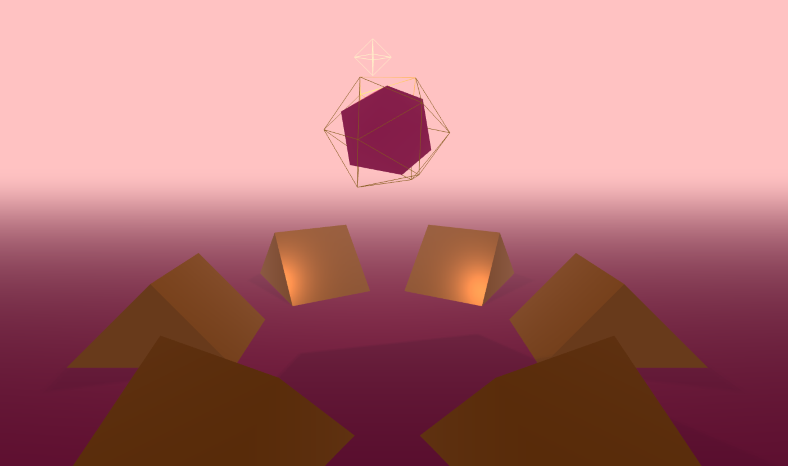
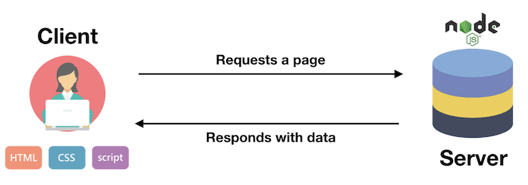

name: inverse
layout: true
class: center, middle, inverse

---

# Creative Coding I

### Jonathan Ho | jonathan.g.ho@filmuniversitaet.de

<br />
#### Film University Babelsberg KONRAD WOLF

---

# Last Session

???
Let's begin with a brief recap of what we covered last time to make sure everyone is on the same page before we move forward.

---

layout: false
.header[Last Week]

## Ingredients For The Web

--

.center[]  
[[Barry Luijbregts, Pluralsight]](https://www.pluralsight.com/courses/html-css-javascript-big-picture)

???

The World Wide Web is a set of protocols and formats...that allow us to visit web pages in a browser.

- Resources, like HTML documents, images, or other files are the content that we want to use, websites that we want to browse, images to look at, files that we want to share.

---

.header[Last Session]

## The Web

--

We learned that the web consists of:

- **HTML** — Structure (the scaffolding)
- **CSS** — Styling (the facade)
- **JavaScript** — Behavior (the functionality)

???
Remember our house metaphor: HTML is the structure, CSS is the decoration, and JavaScript is what makes things happen.

The key insight: p5.js is just JavaScript with helpful drawing functions added!

---

.header[Local Setup | Online Library Files]

## Minified Library Files

--
Most JavaScript libraries have a minified version `.min.js`.

- Same functionally but the file size is smaller and make it faster to load
- All unnecessary characters are removed

???

- For javascript libraries you usually also have a minified version `.min.js`. For p5 it is `p5.min.js`. It has absolutely the same functionality as `p5.js` but it is minified, meaning it is made smaller. Minified versions have all unnecessary characters removed in order to reduce the file size and make it faster to load. It is recommended to use this compressed version in a production environment.

If you are still developing your site, work with the non-minified version, as you can read the source code when necessary.

```html
<!DOCTYPE html>
<html>
  <head>
    <meta charset="UTF-8" />
    <link rel="stylesheet" type="text/css" href="style.css" />
    <title>Hello World!</title>
  </head>

  <body>
    <!-- Html Elements... -->

    <script src="../lib/p5.js"></script>
    <script src="../lib/p5.sound.min.js"></script>

    <script src="./sketch.js"></script>
  </body>
</html>
```

You can link to the library files with a relative path to any location of your liking.

_On a Side Note:_ It is best practice to load JavaScript script files after the html content in the body. The script files might take longer to load and if you put them below the html, the html elements will be displayed first and the user sees already a website even if the scripts are still loading. In my examples I might forget about this order once in a while though, and might have the scripts in the header. Also "on the internet" you will see the lading of the script files in the header a lot.

---

.header[Last Session]

## Local Setup Basics

--

- Folder structure for projects
- HTML files linking to CSS and JS
- Using **Live Server** for development
- Understanding **localhost** and ports

???
We set up our first local development environment. This is the foundation we'll build on today.

Important point: We learned why opening files directly (file://) doesn't work the same as using a proper server (http://).

---

.header[Last Session]

## Artistic Interpretation

.left-even[
**Sol LeWitt**

> Instructions become art
> Different executions, same instructions
> ]

.right-even[
**Yoko Ono**

> Poetic algorithms
> Instructions for imagination
> ]

???
We explored how algorithms and instructions can be artistic expression.

Key connection: Our code is like LeWitt's wall drawing instructions - precise enough to follow, but allowing for variation and creativity.

This concept becomes even more important as we move into 3D graphics, where we're essentially writing instructions for virtual worlds.

---

.header[Last Session | Instruction]

## Instruction Art

???

- or Event Scores
- La Monte Young wrote some of the earliest and most influential instruction pieces.
- Each piece has a unique set of instructions to be followed by the performer. These instructions may include the setting up of the piece, and what to do during the piece.[2] Some of the pieces will even specify what the audience should do.

Fluxus was an international, interdisciplinary community of artists, composers, designers, and poets during the 1960s and 1970s who engaged in experimental art performances which emphasized the artistic process over the finished product.[1][2] Fluxus is known for experimental contributions to different artistic media and disciplines and for generating new art forms.

--

.center[ .imgref[[[whitney]]([link](https://whitney.org/collection/works/38288)]]

---

.header[Last Session | Instruction]

## Instruction Art

_Composition 1960 #13_ by La Monte Young are text-based musical pieces

> The performer should prepare any composition and then perform it as well as he can.

.footnote[[Wikipedia: Compositions 1960](https://en.wikipedia.org/wiki/Compositions_1960)]

???

- I find particularly interesting how these artists used instructions to blur the line between art, everyday life, and audience participation. Many of these works challenge our notion of what constitutes an artwork - is it the instruction itself, the performance of it, or both?

.todo[TODO: Look at home work - creative instructions]

---

.header[Last Session | Vera Molnár]

.left-quarter[

.footnote[[[studio international]](https://www.studiointernational.com/index.php/vera-molnar-interview-computer-art-paris-mayor-gallery)]
]

.right-quarter[
_Vera Molnár. Trapèzes inscrits 1/5, 1974._

<br />

One of the pioneers of computer-generated art, Molnár explored how simple geometric rules could create complex visual compositions.

[Generative Art Exploration: The Life and Work of Vera Molnár ⬀](https://www.youtube.com/watch?v=8tNESHtfkr0)
]

???
Vera Molnár (1924-2023) is considered the "Grande Dame of Generative Art."

She began creating algorithmic art before computers were available - she simulated randomness by hand!

Her work shows how geometric rules and controlled variation can create beautiful, complex compositions.

This directly connects to what we'll do with three.js - using code to create geometric art in 3D.

---

template: inverse

## Today

---

layout: false

## Today

--

1. Debugging

--

2. Space (analogue vs. virtual)

--

3. NodeJS Development Environment

--

4. Introduction to three.js

???
These topics build naturally on each other:

1. Debugging - because as we write more complex code, we need to know how to fix problems
2. Space - philosophical groundwork before we create 3D spaces
3. Development Environment - upgrading our tools for professional work
4. three.js - our first steps into 3D graphics

By the end of today, you'll understand how to set up a three.js project and have the conceptual foundation for the homework.

---

template: inverse

### A Quick Detour...

# Debugging

???
Before we dive into more complex topics, let's talk about something every programmer needs: debugging skills.

As our programs get more sophisticated, bugs become inevitable. Learning to debug efficiently will save you hours of frustration.

---

.header[Debugging]

## Debugging

???
What do you think debugging means?

The term comes from the early days of computing when actual insects (bugs) could cause hardware problems!

Today, it means finding and fixing errors in our code.

---

.center[ .imgref[[[dailymoss]](https://www.dailymoss.com/15-funny-programming-memes-real-computer-programmers-can-decode/)]]

???
Debugging often feels like this - we know something is wrong, but where?

The good news: there are systematic approaches to finding and fixing bugs.

---

.center[
.imgref[[[plasmasturm]](http://plasmasturm.org/log/6debug/)]]

???
Another accurate description of debugging.

---

.header[Debugging]

## Two Types of Errors

--

1. **Syntax Errors**
   - The code doesn't follow language rules
   - Usually the computer tells you what's wrong

--

2. **Logical Errors**
   - The code runs, but does the wrong thing
   - The computer can't help you here!

???
**Syntax errors** are like grammar mistakes - the computer doesn't understand what you're trying to say.

Examples: missing semicolon, misspelled function name, unclosed bracket

**Logical errors** are trickier - your code is valid, but your algorithm is wrong.

Example: Your loop runs 9 times instead of 10, or your calculation uses the wrong formula.

---

.header[Debugging | Syntax Errors]

## Read the Error Messages :)

- **Look at the output of your program**

- **Read it**

- **Understand it?**

???
This sounds obvious, but many ignore error messages

The browser console (F12) is your friend. Error messages usually tell you:

- What went wrong
- Which file
- Which line number

Take time to actually read and understand the message before trying random fixes.

---

.header[Debugging | Syntax Errors]

.center[]

???
Here's an example of an error in the browser console.

Notice: It tells us the file name, line number, and type of error.

This is incredibly helpful! Don't ignore these messages.

**Demo opportunity**: Show a simple syntax error and how to read the console message.

---

.header[Debugging]

## Using Print Statements

In p5.js and JavaScript, use `console.log()`:

--

- **Value of a variable**: `console.log(x);`

--

- **Flow of a program**: `console.log("entered function");`

--

- **Location of a problem**: `console.log("made it here!");`

--

- **Object inspection**: `console.log({x, y, angle});`

???
Print statements are the simplest debugging tool, but incredibly powerful!

Strategic placement of console.log() can help you understand:

- What values your variables actually have (vs. what you expected)
- Whether your code reaches certain points
- The order in which things execute

Pro tip: Use descriptive messages like `console.log("before loop, x =", x);`

---

.header[Debugging]

## VSCode Debugger

A more powerful alternative to print statements.

--

**Benefits over `console.log()`:**

- **Pause execution** at any line (breakpoints)
- **Inspect all variables** at once, not just what you logged
- **Step through code** line by line
- **No cleanup** no removing debug statements later
- **Watch expressions** monitor specific values as you step

???
While console.log() is quick and useful, the VSCode debugger gives you much more control.

Instead of guessing which variables to log, you can pause execution and inspect everything.

You can step through your code one line at a time to see exactly what happens.

---

.header[Debugging]

## Using the VSCode Debugger

--

**1. Set a Breakpoint**

- Click the left margin next to a line number (red dot appears)
- Code will pause when it reaches this line

--

**2. Start Debugging**

- Open the Run & Debug panel (Ctrl+Shift+D / Cmd+Shift+D)
- Or press F5 to start debugging
- For browser code: use browser DevTools debugger instead

--

**3. When Paused, You Can:**

- Hover over variables to see their values
- Use the Variables panel to inspect all local/global variables
- Step Over (F10): Execute current line, move to next
- Step Into (F11): Enter a function call
- Continue (F5): Run until next breakpoint

???
**Demo opportunity**: Show setting a breakpoint in a simple script.

For JavaScript in the browser, use the browser's built-in debugger (F12 → Sources tab).

The workflow is similar: set breakpoints, refresh the page, step through code.

Key insight: Debugging is about understanding what your code _actually does_ vs. what you _think_ it does. The debugger shows you reality.

---

.header[Debugging | Logical Errors]

## Solving Logical Errors

.left-even[
**Identify the problem**

- Find the problematic code area
- Compare actual vs. expected behavior
- Examine behavior with logging
  ]

--

.right-even[
**Solve the problem**

- Develop a hypothesis
- **Isolate and test** (step by step)

> Slow down!
> ]

???
Logical errors require detective work ;)

**Identify**: Where does the actual output diverge from what you expected?

**Solve**: Make one change at a time and test. Don't change 5 things at once!

Key advice: **SLOW DOWN**. When frustrated, we tend to make random changes hoping something works. This rarely helps and often creates new bugs.

Take a breath. Think systematically. Test one thing at a time.

---

.header[Debugging]

.center[ .imgref[[[Venezuelan Poodle Moth]](https://duckduckgo.com/?q=Poodle+moth&t=newext&atb=v247-1&iax=images&ia=images)]]

???
By the way, this is a Venezuelan Poodle Moth, discovered in 2009.

Much cuter than the bugs in our code!

Remember: debugging is a skill that improves with practice. Every bug you fix teaches you something.

---

template: inverse

# Space

???
Now let's shift gears completely and think about something more philosophical: What is space?

This might seem abstract, but understanding space is fundamental to creating 3D graphics.

---

.center[]
.footnote[By NASA, ESA, CSA, and STScI, Public Domain]

???
When we say "space," what comes to mind?

Probably outer space - stars, galaxies, the void between planets.

But space is a much richer concept...

---

## What is Space?

--

- [Merriam-Webster: Space](https://www.merriam-webster.com/dictionary/space) - many definitions

--

- Different perspectives:
  - **Physical Space** (Cosmological) - the universe
  - **Mathematical Space** - abstract dimensions
  - **Philosophical Space** - perception and experience
  - **Everyday Space** - the room around us

???
Space is one of those fundamental concepts that's surprisingly hard to define.

Newton thought of space as an absolute, fixed container.

Einstein showed that space and time are interconnected and warped by gravity.

For us as creative technologists, we work with multiple kinds of space:

- The physical space where our installations exist
- The virtual space inside our screens
- The conceptual space of our designs

---

template: inverse

### _What are the Spatial Properties of Virtual Spaces?_

???
Let's think specifically about the virtual spaces we create and work with.

What makes virtual space different from physical space?

---

.center[]
.footnote[Youtube, "Creating Nebulas using Houdini"]

<!-- ---

.center[]
.footnote[Dall-E, 2023, "Space Virtual"] -->

???
Virtual space has unique properties:

- **Dimensionality**: Can be 2D, 3D, or even higher dimensions
- **Scale**: From microscopic to cosmic, all in the same window
- **Physics**: We can simulate gravity... or ignore it completely
- **Interactivity**: Users can manipulate and navigate
- **Flexibility**: Rules can change, impossible things can happen

<!-- ---

 .imgref[[[ignitingbusiness]](https://www.ignitingbusiness.com/blog/deciding-on-a-device-tablet-vs-laptop-vs-desktop)]

???
And yet, we experience all this virtual space through flat screens!

The magic of 3D graphics is creating the illusion of depth and dimension on a 2D surface.

This is what three.js helps us do - create convincing 3D spaces that live on flat screens. -->

---

template: inverse

### _How Do Analog and Virtual Spaces Relate?_

???
An important question for creative technologists:

How do the physical and virtual worlds connect?

<!-- ---

.center[]
.footnote[ChatGPT 4o, "Analog Virtual Space"] -->

---

<!-- .center[]
.footnote[Dall-E, 2023, "Analog Virtual Space"] -->

template: inverse

## Analog and Virtual Space

#### The relationship between analog and virtual space is complex:

- Virtual spaces can **simulate** physical spaces (architectural visualization)
- Virtual spaces can **extend** physical spaces (AR)
- Virtual spaces can **replace** physical spaces (VR)
- Virtual spaces can be **impossible** (surreal environments, higher dimensions)

As creative technologists, we get to decide how these spaces relate in our work.

<!-- ---

.center[]
.footnote[ChatGPT 4o, "Connection Analog Virtual Space"] -->

---

<!-- .center[]
.footnote[Dall-E, 2023, "Connection Analog Virtual Space"]

??? -->

### The most interesting creative work often happens at the boundary between physical and virtual:

- Interactive installations that respond to physical movement
- AR experiences that overlay virtual on real
- Generative art that visualizes invisible data

---

template: inverse

### _What Makes Analog Space Unique?_

???
Before we dive into virtual 3D, let's appreciate what makes physical space special.

Understanding this helps us know what to simulate... and what we can transcend.

---

.header[Space]

## Analog Space Properties

--

- **Tangibility**: Physical presence, mass, texture

--

- **Physics**: Gravity, friction, conservation of energy

--

- **Sensory richness**: Sight, sound, smell, touch, taste

--

- **Limitations**: Distance, time, resources

--

- **Impermanence, Ephemeral Nature**: Things change, decay, transform

--

- **Spontaneity, Serendipity**: dynamic and unscripted, unpredictable

--

- **Social and Cultural Context**: physical spaces carry cultural significance, human interactions are shaped by social norms, traditions, and shared experiences

???
These properties define our experience of physical reality.

Some we want to simulate in virtual space (physics, visual appearance).

Some we might want to escape (limitations of distance and time).

Some are impossible to fully replicate (smell, touch, the feeling of presence).

Understanding these distinctions helps us make intentional creative choices.

---

template: inverse

## three.js

???
Now that we've thought about space conceptually, let's get practical!

We're going to set up a professional development environment and start working with three.js.

---

.header[three.js]

## Learning Objectives

--

- Set up our local web development environment for node, three.js

--

- Understand node.js, npm, and package management

--

- Have a working understanding of Three.js basics

--

- Be prepared to create your first 3D scene

???
By the end of today and with the reading material, you'll be able to:

1. Set up any JavaScript project professionally
2. Install and manage libraries with npm
3. Create a basic three.js scene

This is real-world web development workflow :)

---

.header[Space]

## Where We're Going

.center[]

???
Today we'll understand how to create scenes like this simple cube.

This is the foundation for much more complex work!

---

.header[Space]

## What's Possible

.center[]

???
And this is just scratching the surface of what three.js can do.

With the same concepts we'll learn today, you can create complex 3D scenes, animations, and interactive experiences.

---

template: inverse

# Node.js Development Environment

???
Now we're upgrading from our simple Live Server setup to a professional development workflow.

---

.header[Development Environment]

## CDN vs. Local Installation

### An upgrade from our simple Live Server setup

Last session we covered using **CDN links** (online library files)

```html
<script src="https://cdnjs.cloudflare.com/ajax/libs/p5.js/1.9.0/p5.js"></script>
```

???
CDN (Content Delivery Network) links are convenient for learning, but have limitations:

- Need internet connection
- Less control over versions
- Can't use advanced build tools
- Some libraries don't work well this way

---

.header[Development Environment]

**CDN (Content Delivery Network)** (like Google Fonts, Cloudflare, etc.)

- No installation needed
- Files may be pre-cached
- Always latest version (usually)

--

**Local Installation (What we're learning)**

- Closed ecosystem - all files on your machine
- More control over dependencies and versions
- Can use bundling and optimization tools
- Required for many modern libraries

???
For simple p5.js sketches, CDN is fine.

But for professional projects and libraries like three.js, local installation is preferred.

Local installation also makes your project **reproducible** - anyone can install exactly what you have.

---

.header[Development Environment]

## Concepts to Know

--

1. **Packages** - bundles of code with metadata

--

2. **Package Management** - tools to install and organize packages

--

3. **Build Tools** - tools to optimize and bundle our code

--

> These concepts apply to almost ALL web development projects.

???
What we're learning today isn't specific to three.js.

This is the standard workflow for modern JavaScript development:

- React projects
- Vue projects
- Node.js backends
- And much more

These are transferable skills!

---

.header[Development Environment]

## Packages

.footnote[[[Eloquent JavaScript - Modules]](https://eloquentjavascript.net/10_modules.html#h_zWTXAU93DC)]

--

A package is:

- **Code** (usually organized into modules)

--

- **Information about dependencies** (what other packages it needs)

--

- **Documentation** (how to use it)

--

- **Versioning** (track changes over time)

--

> Packages require special infrastructure to store, find, install, and update.

???
Think of packages like apps on your phone:

- They have a name and version
- They might depend on other packages
- They're distributed through a central repository
- You can install, update, and remove them

three.js is a package. vite is a package. Everything is packages!

---

.header[Development Environment]

## Node.js & npm


--

**npm** (Node Package Manager):

- Online repository with millions of JavaScript packages

--

- Installation and management program

--

- Command-line tools for running projects

--

- Comes bundled with Node.js

???
npm is THE package manager for JavaScript.

It's like the App Store, but for code libraries.

When you `npm install three`, npm:

1. Finds the three.js package in the online repository
2. Downloads it to your project
3. Records it in your project configuration
4. Downloads any packages that three.js depends on

---

.header[Development Environment]

## Node.js


--

- An open-source JavaScript runtime environment

--

- Lets you run JavaScript **outside** the browser

--

- Powers modern web development tools

???
Traditionally, JavaScript only ran in web browsers.

Node.js changed that - now JavaScript can run anywhere:

- On servers (backend)
- In development tools
- As command-line utilities

npm is part of Node.js. To use npm, you need Node.js installed.

---

## Node.js



--

- **Backend**: The server side of applications

--

- Powerful for scalable, real-time applications

???
You might hear "Node" in the context of backend development.

While we're using it primarily for development tools today, Node.js is also used to build:

- Web servers
- APIs
- Real-time applications (chat, games)
- Command-line tools

---

## Node.js

The _Hello World_ of Node.js is a web server:

```js
const http = require("node:http");

const hostname = "127.0.0.1";
const port = 3000;

const server = http.createServer((req, res) => {
  res.statusCode = 200;
  res.setHeader("Content-Type", "text/plain");
  res.end("Hello World\n");
});

server.listen(port, hostname, () => {
  console.log(`Server running at http://${hostname}:${port}/`);
});
```

.footnote[[[nodejs.org]](https://nodejs.org/en/learn/getting-started/introduction-to-nodejs)]

???
.todo[TODO: show and execute 2425/code/node/server.js]

---

.header[Node.js]

## Version Management

The Node.js version matters!

--

- Different projects may require different versions

--

- Node.js needs its own version manager

--

**Solution: NVM (Node Version Manager)**

- Allows installing different versions of Node
- Switch between versions for different projects

???
This might seem like overkill now, but you'll thank yourself later!

Some projects need Node 16, others need Node 20. NVM lets you switch instantly.

**When installing Node.js:**

1. Choose the download option that includes NVM and npm
2. Follow the installation steps on nodejs.org

---

.header[Node.js]

## Getting Node.js

### Installation Steps

1. Go to [nodejs.org/en/download](https://nodejs.org/en/download)

--

2. Choose the option with **NVM and npm**

--

3. Follow the installation instructions for your OS

--

4. Verify installation in terminal:

```bash
node -v         # Should show version, e.g., v22.13.0
npm -v          # Should show version, e.g., 10.9.2
```

???
This is homework! You need Node.js installed before the next session.

If you run into problems, ask early - installation issues can be tricky.

Common problems:

- Permission errors (need to run as admin)
- PATH not set correctly
- Old versions conflicting

---

.header[Node.js | npm]

## Working with npm

For every project, you need to:

--

1. **Initialize** the npm environment

--

2. **Install** the packages you want to use

???
Let's walk through the actual workflow.

This is what you'll do for your homework project!

---

.header[Node.js | npm]

## 1. Initialize the Project

```bash
npm init -y
```

--

This creates a `package.json` file that tracks:

- **Dependencies**: which packages are installed

--

- **Scripts**: how to run the project

--

- **Metadata**: name, version, description

???
The `-y` flag uses default values. Without it, npm asks you questions about your project.

`package.json` is the heart of any JavaScript project. It tells npm:

- What packages to install
- How to run the code
- Project metadata

**Demo**: Create a folder, run `npm init -y`, show the generated file.

---

.header[Node.js | npm]

## 2. Install Packages

```bash
npm install three
```

--

This:

- Downloads three.js from the npm repository

--

- Saves it in a `node_modules/` folder

--

- Records it in `package.json`

--

- Creates `package-lock.json` with exact versions

???
When you run `npm install three`:

1. npm contacts the online repository
2. Downloads the latest three.js version
3. Downloads all packages three.js depends on
4. Puts everything in `node_modules/`
5. Updates `package.json` to remember you installed it

The `node_modules` folder can get HUGE. That's normal!

---

.header[Node.js | npm]

## Important Files

After running npm commands, you'll have:

--

- `package.json` **(Track this in git!)** Configuration file with metadata

--

- `package-lock.json` **(Track this in git!)** Exact versions of the packages

--

- `node_modules/` **(DO NOT track in git!)** The actual packages
  - Don't modify this folder
  - Don't commit this folder
  - It can be regenerated from package.json

???
Key insight: You share `package.json` and `package-lock.json` with collaborators.

They can run `npm install` to download the same packages you have.

This is why we don't commit `node_modules/` - it's huge and can be recreated!

---

.header[Local Installation]

## For three.js Projects

We need two packages:

```bash
npm install three vite
```

--

**three** — The 3D graphics library

--

**vite** — Development server and build tool

???
Vite (French for "quick") is the recommended build tool for three.js.

It provides:

- Fast development server with hot reload
- Automatic browser refresh when you save
- Optimization for production builds

Vite is much faster and simpler than older tools like Webpack.

---

## How to Run Your Project

In `package.json`, add a script:

```json
{
  "scripts": {
    "dev": "vite",
    "build": "vite build"
  }
}
```

--

Then run:

```bash
npm run dev
```

--

This starts a development server at `localhost:5173` (typically). CTRL+C to stop.

???
**npm run dev** tells npm to look at package.json, find the "dev" script, and run it.

"dev" runs "vite", which starts a local development server.

Benefits over Live Server:

- Faster hot reloading
- Better error messages
- Module support built-in
- Production builds when ready

**CTRL+C** stops the server.

---

.header[Local Installation]

## Quick Summary

**Install once (globally):**

- Node.js (with npm)

---

.header[Local Installation: Summary]

**For each new project:**

```bash
# Create and enter project folder
mkdir myproject
cd myproject

# Initialize npm
npm init -y

# Install packages
npm install three vite

# Add "dev": "vite" to package.json scripts

# Run the project
npm run dev
```

???
This workflow becomes second nature with practice.

Your homework walks you through this step by step!

---

template: inverse

### three.js

## Introduction

???
Now let's finally look at three.js itself!

With our development environment ready, we can start creating 3D graphics.

---

.header[three.js]

## What is three.js?

--

- **Open-source library** for 3D graphics in the browser

--

- Built on **WebGL** (Web Graphics Library)

--

- Simplifies complex 3D programming dramatically

--

- Used by major companies and creative studios worldwide

???
three.js is the most popular library for 3D web graphics.

It was created by Ricardo Cabello (Mr.doob) in 2010 and has grown into a massive ecosystem.

WebGL is powerful but complex - three.js makes it accessible!

---

.header[three.js]

## WebGL: The Hard Way

---

Creating a simple triangle in pure WebGL:

```js
var canvas,
  gl,
  vertices,
  vertexBuffer,
  vertexShader,
  fragmentShader,
  shaderProgram;

init();
setupBuffers();
createVertexShader();
createFragmentShader();
createShaderProgram();
assignShadersToBuffers();
draw();

// ... 70+ more lines of code
```

???
This is just a TRIANGLE! Imagine a complex scene...

WebGL requires:

- Manual buffer management
- Writing shader code (like mini programs for the GPU)
- Complex setup and binding operations

Most people don't want to deal with this level of detail.

---

.header[three.js]

## three.js: The Easy Way

Creating a cube in three.js:

```js
const geometry = new THREE.BoxGeometry(0.5, 0.5, 0.5);
const material = new THREE.MeshNormalMaterial();
const cube = new THREE.Mesh(geometry, material);
scene.add(cube);
```

--

<br>

> three.js handles all the WebGL complexity for us!

???
Same result, fraction of the code.

three.js provides:

- Pre-built geometries (boxes, spheres, planes...)
- Ready-made materials
- Lighting systems
- Camera controls
- Animation helpers
- And much more!

---

.header[three.js]

## What Can You Build?

.left-even[


Interactive animations
]

.right-even[


Brand experiences
]

???
three.js is used for:

- Interactive product showcases
- Data visualizations
- Games and experiences
- Art installations
- Scientific simulations
- Brand websites
- VR/AR applications

Let's look at some inspiring examples...

---

.header[three.js | Examples]

.center[]

[bruno-simon.com](https://bruno-simon.com/) — A portfolio as a driving game!

???
Bruno Simon's portfolio is legendary in the three.js community.

You navigate through his work by driving a little car!

This shows the playfulness possible with three.js.

---

.header[three.js | Examples]

.center[]

[Blue Marine Foundation](https://www.bluemarinefoundation.com/the-sea-we-breathe/) — Underwater storytelling

???
Beautiful scrolling narrative experience about ocean conservation.

Shows how three.js can enhance storytelling and communication.

---

.header[three.js | Examples]

.center[]

[NASA Eyes](https://eyes.nasa.gov/apps/solar-system/) — Explore the solar system

???
NASA uses three.js for educational visualizations!

You can explore spacecraft missions, planets, and cosmic phenomena.

Real scientific data, beautiful presentation.

---

.header[three.js]

## Core Concepts

To create any three.js scene, you need:

--

1. **Scene** — Container for everything

--

2. **Camera** — Point of view

--

3. **Renderer** — Draws to the screen

--

Plus the things you want to show:

- **Geometry** — The shape
- **Material** — The appearance
- **Mesh** — Geometry + Material combined

???
This is the fundamental structure of EVERY three.js project.

No matter how complex a scene gets, it always has these core elements.

The script goes into much more detail on each of these!

---

.header[three.js]

## Basic Scene Structure

```js
import * as THREE from "three";

// 1. Scene
const scene = new THREE.Scene();

// 2. Camera
const camera = new THREE.PerspectiveCamera(
  70,
  window.innerWidth / window.innerHeight,
  0.1,
  10
);
camera.position.z = 1;

// 3. Renderer
const renderer = new THREE.WebGLRenderer({ antialias: true });
renderer.setSize(window.innerWidth, window.innerHeight);

// 4. Geometry
const geometry = new THREE.BoxGeometry(0.5, 0.5, 0.5);
const material = new THREE.MeshNormalMaterial();
const cube = new THREE.Mesh(geometry, material);
scene.add(cube);

// 5. Render!
renderer.render(scene, camera);
```

???
This is a complete, minimal three.js scene!

Let me break this down:

1. Import the three.js library
2. Create a scene to hold everything
3. Create a camera to see the scene
4. Create a renderer to draw to the canvas
5. Create a cube (geometry + material = mesh)
6. Add the cube to the scene
7. Render the scene through the camera

The script explains each part in detail.

---

.header[three.js]

## Coordinate System

.center[]

- **X**: Left/Right
- **Y**: Up/Down
- **Z**: Toward/Away from camera

???
Important! Every 3D environment has its own coordinate system.

In three.js:

- X increases to the right
- Y increases upward
- Z increases toward the viewer (camera looks down -Z by default)

This is a "right-handed" coordinate system.

When you position objects, remember this system!

---

.header[three.js]

## The Render Loop

Just like `draw()` in p5.js, we need continuous rendering:

```js
function animate() {
  // Update things here

  renderer.render(scene, camera);
  requestAnimationFrame(animate);
}

animate();
```

???
Without a render loop, the scene renders exactly once.

For animation, interaction, and even just camera controls, we need continuous rendering.

`requestAnimationFrame` is JavaScript's way of saying "call this function again next frame."

This creates a loop that runs 60 times per second (typically).

---

.header[three.js]

## Reading the Script

The **three.js script** covers:

- Detailed scene, camera, renderer setup
- Creating and transforming geometry
- Materials and colors
- Lighting (ambient, point, directional)
- The render loop
- Orbit controls for navigation
- A complete example scene

> **Read the script before starting your homework!**

???
The script is your detailed guide.

It explains concepts we've only briefly touched on today:

- How cameras work (frustum, field of view)
- Different material types
- How to add lighting
- How to make the scene interactive

Don't start the homework without reading it!

---

## Homework

### Task 03.01: Install Node.js

- Download from [nodejs.org](https://nodejs.org/en/download)
- Verify with `node -v` and `npm -v`

--

### Task 03.02: Set Up a Project

- Create a folder
- `npm init -y`
- `npm install three vite`
- Create `index.html` and `scene.js`

--

### Task 03.03: Create a 3D Scene

- Build a geometric, sculptural scene
- Use basic three.js elements from the script
- Be creative with abstract geometry!

???
The homework has three parts:

1. **Installation** - Get Node.js working on your machine
2. **Setup** - Follow the steps to create a three.js project
3. **Creation** - Make something beautiful!

For the creative part, think about:

- Mondrian's compositions
- Kandinsky's circles
- Sol LeWitt's geometric instructions
- Vera Molnár's algorithmic variations

How can you translate 2D geometric art into 3D space?

---

## Homework Inspiration

.center[]

_Several Circles, Wassily Kandinsky, 1926_

> How would you translate this into 3D?

???
These artists worked with simple geometric elements to create powerful compositions.

You have:

- Boxes, spheres, cylinders, planes
- Colors and materials
- Position, rotation, scale
- Lighting and shadow

What can you create?

---

## Summary

--

- **Debugging**: Read error messages, use console.log(), slow down

--

- **Space**: Physical vs. virtual, unique properties of each

--

- **Development Environment**: Node.js, npm, packages, vite

--

- **three.js**: Scene + Camera + Renderer → 3D graphics

???
We covered a lot today!

Key takeaways:

1. Debugging is a skill - develop it systematically
2. Understanding space helps us create virtual worlds intentionally
3. Modern JavaScript development uses packages and build tools
4. three.js makes 3D graphics accessible

---

---

## Resources

- **Script**: Read cc1_ws2425_06_threejs_script.md thoroughly!
- **three.js docs**: [threejs.org/docs](https://threejs.org/docs/)
- **three.js examples**: [threejs.org/examples](https://threejs.org/examples/)
- **three.js Journey**: [threejs-journey.com](https://threejs-journey.com/) (paid but excellent)
- **Node.js**: [nodejs.org](https://nodejs.org/)

???
The script is your primary reading material.

The three.js documentation is excellent - use it as a reference.

The examples section is great for inspiration and seeing how things are done.

---

template: inverse

## The End

💻 💫 🔺

???
Any questions before we wrap up?

Remember:

1. Install Node.js this week!
2. Read the three.js script
3. Start early on the homework - setup can have surprises

See you next session!
