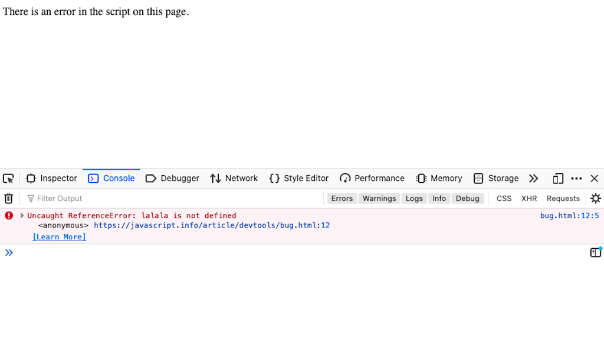

name: inverse
layout: true
class: center, middle, inverse
---


# Creative Coding I

### Jonathan Ho | jonathan.g.ho@filmuniversitaet.de  

<br />
#### Film University Babelsberg KONRAD WOLF


---
template:inverse

# three.js

---
layout:false

## What is three.js ?

--
* Goal: enable 3D graphics in a web browser

--
* Open-source package for JavaScript using WebGL

???


WebGL is a JavaScript API for rendering interactive 2D and 3D graphics. It is executed on a computer's GPU. It consists of control code written in JavaScript and shader code which is written in OpenGL ES Shading Language (GLSL ES), a language similar to C or C++. [[1]](https://developer.mozilla.org/en-US/docs/Web/API/WebGL_API)
  

* An application programming interface (API) is a way for two or more computer programs to communicate with each other. It is a type of software interface, offering a service to other pieces of software
* An API, or application programming interface, is a set of defined rules that enable different applications to communicate with each other. It acts as an intermediary layer that processes data transfers between systems, letting companies open their application data and functionality to external third-party developers, business partners, and internal departments within their companies.


* Rendering interactive 2D and 3D graphics
* Executed on a computer's GPU
* JavaScript + shader code (GLSL ES)

--
* Simplifies WebGL tools and environments, e.g.,  geometries, materials, lighting, audio

--

> Alternatively, you could write everything in WebGL, but that is much more complicated.


---
.header[three.js]

## WebGL Example Code

.left-even[
[webgl_triangle.html ↗︎](../01_sessions/03_space/code/webgl_triangle.html)
  

]

???

What is a **Buffer**?

- A *buffer* is a block of GPU memory that stores data such as:
  - Vertex positions
  - Colors
  - Normals
  - Texture coordinates

**In WebGL, buffers are managed as follows:**
1. **Create a buffer:**
   - `gl.createBuffer()` — allocates memory on the GPU
2. **Bind it:**
   - `gl.bindBuffer()` — selects which buffer is currently active
3. **Upload data:**
   - `gl.bufferData()` — copies data from the CPU to GPU memory
4. **Use it:**
   - The GPU accesses data from the buffer during drawing/rendering

> *Buffers let you send data to the GPU once and reuse it for multiple frames, improving efficiency.*

### What does a **Vertex Shader** do?

- Runs **once per vertex**
- Tasks:
  - Receives vertex attributes (e.g., position, color, texture coordinates)
  - Transforms vertex positions from model space to clip space (using model, view, and projection matrices)
  - Outputs `gl_Position` (the final position of the vertex)
  - Passes data to the fragment shader (via *varyings*)

> Example:  
> Takes 2D coordinates and outputs:  
> `gl_Position = vec4(coordinates, 0, 1.2);`

### What does a **Fragment Shader** do?

- Runs **once per pixel** (fragment)
- Tasks:
  - Receives interpolated values from the vertex shader
  - Computes the color of each pixel
  - Outputs `gl_FragColor` (RGBA value)

> Example:  
> Sets every pixel to red:  
> `gl_FragColor = vec4(1, 0, 0, 1);`

### What does it mean to **bind to ARRAY_BUFFER**?

- Binding selects the active buffer for a specific type of data
- `ARRAY_BUFFER` is used for vertex attribute data

```js
// Example usage:
gl.bindBuffer(gl.ARRAY_BUFFER, vertexBuffer);
// Now, gl.bufferData() and gl.vertexAttribPointer() 
// will use `vertexBuffer`
```

- The bound buffer stays active until you bind another buffer or unbind (using `null`).
- **Analogy:** Binding is like selecting a file before editing it — you must select (bind) before making any changes.

**Other Buffer Types:**
- `ELEMENT_ARRAY_BUFFER`: stores indices (defines vertex order for shapes)
- `UNIFORM_BUFFER`: stores uniform/shared data for shaders

> *Binding is WebGL’s way of managing state — you set the active resource, then work with it.*


--
.right-even[

* WebGL requires a lot of code for setting up a scene

]


???


As you can see it it's quite **a lot** of code for a simple red triangle. This is where Three.js comes in to simplify the creation of 3D graphics with WebGL.


---
.header[three.js]

## WebGL Example Code

.left-even[
[webgl_triangle.html ↗︎](../01_sessions/03_space/code/webgl_triangle.html)
  

]

.right-even[

* WebGL requires a lot of code for setting up a scene

> three.js takes care of many steps for us!

]

---
.header[three.js]

## Alternatives


---
.header[three.js | Alternatives]

## [babylon.js](https://www.babylonjs.com/)

<div style="display: flex; flex-direction: row; justify-content: space-between; align-items: flex-start; gap: 16px;">
  <video height="320" controls style="max-width: 32%; flex: 1;">
    <source src="../02_scripts/img/space/babylon_01.mp4" type="video/mp4">
  </video>
  <video height="320" controls style="max-width: 32%; flex: 1;">
    <source src="./imgs/areaLights2.mp4" type="video/mp4">
  </video>
  <video height="320" controls style="max-width: 32%; flex: 1;">
    <source src="./imgs/gltfDispersion.mp4" type="video/mp4">
  </video>
</div>

---
.header[three.js | Alternatives | babylon.js]

[](https://somewhere.gl/index.html)


---
.header[three.js | Alternatives]

## [p5.js](https://p5js.org/)

`createCanvas(windowWidth, windowHeight, WEBGL);`
  
.left-even[]

--

.right-even[

* Quite clumsy implementation

> Don't do 3D projects with p5.
]

---
template:inverse

### three.js

## Examples


---
.header[three.js | Examples]

## [Blue Marine Foundation](https://www.bluemarinefoundation.com/the-sea-we-breathe/)
  


???
https://lusion.co/  
https://richardmattka.com/  
https://cornrevolution.resn.global/#result  


---
.header[three.js | Examples]


## [Cat](https://moments.epic.net/#cat)

  


???

## [Helios](http://unseen-music.com/yume/)


[Pola](https://www.pola.co.jp/wecaremore/mothersday/)
  


## [Swiss Army Man](https://swissarmyman.com/)
  


???


## [Chartongne-Taillet Winery](https://chartogne-taillet.com/en)


---
.header[three.js | Examples]

## [Woodkid Robot](https://experiment-woodkid-volcano-robot.vercel.app/)


???

## [VR Dust](https://vrdust.org.uk/)


---
.header[three.js | Examples]

## [Thump Thump](http://www.larsberg.net/#/thumpThump)


---
.header[three.js | Examples]

## [Aquarium](https://www.aquarium.ru/en)


---
.header[three.js | Examples]

## Anna Eschenbach's 1st Term Project


---
.header[three.js | Examples]

## Anna Eschenbach's 1st Term Project


---
.header[three.js | Examples]

## Collections

* [three.js examples](https://threejs.org/examples/#webgl_animation_keyframes)
* [Featured projects on the three.js](https://threejs.org/)
* [Awarded Three.js projects](https://www.awwwards.com/websites/three-js/?ads=1&page=1)

--

<br />

### Best Tutorial: [three.js Journey](https://threejs-journey.com/) (95$)

* Very thorough
* Worth every penny...


---
template:inverse

### three.js

## Installation


---
.header[three.js]

## Installation


---
.header[Local Installation]

## Summary

--

Install **once** as global environment:

* Node.js
* npm

--
  
**Each project** initialize with:

```
npm init -y
```

--
  
Within a project, install **each package** with:

```
npm install packagename
```

---
.header[Local Installation]

## three.js

```
npm install three
```

--

We want also [vite](https://vite.dev/):

```
npm install vite
```


???

Nowadays, the most popular build tool is Webpack. It’s widely used, it has a great community and you can do a lot with it. But while Webpack is the most popular, it’s not the most appreciated.

In fact, the most appreciated build tool these days is Vite (French word for "quick", pronounced /vit/, like "veet”). It’s faster to install, faster to run, and less prone to bugs. Ultimately, the developer experience is much better.


--
* [Recommended by three.js](https://threejs.org/docs/index.html#manual/en/introduction/Installation) as development environment


???
* Vite will build the final website. It’ll also do a bunch of things like optimizations, cache breaking, source mapping, running a local server, etc.
* Vite was created by Evan You, the creator of Vue.js, is highly maintained by hundreds of developers, and is getting a lot of hype.

--
* Optimizes the development experience (quick server updates, etc.)

--
* Helps us later to bundle and employ a project (vite is a **build tool**)

---
.header[Local Installation]

## three.js

  
You could also install multiple packages at once:

```
npm install three vite
```


???

.todo[TODO: Show all steps until here]


---
.header[Local Installation | three.js]

## How To Run

--
  
In `package.json` we define how to run our app:

```js
{
  // ...
  "scripts": {
    "dev": "vite",
    "build": "vite build"
  },
  // ...
}
```

--
* **`npm run dev`** to start the development server

.footnote[[[three.js Journey]](https://threejs-journey.com/lessons/first-threejs-project#basic-website)]

???


We are using the vite package to run our code.
* `dev` executes `vite`, and `build` executes `vite build` by using the vite/ dependency from the node_modules/ folder.

---
.header[Local Installation | three.js]

## How To Run

* **`npm run X`** runs the command under the key X inside scripts object

---
.header[Local Installation | three.js]

## How To Run

`npm run dev`

* You are now running a web server
    * If the page doesn’t open, the terminal should display a local URL such as http://localhost:5173/
    * Open that URL manually

--
* Detects file changes

--
* `CTRL + C` to stop the server


---

template:inverse

### three.js
## Basic Scene

---
.header[three.js]

## Basic Scene

--
* `.html`, `.css`

--
* Three file as `.js`

---
.header[three.js | Basic Scene | `.html` & `.css`]

```html
<!DOCTYPE html>
<html>
  <head>
    <meta charset="UTF-8" />
    <style>
        body { margin: 0; }
    </style>

  </head>

  <body>
    <h1>Hello World!</h1>


  </body>
</html>

```


---
.header[three.js | Basic Scene | `.html` & `.css`]

```html
<!DOCTYPE html>
<html>
  <head>
    <meta charset="UTF-8" />
    <style>
        body { margin: 0; }
    </style>

  </head>

  <body>
    <h1>Hello World!</h1>
    <canvas id="canvasThree"></canvas>
    <script type="module" src="scene_basic.js"></script> 
  </body>
</html>
```

---
.header[three.js | Basic Scene]

## `.html`

```html
<canvas id="canvasThree"></canvas>
```

--

* Canvas is a container for graphics
* Supported by all major browsers
* You must use JavaScript to actually draw the graphics
* Custom `id` value to identify the canvas element in the javascript code

.footnote[[w3schools](https://www.w3schools.com/html/html5_canvas.asp)]


--

We add three.js code to fill the canvas element in `scene.js`.


---
.header[three.js | Basic Scene]

## `.html`

```html
<script type="module" src="scene_basic.js"></script> 
```

--
* Includes the Three.js code
* `type="module"`
* Within `scene_basic.js` assignment to the canvas element


???
  
* JavaScript modules allow you to break up your code into separate files.
* This makes it easier to maintain a code-base.
* Modules are imported from external files with the import statement.
* Modules also rely on type="module" in the <script> tag.

---

.header[three.js | Basic Scene]

## Modules

--

* Structure programs by separating the code into pieces

.footnote[[[Eloquent JavaScript - Modules]](https://eloquentjavascript.net/10_modules.html#h_zWTXAU93DC)]

???

* Modules provide structure to bigger programs by separating the code into pieces with clear interfaces and dependencies. The interface is the part of the module that’s visible from other modules, and the dependencies are the other modules that it makes use of.

--

* Provide certain functionality to include

???


* Structuring programs is one of the subtler aspects of programming. Any nontrivial piece of functionality can be modeled in various ways.

--

* Might be dependent on other modules


  
> Again, relationships between modules are called **dependencies**.

---

.header[three.js | Basic Scene]

## Modules

* Parts of a modules are for the outside world to use, the rest is private

--

> Modules interact through well-defined connectors, namely `import` and `export`.


???


* By restricting the ways in which modules interact with each other, the system becomes more like LEGO, where

https://dev.to/hamza/framework-vs-library-vs-package-vs-module-the-debate-3jpp
  

Module

Is the smallest piece of software. A module is a set of methods or functions ready to be used somewhere else.  
  
Package

Is a collection of modules. This may sound funny, but usually what a package does, is gather a number of modules holding in general the same functional purpose. Making it easier to include all the related modules at once.  
  
Library

Well library at it's core, is a collections of packages. It's purpose is to offer a set of functionalities ready to use without worrying about the subsequent packages. So a library is what you include when you want to add some functionality to your code. It does not force any coding style on you either.  
  
Framework

It's a set of libraries. But this time, the framework does not just offer functionalities, but it also provides an architecture for the development work. In other words you don't include a framework. You integrate you code into it. He is the wire frame of the project. That's why a framework forces its coding style on you.

---

.header[three.js | Basic Scene]

## Modules


???
* text

You can export a function or variable from any file. Exported values can then be imported into other programs with the import declaration. 

There are two types of exports, *named* exports and *default* exports. You can have multiple named exports per module but only one default export. 

--

```js
// person.js
export const name = "Jesse";
export const age = 40;

const identity = 836;
function computeIdentity(){

}
```


???

#### Named Exports

You can create named exports for specific lines individually, or all at once at the bottom of a file.

For an in-line individual export, after the `export` keyword, you can use `let`, `const`, and `var` declarations, as well as `function` or `class` declarations: 

```js
// person.js
export const name = "Jesse";
export const age = 40;
```

For exporting all at once at the bottom, you can also use the `export { name1, name2 }` syntax to export a list of names declared elsewhere:

```js
// person.js
const name = "Jesse";
const age = 40;

export {name, age};
```

#### Default Exports

You can only have one default export in a file.

```js
// message.js
const message = () => {
    const name = "Jesse";
    const age = 40;
    return name + ' is ' + age + 'years old.';
};

export default message;
```

Named exports are useful when you need to export several values. When importing this module, named exports must be referred to by the exact same name (optionally renaming it with as), but the default export can be imported with any name. For example:

```js
// file test.js
const k = 12;
export default k;
```

```js
// some other file
import m from './test'; // note that we have the freedom to use import m instead of import k, because k was default export
console.log(m);        // will log 12
```

You can also rename named exports to avoid naming conflicts:

```js
export {
  myFunction as function1,
  myVariable as variable,
};
```

--

```js
//staff.js

import { name, age } from "./person.js";
```


???

### Import

You can read-only import modules into a file in two ways, based on if they are *named* exports or *default* exports. Named exports are constructed using curly braces. Default exports are not.   

In total there are four forms of [import declarations](https://developer.mozilla.org/en-US/docs/Web/JavaScript/Reference/Statements/import):

* Named import: import { export1, export2 } from "module-name";
* Default import: import defaultExport from "module-name";
* Namespace import: import * as name from "module-name";
* Side effect import: import "module-name";

`import` declarations can only be present in modules, and only at the top-level (i.e. not inside blocks, functions, etc.). 

#### Import From Named Exports

Import named exports from the file `person.js`:

```js
import { name, age } from "./person.js";
```

#### Import From Default Exports

Import a default export from the file `message.js`:

```js
import message from "./message.js";
```


---
.header[three.js | Basic Scene]

## `.html`

```html
<script type="module" src="scene_basic.js"></script> 
```


???
  
* JavaScript modules allow you to break up your code into separate files.
* This makes it easier to maintain a code-base.
* Modules are imported from external files with the import statement.
* Modules also rely on type="module" in the <script> tag.

---
.header[three.js | Basic Scene]

## The THREE Module 

```js
//scene_basic.js

import * as THREE from 'three';
```

???


As above for the library loading already mentioned, three.js is a well-structured library, separated into different modules (and classes, see the section below). Such a setup requires us to specify for our JavaScript file, what to import from which module.

--
* Import everything (`*`)

???


The following line indicates to import everything (`*`) from the library's module `three` (the same value as in the `"imports"` call in `index.html`) and save it in an object, which is called `THREE` (in theory, you could change this name, but `THREE` is a convention):


--
* From the three.js module `three`

--
* Save it in an object, called `THREE`

--

Now we work with the object `THREE` and access its properties, functions, and classes.


---
.header[three.js | Basic Scene]

## The THREE Module 

```js
import * as THREE from 'three';
```


???
* What did we learn yesterday about how to get to know what a variable contains?

--
Let's print the `THREE` variable to look at its value!

--
> Where do we print to?


---
.header[Ingredients For A Webpage | Local Setup]

## Browser Console

* The browser is running our JavaScript code

???
.task[COMMENT:]  

Remember that the browser is running our JavaScript code. Hence possible error messages are given from the browser. The browser is telling us errors through the browser Console. 

You can see an example error message in your console when opening the [bug.html](https://javascript.info/article/devtools/bug.html) page.

--
* Possible output and error messages are given from the browser through the browser **console**

???
.task[COMMENT:]  

Most browser Consoles are REPL, which stands for Read, Evaluate, Print, and Loop. This means that you can also type in JavaScript directly into the Console, it evaluates your code, prints out the result of your expression, and then loops back to the first step.

--
* The console is part of the **development tools** 
    * Firefox: `Command+Option+I` (Mac) or `Control+Shift+I` (Windows, Linux)
    * [Firefox Developer Tools](https://developer.mozilla.org/en-US/docs/Tools)


???
.task[COMMENT:]  

The Console is part of the Development Tools and you can access the Development Tools in Firefox by pressing `Command+Option+I` (Mac) or `Control+Shift+I` (Windows, Linux). You can do proper debugging with the Development Tools but for now we are only interested in reading any error messages we might get from the Console.

--

> Usually, I just keep the console open while developing a web application.

---
.header[Ingredients For A Webpage | Local Setup]

## Browser Console

.center[]  
[[javascript.info]](https://javascript.info/article/devtools/bug.html)


???
.task[COMMENT:]  

You can see an example error message in your console when opening the [bug.html](https://javascript.info/article/devtools/bug.html) page.

---
.header[Ingredients For A Webpage | Local Setup]

## Print Outs

* [`console.log()`](https://developer.mozilla.org/en-US/docs/Web/API/Console/log) prints to the console

???
.task[COMMENT:]  

You can print to the Console of the browser with the Console method [`log()`](https://developer.mozilla.org/en-US/docs/Web/API/Console/log). The message may be a single string or it may be any one or more JavaScript objects.

--

* [`alert()`](https://developer.mozilla.org/en-US/docs/Web/API/Window/alert) prints to a newly opened message window


???
.task[COMMENT:]  

Alternatively you can use [`alert()`](https://developer.mozilla.org/en-US/docs/Web/API/Window/alert), which prints to a newly opened message window.

--

```js
import * as THREE from 'three';

console.log(THREE);
```


???

.todo[TODO: show]


---
.header[three.js | Basic Scene]

## The THREE Module 

```js
import * as THREE from 'three';
```

We access `THREE`'s properties, functions, and classes with the **`.` notation**.  
  
--
  
<br />

E.g., `THREE.Scene();`. 


---
.header[three.js | Basic Scene]

## THREE Classes

--

* Most components in `THREE` are encapsulated into classes

--
* E.g., there is a [`Scene`](https://threejs.org/docs/#api/en/scenes/Scene) class, a [`PerspectiveCamera`](https://threejs.org/docs/#api/en/cameras/PerspectiveCamera) class, a [`BoxGeometry`](https://threejs.org/docs/#api/en/geometries/BoxGeometry) and so on.


---
.header[three.js | Basic Scene]

## THREE Classes

Short story: **create an instance from a class** in order to work with that component.  

--

<br />
We do so with the `new` key word:

--
```js
const camera = new PerspectiveCamera();
```


???

* What is still missing?
* The short story for working with three.js is that you have to **create instances from the given classes** in order to work with that component and to, e.g., use that component's functionalities. To create an instance of a class, we have to use the keyword **`new`**. The following code creates an instance of the [`PerspectiveCamera`](https://threejs.org/docs/#api/en/cameras/PerspectiveCamera) class (let's ignore its arguments for now) and we have to access that class through the `THREE` object:


---
.header[three.js | Basic Scene]

## THREE Classes

Short story: **create an instance from a class** in order to work with that component.  

<br />
We do so with the `new` key word:
  
```js
const camera = new THREE.PerspectiveCamera();
```

> Don't forget: To access these classes, we always have to use the `THREE` object, which we have imported in the previous step.

---
.header[three.js | Basic Scene]

## THREE Classes

```js
const camera = new THREE.PerspectiveCamera();
```

```js
camera.position.z = 1;
```


???


* Once we have created an instance of the [`PerspectiveCamera`](https://threejs.org/docs/#api/en/cameras/PerspectiveCamera) class, we can work with that object:


---
.header[three.js | Basic Scene]

## THREE Classes

Long story:

* A class is a common data structure in many programming languages
    * See [Script 04 - Javascript - Classes](../02_scripts/cc1_ws2425_04_javascript_script.md#classes)
  

Classes define a template for "a type of object" with properties and functions.

???


* (conceptually this can be anything)
It let's programmers define their own templates for "a type of object" (conceptually this can be anything) and define which properties and function that object should have. For example, if I am working on a game about cats, I might want to have a data structure for cats, meaning a template for the properties and functions of a cat. Once I have that template -which in computer science lingo is the class- I can derive instances from that template/class, and all instances have certain cat properties and functions.

--
  
.blockquote[>Classes are the core part of the **object-oriented programming paradigm**.]

---
.header[three.js | Basic Scene]

## JavaScript Classes

```js
// The template
class Cat
{
    constructor(name, age) {
        this.name = name;
        this.age = age;
    }
    makeSound() { console.log('meow') }
    getName() { console.log('My name is', this.name) }
}
```
--
```js
// The instance
let ernie = new Cat('Ernie', 3);

```


---
.header[three.js | Basic Scene]

## JavaScript Classes

```js
// The template
class Cat
{
    constructor(name, age) {
        this.name = name;
        this.age = age;
    }
    makeSound() { console.log('meow') }
    getName() { console.log('My name is', this.name) }
}
```
  
```js
// The instance
let ernie = new Cat('Ernie', 3);
ernie.makeSound();  // -> meow
```
---
.header[three.js | Basic Scene]

## JavaScript Classes

```js
// The template
class PerspectiveCamera
{
    constructor() {
        //...
    }
    //...
}
```

```js
const camera = new THREE.PerspectiveCamera();
```


---
.header[three.js]

## Basic Scene

To display something with three.js, we need at least three components: 

--
1. Scene 

--
2. Camera

--
3. Renderer


???


Now the fun part begins - let's get started with our first three.js scene, which we will implement in th `scene.js` file. 

<!-- A basic three.js project consists of the following elements and we will go through them one by one: <br> [[3]](https://threejs.org/manual/resources/images/threejs-structure.svg) -->

To display something with three.js, such as the beautiful cube below, we need at the very least three components: 

1. a scene, 
2. a camera and 
3. a renderer.

The code below creates a basic scene, displaying a cube. Worry not, in the following script, I will explain each component.

---


---
.header[three.js]

## Basic Scene

```js
import * as THREE from 'three';

// SCENE

// CAMERA

// RENDERER

// GEOMETRY
```


???

```js
import * as THREE from 'three';

// SCENE
const scene = new THREE.Scene();

// CAMERA
const fov = 70;
const aspect = window.innerWidth / window.innerHeight;
const near = 0.1;
const far = 10;
const camera = new THREE.PerspectiveCamera(fov, aspect, near, far);
camera.position.z = 1;

// RENDERER
const canvas = document.querySelector("#canvasThree");
const renderer = new THREE.WebGLRenderer({canvas, antialias: true});
renderer.setSize( window.innerWidth, window.innerHeight);

// GEOMETRY
const geometry = new THREE.BoxGeometry(0.5, 0.5, 0.5);
const material = new THREE.MeshNormalMaterial();
const cube = new THREE.Mesh( geometry, material );

cube.rotation.x = 100;
cube.rotation.y = 180;
scene.add(cube);

renderer.render(scene, camera);
```


---
.header[three.js | Basic Scene]

## Scene

Three.js uses the concept of a *scene*.

```js
const scene = new THREE.Scene();
```

--

* Holds everything together, which belongs to a scene, such as geometry and lights

--
* Is then given to the renderer (together with a camera)


???


* You can think of a scene as the object, which holds everyhting together, which belongs to a scene, such as geometry and lights, and which is then given to the renderer (together with a camera).

Under the hood, a `Scene` object defines the root of a [scenegrap](https://threejs.org/manual/#en/scenegraph). A scene graph in a 3D engine is a hierarchy of nodes in a tree-like structure, where each node represents a local space:


--

```js
renderer.render(scene, camera);
```

---
.header[three.js]

## Basic Scene

To display something with three.js, we need at least three components: 

1. Scene ✓
2. Camera
3. Renderer

---
.header[three.js | Basic Scene]

## Camera

There are a few different camera types in three.js. 

--

<br >

**`PerspectiveCamera( fov : Number, aspect : Number, near : Number, far : Number)`**


???


* We will use a [PerspectiveCamera](https://threejs.org/manual/#en/cameras) since its projection mode is designed to mimic the way the human eye sees. 

--

```js
const fov = 70;
const aspect = window.innerWidth / window.innerHeight;
const near = 0.1;
const far = 10;
const camera = new THREE.PerspectiveCamera(fov, aspect, near, far);
```

???

  
* fov — Camera frustum vertical field of view.
* aspect — Camera frustum aspect ratio.
* near — Camera frustum near plane.
* far — Camera frustum far plane.

---
.header[three.js | Camera]

## Field of View

.center[ .imgref[[[shotkit]](https://shotkit.com/field-of-view/)]]  


???


The first attribute is the **field of view**. FOV is the extent of the scene that is seen on the display at any given moment. The value is in degrees.

For example, this image shows different field of views taken from the same camera position (with real cameras, this is done with changing the focal length of the lens used):

 [[shotkit]](https://shotkit.com/field-of-view/)

---
.header[three.js | Camera]

## Aspect Ratio
  
You almost always want to use the width of the element divided by the height,otherwise you'll get a distorted image.  

---
.header[three.js | Camera]

## Clipping Planes
  
Anything beyond **far** and closer than **near** will not be rendered.


---
.header[three.js | Camera]

## The View Frustum

.center[]

[[5]](https://pbs.twimg.com/media/Di2Z3InU8AAd3bm.jpg)


???


* By defining these attributes, we constrain the rendered area to the *view frustum*, which is the space between the green and red planes in this image:

---
.header[three.js | Basic Scene]

## Camera

.left-even[]

.right-even[
```js
const fov = 70;
const aspect = window.innerWidth / window.innerHeight;
const near = 0.1;
const far = 10;
const camera = new THREE.PerspectiveCamera(fov, aspect, near, far);
```

[Camera Parameter Visualization ⬀](https://threejs.org/manual/examples/cameras-perspective.html)
]

---
.header[three.js]

## Basic Scene

To display something with three.js, we need at least three components: 

1. Scene ✓
2. Camera ✓
3. Renderer

---
.header[three.js | Basic Scene]

## Renderer

--

```js
const canvas = document.querySelector("#canvasThree");
const renderer = new THREE.WebGLRenderer({canvas, antialias: true});
```

The standard renderer is the [WebGLRenderer](https://threejs.org/docs/?q=WebGLRenderer#api/en/renderers/WebGLRenderer).


???


Next up is the **renderer**.  Three.js comes with a few other renderers, often used as fallbacks for users with older browsers or for those who don't have WebGL support for some reason.  

In the first line we are accessing with plain, old JavaScript the element in the DOM with the id `canvasThree`. This is the canvas element to which we want to render to. This canvas we pass as argument when creating an instance from the [WebGLRenderer](https://threejs.org/docs/?q=WebGLRenderer#api/en/renderers/WebGLRenderer) class.


???
  

```js
const canvas = document.querySelector("#canvasThree");
const renderer = new THREE.WebGLRenderer({canvas: canvas, antialias: true});
```

```js
const canvas = document.querySelector("#canvasThree");
const renderer = new THREE.WebGLRenderer({canvas, antialias: true});
```


???

For example, when creating an instance of three.js's [WebGLRenderer](https://threejs.org/docs/?q=WebGLRenderer#api/en/renderers/WebGLRenderer) class, it takes as an argument an object. That object has, among other keys, the key `canvas`. The long version of the object as argument would be


```js
const myCanvas = document.querySelector("#canvasThree");
const renderer = new THREE.WebGLRenderer({canvas: myCanvas, antialias: true});
```

--

* Define which DOM element are we rendering to
* Setup the renderer

--

```js
renderer.setSize( window.innerWidth, window.innerHeight);
```


???


We also need to **set a size** for the renderer. You can understand this as the "image size", we are rendering to. It is best to use the width and height of the area we want to fill - in this case, the width and height of the browser window.

--
* Imagine this as image size of the renderer


---
.header[three.js | Basic Scene]

## Renderer

To actually see a rendering, we have to activate the rendering with a scene and a camera:

--

```js
renderer.render(scene, camera);
```

???


(probably somewhere at the end of our file, once the scene is put together)

Now we have a **scene**, a **camera**, and **renderer** and with that a fully functioning rendering pipeline. Let's put something into our scene.


---

```js
import * as THREE from 'three';

// SCENE
const scene = new THREE.Scene();

// CAMERA
const fov = 70;
const aspect = window.innerWidth / window.innerHeight;
const near = 0.1;
const far = 10;
const camera = new THREE.PerspectiveCamera(fov, aspect, near, far);
camera.position.z = 1;

// RENDERER
const canvas = document.querySelector("#canvasThree");
const renderer = new THREE.WebGLRenderer({canvas, antialias: true});
renderer.setSize( window.innerWidth, window.innerHeight);

// GEOMETRY ...

renderer.render(scene, camera);
```

---
.header[three.js]

## Basic Scene

To display something with three.js, we need at least three components: 

1. Scene ✓
2. Camera ✓
3. Renderer ✓


---
.header[three.js | Basic Scene]

## JavaScript Objects

--

* Group multiple values into a single value


???


* Similar to an array
  
---
.header[three.js | Basic Scene]

## JavaScript Objects

  
```js
let object_name = {
   key1: value1,
   key2: value2
}
```

--
```js
let user = {        // an object
  name: "Sully",    // the key "name" stores the value "Sully"
  age: 30           // the key "age" stores the value 30
};
```
  
--
* Key-value pairs as elements
  
--
* Often used in three.js, e.g. as arguments for functions


???


When working with three.js, we often have to use objects as data structure (also see [Script 04 - Javascript - Classes](./cc1_ws2324_04_javascript_script.md#objects)). 


---
.header[three.js | Basic Scene]

## JavaScript Objects

```js
let user = { name: 'Sully', age: 30 };
```

--

To access a property:  

`obj.property`  
  
e.g.,

`user.name;`


---
.header[three.js | Basic Scene]

## JavaScript Objects

There is a short-cut for the case that key and value are the same


???


Which might be confusing, an which might happen, when working with three.js: When defining an object, there is a short-cut for the case that key and value are the same.

Let's say we have a variable `name` that we want to save in a key called `name`:

--

```js
let name = 'Sully';
let age_sully = 30;

let user = { name: name, age: age_sully };
```

--

The expresseion `name: name,` within an object can be shortend to just `name`:

```js
let name = 'Sully';
let age_sully = 30;

let user = { name, age: age_sully };
```


---
.header[three.js | Basic Scene]

## JavaScript Objects

```js
const canvas = document.querySelector("#canvasThree");
const renderer = new THREE.WebGLRenderer({canvas: canvas, antialias: true});
```


???
https://threejs.org/docs/index.html#api/en/renderers/WebGLRenderer


--

```js
const canvas = document.querySelector("#canvasThree");
const renderer = new THREE.WebGLRenderer({canvas, antialias: true});
```


???
.task[COMMENT:]  
For example, when creating an instance of three.js's [WebGLRenderer](https://threejs.org/docs/?q=WebGLRenderer#api/en/renderers/WebGLRenderer) class, it takes as an argument an object. That object has, among other keys, the key `canvas`. The long version of the object as argument would be

--

```js
const myCanvas = document.querySelector("#canvasThree");
const renderer = new THREE.WebGLRenderer({canvas: myCanvas, antialias: true});
```


---
template:inverse

### three.js

## Filling The Scene

---
.header[three.js | Filling The Scene]

## Coordinate System

We are now in 3 dimensions!

--

.center[  [[6]](https://threejs.org/manual/resources/scene-down.svg)]


???


* Before we add any geometry, we have to take a quick look at the coordinate system. We need to clarify the coordingate system of every new environement that we use, as these differ from enviornment to environment. 
As we are now in 3D, next to x, and y we have to consider a thrid dimension, namely z. As default, the camera is looking down the -z axis:


---
.header[three.js | Filling The Scene]

## Adding 3D Elements

--

You add meshes as 3D elements to a scene.

--

>  Mesh = Geometry + Material


---
.header[three.js | Filling The Scene]

## Mesh

.left-even[

>  Before you can add a mesh, you need geometry and material


]

.right-even[]


---
.header[three.js | Filling The Scene]

## Geometry

`BoxGeometry`, `PlaneGeometry`, `CircleGeometry`, `ConeGeometry`, `CylinderGeometry`, 
`RingGeometry`, `TorusGeometry`, `TorusKnotGeometry`, `DodecahedronGeometry`, `OctahedronGeometry`, `TetrahedronGeometry`, `IcosahedronGeometry`, `SphereGeometry`, `ShapeGeometry`, `TubeGeometry`, `ExtrudeGeometry`, `LatheGeometry`, `TextGeometry`  
  
--
<br/>
`BoxGeometry(width : `Float`, height : Float, depth : Float)`

```js
const geometry = new THREE.BoxGeometry(0.5, 0.5, 0.5);
```


???


* width — Width; that is, the length of the edges parallel to the X axis. Optional; defaults to 1.
* height — Height; that is, the length of the edges parallel to the Y axis. Optional; defaults to 1.
* depth — Depth; that is, the length of the edges parallel to the Z axis. Optional; defaults to 1.

 [`BoxGeometry`](https://threejs.org/docs/#api/en/geometries/BoxGeometry) 


---
.header[three.js | Filling The Scene]

## Material

`LineBasicMaterial`, `LineDashedMaterial`, `Material`, `MeshBasicMaterial`, `MeshDepthMaterial`, `MeshDistanceMaterial`, `MeshLambertMaterial`, `MeshMatcapMaterial`, `MeshNormalMaterial`, `MeshPhongMaterial`, `MeshPhysicalMaterial`, `MeshStandardMaterial`, `MeshToonMaterial`, `PointsMaterial`, `RawShaderMaterial`, `ShaderMaterial`, `ShadowMaterial`, `SpriteMaterial`


--
MeshNormalMaterial( parameters : Object )  

```js
const material = new THREE.MeshNormalMaterial();
```


---
.header[three.js | Filling The Scene]

## Mesh

```js
const geometry = new THREE.BoxGeometry(0.5, 0.5, 0.5);
const material = new THREE.MeshNormalMaterial();

const cube = new THREE.Mesh( geometry, material );
```

--

```js
scene.add(cube);
```


--
  


By default, the object will be added to the coordinates (0,0,0). 


--

> That is just how three.js wants it.

???

```js
cube.rotation.x = 100;
cube.rotation.y = 180;
scene.add(cube);
```


---
## three.js

### Our basic scene is now completed. 💫


???


```js
import * as THREE from 'three';


// SCENE
const scene = new THREE.Scene();

// CAMERA
const fov = 70;
const aspect = window.innerWidth / window.innerHeight;
const near = 0.1;
const far = 10;
const camera = new THREE.PerspectiveCamera(fov, aspect, near, far);
camera.position.z = 1;

// RENDERER
const canvas = document.querySelector("#canvasThree");
const renderer = new THREE.WebGLRenderer({ canvas, antialias: true });
renderer.setSize( window.innerWidth, window.innerHeight);

// GEOMETRY
const geometry = new THREE.BoxGeometry( 0.5, 0.5, 0.5 );
const material = new THREE.MeshStandardMaterial({ color: 0x50ffc0 });

const cube = new THREE.Mesh( geometry, material );
cube.rotation.x = 100;
cube.rotation.y = 180;
scene.add(cube);

renderer.render(scene, camera);
```

Notice, how [MeshStandardMaterial](https://threejs.org/docs/#api/en/materials/MeshStandardMaterial) takes as argument an object with the key-value pair color - value.

---
.header[three.js]

## Materials

--

Let's change the material to a standard material:

```js
const material = new THREE.MeshStandardMaterial({ color: 0x50ffc0 });
```

--

* Colors are usually defined as a hexadecimal triplet in the format of `0x...`
* There is also the [color class](https://threejs.org/docs/#api/en/math/Color), which gives you many different options to work with color.


---
.header[three.js | Colors]

## Hexadecimal Color Triplets

* 6-digit codes preceded by a `#`
* Three pairs of hexadecimal numbers (`0-9` and `A-F`)
* Each pair represents the intensity of red, green, and blue (RGB) from `00` (none) to `FF` (full)

--

For example, `#FF0000` is pure red, `#00FF00` is pure green, and `#0000FF` is pure blue. White is `#FFFFFF` and black is `#000000`.


???
Hexadecimal color triplets offer several key benefits:

* Compactness - They efficiently represent millions of colors in just 6 characters plus the # symbol, making them ideal for code and storage
* Human-readability - Once familiar with the system, developers can quickly recognize common colors (e.g., #FF0000 is clearly full red) and estimate color values
* Web-standard compatibility - They're universally supported across browsers, design tools, and programming languages, making them a reliable choice for web development
* Easy manipulation - The consistent format makes it simple to programmatically generate, modify, and validate colors
* Precision - With 256 possible values (00-FF) for each RGB component, they can * represent over 16 million distinct colors, providing fine-grained control over color selection

Also, these values can be shortened to three digits when each pair is the same (e.g., #FF0000 can be written as #F00), making them even more concise when possible.

---
.header[three.js]

## The Rendering


--
* The standard material reacts to light

--
* We need light to be reflected


---
.header[three.js]

## Lighting

`AmbientLight`, `DirectionalLight`, `HemisphereLight`, `Light`, `LightProbe`, `PointLight`, `RectAreaLight`, `SpotLight`


???
There are a few different [lights](https://threejs.org/examples/?q=light#webgl_lights_hemisphere) like ambient light, directional light, point light, spot light. 

--


```js
// LIGHTING
// AMBIENT
const ambientLight = new THREE.AmbientLight(0xffffff, 1);
scene.add(ambientLight);
```

---
.header[three.js]

## The Rendering


???


Also not too exciting. An ambient light simply makes the whole scene evenly brighter.

---
.header[three.js]

## Lighting

```js
// LIGHTING
// AMBIENT
const ambientLight = new THREE.AmbientLight(0xffffff, 0.1);
scene.add(ambientLight);
```

--

```js
// POINTLIGHT
const pointLight = new THREE.PointLight(0xffffff, 0.5);
pointLight.position.set(2, 2, 2);
scene.add(pointLight);
```

Decrease the intensity of the ambient light to have a reasonable sum of the two light intensities (e.g., 0.1 for ambient and 0.8 for the point light).

---
.header[three.js]

## The Rendering


  

### Stunning 🤩

---
template:inverse

### three.js
## A Render Loop


???


* Wouldn't it be nice though, if we could navigate in the scene? For enabling any type of interaction or also, e.g., animation we are still a fundamental property missing in our scene: a render loop. As of now, we are rendering the scene exactly once. But we need a functionality such as the `draw` function in p5, which is called multiple times per second.

---
.header[three.js]

## A Render Loop

* Currently our scene is rendered once

--
* We need a render loop for interaction and animation

--

JavaScript's [`requestAnimationFrame`](https://developer.mozilla.org/en-US/docs/Web/API/window/requestAnimationFrame) function requests a refresh from the browser window. 


???


* Standard function for creating an animation in a browser
* We can easily create a render loop similar to the `draw()`-loop in p5.js. For that we are using JavaScript's [`requestAnimationFrame`](https://developer.mozilla.org/en-US/docs/Web/API/window/requestAnimationFrame) function, which requests the browser to refresh its window. 

<!-- The frequency of calls to the callback function will generally match the display refresh rate. The most common refresh rate is 60hz, (60 cycles/frames per second), though 75hz, 120hz, and 144hz are also widely used. [[8]](https://developer.mozilla.org/en-US/docs/Web/API/window/requestAnimationFrame) You can also control the refresh rate but there is no need for us to do so. -->

--
* `requestAnimationFrame` takes as argument a function to call

--
* `requestAnimationFrame(callback)`


???


* This is the typical function to for creating an animation in a browser. `requestAnimationFrame` refreshes the current window and takes as argument another function that should be called from `requestAnimationFrame`. Such a function as an argument is a *callback* function.


--
  
> In this case the callback function is the function to call when it's time to update our animation or better our scene for the next repaint.


---
.header[three.js]

## A Render Loop


```js
function renderLoop() {
    
    ...
}

requestAnimationFrame(renderLoop);
```


???


*Wait, what? A function takes another function as argument??* Welcome to JavaScript, my friends! 

These type of functions are called higher order functions and they are part of the *functional programming* paradigm. With that they are not JavaScript specific but to my knowledge most prominently used in JavaScript. At a different time you will hear everything about those functions. For now, just accept the fact that functions are just objects that can be passed as argument to functions.


--
Yes, functions can take other functions as arguments! 


--
  
> Higher order functions are the core part of the **functional programming paradigm**.

---
.header[three.js]

## A Render Loop


```js
function renderLoop() {
    
    ...
}

requestAnimationFrame(renderLoop);
```

* We refresh exactly once!


???


* The above does not create a loop yet. We request a window refresh exactly once. But the callback function could be the function that also calls `requestAnimationFrame(animate);` - and with that we have our loop!

--
> How to create a loop?

---
.header[three.js]

## A Render Loop


```js
// RENDER LOOP
function renderLoop() {
    
    ...
    requestAnimationFrame(renderLoop);
}

renderLoop();
```


???


As we want to re-render our scene with each refresh window call, we add the rendering to this animation function:

---
.header[three.js]

## A Render Loop

```js
// RENDER LOOP
function renderLoop() {
    
    renderer.render(scene, camera);
    requestAnimationFrame(renderLoop);
}

renderLoop();
```


???


This function is typically called animate even though in the above example it is more of a render function. We could also call it `draw` if our hearts are still with p5. Eventually, we will add animation behavior to the function that is why I introduce the name `animate` here already.

Now, that we have a render loop, we can also add interaction. Let's start with simple scene navigation.

---
.header[three.js]

## A Render Loop

```js
// RENDER LOOP
function renderLoop() {
    
    cube.rotation.x += 0.004;
    cube.rotation.y += 0.007;

    renderer.render(scene, camera);
    requestAnimationFrame(renderLoop);
}
renderLoop();
```


---
template:inverse

### three.js
## Orbit Control

---
.header[three.js]

## Orbit Control

[OrbitControls](https://threejs.org/docs/index.html#examples/en/controls/OrbitControls) enable a simple navigation setting that allows us to move around a target.

--
* This module is not part of the main three module


???


The Orbit Control functionality is not part of the main library but we need to load an additional module for it. three.js calls these *Addons*. 

--
* We need to import it

---
.header[three.js]

## Orbit Control

OrbitControls gives us a named export and we can use that name for the import:

```js
import {OrbitControls} from 'three/addons/controls/OrbitControls.js';
```


???
* node_modules/three/examples/jsm/controls/OrbitControls.js 

--

```js
// CONTROLS FOR NAVIGATION
const controls = new OrbitControls(camera, canvas);
```


???

canvas = renderer.domElement

---
.header[three.js]

## Orbit Control

```js
import * as ORBIT from 'three/addons/controls/OrbitControls.js';
```

```js
// CONTROLS FOR NAVIGATION
const controls = new ORBIT.OrbitControls(camera, canvas);
```

* Would also work
* I recommend to always go with the instructions from the [official documentation](https://threejs.org/docs/index.html?q=orbit#examples/en/controls/OrbitControls)


???


* https://github.com/mrdoob/three.js/blob/dev/examples/jsm/controls/OrbitControls.js


---
.header[three.js]

## Orbit Control

```js
import { OrbitControls } from 'three/addons/controls/OrbitControls.js';
```

```js
// CONTROLS FOR NAVIGATION
const controls = new OrbitControls(camera, canvas);
```


???


* Now, we can add those controls to the scene with

**OrbitControls( object : Camera, domElement : HTMLDOMElement )**

* object: (required) The camera to be controlled. The camera must not be a child of another object, unless that object is the scene itself.
* domElement: The HTML element used for event listeners (*where to detect user input?*). 


---
.header[three.js]

## Orbit Control

```js
import { OrbitControls } from 'three/addons/controls/OrbitControls.js';
```

```js
// CONTROLS FOR NAVIGATION
const controls = new OrbitControls(camera, canvas);
```

```js
// RENDER LOOP
function renderLoop() {
    
    controls.update();
    renderer.render(scene, camera);
    requestAnimationFrame(renderLoop);
}
renderLoop();
```


???
.todo[TODO: go through 07_example]

---
template:inverse

## Next

---
## Next

Three.js

* [Loading objects](https://threejs.org/examples/#webgl_loader_fbx)
* Gui


???
* https://threejs.org/examples/#webgl_lights_hemisphere

--

JavaScript

* Higher order functions
* Asynchronism


---
template: inverse

## The End  

💻 💫 🔺


