name: inverse
layout: true
class: center, middle, inverse

---

# Creative Coding I

### Jonathan Ho | jonathangho@filmuniversitaet.de

#### Film University Babelsberg KONRAD WOLF

---

# Last Session

---

layout:false

.header[Last Session]

## Asynchronism

???

- What does it mean?
  - Occurring at different times
  - Allowing the client to continue during processing
  - Having many actions occurring at a time, in any order, without waiting for each other.
- Do you have examples for asynchronity in every day life?
  - Recorded communication
  - Personal plans alla "when I have done this, I will..."
  - Promises
  - Thinking in general?
- How does the digital transformation re-shape time for us?
- Which role does asynchronism play in regard to web development?

--

An _asynchronous_ model allows multiple things to happen at the same time.

???

_asynchronous_: When you start an action, your program continues to run. When the action finishes, the program is informed and gets access to the result (for example, the data read from disk).

Asynchronous means they are totally independent and neither one must consider the other in any way, either in the initiation or in execution.

> You are in a restaurant with many other people. You order your food. Other people can also order their food, they don't have to wait for your food to be cooked and served to you before they can order. In the kitchen restaurant workers are continuously cooking, serving, and taking orders. People will get their food served as soon as it is cooked.

In the asynchronous model, starting a network action conceptually causes a split in the timeline. The program that initiated the action continues running, and the action happens alongside it, notifying the program when it is finished.

Another way to describe the difference is that waiting for actions to finish is **implicit** in the synchronous model, while it is **explicit**, under our control, in the asynchronous one.

Asynchronicity cuts both ways. It makes expressing programs that do not fit the straight-line model of control easier, but it can also make expressing programs that do follow a straight line more awkward. We’ll see some ways to address this awkwardness later in the chapter.

Both of the important JavaScript programming platforms—browsers and Node.js—make operations that might take a while asynchronous, rather than relying on threads. Since programming with threads is notoriously hard (understanding what a program does is much more difficult when it’s doing multiple things at once), this is generally considered a good thing.

--
<br >

**Async threads** of control:

```
         A-Start ------------------------------------------ A-End
           | B-Start -----------------------------------------|--- B-End
           |    |      C-Start ------------------- C-End      |      |
           |    |       |                           |         |      |
           V    V       V                           V         V      V
1 thread->|<-A-|<--B---|<-C-|-A-|-C-|--A--|-B-|--C-->|---A---->|--B-->|
```

.footnote[[[Eloquent Javascript]](https://eloquentjavascript.net/11_async.html), [[stackoverflow]](https://stackoverflow.com/questions/748175/asynchronous-vs-synchronous-execution-what-is-the-difference)]

---

## Asynchronism

In a _synchronous_ programming model, things happen one at a time.

<br >
  
A **single thread** of control:

```
1 thread ->   |<---A---->||<----B---------->||<------C----->|
```

.footnote[[[Eloquent Javascript]](https://eloquentjavascript.net/11_async.html), [[stackoverflow]](https://stackoverflow.com/questions/748175/asynchronous-vs-synchronous-execution-what-is-the-difference)]

**Parallel threads** of control:

```
thread A -> |<---A---->|
                        \
thread B ------------>   ->|<----B---------->|
                                              \
thread C ---------------------------------->   ->|<------C----->|
```

???

_synchronous_: When you call a function that performs a long-running action, it returns only when the action has finished and it can return the result. This stops your program for the time the action takes.

Synchronous or Synchronized means "connected", or "dependent" in some way. In other words, two synchronous tasks must be aware of one another, and one task must execute in some way that is dependent on the other, such as wait to start until the other task has completed.

> You are in a queue to get a movie ticket. You cannot get one until everybody in front of you gets one, and the same applies to the people queued behind you.

- The thick lines represent time the program spends running normally, and the thin lines represent time spent waiting for the network.
- In the synchronous model, the time taken by the network is part of the timeline for a given thread of control.

https://stackoverflow.com/questions/748175/asynchronous-vs-synchronous-execution-what-is-the-difference

A thread is another running program whose execution may be interleaved with other programs by the operating system—since most modern computers contain multiple processors, multiple threads may even run at the same time, on different processors. A second thread could start the second request, and then both threads wait for their results to come back, after which they resynchronize to combine their results.

---

.header[Last Session]

## Higher Order Functions

???

- What are higher order functions?
- Higher-order functions allow us to abstract over _actions_, not just _values_. They come in several forms. For example, we can have functions that create new functions.
- We have already used higher order function by adding a function as callback to an event listeners.

--

A function that can

- takes one or more functions as arguments
- return a function as its result

???

Functions are regular objects in JavaScript and they can be handled almost the same as objects.

This means that functions operate on other functions, either by taking them as arguments or by returning them.

Higher-order functions allow us to abstract over _actions_, not just _values_. They come in several forms. For example, we can have functions that create new functions.

We have already used higher order function by adding a function as callback to an event listeners.

[[Wikipedia: Higher-order function]](https://en.wikipedia.org/wiki/Higher-order_function)

---

.header[Last Session]

## Higher Order Functions

JavaScript offers two ways to write the code for higher order functions more compactly:

--

- **_Anonymous_** functions
- **_Arrow_** functions

--

> Arrow functions are the modern and preferred way!

---

.header[Last Session | Higher Order Functions | Anonymous Functions]

## Separate Function Definition

```js
function setup() {
  let canvas = createCanvas(512, 512);
  canvas.doubleClicked(changeColor);

  background(240);
}

function changeColor() {
  background(random(255), random(255), random(255));
}
```

---

.header[Last Session | Higher Order Functions]

## Anonymous Function

```js
function setup() {
  let canvas = createCanvas(512, 512);

  // The callback as anonymous function
  canvas.doubleClicked(function () {
    background(random(255), random(255), random(255));
  });

  background(240);
}
```

???

The value of the first argument of the `.doubleClicked()` event is a function without a name.

- The above makes use of the principle of higher order functions.

---

.header[Last Session | Higher Order Functions]

## Arrow Function

```js
function setup() {
  let canvas = createCanvas(512, 512);

  // The callback as arrow function
  canvas.doubleClicked(() => background(random(255), random(255), random(255)));

  background(240);
}
```

---

.header[Last Session | Higher Order Functions]

## Arrow Functions

```js
... (param1, param2) => {
    // do something
    return something;
} ...
```

???

- An arrow comes after the list of parameters and is followed by the function’s body.

---

.header[Last Session | Higher Order Functions]

## Arrow Functions

```js
const myFunction = (param1, param2) => {
  // do something
  return something;
};
```

???

- An arrow comes after the list of parameters and is followed by the function’s body.

> This input (the parameters) produces this result (the body).

`this input => this result`

---

.header[Last Session | Higher Order Functions | Arrow Functions]

## () vs. {} Body

--

Explicit returns have the `return` keyword and `{}`:

```js
const multiply = (a, b) => {
  return a * b; // Explicit return
};
console.log(multiply(3, 4)); // Output: 12
```

---

.header[Last Session | Higher Order Functions | Arrow Functions]

## () vs. {} Body

Implicit returns do not need any brackets or use `()`:

```js
const multiply = (a, b) => a * b; // No need for the return keyword
console.log(multiply(3, 4)); // Output: 12
```

--

Same as:

```js
const multiply = (a, b) => a * b; // Implicit return, hence ()
console.log(multiply(3, 4)); // Output: 12
```

--

```
const getUser = () => ({ name: "Alice", age: 25 });
console.log(getUser()); // Output: { name: "Alice", age: 25 }
```

???

- .updateProjectionMatrix () : undefined

Updates the camera projection matrix. Must be called after any change of parameters.

[Exercise File ↗︎](../../../2324/code/class07/cc1_ws2324_functions_START.js)

---

.header[Last Session | Higher Order Functions]

## Arrow Functions

When working in a web context, you **must understand higher order functions**, meaning that functions can be input and return arguments.

???

- Functions, anonymous functions, function expression and arrow functions do (almost) the same

They do have slight differences but nothing we need to be bothered about at this point.

When Is The Arrow Function Helpful?

Arrow functions do not have their own this. They are not well suited for defining object methods.

Arrow functions are not hoisted. They must be defined before they are used.

Using `const` is safer than using `let`, because a function expression is always constant value.

You can only omit the return keyword and the curly brackets if the function is a _single statement_. Because of this, it might be a good habit to always keep them:

--

<br >

> The best syntax for higher order functions is the **arrow syntax**.

---

.header[Last Session]

## Higher Order Functions

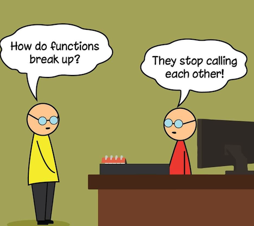 .imgref[[[pinterest]](https://www.pinterest.com/pin/143059725641565518/)]

---

.header[Last Session]

## Asynchronism

_But wait, there is more..._ 😱

--

<br />

JavaScript specific functionality that we haven't covered:

- Promises
- then..catch
- Async / Await

???

For proper web development you would need to understand the above concepts.

You must **understand promises** but not necessarily write them from scratch yourself.

---

template:inverse

# Homework

---

template:inverse

# Systems

---

## Learning Objectives

--
With this session you

--

- Make some practical experiences with deploying a Three.js scene

--

- Think about software development and building larger systems

--

- Understand the overall principles of React

---

.center[
[](https://threejs-tutorial-vercel-deploy.vercel.app/)
]

.footnote[[by Malte Hillebrand]]

???

- [Deployed on Vercel](https://threejs-tutorial-vercel-deploy.vercel.app/)
- [As part of a webpage](https://threejs-tutorial-react-vercel-deploy.vercel.app/)

---

[](https://threejs-tutorial-react-vercel-deploy.vercel.app/) 

???

- [Deployed on Vercel](https://threejs-tutorial-vercel-deploy.vercel.app/)
- [As part of a webpage](https://threejs-tutorial-react-vercel-deploy.vercel.app/)

---

template:inverse

# Online Deployment

---

## Online Deployment

Frist, we are publishing a page-filling Three.js scene:

[.center[]](https://threejs-tutorial-vercel-deploy.vercel.app/)

.footnote[[by Malte Hillebrand]]

???

- [Deployed on Vercel](https://threejs-tutorial-vercel-deploy.vercel.app/)

---

## Online Deployment

.center[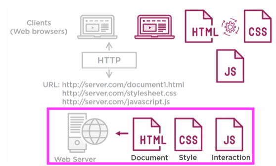]

.footnote[[B. Luijbregts. 2020. [*HTML, CSS, and JavaScript: The Big Picture*](https://www.pluralsight.com/courses/html-css-javascript-big-picture). Pluralsight]]

---

## Online Deployment

To discuss all the options and requirements for hosting a website professionally is out of scope.

--

<br >
  
**Use a hosting platform:**
* Upload your code
* The platform runs it for you

--

> By using vite already, we are well prepared!

???

- So far, we used vite as development server designed for fast performance and a smooth developer experience.
  - Hot Module Replacement (HMR): Updates changes without a full page reload.
- For production, Vite leverages Rollup to bundle optimized builds.

Rollup refers to Rollup.js, a JavaScript module bundler that optimizes and bundles code for production. It is used by Vite to generate efficient, optimized builds.

How Rollup Works in Vite:

1. Module Bundling: Rollup compiles multiple ES modules into a single, optimized JavaScript file.
2. Tree Shaking: It removes unused code (dead code elimination) to reduce bundle size.
3. Efficient Code Splitting: It generates smaller chunks, improving loading performance.
4. Plugin Ecosystem: Vite can leverage Rollup plugins for additional functionality like transpilation, asset handling, and optimizations.

While Vite uses native ES modules during development for fast updates, it switches to Rollup for production builds to ensure the final output is as optimized as possible.

---

## Online Deployment

--

- [Vercel](https://vercel.com/)
  - Great for three.js, doesn't support individual backend programming
- [Heroku](https://www.heroku.com/)
  - Powerful, no free plans since 2022
- [Netlify](https://www.netlify.com/)
  - Backend programming a bit tricky at times
- [Render](https://render.com/)
  - Front- and backend, works like a charm

???

- It has a free _hobbyists, students, and indie hackers_ hosting option.
- Render is a unified cloud to build and run all your apps and websites [...] and auto deploys from Git.

---

## Online Deployment

The general idea (this is the same for Vercel, Heroku, Netlify, Render):

<br />

--

- Manage project through GitHub

--

- Connect hosting platform with your GitHub repository

--

- "Hit the deploy button"

--

<br />

### That is it 🎉

---

.header[Online Deployment]

## Vercel

> Vercel builds a frontend-as-a-service product—they make it easy for engineers to deploy and run the user-facing parts of their applications.

.footnote[[[What does Vercel do?]](https://vercel.com/blog/what-is-vercel)]

???

Frontend vs. Backend?

---

template:inverse

### On a side note:

# Fontend vs. Backend

???

TASK: What is the difference?
There is - as far as I know it - no common and clear definition of font- and backend development. I agree with the following.

.center[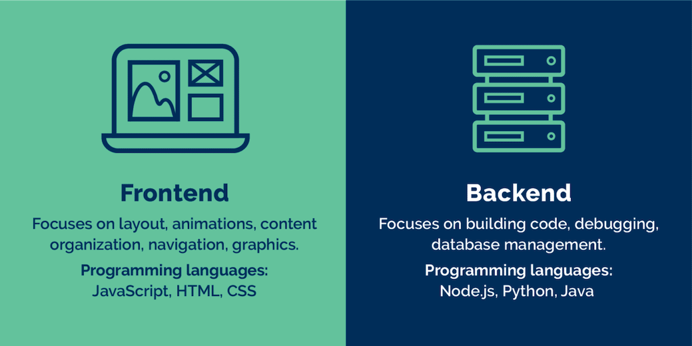[[ref]]()]

---

## Fontend vs. Backend

> Client/server or better bowser/server model

- Frontend: client
- Backend: server

???

This means that we have changed programmatically only what the client, in our case a browser, can computer and execute. Specifically, we have done DOM-manipulations (e.g., we created and changed elements from a website) - but that is about it.

The most common frontend and back-end scenario is based on a client-server model, which describes the relationship of cooperating programs in an application. In such a relationship, the server provides a function or service to one or many clients, which initiate requests for such services [[1]](https://en.wikipedia.org/wiki/Client%E2%80%93server_model). The client-server model is not limited to the context of web development but has many different application scenarios.

In the web development context, the client is usually considered the frontend and the server the backend [[9]](https://en.wikipedia.org/wiki/Frontend_and_backend). For a bit more information on servers and web server, read the section [A Dynamic Web Application - Server](#server).

<!-- Here, client and servers talk to each other through the World Wide Web, most often via Http requests. The client will, for example, send to the server (or better *requests from the server*) a character string called uniform resource locator (URL), which identifies specific data, e.g. .html & .css, which the server sends back to the client as response. The data is transferred using the Hypertext Transfer Protocol (HTTP).  -->

---

  
[[evertop]](https://www.evertop.pl/en/frontend-vs-backend/)

---

.header[Fontend vs. Backend Development]

## Frontend

> What the user sees and interacts with.

???

- Manages everything that users visually see in their browser or application
- Responsible for the look and feel of a site

.footnote[[[Team Tree House]](https://blog.teamtreehouse.com/i-dont-speak-your-language-frontend-vs-backend) [[Course Report]]([#4-front-end-vs-back-end-development](https://www.coursereport.com/blog/front-end-development-vs-back-end-development-where-to-start)]

The “frontend” of the web is the part of the web that you can see and interact with. The frontend usually consists of two parts: the web design and front end web development. Hence, the task can range from work done in Photoshop to coding using HTML, CSS, JavaScript.

Definition: Front end development manages everything that users visually see first in their browser or application. Front end developers are responsible for the look and feel of a site.

- If you book a flight or buy concert tickets, you usually open a website and interact with the frontend. Once you’ve entered that information, the application stores it in a database that was created on a server.

--

Frontend development can mean two aspects:

--

1. The design of a webpage

-- 2. The development of what you see of a webpage

--

...or both!

---

.header[Fontend vs. Backend Development]

## Frontend

- Markup and web languages such as HTML, CSS, JavaScript
- Responsive web design
- Asynchronous request handling and AJAX
- Cross-browser compatibility
- Search engine optimization
- Accessibility

???
AJAX (Asynchronous JavaScript and XML) is a technique used in web development to fetch data from a server without reloading the entire webpage. It allows for asynchronous communication, meaning the browser can request, receive, and update parts of a webpage dynamically.

How AJAX Works:

1. A user triggers an action (e.g., clicking a button).
2. JavaScript sends a request to the server (via XMLHttpRequest or fetch()).
3. The server processes the request and responds (often with JSON or XML).
4. JavaScript updates the page content without refreshing the entire page.

---

.header[Fontend vs. Backend Development]

## Backend

--

> Serves the data to the user and is the system architecture

???

- The server side of an application
- Everything that communicates, e.g., between a database and the browser

.footnote[[[Team Tree House]](https://blog.teamtreehouse.com/i-dont-speak-your-language-frontend-vs-backend) [[Course Report]]([#4-front-end-vs-back-end-development](https://www.coursereport.com/blog/front-end-development-vs-back-end-development-where-to-start)]

Backend technologies usually consist of languages like PHP, Ruby, Python, etc but you can also used pure JavaScript. Frameworks make backend development easier and faster.

Definition: Back end development refers to the server side of an application and everything that communicates between the database and the browser.

[[Team Tree House]](https://blog.teamtreehouse.com/i-dont-speak-your-language-frontend-vs-backend) [[Course Report]]([#4-front-end-vs-back-end-development](https://www.coursereport.com/blog/front-end-development-vs-back-end-development-where-to-start)

--

The backend usually consists of three parts:

- Server
- Application
- Database

???

- If you book a flight or buy concert tickets, you usually open a website and interact with the frontend. Once you’ve entered that information, the application stores it in a database that was created on a server.
- Many web professionals that are just getting into the field may have heard a lot of people talking about WordPress. WordPress is a good example of the frontend and backend working together because WordPress is an open-sourced framework built on PHP that you have to install on your server with a database.

Turns out, the internet has quite some fun describing visually the differences between front- and back-end...

---

.header[Fontend vs. Backend Development]

## Backend

- Scripting languages like PHP, Python, Ruby, Perl, JavaScript, (Node.js), compiled languages like C#, Java or Go
- Automated testing frameworks
- Data Access, Databases
- User management
- Scalability
- Availability
- Security, authentication and authorization
- Backups

???
A scripting language is a programming language designed for automating tasks, often interpreted rather than compiled. These languages are commonly used for server-side or client-side scripting, automating processes, and handling dynamic content in web applications.

Breakdown of Each:

- PHP: A server-side scripting language primarily used for web development (e.g., WordPress, Laravel).
- Python: A versatile scripting language used for web apps, automation, data science, AI, and more.
- Ruby: Known for its clean syntax and used in web frameworks like Ruby on Rails.
- Perl: Historically popular for text processing, system administration, and web scripting.
- Node.js: A runtime for JavaScript that enables it to be used as a server-side scripting language.

Is Node.js a Scripting Language?

- JavaScript itself is a scripting language.
- Node.js is a runtime that allows JavaScript to be used for backend development.
- Since JavaScript is interpreted and dynamic, Node.js is often considered a scripting environment.

---

.center[ [[bluecoders]](https://twitter.com/bluecoders/status/966624401172123649)]

???

- Keep in mind that this frontend vs. backend structure is highly dynamic and it is constantly changing where what is done by whom...

---

.center[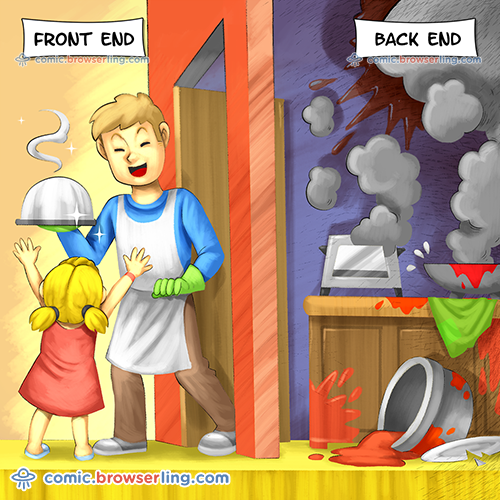 [[bluecoders]](https://twitter.com/bluecoders/status/966624401172123649)]

---

.header[Online Deployment]

## Vercel

> Vercel handles all of the backend.

--

- Automated testing, checks for errors
- Optimized production code to be served faster
- Distribution of code on CDNs around the world so everybody has fast access
- Automatic redeployment when repo changes
- Messages interface

???

- It abstracts a lot of backend features that involve digging through logs etc.
  - Analytics
  - Error messages
  - DNS handling

# Traditional Way of Deployment

## Using FTP Client for Static Hosting

- You can't just upload the Node project folder structure
  - They are made for real-time execution via a (local) Node server
- To create files made for static web hosting you need to **build your project**
  - Execute `npm run build` to build a static folder
    - Make sure to use Webpack or something similar to build!
- Once the build is done, you have a new folder in your project folder: `dist`
  - This folder is made for static web hosting, you can upload them to your FTP server

Vercel creates and maintains Next.js

- Next.js is a popular framework for React
  - Open-source and free
  - Other Frameworks are Create React App, Gatsby, etc.
- Integration and Deployment of Next.js projects on Vercel are native, fast and easy

* Next.js is a React framework that allows you to build supercharged, SEO-friendly, and extremely user-facing static websites and web applications using the React framework. Next.js is known for the best developer experience when building production-ready applications with all the features you need.

It has hybrid static and server rendering, TypeScript support, smart bundling, route prefetching, and more, with no extra configuration needed.

- With Next.js termed the React framework for production, it’s become clear that you can quickly build and deploy large-scale and enterprise-ready applications to production with Next.js.

Next.js comes with features that are guaranteed to take your application from zero to production in no time while providing an easy to learn curve, simplicity, and powerful tooling at your disposal.

Next.js extends the original Facebook React library and the create-react-app package to provide an extensible, easy-to-use, and production-proof React framework.

https://kinsta.com/knowledgebase/next-js/

---

.header[Online Deployment]

## Vercel

Is is free?

- [Yes and No](https://vercel.com/pricing)

--

- No commercial intent? Deploy on Vercel for free!
  - Hobby Plan
  - As many projects as you want
  - Limited bandwidth and build time limitations

---

.header[Online Deployment]

## Vercel

--

### 1. Create an account on vercel.com

--

- Connect your GitHub account

--

### 2. Import your repository

--

- Vercel fetches the whole code automatically

--

- Vercel deploys to an generic URL

--

- Webpage is re-build any time you push an update to your repository

???

3. Add Vercel to your project

- Vercel is available as an NPM module  
   `npm install vercel`
- In `package.json` add a new script in the `scripts` property  
   `"deploy": "vercel --prod"`
- Using `vercel` without prod means the code will be published to a preview URL, not the live Vercel site

---

.header[Online Deployment]

## Vercel

### 3. Deploying your project on Vercel

- If there are no build errors, then your project is live now!

???

.todo[TODO: Add new project from repository on Vercel dashboard]

- https://github.com/lenagieseke/cc1_ws2425_cave
- https://vercel.com/lenas-projects-c6f2c790

Old:

- Run `npm run deploy`
  - At this point, Vercel should invite you to log in. If you get an error regarding an invalid token, you need to run `npx vercel login`
- Follow the instructed steps according to your account setup on Vercel
  - Make sure the directories and commands are the same as you used when building!
- Now your project is live!

---

.header[Online Deployment]

## The Vercel Dashboard

- Analytics
- Deployment preferences
- Information about the latest builds
  - See potential errors
- Add a custom domain

???

- Three.js Within a Webpage?

---

template:inverse

# Software

---

## Software

???

.task[ASK:]

- What is software?
- Difference between software and algorithms?
- What are important aspects of software development?
  - Planning, user test, error checking

--

Software is a collection of programs, data, and instructions that tell a computer how to perform specific tasks.

.footnote[[ChatGPT 4o: What is software?]]

???

Unlike hardware, software is intangible and can be updated or modified without changing physical components.

--

- Might include multiple algorithms
- Is executed as a system (e.g., a web browser, a game)

???

Example:

- An algorithm for sorting numbers (e.g., QuickSort) defines the logic for arranging elements in order.
- A software program (e.g., Excel) may use multiple algorithms, including QuickSort, but also includes a user interface, error handling, and other functionalities.

In short: An algorithm is a building block, while software is the complete functional application.

???

An algorithm is a set of rules for solving a specific problem or performing a task.

- It is a logical concept that defines how a task should be done
- Needs to be implemented in a programming language to become part of software

---

## Software

- System software

--
_ E.g., operating systems like Windows or Linux
_ Manage hardware

--

- Application software

--
_ E.g., web browsers, games, or business tools
_ Help users accomplish tasks
--

- Malicious software

.footnote[[ChatGPT 4o: What is software?]]

???

Wiki: Software is a set of programmed instructions stored in the memory of stored-program digital computers for execution by the processor. Software is a recent development in human history and is fundamental to the Information Age.

- Application software
  - uses the computer system to perform special functions beyond the basic operation of the computer itself. There are many different types of application software because the range of tasks that can be performed with
- System software
  - manages hardware behaviour, as to provide basic functionalities that are required by users, or for other software to run properly, if at all. System software is also designed for providing a platform for running application software,[15] and it includes the following:
    - Operating systems are essential collections of software that manage resources and provide common services for other software that runs "on top" of them. Supervisory programs, boot loaders, shells and window systems are core parts of operating systems. In practice, an operating system comes bundled with additional software (including application software) so that a user can potentially do some work with a computer that only has one operating system.
    - Device drivers operate or control a particular type of device that is attached to a computer. Each device needs at least one corresponding device driver; because a computer typically has at minimum at least one input device and at least one output device, a computer typically needs more than one device driver.
    - Utilities are computer programs designed to assist users in the maintenance and care of their computers.
- Malware, is software that is developed to harm or disrupt computers. Malware is closely associated with computer-related crimes, though some malicious programs may have been designed as practical jokes.

https://www.javatpoint.com/what-is-software

- Software's are broadly classified into two types, i.e., System Software and Application Software.
  - System software is a computer program that helps the user to run computer hardware or software and manages the interaction between them. Essentially, it is software that constantly runs in the computer background, maintaining the computer hardware and computer's basic functionalities, including the operating system, utility software, and interface. In simple terms, you can say that the system acts as a middle man that checks and facilitates the operations flowing between the user and the computer hardware.
  - Application programs or software applications are end-user computer programs developed primarily to provide specific functionality to the user. The applications programs assist the user in accomplishing numerous tasks such as doing online research, completing notes, designing graphics, managing the finances, watching a movie, writing documents, playing games, and many more. Therefore, many software applications are designed and developed every year by companies as per the demand and requirements of the potential users. The application software can either be designed for a general-purpose or specially coded as per the requirements of business cooperation.

---

## Characteristics Of Good Software

--

- Functionality
- Usability
- Reliability
- Performance
- Security
- Maintainability
- Reusability / Portability
- Scalability
- Testability

.footnote[[[geeksforgeeks]](https://www.geeksforgeeks.org/software-engineering-characteristics-of-good-software/)]

???

- Functionality: The software meets the requirements and specifications that it was designed for, and it behaves as expected when it is used in its intended environment.
  Usability: The software is easy to use and understand, and it provides a positive user experience.
- Reliability: The software is free of defects and it performs consistently and accurately under different conditions and scenarios.
- Performance: The software runs efficiently and quickly, and it can handle large amounts of data or traffic.
- Security: The software is protected against unauthorized access and it keeps the data and functions safe from malicious attacks.
- Maintainability: The software is easy to change and update, and it is well-documented, so that it can be understood and modified by other developers.
- Reusability: The software can be reused in other projects or applications, and it is designed in a way that promotes code reuse.
- Scalability: The software can handle an increasing workload and it can be easily extended to meet the changing requirements.
- Testability: The software is designed in a way that makes it easy to test and validate, and it has a comprehensive test coverage.

---

.center[ .imgref[[[onlyonce]]([link](https://onlyonceshop.com/blog/dieter-rams-10-principles-of-good-design)]]

Dieter Ram’s principles for good design, tailored for software?

Dieter Rams famous 10 principles of good design have become iconic and have inspired designers across the world.
Born in Wiesbaden on May 20, 1932, Dieter Rams soon made a name for himself in the field of industrial design. Over the course of half a century, he has developed more than 500 products ranging from audio to furniture. In the 19070s Dieter Rams has laid out of a list of 10 principles which made history ever since. This straightforward list lays out the fundamentals of good design, which are valid up to this day decades after.

Dieter Rams design philosophy of "Less, but better." along with his famous 10 principles are building the fundamentals of the successful & iconic Braun designs which have ultimately inspired other famous brands (such as Apple) and designers (ie. Johnathan Ive) across the world. With no further ado, here are the ten fundamental principles of good design:

Ten Principles for Good Design.

by Dieter Rams

- Good design is innovative
  - The possibilities for progression are not, by any means, exhausted. Technological development is always offering new opportunities for original designs. But imaginative design always develops in tandem with improving technology, and can never be an end in itself.
- Good design makes a product useful
  - A product is bought to be used. It has to satisfy not only functional, but also psychological and aesthetic criteria. Good design emphasizes the usefulness of a product whilst disregarding anything that could detract from it.
- Good design is aesthetic
  - The aesthetic quality of a product is integral to its usefulness because products are used every day and have an effect on people and their well-being. Only well-executed objects can be beautiful.
- Good design makes a product understandable
  - It clarifies the product’s structure. Better still, it can make the product clearly express its function by making use of the user’s intuition. At best, it is self-explanatory.
- Good design is unobtrusive
  - Products fulfilling a purpose are like tools. They are neither decorative objects nor works of art. Their design should therefore be both neutral and restrained, to leave room for the user’s self-expression.
- Good design is honest
  - It does not make a product appear more innovative, powerful or valuable than it really is. It does not attempt to manipulate the consumer with promises that cannot be kept.
- Good design is long-lasting
  - It avoids being fashionable and therefore never appears antiquated. Unlike fashionable design, it lasts many years – even in today’s throwaway society.
- Good design is thorough down to the last detail
  - Nothing must be arbitrary or left to chance. Care and accuracy in the design process show respect towards the consumer.
- Good design is environmentally friendly
  - Design makes an important contribution to the preservation of the environment. It conserves resources and minimizes physical and visual pollution throughout the lifecycle of the product.
- Good design is as little design as possible
  - Less, but better. Simple as possible but not simpler. Good design elevates the essential functions of a product.

---

## Software Architecture

> The architecture of a software system is a metaphor, analogous to the architecture of a building.

.footnote[[[wiki](https://en.wikipedia.org/wiki/Software_architecture)]]

--

- High-level structure of a software system

--

- Defines how components interact, data flows, properties

--

- Ensures robustness, scalability, maintainability, and performance

--

- Software architectures can be categorized into two main types: monolith and distributed architecture, each having its own subcategories.

???

## Example: Simple Web Application Architecture

**Blog Website**

### 1. Frontend (User Interface)

- What users see and interact with: buttons, text, images.
- Built using HTML, CSS, JavaScript.
- Example: User clicks "Post" to submit an article—this action sends data to the backend.

### 2. Backend (Server & Logic)

- The "brain" of the system, handling logic and responding to user requests.
- Common technologies: Python (Django), Node.js, PHP.
- Example: When "Post" is clicked, backend receives and processes the article, storing it in a database.

### 3. Database (Storage)

- Stores all blog posts and user data.
- Typical options: MySQL, MongoDB.
- Example: Database keeps records of all articles for later retrieval.

How They Work Together:

1.  A user visits the site (Frontend loads).
2.  They write an article and click “Publish” (Frontend sends a request to the Backend).
3.  The Backend saves the article in the Database.
4.  Other users can now see the article when they visit the page.

This simple three-layer (Frontend-Backend-Database) architecture ensures a structured, organized system where each part has a specific role, making it easy to maintain and scale.

There are also concerns that software architecture leads to too much big design up front, especially among proponents of agile software development. A number of methods have been developed to balance the trade-offs of up-front design and agility,[36] including the agile method DSDM which mandates a "Foundations" phase during which "just enough" architectural foundations are laid. IEEE Software devoted a special issue to the interaction between agility and architecture.

https://en.wikipedia.org/wiki/Software_architecture

Software architecture is the set of structures needed to reason about a software system and the discipline of creating such structures and systems. Each structure comprises software elements, relations among them, and properties of both elements and relations.[1][2]

The architecture of a software system is a metaphor, analogous to the architecture of a building.[3] It functions as the blueprints for the system and the development project, which project management can later use to extrapolate the tasks necessary to be executed by the teams and people involved.

https://www.codementor.io/learn-development/what-makes-good-software-architecture-101

---

## Software Architecture

Software architecture is often visualized.

--

<br />

There are various formal descriptions possibilities for software architecture and larger systems, e.g. with the Unified Modeling Language (UML).

???

UML is a standard notation for many types of diagrams, roughly divided into three groups:

- Structure diagrams represent the static aspects of the system. It emphasizes the things that must be present in the system being modeled. Since structure diagrams represent the structure, they are used extensively in documenting the software architecture of software systems. For example, the component diagram describes how a software system is split up into components and shows the dependencies among these components.
- Behavior diagrams represent the dynamic aspect of the system. It emphasizes what must happen in the system being modeled. Since behavior diagrams illustrate the behavior of a system, they are used extensively to describe the functionality of software systems. As an example, the activity diagram describes the business and operational step-by-step activities of the components in a system.
- Interaction diagrams, a subset of behavior diagrams, emphasize the flow of control and data among the things in the system being modeled. For example, the sequence diagram shows how objects communicate with each other regarding a sequence of messages.

---

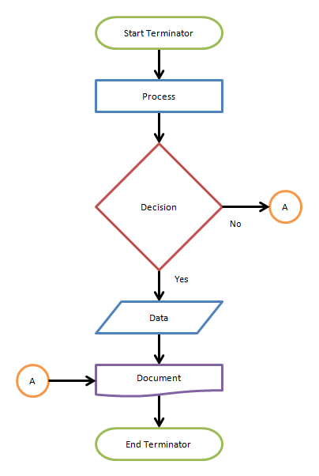

.footnote[[[BreezeTree](https://manualihindukac67.z21.web.core.windows.net/simple-flow-diagram-examples.html)]]

---

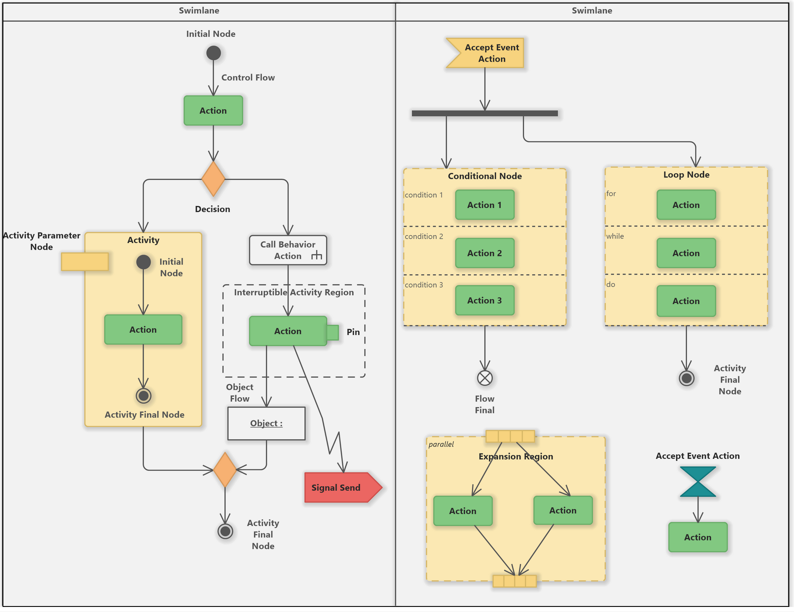

.footnote[[[edrawsoft](https://www.edrawsoft.com/what-is-uml-diagram.html)]]

---

.header[Software Architecture]

## Diagrams

**Get in the habit of visualizing your algorithms and systems!**

--

- Don't worry about using a standard notation
- Just be consistent within your diagram

???

- https://www.ecosia.org/images?q=quick%20sort%20diagram&addon=firefox&addonversion=5.0.2

---

.header[Software Architecture]

## Diagrams

.center[]

.footnote[[Julia Dufek]]

---

## Software Development

???

- What other aspects are needed for software development?

--

.left-even[

- Conceiving
- Specifying
- Designing
- Programming
- Documenting
- Testing
- Bug fixing
- Maintaining

.footnote[[[Wiki: Software development]](https://www.wikiwand.com/en/Software_development)]
]

--

.right-even[
<br />
Programming is really only a small part of software development!]

---

.header[Software Development]

## Incremental vs. Iterative

---

.header[Software Development]

## Incremental

.center[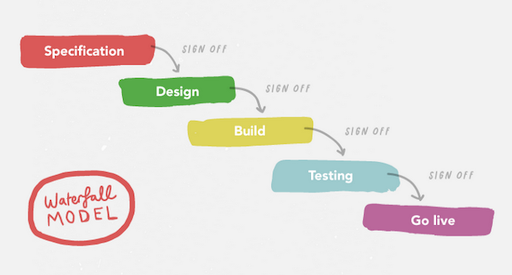]  
.footnote[[[The Agile Mona Lisa]](https://medium.com/yoomee/the-agile-mona-lisa-3313d4b6dc59)]
???

- With traditional (waterfall) projects it’s very difficult to make changes to the software after the specification has been signed off at the beginning of the project. Unfortunately, it’s at the end of the project that users get to use the software and give the most useful feedback.

---

.header[Software Development]

## Iterative

.center[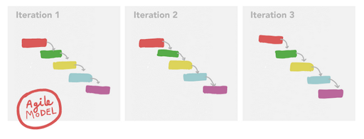]

.footnote[[[The Agile Mona Lisa]](https://medium.com/yoomee/the-agile-mona-lisa-3313d4b6dc59)]

???
Agile is not incremental. A mindset and methodology built on iterative principles but with a stronger emphasis on flexibility, collaboration, and continuous improvement. Agile follows a set of values defined in the Agile Manifesto.

???

1. Iterative Development

Definition:
An approach where software is developed in repeated cycles (iterations). Each cycle adds new functionality or improves existing features until the final product is ready.

Key Characteristics:

- Each iteration results in a working version of the software.
- Feedback is incorporated after each iteration.
- Focuses on continuous refinement of the product.
- Changes are allowed but less flexible than Agile.

Example:

- A word processor starts with basic typing features in the first iteration.
- The next iteration adds formatting options (bold, italic).
- Later iterations add spell-check and grammar suggestions.

---

.header[Software Development | Iterative]

## The Agile Manifesto

- Individuals and interactions over processes and tools
- Working software over comprehensive documentation
- Customer collaboration over contract negotiation
- Responding to change over following a plan

???

Definition:  
A mindset and methodology built on iterative principles but with a stronger emphasis on flexibility, collaboration, and continuous improvement. Agile follows a set of values defined in the Agile Manifesto.

Key Characteristics:

- Divides work into small, incremental user stories.
- Teams work in short sprints (e.g., 1-4 weeks).
- Heavy emphasis on customer collaboration and constant feedback.
- Priorities can change dynamically based on business needs.
- Common frameworks include Scrum, Kanban, and XP.

Example:

- A food delivery app starts with a basic ordering system.
- The team gets user feedback and quickly adjusts priorities.
- In the next sprint, they add real-time tracking instead of a previously planned feature.

---

.header[Software Development | Iterative]

## Scrum

???
Work is organized into short cycles called sprints (typically 1-4 weeks), where a cross-functional team collaborates to deliver small, functional parts of the product.

--

Team

- Product Owner: defines priorities
- Scrum Master: facilitates the process
- Development Team: builds the product

Sprints

- Fixed-length work cycles where teams complete a set of tasks

.footnote[[ChatGPT 4o: What is Scrum?]]

???

Daily Stand-ups

- Short meetings to discuss progress and blockers

Sprint Review & Retrospective

- Evaluating work done and improving the process

Scrum helps teams stay adaptive, efficient, and customer-focused, making it a popular choice in software development and beyond!

Possible Problems with Scrum

While Scrum is a popular Agile framework, it comes with challenges that can impact its effectiveness. Here are some common problems:

1. Poorly Defined Roles

- If the Product Owner doesn’t clearly define priorities, the team may build the wrong features.
- A Scrum Master without strong leadership may fail to remove obstacles.

2. Scope Creep (Uncontrolled Changes)

- Frequent changes during sprints can disrupt workflow and delay deliveries.
- Stakeholders may keep adding new requirements without adjusting timelines.

3. Team Resistance to Agile Mindset

- Teams used to traditional methods (Waterfall) may struggle with self-organization.
- Lack of commitment to Scrum principles leads to inefficiency.

4. Excessive Meetings (“Scrum Overhead”)

- Daily stand-ups, sprint reviews, and retrospectives can feel like too many meetings.
- If not well-facilitated, meetings become time-consuming and unproductive.

5. Unrealistic Sprint Planning

- Teams may overestimate their capacity, leading to unfinished work.
- Pressure to complete too many tasks can result in burnout.

6. Lack of Documentation

- Since Scrum focuses on working software over documentation, teams may lack proper documentation, leading to confusion later.

7. Dependencies Between Teams

- In large projects, dependencies between multiple Scrum teams can slow progress.
- Coordination becomes difficult if teams work at different speeds.

8. Management Misuse of Scrum

- Some companies use Scrum as a micromanagement tool instead of empowering teams.
- Leadership expects fixed deadlines instead of embracing Scrum’s flexibility.

How to Fix These Problems?

✅ Clearly define roles and responsibilities.
✅ Limit scope creep with a well-prioritized backlog.
✅ Balance meetings—keep them short and focused.
✅ Plan sprints realistically and ensure team buy-in.
✅ Maintain key documentation for clarity.
✅ Improve cross-team collaboration in large projects.

When done right, Scrum is powerful, but avoiding these pitfalls is key to success! 🚀

---

.header[Software Development]

## Incremental vs. Iterative

--

.center[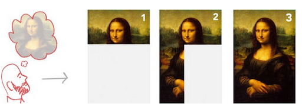]

.footnote[[[The Agile Mona Lisa]](https://medium.com/yoomee/the-agile-mona-lisa-3313d4b6dc59)]

???

The old waterfall approach is akin to painting by numbers, as it calls for a fully formed idea at the start, which is delivered piece by piece without flexibility. This is called an incremental approach because the product is built piece by piece from a fully formed initial design. It’s difficult to change the project’s direction once the design’s been determined at the beginning of the project. This approach doesn’t welcome change, and isn’t Agile in the slightest.

---

.header[Software Development]

## Incremental vs. Iterative

.center[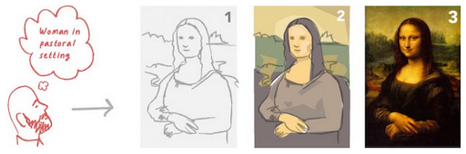]

.footnote[[[The Agile Mona Lisa]](https://medium.com/yoomee/the-agile-mona-lisa-3313d4b6dc59)]

<!-- [[The Agile Mona Lisa]](https://medium.com/yoomee/the-agile-mona-lisa-3313d4b6dc59) -->

???

Agile is not incremental

The old waterfall approach is akin to painting by numbers, as it calls for a fully formed idea at the start, which is delivered piece by piece without flexibility. This is called an incremental approach because the product is built piece by piece from a fully formed initial design. It’s difficult to change the project’s direction once the design’s been determined at the beginning of the project. This approach doesn’t welcome change, and isn’t Agile in the slightest.

The Agile Mona Lisa

An Agile, iterative process allows you to move from a vague idea to concrete realisations. You can also iterate to find the ideal solution for users, and iterate to improve it, once you’ve found it. Oh, what a dream come true!

One of the best ways of visualising this contrasting approach I’ve seen is an explanation by Jeff Patton illustrating what Agile development of the Mona Lisa would look like. You can see that three iterations, starting with a concept, which is firmed up into the final deliverable. Iterating builds a rough version, validates it, then slowly builds up quality.

---

.header[Software Development]

## Agile As Often Practiced

.center[]  
[[pinimg]](https://i.pinimg.com/originals/3e/8c/8d/3e8c8dac53ea2ef31f8dbc7257dd9a2d.jpg)

---

.header[Software Development]

## Incremental vs. Iterative

> While there is much anecdotal evidence that adopting agile practices and values improves the effectiveness of software professionals, teams and organizations, the empirical evidence is mixed and hard to find.

.footnote[[[wiki]](https://en.wikipedia.org/wiki/Agile_software_development)]

---

template: inverse

Homework

### Software Development

## Tools?

???
.center[
[](https://threejs-tutorial-react-vercel-deploy.vercel.app/)
]

.footnote[[by Malte Hillebrand]]

- https://threejs-tutorial-react-vercel-deploy.vercel.app/

---

template: inverse

### Software Development

# React

???

- What is it? In one sentence (a tool for building user interfaces)
- Do you like it?

React has literally changed the way we think about web applications and user interface development and made it possible to build and manage large-scale web applications such as Facebook, Netflix and many more in a more-efficient and modular way.

---

## React

.left-quarter[]
.right-quarter[

> React is a tool for building user interfaces.
> ]

---

## React

.left-quarter[
.footnote[[[ishandeveloper]](https://blog.ishandeveloper.com/react-intro)]
]
.right-quarter[

> React is a tool for building user interfaces.

- JavaScript library built by Facebook / Meta
- Front-end

]

---

## React

.left-quarter[
.footnote[[[ishandeveloper]](https://blog.ishandeveloper.com/react-intro)]
]
.right-quarter[

> React is a tool for building user interfaces.

- JavaScript library built by Facebook / Meta
- Front-end
  - Modular UIs by dividing an interface into components

]

---

## React

.left-quarter[
.footnote[[[ishandeveloper]](https://blog.ishandeveloper.com/react-intro)]
]
.right-quarter[

> React is a tool for building user interfaces.

- JavaScript library built by Facebook / Meta
- Front-end
  - Modular UIs by dividing an interface into components
  - Makes large-scale web applications efficiently manageable
    ]

---

.header[React]

## Use Cases

- Anything from Meta (Facebook, Instagram, WhatsApp Web)
- AirBnb
- Netflix
- Imdb
- Discord
- Dropbox
- Reddit
- ...

---

.header[React]

## Why Should You Care?

- Powerful and flexible (with a bit of a learning curve...)
- Industry standard
- (Job security)

--

<br />
There is a powerful library, [React Three Fiber](https://r3f.docs.pmnd.rs/getting-started/introduction), to weave Three.js into a webpage.

???
.todo[TODO:Show:] https://r3f.docs.pmnd.rs/getting-started/examples

---

.header[React]

## The Problem

--

- DOM manipulation is the heart of the interactive web
- Unfortunately, it is also quite slow

--

> Most JavaScript frameworks update the DOM much more than they have to!

.footnote[[[Codecademy Team. React: The Virtual DOM](https://www.codecademy.com/article/react-virtual-dom)] [[javascript.plainenglish]](https://javascript.plainenglish.io/dom-manipulation-985995eb858a)]

---

.header[React]

## The Problem

.center[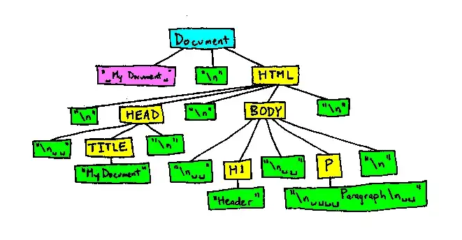]

.footnote[[[Codecademy Team. React: The Virtual DOM](https://www.codecademy.com/article/react-virtual-dom)] [[javascript.plainenglish]](https://javascript.plainenglish.io/dom-manipulation-985995eb858a)]

???

- As an example, let’s say that you have a list that contains ten items. You check off the first item. Most JavaScript frameworks would rebuild the entire list. That’s ten times more work than necessary! Only one item changed, but the remaining nine get rebuilt exactly how they were before.

Rebuilding a list is no big deal to a web browser, but modern websites can use huge amounts of DOM manipulation. Inefficient updating has become a serious problem.

---

.header[React | Slow DOM Updates]

## React's Solution

--
Virtual DOM Creation:

- React creates a lightweight copy of the real DOM in memory.

.footnote[[ChatGPT 4o: Describe React's Virtual DOM]]

--

State or Prop Changes:

- When data changes, React re-renders a new Virtual DOM.

Diffing Algorithm:

- React compares (diffs) the new Virtual DOM with the previous one.
- Identifying the changed elements.

---

.header[React | Slow DOM Updates]

## React's Solution

Efficient Updates (Reconciliation):

- Instead of updating the entire DOM, React updates only the changed parts in the real DOM.
- This minimizes browser reflows and improves performance.

.footnote[[ChatGPT 4o: Describe React's Virtual DOM]]

???

Problem

- DOM manipulation is the heart of the interactive web. Unfortunately, it is also quite slow.
- Most JavaScript frameworks update the DOM much more than they have to.

In summary, here’s what happens when you try to update the DOM in React:

- The entire virtual DOM gets updated.
- The virtual DOM gets compared to what it looked like before you updated it. React figures out which objects have changed.
- The changed objects, and the changed objects only, get updated on the real DOM.
- Changes on the real DOM cause the screen to change.

Once the virtual DOM has updated, then React compares the virtual DOM with a virtual DOM snapshot that was taken right before the update.

By comparing the new virtual DOM with a pre-update version, React figures out exactly which virtual DOM objects have changed. This process is called “diffing.”

Once React knows which virtual DOM objects have changed, then React updates those objects, and only those objects, on the real DOM. In our example from earlier, React would be smart enough to rebuild your one checked-off list-item, and leave the rest of your list alone.

This makes a big difference! React can update only the necessary parts of the DOM. React’s reputation for performance comes largely from this innovation.

https://reactkungfu.com/2015/10/the-difference-between-virtual-dom-and-dom/

--

> This makes react efficient and performant!

<!--
## React

```js
import React from 'react';
import ReactDOM from 'react-dom/client';

function Hello(props) {
  return <h1>Hello World!</h1>;
}

const root = ReactDOM.createRoot(document.getElementById("root"));
root.render(<Hello />);
```

-->

---

.header[React]

## Development Mantra

--

> DRY - Don't repeat yourself!

---

.header[React]

## Development Mantra

Work with UI building blocks that are independent and reusable:

.center[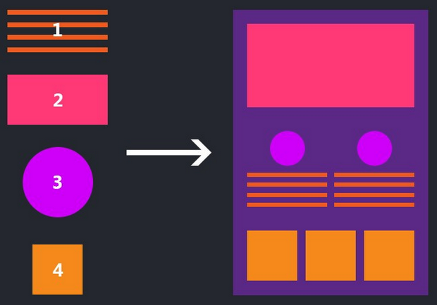 .imgref[[[desaihetvi]](https://medium.com/@desaihetvi/components-in-react-5d72887cc51d)]]

---

.header[React]

## Alternatives (2024)

- Vue.js
- Svelte
- Solid.js
- Angular
- Qwik

Honorable Mentions: Preact, Lit, Alpine.js

.footnote[[ChatGPT 4o: Alternatives to React?]]

???

TroisJS (Vue + Three.js)  
Threlte (Svelte + Three.js)  
Angular Three (Angular + Three.js)

1. Vue.js

Best for: Simplicity & Progressive Adoption  
Why Use It?

- Easier to learn than React.
- Uses a reactive data model with a simpler API.
- Supports both Options API and Composition API (similar to React Hooks).
- Great for small to medium apps and supports SSG/SSR (Nuxt.js).

When to Choose Vue?

- You want simplicity and faster learning than React.
- You prefer template-based syntax over JSX.
- You’re building a small or medium-sized app with a smooth learning curve.

2. Svelte

Best for: Performance & Simplicity  
Why Use It?

- No virtual DOM → Directly compiles to optimized JavaScript.
- Less boilerplate compared to React.
- Reactivity built-in (no need for useState/useEffect).
- Super fast for small apps & interactive UI components.

When to Choose Svelte?

- You need a lightweight, faster alternative to React.
- You want less code & simpler reactivity.
- You’re building a performance-sensitive app (e.g., dashboards, animations).

3. Solid.js

Best for: React-like API with Higher Performance  
Why Use It?

- Uses fine-grained reactivity instead of a Virtual DOM.
- Same JSX syntax as React but faster.
- Highly efficient updates (better than React in benchmarks).
- Great for complex, reactive UI applications.

When to Choose Solid.js?

- You love React’s syntax but need faster reactivity.
- You’re working on performance-critical applications.
- You want a React-like experience with better efficiency.

4. Angular

Best for: Large Enterprise Apps  
Why Use It?

- Full-fledged MVC framework (not just a UI library like React).
- Built-in dependency injection, routing, state management.
- Best suited for large-scale, enterprise-level apps.
- Uses TypeScript by default.

When to Choose Angular?

- You need a structured, opinionated framework.
- You’re building large, enterprise applications.
- Your team prefers TypeScript & OOP patterns.

5. Qwik

Best for: Instant Loading & SSR Optimization  
Why Use It?

- Resumability instead of hydration → Faster load times.
- Efficient server-side rendering (SSR).
- Optimized for SEO & performance (great for e-commerce, blogs).

When to Choose Qwik?

- You need ultra-fast SSR (better than Next.js).
- You’re optimizing for performance & SEO.

Honorable Mentions

Preact: A lightweight 3KB alternative to React (same API, faster).  
Lit: Uses web components for lightweight, reusable UI elements.  
Alpine.js: Good for small, interactive UI enhancements (alternative to jQuery).

- If you like React but want a faster alternative, try Solid.js.
- If you need simplicity, go for Vue.js or Svelte.
- If you’re building large enterprise apps, Angular is a strong choice.

---

template:inverse

### Let's Dive In...

---

.header[React]

## New Concepts

- Components
- JSX
- Routes
- Properties
- Hooks

---

template:inverse

### React

# Components

---

.header[React]

## Components

.left-even[ .imgref[[[ishandeveloper]](https://blog.ishandeveloper.com/react-intro)]]

--

.right-even[

> Every colored box represents a different component.
> ]

???

- Components are the most fundamental building blocks of a react application. In React, a single web page can be divided into small blocks that represent a different part of the screen. Consider the layout below for an example.

Here every colored box that you can see, represents a different component. Each individual component is independent of one another and responsible both for it’s visual appearances and its interaction

In layman terms, a component is basically just a file that contains all the html, styling and js logic in one group.

---

.header[React]

## Components

--

- The fundamental building blocks of a react application

--

- Independent and reusable bits of code

--

- Responsible for both visual appearances and interaction

--

<br />

> Components are like functions that return HTML elements.

---

.center[]

---

.center[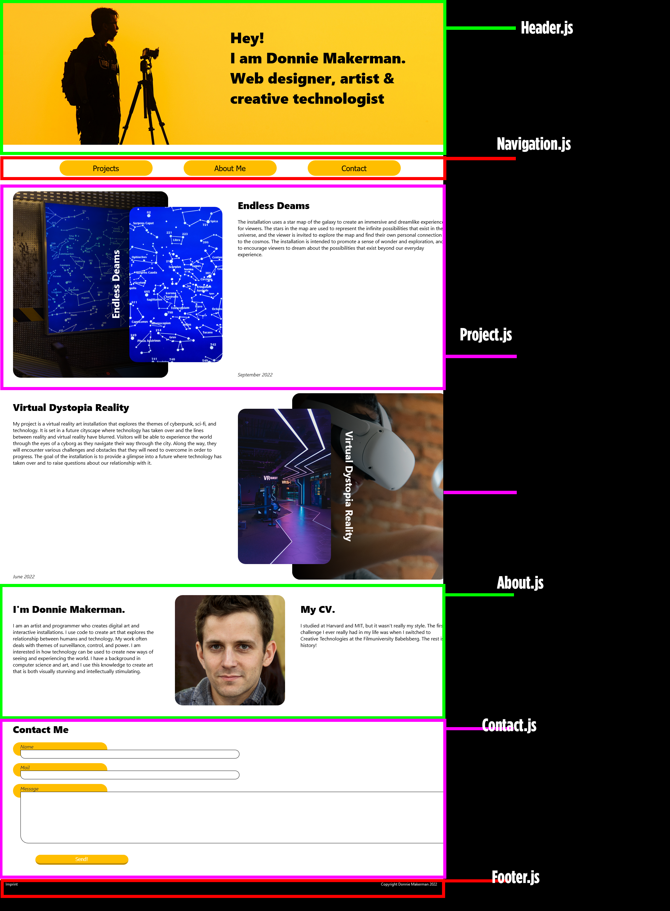]

---

.center[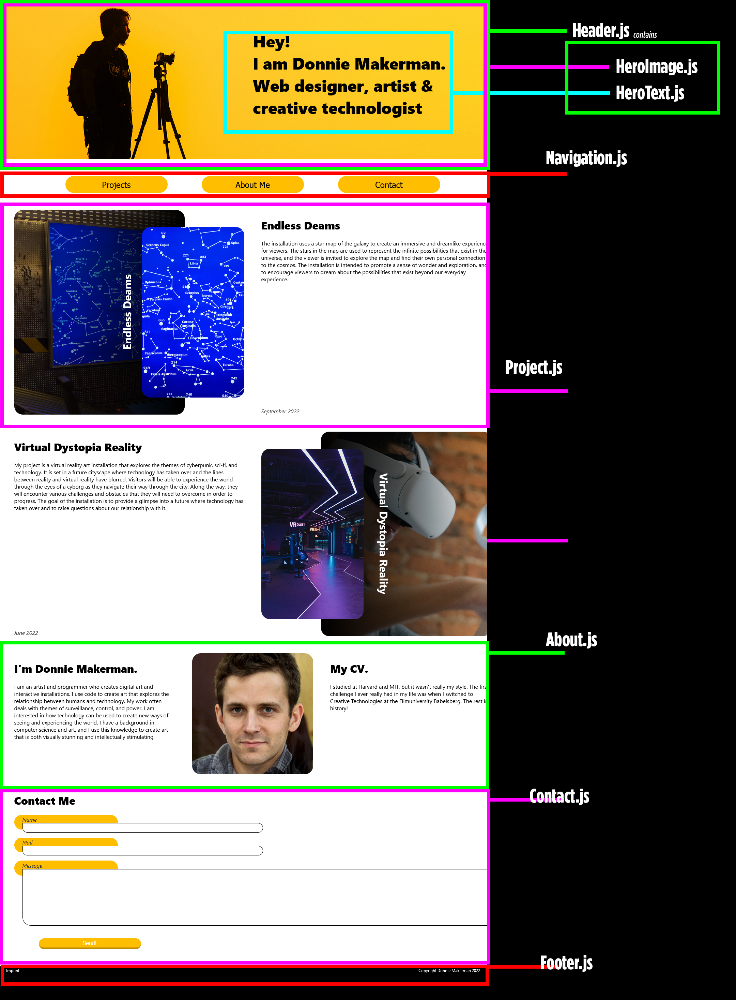]

---

.center[]

---

.center[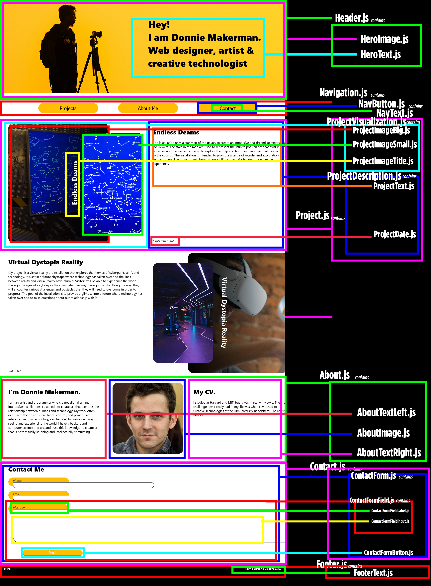]

---

.center[]

---

.center[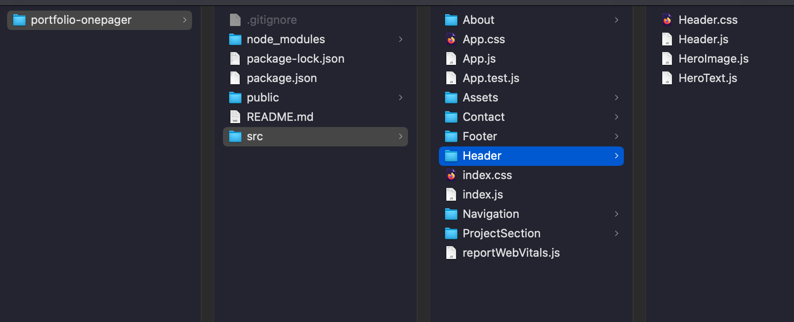]

---

.header[React]

## Components

--

```js
// HeroText.jsx

function HeroText() {
  return <h2>Hi, I am a Donnie!</h2>;
}
```

--

- The function returns JSX, which has HTML-like syntax

> For now think HTML is returned...

---

.header[React]

## Components

```js
// HeroText.jsx

function HeroText() {
  return <h2>Hi, I am a Donnie!</h2>;
}
```

The `HeroText` function is called by:

```js
<HeroText />
```

---

.header[React | Components]

## Basic Rules

```js
// HeroText.jsx

function HeroText() {
  return <h2>Hi, I am a Donnie!</h2>;
}
```

--

- Components' name must start with an upper case letter

--

- Elements must be properly closed `<h2> ... </h2>`

---

.header[React | Components]

## Basic Rules

```js
// HeroText.jsx
function HeroText() {
  return (
    <>
      <h2>Hi, I am a Donnie!</h2>
      <p>I am a paragraph.</p>
      <p>I am a paragraph too.</p>
    </>
  );
}
```

- Components must return a single statement
- Wrap multiple lines in `<> ... </>` or `()`

---

.header[React | Components]

## Export

We export the component, so that it can be imported in a different file:

```js
// HeroText.jsx

export default function HeroText() {
  return <h2>Hi, I am a Donnie!</h2>;
}
```

???
export default (Single Export)

- Used when a module has one primary value to export.
- Only one default export per module.
- Imported without {} and can be renamed freely.

---

.center[]

---

.header[React]

## Components

```js
// HeroText.jsx

export default function HeroText() {
  return <h2>Hi, I am a Donnie!</h2>;
}
```

```js
// HeroImage.jsx

export default function HeroImage() {
  return ;
}
```

---

.header[React]

## Components

```js
// Header.jsx
import "./Header.css";
import HeroText from "./HeroText.jsx";
import HeroImage from "./HeroImage.jsx";

export default function Header() {
  return (

      <HeroText />
      <HeroImage />

  );
}

```

---

.header[React]

## Components

```js
// Header.jsx
import "./Header.css";
import HeroText from "./HeroText.jsx";
import HeroImage from "./HeroImage.jsx";

export default function Header() {
  return (
    <div id="header">
      <HeroText />
      <HeroImage />
    </div>
  );
}
```

???

- In older React code bases, you may find Class components primarily used. It is now suggested to use Function components along with Hooks, which were added in React 16.8. There is an optional section on Class components for your reference.
- https://www.w3schools.com/react/showreact.asp?filename=demo2_react_component_function

---

```js
// App.jsx
import "./App.css";
import Header from "./Header/Header.jsx";
import Navigation from "./Navigation/Navigation.jsx";
import ProjectSection from "./ProjectSection/ProjectSection.jsx";
import About from "./About/About.jsx";
import Contact from "./Contact/Contact.jsx";
import Footer from "./Footer/Footer.jsx";

export default function App() {
  return (
    <>
      <Header />
      <Navigation />
      <ProjectSection />
      <About />
      <Contact />
      <Footer />
    </>
  );
}
```

---

```js
// index.jsx

import React from "react";
import ReactDOM from "react-dom/client";
import "./index.css";
import App from "./App";

const root = ReactDOM.createRoot(document.getElementById("root"));

root.render(<App />);
```

???

## Render HTML

As library for building front-end user interfaces, one of React's main goals is to **render HTML**.

It does so with:

```js
ReactDOM.render(*what?*, *where?*)
```

This function takes two arguments

- HTML code (_what?_)
- An HTML element (_where?_)

The function displays then the specified HTML code inside the specified HTML element.

```js
ReactDOM.render(<p>Hello</p>, document.getElementById("root"));
```

The result is displayed in the `<div id="root">` element:

```html
<body>
  <div id="root"></div>
</body>
```

- There is another folder in the root directory of your React project, named "public". In this folder, there is an index.html file.
- You'll notice a single <div> in the body of this file. This is where our React application will be rendered.
- Note that the element id does not have to be called "root", but this is the standard convention.

## The Root Node

The root node is the HTML element where you want to display the result. It is like a container for content managed by React.

It does NOT have to be a `<div>` element and it does NOT have to have the `id='root'`:

```html
<body>
  <header id="xmas"></header>
</body>
```

```js
ReactDOM.render(<p>Hallo</p>, document.getElementById("xmas"));
```

---

```js
// index.html
<!DOCTYPE html>
<html lang="en">
    <head>
        <title>React App</title>
    </head>
    <body>
        <div id="root"></div>
    </body>
</html>
```

---

.header[React]

## Components

In summary, a React component is

--

- A reusable, self-contained piece of the UI

--

- Defines how a part of an application should look and behave

--

- Is represented as a function, which returns JSX (HTML-like syntax)

--

Components are eventually collected within the `App` component and rendered to a root node.

???

Components can have state (to manage dynamic data) and props (to receive inputs from parent components), making them the building blocks of React applications.

.todo[TODO: Show Portfolio setup]

```js
import React from "react";
import ReactDOM from "react-dom/client";

function MyPage() {
  return <h2>This is my web page</h2>;
}

ReactDOM.render(<MyPage />, document.getElementById("root"));
```

---

template:inverse

### React

# JSX

---

.header[React]

## JSX

--

JSX stands for **JavaScript XML**

--

- Allows us to write HTML elements in JavaScript efficiently
  - We can pretty much write the HTML directly such as  
     `<h1>I Love JSX!</h1>`
  - The HTML is placed in the DOM

???
without any `createElement()` and/or `appendChild()` methods

--

- Converts HTML tags into React elements

.footnote[[[w3schools]](https://www.w3schools.com/react/default.asp)]

---

.header[React | JSX]

## JSX vs. No JSX

### Without JSX:

```js
const myElement = React.createElement("h1", {}, "I do not use JSX!");

ReactDOM.render(myElement, document.getElementById("root"));
```

### With JSX:

```js
const myElement = <h1>I Love JSX!</h1>;

ReactDOM.render(myElement, document.getElementById("root"));
```

???

- At first sight, you might be thinking, this looks like HTML. You are not alone, every new React developer thinks the same at first. I also thought the same.
- But, the funny thing is, it’s not HTML. It is just a syntax extension to JavaScript, or you can say some sugar syntax for defining components and their positioning inside the markup.

---

.header[React | JSX]

## Expressions

--

With JSX you can write expressions inside curly braces { }:

```html
<h1>JavaScript calculation added within JSX: {5 + 5}</h1>
;
```

--

Expression can be a React variable, or property, or any other valid JavaScript expression.

---

.header[React | JSX]

## Expressions

```js
function Greeting() {
  const name = "Alice";
  return <h1>Hello, {name}!</h1>; // JavaScript expression inside JSX
}

export default Greeting;
```

--

Html:

```html
<h1>Hello, Alice!</h1>
```

---

.header[React | JSX | Expressions]

```js
function UserList() {
  const users = [
    { id: 1, name: "Alice", isOnline: true },
    { id: 2, name: "Bob", isOnline: false },
    { id: 3, name: "Charlie", isOnline: true },
  ];
  return (
    <ul>
      {users.map((user) => (
        <li style={{ color: user.isOnline ? "green" : "red" }}>
          {user.name} {user.isOnline ? "✅" : "❌"}
        </li>
      ))}
    </ul>
  );
}
export default UserList;
```

---

.header[React | JSX | Expressions]

<br />
  
Renders to:

```html
<ul>
  <li style="color: green;">Alice ✅</li>
  <li style="color: red;">Bob ❌</li>
  <li style="color: green;">Charlie ✅</li>
</ul>
```

???

There are several more JSX options, such as class attributes, conditions.

It is just something to look up when needed and to get used to.

---

.header[React]

## JSX

In summary, JSX

- Is a syntax extension for JavaScript used in React
- Looks like HTML
- Helps to write UI components more intuitively
- Can have embedded JavaScript expressions inside {}

???
Key Features

- Syntax for UI → Combines JavaScript and HTML-like code.
- Transpiled to JS → Browsers don’t understand JSX, so Babel converts it to regular JavaScript.
- Dynamic Content → You can embed JavaScript expressions inside {}.

---

template:inverse

### React

# Basic Example

---

.header[Example]

## Installation

```
npm create vite@latest
```

- `create`: It sets up the folder structure and installs necessary files (called _scaffolding_)
- `vite@latest`: create a vite environment, with the latest version of vite

???
https://stackoverflow.com/questions/73594809/what-is-the-difference-between-npm-init-vitelatest-and-npm-init-vite

The difference between the two, is, npm init vite@latest will download the latest version - and npm init vite will use create-vite if you had it previously globally installed, or it will fetch the latest version. that's it.

---

.header[Example]

## Installation

```
npm create vite@latest
```

Prompts:

--

1. Project Name → Enter a name

-- 2. Framework → Choose a framework (e.g., React, Vue, Svelte, etc.)

-- 3. Variant → Choose the language (e.g., JavaScript or TypeScript)

---

.header[Example]

## Installation

```
cd portfolio_01_components
npm install
npm run dev
```

--

- Clean example, or start from scratch

???
.todo[TODO: Show, run example]

- 01_start
- 02_components

---

template:inverse

# Next

---

## Next

--

- Properties

--

- Hooks

--

- Example React Project

--

- React Three Fiber

--

- Wrap-Up

---

template: inverse

## The End

# 🤹🏻‍♀️ 🧩 📱
