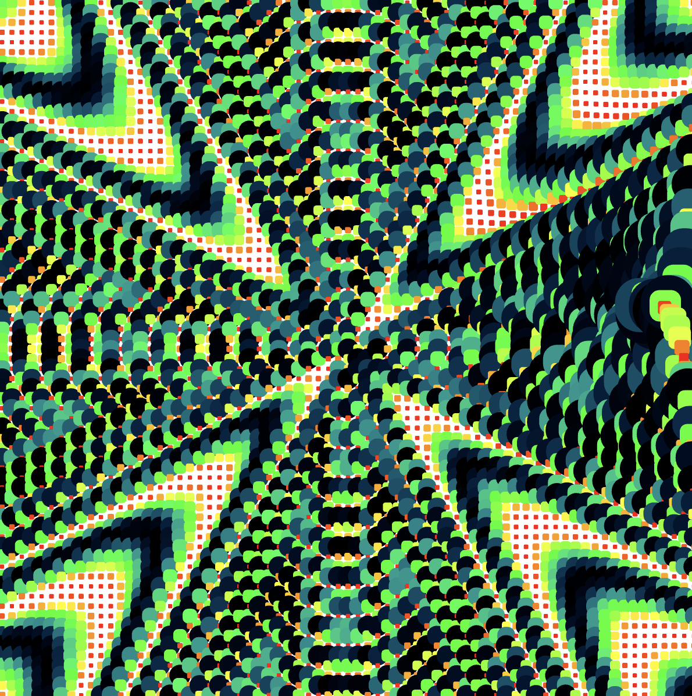
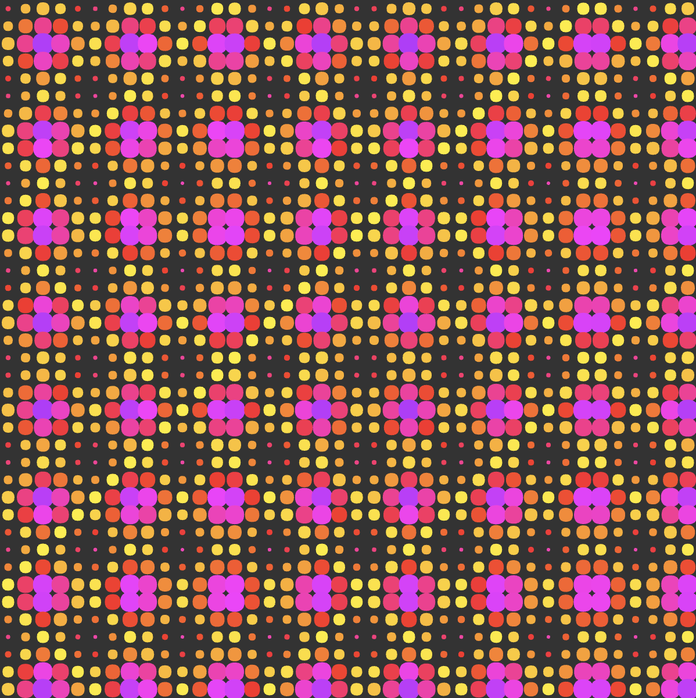
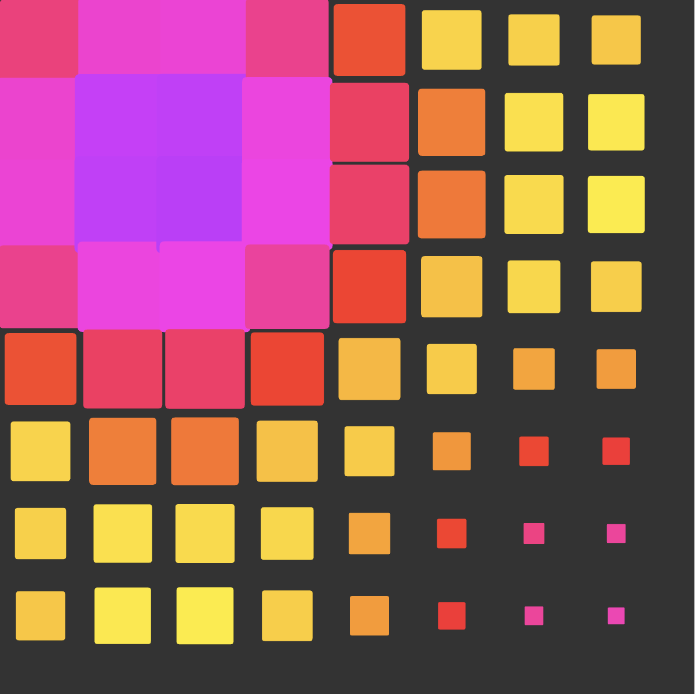
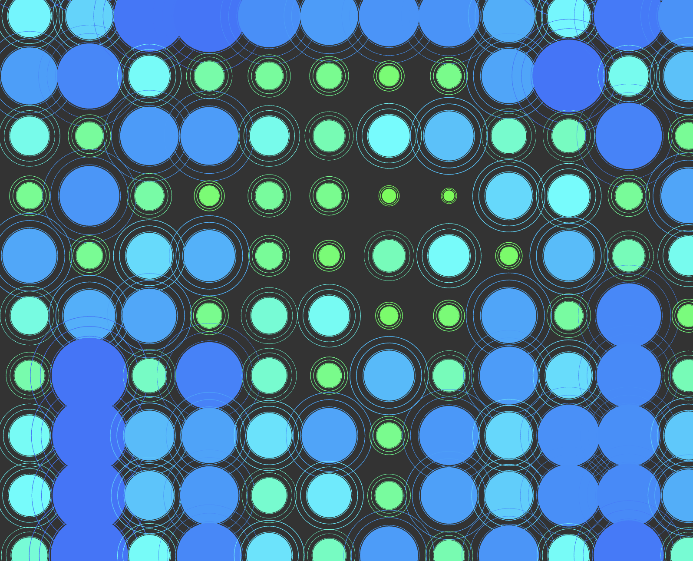
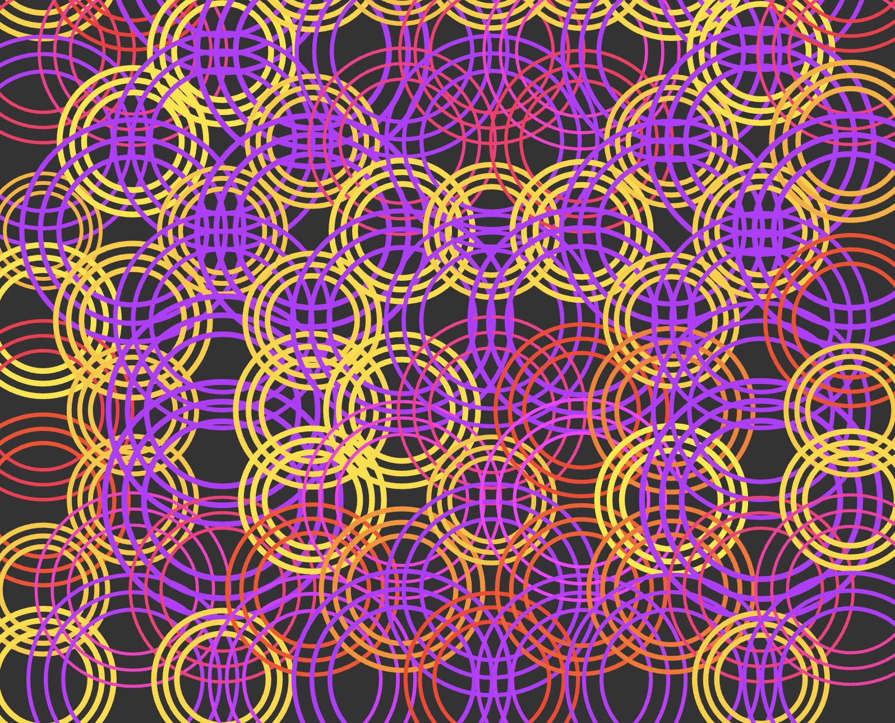
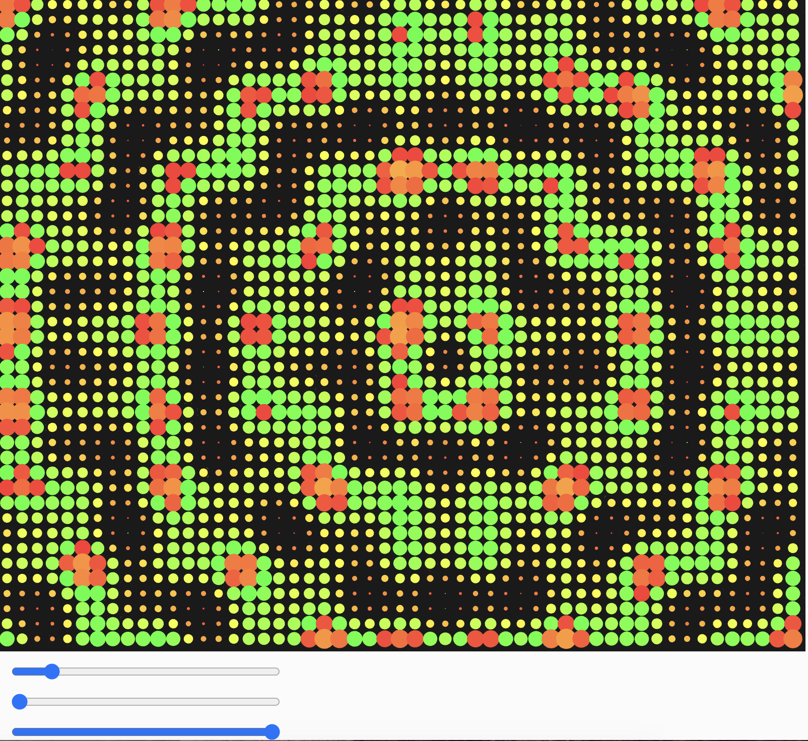
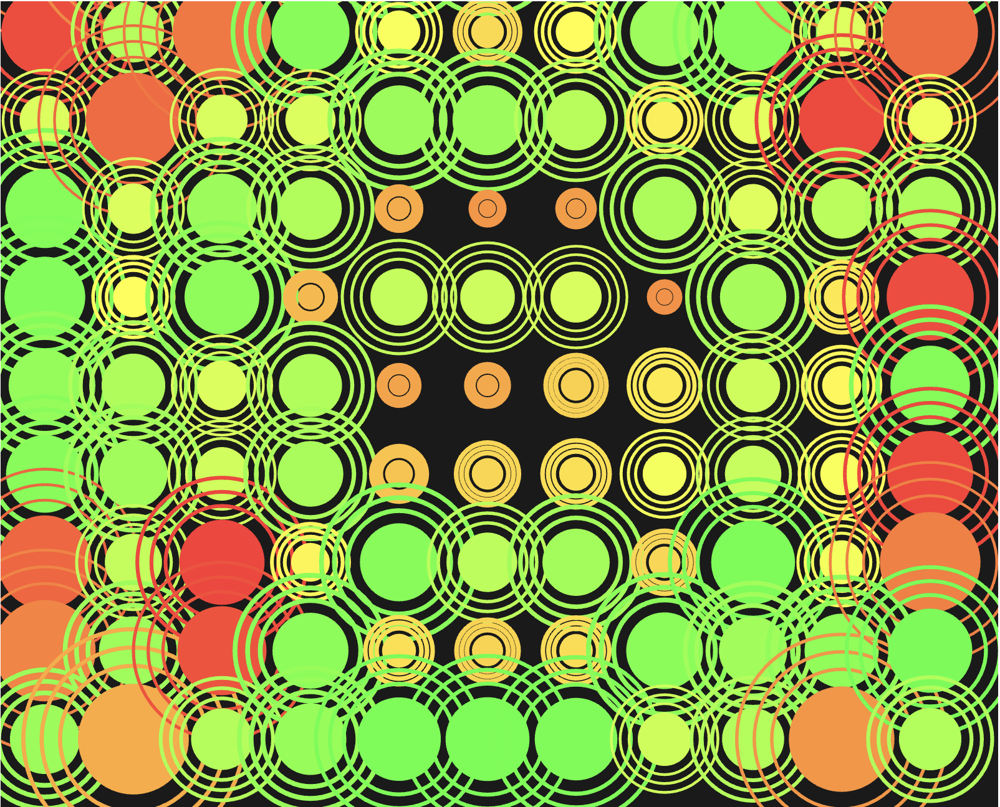
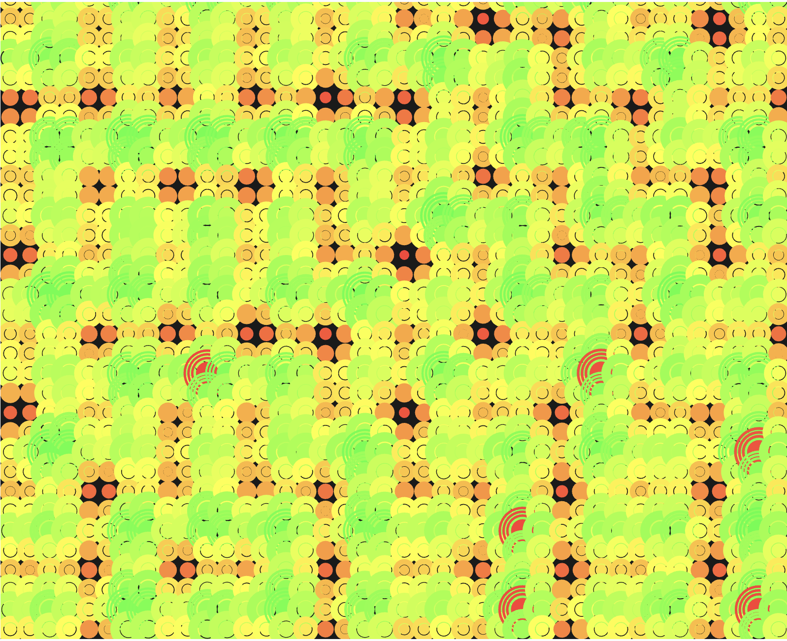

### Task 02.01 - _Coding_

> Circles!

> Description: 
+ I used a lot algorithmic thinking in a very classic way I think but I had a lot of fujn playing with some paraeters. i loved trying to figure out what the circle animation could develop into

Link: 
1 -
https://editor.p5js.org/haag.lynn1703/sketches/VdYRuTDow

2 -
https://editor.p5js.org/haag.lynn1703/sketches/T__PPsjmw

3 - 
https://editor.p5js.org/haag.lynn1703/sketches/_OfpQLJP-

### Task 02.02 - _Coding_

> Happiness.

> Description: 
+ For this Happiness task, I wanted a bit of a different pattern that is only visible when you zoom out, and then has a 3D effect also. In the future I can imagine integrating somthing like this in a website, eg. there is a group of animated objects and when zoom out they for another pattern and. like an interactive infity zoom that is triggered my scrollitelling or ouse clicks.

Link:
1 - 
https://editor.p5js.org/haag.lynn1703/sketches/R5c0Uf1PT

 
 

### Task 02.03 - _Algorithmic Thinking_

Briefly reflect on how you implemented your creative idea. Did you apply algorithmic thinking and if so, how?

_Submission_: 
In both sketches, I wanted to create a pulsating and also liquid motion generate exitement and happiness! Also also bit of overstimulation, because that decribed my mindset whle doing the homework very well.

### Task 02.04 - _Creative Instructions_

Write instructions that are in themselves a creative output.

_Submission_: 

--/ Procrastinating 

let meSleep ;
let meEat ;

function setup() {
  createFailstate (100/100);
  noColor
  noFill
  verydeadandtired
}

let deadline = [
  [28. 02. 2026],
];
// be extendet! LOL

if (one_day == more hours) {
    I would be very happy; 
}

function setup() {
  createFailstate (100/100);
  noColor
  noFill
}
---

## Learnings

Please summarize your personal learnings. What was challenging for you in this session? How did you challenge yourself?

_Submission_: 
- I tried out a lot of different approaches to change coulours, shapes and trigger some change in animation with mouse clicks. the animation always stayed a little bit steady and grid-like. I wanted it to feel repetive with only subtle changes because of the algorithmic topic. i really am a bloddy beginner and I had some help from chatty, but as I progressed I learned that it's all about writing and reading a lot of code on repeat in order to really get the hang of it. I exchanged so many differnt parts and readjusted a lot of things but in the end I also experimented a lot! I hope it's maybe fun for you too, to play around a little with the sliders. :-)
---