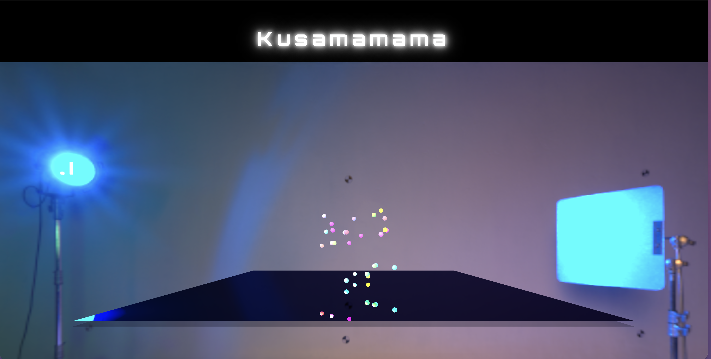
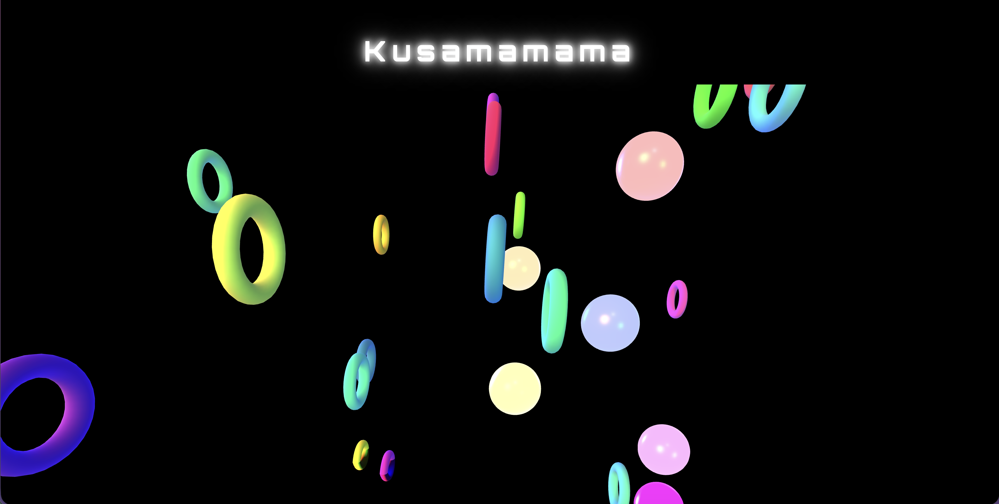
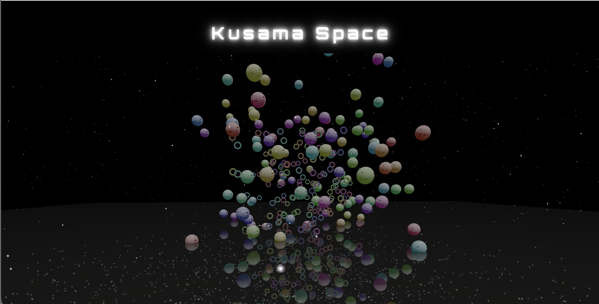

# Session 03 - Space (10 points)

## Task 03.03 - First Three.js Scene

**The sourcecode is this folder: scrccode03**

**Here is my Demo Video:**
https://owncloud.gwdg.de/index.php/s/OFx7aWgxSQG1TDb

*I wanted to share some screenshots of the progress too :-)* 

 ## KUSAMA SPACE

With this task I feel like I made some progres. I had to trust the process of backing up my code so I didn't mess up where I wanted to go with this from the beginning. So I started out with simple things like bubbles and evetually got the hang of how to move them so they are in in the place and going to right place. Also I had a lot of struggle with animating organic metaballs (initial idea) because in this version of three.js they were not showing up, when I integrated them in my code?? I'm still a bit unsure about the reason for them not showing up. I decided to try particles that simulate stars. Very fitting for Kusamas art I think. I also started out with neon lights but in the end deided against my initial HDRI and created an enviroment to create a cleaner more polished looking lighting set up. Coming from a design background I want to start also working ore with my style.css sheet, to include fonts and headers and all of that. From the beginning on I also wanted to work with a reflector surface at the bottom. Yippiiie
