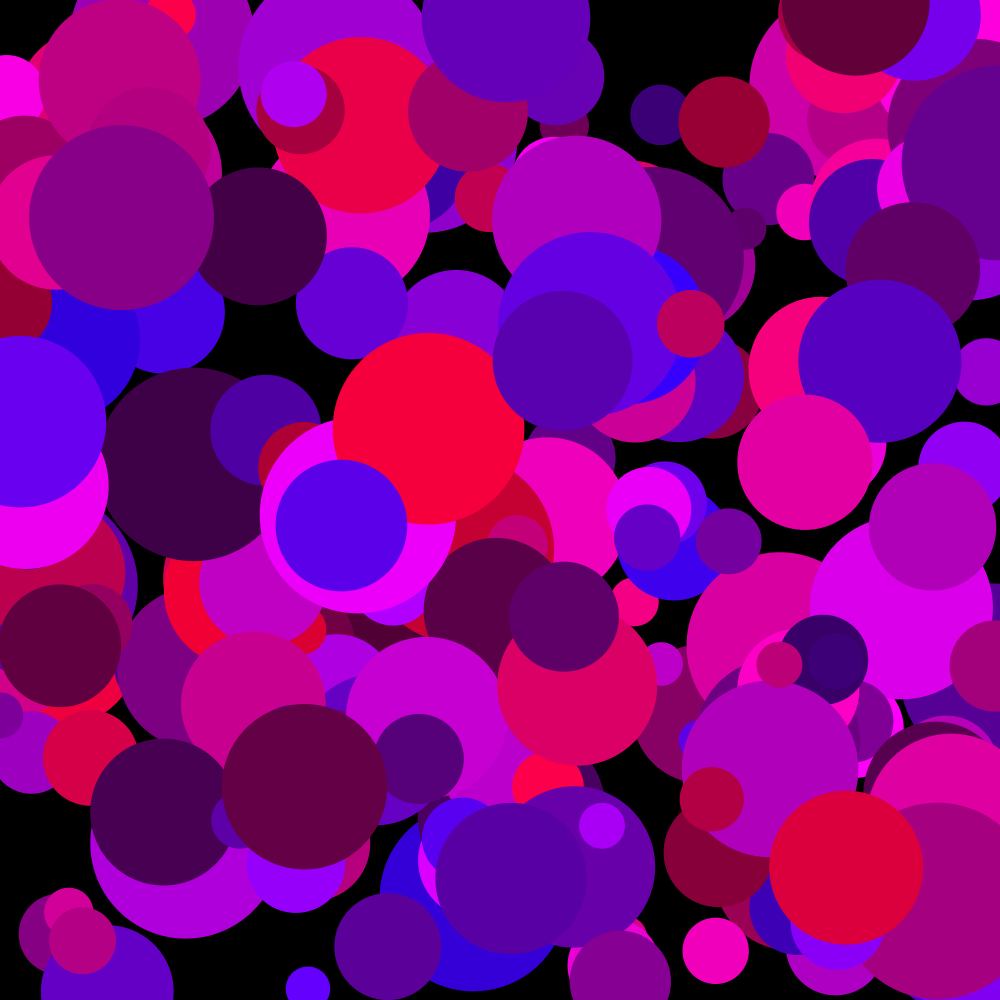
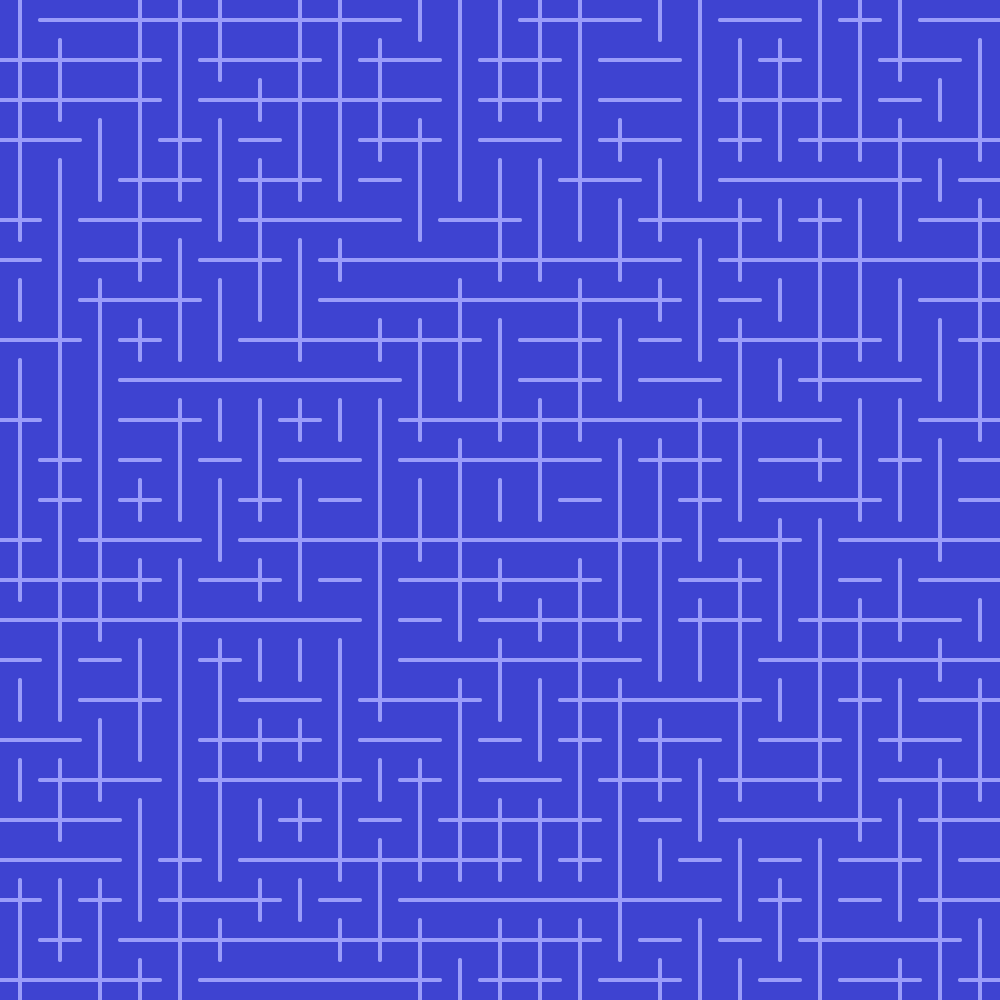
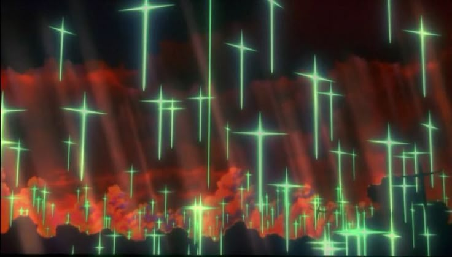

# Creative Coding I

Prof. Dr. Lena Gieseke \| l.gieseke@filmuniversitaet.de  \| Film University Babelsberg KONRAD WOLF
  

# Session 01 (20 points)

### Task 01.01

Are there any open questions regarding the syllabus and the administration of this course? If so, please mention them next class.

*Submission*: None

### Task 01.02

Please answer the following questions truthfully so that I can set up the lecture accordingly.

* Overall, how would you rate your skill level of programming?
    * [ ] Never done it
    * [x] Novice
    * [ ] Intermediate
    * [ ] Advanced
    * [ ] God-like
* Have you used object-oriented programming before?
    * [x] I don't know what that is
    * [ ] I know the concept, but I have never implemented it
    * [ ] Yes
* Overall, how would you rate your skill level of using web technologies, e.g., have you used a local server setup?
    * [x] Never done it
    * [ ] Novice
    * [ ] Intermediate
    * [ ] Advanced
    * [ ] God-like
* How would you rate your skill level of working with Git and GitHub?
    * [ ] Never done it
    * [x] Novice
    * [ ] Intermediate
    * [ ] Advanced
    * [ ] God-like
  

* Are there any specific topics that would interest you in the context of this lecture and that haven't been mentioned so far? 

I am generally interested in understanding the basics of coding because I only "vibe-coded" with Chat-GPT in past projects. I would love to familiarize myself with a few things to in the future use coding as a tool. I want to seek out coding as a problem solution and not only code when its strictly necessary. 

## Introduction

Recapture [Script 01 - Intr oduction](../../02_scripts/cc1_ws2425_01_intro_script.md), if need be.

### Task 01.02

Personal motivation for coding and final creative coding project:

Motivation:
My motivation is manly that I no longer want coding to be a subject I scare away from. I know from my work in Unity or TouchDesigner, that I could have made a few interaction way easier on me if coding were more familiar for me. I think my big goal is that I no longer want to be annoyed by or be scared of a project that requires coding. 

Final Project Idea:
I would want to have something visual with which there is a sort of interaction. Something like a particle simulation with different user exposed parameters or some visual filters which the userer can change inputs of.

### Task 01.03

Find an existing creative coding project that you like. Coding needs to play a significant role for the project, also ideally it is web-based (this is not a hard requirement). Describe what you like about the project and why you think that the project represents creative coding.

*Submission*: 
An example for creative coding and integrating touch interaction are almost all SchultzSchultz tools. I picked out “Toch Type” as one I find very interesting. 

Small note: You need to be on mobile or use a touch screen and need to create an account but its free.

Website:

https://schultzschultz.com/

Demonstration Video:

https://www.instagram.com/reel/DL5XIkGs1St/?igsh=MTN6ZzNmZjByMmtrdQ==

Its a tool to create text and modulate every letter of a font. What makes it particularly interesting for me as a coding exercise is that it has a lot of value as a tool. It’s not inherently beautiful or a massive project but by giving users the opportunity to play with it and make own creations its virtually limitless. 

I think it’s a great example for the possibility's of creative coding because the base idea is simple (the code may be more complex integrating touch etc.) but the sum of what it is feels larger than the parts its made of. 

It is also easy to get started, an interesting reimagination of UI/UX and fun to play with as a user.

## p5

If you are a beginner, you can find detailed and slowly explained information in the scripts of my [*Creative Coding for Beginners Course*](../../02_scripts/p5/) (Scripts -> p5).

Also, please refer to [p5's reference](https://p5js.org/reference/). It is well-made.

### Task 01.04 - p5 With The Online Editor

For the coding of this session, it is sufficient to use p5's [online editor](https://editor.p5js.org/). Make an account and start coding 🤓! If you prefer to work with p5 in a different environment, that is also fine.

*Tip*: Right-click on the canvas in the p5 editor and chose `Save image as...` to save an image of your canvas.

*Submission*: 

  

Link:
https://editor.p5js.org/Pucky-png/full/9l0xZbmcY

My first little  random p5 Code

### Task 01.05 - The 10 PRINT pattern

Write a sketch that generates a pattern with a similar logic as the 10 PRINT example. Your pattern should follow an element-by-element and row-by-row iterative creation process. If you are a beginner, you can use [the code from the slides](https://editor.p5js.org/legie/sketches/nrfQTzxMI) as a basis (fully understand it first, though!). The goal is to create a visual pleasing or interesting pattern. 

If you have further ideas about how to design the pattern but do not manage to implement them, also submit your ideas as text or image.

*Submission*: 

  

Link:
https://editor.p5js.org/Pucky-png/full/0UhLDGElo

I wanted to keep it simple with this task and played around with different symbols and was quite happy with this result. It reminded me of the crosses from Neon Genesis Evangelion. Even though I didn’t plan on it looking like that I feel like its emblematic for creative coding where you can be surprised by the result. 

## Task 01.06 - Greeting Card

Yes, it is that time of the year... the holidays! 🎄 🎄 🎄 🎄

Design and implement an interactive greeting card. It can be a holiday card, but it doesn't have to be. It can be anything you like.

Recognize your available skills when coming up with ideas. Some of the best results to this task that I saw over the years have been from beginners!

If you have programming experience already, I expect that you go beyond p5's basic interaction mechanism! For example, you could use some form of input live-stream as interaction. The easiest input is to use a webcam. Creating a webcam feed can be done with [`createCapture()`](https://p5js.org/reference/#/p5/createCapture). For working with video, the [ml5 library](https://ml5js.org/) offers many interesting functionality extensions based on machine learning.

*Submission*: 

  

Link:
https://editor.p5js.org/Pucky-png/full/Js4wdHiV1

When you move the mouse it snows.

## Learnings

Please summarize your personal learnings. What was challenging for you in this session? How did you challenge yourself?

*Submission*:

Plus and Minus:

When searching for probability I found floor to cut of everything behind the point. This returns full numbers and made it easier to integrate more options. probability in this case also has to be behind the draw function because it is redefined for every symbol (although I forgot that random 3 would go from 0-2 and struggled with that for a while).

Card:

Some concepts are a bit harder to search for when you try to avoid LLMs to learn p5. In the beginning of my project there was always one snowflake drawn per frame and when searching I found that I had to use instances of that one snowflake. 

There are many ways to integrate an Idea and looking into tutorials when you have already started sometimes isn’t helpful if you want to keep the code that you have. 

Some of the “best practice approaches” aren’t as beginner friendly because more advanced programmers try to work with variables in multiple positions or keep there workflow in a way so that every feature is separate and can be removed/changed later. This approach makes it hard for novices to comprehend why something is being added and one can fall into the trap of copying without understanding.

