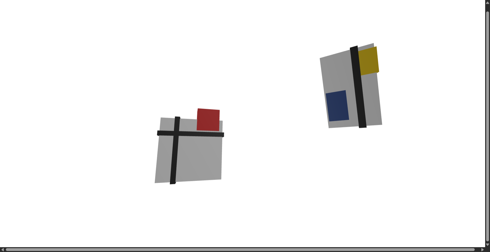

# Creative Coding I

Jonathan Ho \| jonathan.g.ho@filmuniversitaet.de
Prof. Dr. Lena Gieseke \| l.gieseke@filmuniversitaet.de  \| Film University Babelsberg KONRAD WOLF
  


# Session 03 - Space (10 points)

Please complete this session by January 28th. Completing the session should take < 5h.  


- [Creative Coding I](#creative-coding-i)
- [Session 03 - Space (10 points)](#session-03---space-10-points)
  - [Local Installation](#local-installation)
    - [Task 03.01 - Your First Scene](#task-0301---your-first-scene)
  - [three.js](#threejs)
    - [Task 03.02 - Local Project Setup](#task-0302---local-project-setup)
    - [Task 03.03 - Your First Scene](#task-0303---your-first-scene)
  - [Learnings](#learnings)


In this session we are dealing with the topic of _space_ and what types of virtual spaces we are working with. In terms of tech, this session introduces you to the JavaScript library [`Threejs`](https://threejs.org/), which is a good choice if you want to build 3D scenes in a browser.

## Local Installation

### Task 03.01 - Your First Scene

* [Install node, nvm and npm](https://nodejs.org/en/download)
* Verify a correct installation with executing `node -v` and `npm -v` in the terminal

*Submission:* -

## three.js

### Task 03.02 - Local Project Setup

Task 03.02 should be developed with a proper local installation. For that you can follow these steps in a terminal:

* Create a project folder
    * Either manually or in the terminal with `mkdir foldername`
* With the terminal navigate into the folder you just created and execute:
    * `npm init -y`
    * `npm install three vite`
* In `package.json` add line `"dev": "vite",` by changing the `"scripts": {...}` entry to:

```
  "scripts": {
    "dev": "vite",
    "test": "echo \"Error: no test specified\" && exit 1"
  },
```
* Create a `index.html` and a `scene.js`
* Add to `index.html`:

```html
<!DOCTYPE html>
<html>
  <head>
    <meta charset="UTF-8" />
    <title>Hello three.js!</title>
    <style>
        body { margin: 0; }
    </style>
  </head>

  <body>
    <canvas id="canvasThree"></canvas>
    <script type="module" src="scene.js"></script> 
  </body>
</html>
```
* Complete `Task 03.03` in `scene.js`

### Task 03.03 - Your First Scene

Build a three dimensional, geometric scene. With geometric I mean that the scene should focus on abstract geometry - also think *sculptural*. Remember: exceptional creativity often emerges out of constraints and refrainment 😎. You could (but don't have to) find inspiration in the following art work. 


  
[[Composition A, Piet Mondriaan, 1923]](https://www.wikiart.org/de/piet-mondrian/composition-a-1923) 

  
[[Several Circles, Wassily Kandinsky, 1926]](https://en.wikipedia.org/wiki/File:Vassily_Kandinsky,_1926_-_Several_Circles,_Gugg_0910_25.jpg)

  
[[Hadia geometria 36 – Alphabet 1, Mária Balážová, 1956]](https://www.1stdibs.com/art/prints-works-on-paper/abstract-prints-works-on-paper/yaacov-agam-thanksgiving/id-a_13123922/) 

  
[[ Drawing #220, Zanis Waldheims, 1969]](https://post.moma.org/zanis-waldheims/) 

  
[[Thanksgiving, Yaacov Agam, 1980]](https://www.1stdibs.com/art/prints-works-on-paper/abstract-prints-works-on-paper/yaacov-agam-thanksgiving/id-a_13123922/) 


  
[[Wall Drawing #564, Sol LeWitt, 1988]](https://www.nytimes.com/2013/09/06/arts/design/sol-lewitt.html) 

  
[[Dürer, Pair Impair A, Vera Molnar, 2021]](https://www.apollonia-art-exchanges.com/en/vera-molnar/) 


<br >

> How to translate the above 2D concepts and aesthetics into 3D space?  
  
> How to give the above abstractions an 3D embodiment?  
  
> How to merge 2D and 3D?
   
> How about using time as an creative tool? Could there be movement?

<br >

  
[[The Moving Moment When I Went To The Universe, Yayoi Kusama, 2018]](https://ocula.com/art-galleries/victoria-miro-gallery/exhibitions/yayoi-kusama/)  

---

For this task there is no need to go beyond the three.js basic elements that we have discussed in class. The scene should be navigable with (e.g., a simple orbit control but feel free to do something different) but other than that the scene should not include any interactions.

*Note:* If you have previous experience with three.js and consider yourself a proficent programmer, I expect you to still challenge yourself technically with this exercise as well as completing a polished result.
  

*Submission*: Link in your markdown submission file at least one result image or video of your work. Also, submit the required source files, and your package.json for me to `npm install` and `npm run` your project. If your are using a different environment than npm, let me know which steps to follow and make sure that the required steps to run your project are **easy** and **fast** (any setup that takes more than 5 minutes for me to re-create or need heavy installations, I am most likely not doing).

  
Trapped with Mondrian

Folder: 
sub_03_dietze

Video and alternative download:
https://owncloud.gwdg.de/index.php/s/hFHGj80hY0lFZMN


## Learnings

Please summarize your personal learnings. What was challenging for you in this session? How did you challenge yourself?

*Submission*: 

Three JS is challenging in the sense, that a the basic setup requires commands, pre installed package managers and importing packages you need. Working in multiple documents which reference each other felt like a huge step up from previously working with p5. 

I was able to offload some of the creation of the 3d models to Chat-GPT, by placing cubes In spaces, giving it my script and describing how I want three-dimensional representations of Mondrian's paintings in those places. 


---

Write and link all task results in a copy of this file. Submit your copy as `cc1_ws2526_XX_lastname.md` in your assignments' folder.

Please add the following header at the beginning of your Markdown file:

```md
---
layout: default
title: Homework
nav_exclude: true
---
```

---


**Happy Three Dimensioning!**
