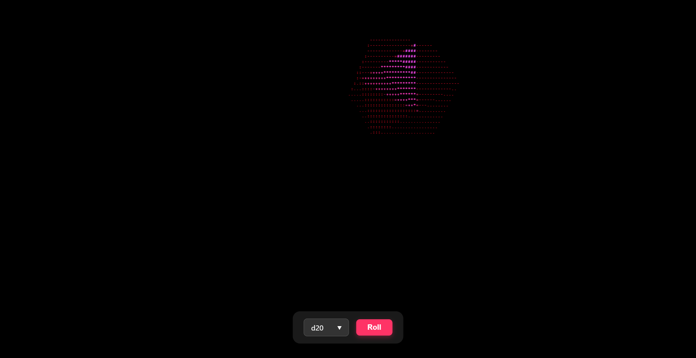
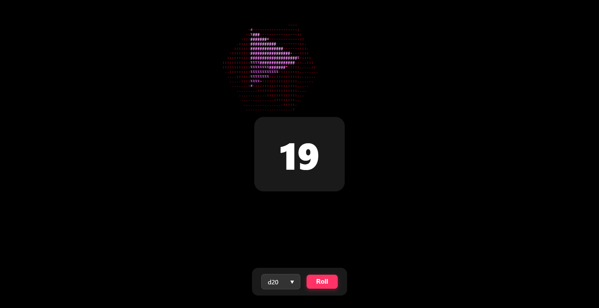

# Creative Coding I

Jonathan Ho \| jonathan.g.ho@filmuniversitaet.de  
Prof. Dr. Lena Gieseke \| l.gieseke@filmuniversitaet.de \| Film University Babelsberg KONRAD WOLF

# Session 05 - Systems (55 points)

Please complete this session by February 28th. Completing the session should take < 40h.

- [Creative Coding I](#creative-coding-i)
- [Session 05 - Systems (55 points)](#session-05---systems-55-points)
  - [Task 05.01 - The Final Project](#task-0501---the-final-project)
- [Dicy Roll](#dicy-roll)
  - [Files](#files)
  - [Details](#details)
    - [What is it?](#what-is-it)
    - [How did I come to the Idea?](#how-did-i-come-to-the-idea)
    - [Process](#process)
    - [Learnings \& Challenging Myself](#learnings--challenging-myself)
    - [Future Plans](#future-plans)
    - [Reflection on the entire course](#reflection-on-the-entire-course)
  - [Task 05.02 - Feedback](#task-0502---feedback)
  - [Learnings](#learnings)

Our last topic is _systems_. We are done with the class and hopefully from here on you have enough coding competencies and algorithmic thinking developed that you can build more complex systems - by using code, nodes, hardware... Also, hopefully you, yourself, can further evolve with what you have learned from this class (🐛 -> 🦋).

## Task 05.01 - The Final Project

The final project is an individually chosen project.

_Maybe a portfolio page?_ 👑

_Maybe something useless?_ 😁

You can do whatever you want but your project must make use of text-based programming. It can also be an experiment, part of a larger project, work in progress, or a learning path. Ideally it should be something online, but this is not a hard requirement. You don't need to submit a project plan beforehand. However, I am open to discuss your plan with me in advance.

The time dedicated to the final project is ~40h.

The official work period for the final assignment is Feb. 1st - Feb. 28th. The deadline for the final project is February, 28th.

- The deadline for the final project is strict and for a late submission, I reduce **15% of the total points**.
- If you are sick within the official work period, you can get a deadline extension based on a doctor's note ("Attest"). You must hand in the Attest within 3 days.

As submission, I require

- a description
- the source code
- a link to the build / online deployment or such, and
- at least one representative image.

Submit your code in your assignment folder as assignment `05` or add a link there to where to find the code.

# Dicy Roll
---
Dicy Roll is a website that lets you select standard roleplaying dice and it outputs a corresponding number that is in the range of the dice that you picked, additionally it plays an animation of the corresponding dice rolling over your screen represented in ASCII art.

---





## Files

Link: 
https://dicy-roll.vercel.app/

Folder: 
sub_05_dietze

Video and alternative download:
https://owncloud.gwdg.de/index.php/s/igGR29fwrjX9R1C


## Details

### What is it?
Dicy Roll is a pretty dice roller  website. 

When you arrive to your pen and paper rollplaying session, let’s say your playing D&D with your friends, you reach into your backpack and … OH NO!!! You forgot your dice! Susan isn’t gonna let you borrow any of her dice anymore… at least not since you ate the pink one, thinking it was candy. 

But no need to worry, there is an app for that!

Simply whip out your tower pc, smart fridge or phone and go to https://dicy-roll.vercel.app/ set which dice you want and press roll. It has all the dice you need, even the bad ones. 

It also has pretty animations and takes as long as rolling a real dice. The d100 really takes it’s sweet time. In this way it’s even better than the stupid, no good, very bad dice roller google has made. No pretty animation, not even 3d and way to quick…Yuck!

Disclaimer: Dicy Roll ©®™ Corp. Ltd. is not responsible for any character deaths, failed checks or broken electronic devices resulting from such events.


### How did I come to the Idea?
I initially wanted to create something with a shader so experimented with ASCII shaders and simple 3d shapes. When I looked at my first draft I saw the shapes displayed in numbers and had the association with D&D dice.  Then I had the Idea of combining the minimalistic aesthetic with a minimalistic dice roller. 

Here is a little sketch of what I then created as a rough prototype:


### Process 
After my first attempt and the decision to create a dice roller I started over. 

This time I planed more ahead. I first talked with friends for recommendations of how I should approach the project. My key takeaway from this was working with with TypeScript, because of it’s better defined variables and generally better auto complete suggestions. 

Another recommendation I got was to work directly with a Vite to Vercel integration, so I could test the project quickly and easily. At that point, I was already hoping that the final result would run on mobile devices, which it currently does.

After that I discussed my plans with Gemini on how I would approach the project. 

After that I had an list  for what features to integrate and in what order:

- 3d model creation
- 3d model selector for user
- rolling animation/ interaction
- Optional: actuall physics simulation
- Number request from roll
- lil gui integration

And even though it was the Idea I started with:

- Optional: ASCII filter

And that is the order I worked through it. 

I let Chat-GPT create the 3D models, I just wrote code that would display one model. I had a few problems with the d10 but I got them worked out. 

Then I made a model selection (at this point with lil-gui) so the user could change the model.

I looked into a few possible physics simulations for Three, Gemini actually recommended something else but I found a comprehensive tutorial for Cannon.js which had exactly an example for falling and rolling. If I wouldn’t have found that I would have probably just used a fixed animation which randomly rotates its beginning axis so it would have always looked like a unique dice roll. 

When I tired to use AI to integrate a feature in which the actual dice roll determined what number the user gets, I quickly found out, that with little comprehension of the physics integration the results weren’t truly random. So I scrapped that and now the code gives out a random number when the speed of the dice slows down significantly as if it had rolled and landed on a number. I also added borders (because the dice kept rolling of screen) and used Claude to connect those to the screen ratio for different resolutions (like on mobile). 

At this point I tried using Gemini recommendations to make lil gui more beautiful which I then scrapped for rather rewriting the interaction with way cleaner html. 

Here is the point were I felt like I was technically done with the project but I still wanted to include the ASCII shader. In this process I manly used Claude for debugging stretched characters and making everything look clean. First the 3d Dice is rendered, then the shader divides the screen in grids and then this outputs a limited selection of ASCII characters. For visual clarity I reduced the number of possible characters to a minimum. 

In this entire process I  asked Chat-GPT, Gemini and Claude for help, to integrate features, to fix bugs and possible additions.

### Learnings & Challenging Myself

Learnings in this project:

- Setting priorities
- Killing key aspects I planed with if there is a better solution (lil gui, physics influencing the number, shifting the focus away from ASCII as the first thing)
- The best look isn’t achieved by more complexity, rather simplicity
- Iteration is king and therefor everything that optimizes quick testing should be first priority (Vite to Vercel integration)

Big general learnings for me were:

- Generally coding in Three.js
- New ways to structure projects with AI
- If I am a single person, make AI mimic my assistant/reviewer/Instructor
- Sometimes starting over is faster then fixing
- Randomly starting and stumbling into problems is still helpful to understand and “fail faster”

Challenges:

- Cocreating with AI but still maintaining an overview
- Working in more separate documents than before (it also partially simplifies but I perceived it as a challenge)
- Not being sure how the final result will turn out whilst working
- Removing features after I had already integrated them at so many points
- Working with HTML/CSS
- Wanting to change one little thing the next day and no longer being able to find it
- Generally working with shaders
- Knowing when I’m done

### Future Plans
Things I can add are integrations of rolling multiple dice, the user being able to change color, ASCII characters, contrast and general appearance of the Website. I just stopped where I have because adding those features just as extra buttons and selections could ruin the minimalistic feel I tried to keep with every design decision. In the future I am very much interested in adding those features and then maybe actually using the website in a pen and paper setting with friends.


### Reflection on the entire course


## Task 05.02 - Feedback

- How would you rate the difficulty of this class from 1 (far too easy) to 5 (far too difficult)?

    3

- How would you rate the amount of work you had to put into this class so far from 1 (no work at all) to 5 (far too much work)?

    4.5

- How much did you learn in the class and expanded your skill set, from 1 (I am the same) to 5 (learned a lot)?

    3

- How much did you enjoy working with p5, from 1 (hate it) to 5 (love it)?

    4

- How useful do you consider p5 for you, from 1 (don't need it) to 5 (will use it all the time)?


    3

- How much did you enjoy working with tree.js, from 1 (hate it) to 5 (love it)?

    2.5

- How useful do you consider tree.js for you, from 1 (don't need it) to 5 (will use it all the time)?

    4

- How much did you enjoy working with React, from 1 (hate it) to 5 (love it)?

    3

- How useful do you consider React for you, from 1 (don't need it) to 5 (will use it all the time)?

    3

- How much did you enjoy working on the exercise tasks, from 1 (hated it) to 5 (loved it)?

1.  4
2.  5
3.  2
4.  3
5.  4


- What do you think about the context expansions, e.g., the brief general discussions of certain topics?

    Very much usefull, but sometimes hard to comprehend in the limited timeframe we had. 

- Which one was your favorite topic, which one your least favorite?

I would generally say the easier ones with direct impact of what we where doing. More abstract concepts, which were hard to wrap your head around and weren’t directly useful in the projects we did didn’t really stick. 

- Was there a topic missing and if so which one?

I can really say if there was a topic missing. I can only say, if someone recommends a topic to cover it should replace another topic otherwise the information load becomes to much. 

- Please feel free to add any feedback you want to give!

I would have liked to work on our submissions/ final project  more in class but I know that we didn’t have the time for that. So I wish we have had more time to explore the topics. :)

I want more and I want to get better is probably a very good indicator that your class was very good and left a positive impact.


## Learnings

Please summarize your personal learnings of the final project and in regard to the whole course. What was challenging for you? How did you challenge yourself?

_Submission_: I put most of my learnings and challenges up in the script. 
I challenged myself by making my first real website and application. I  hope everything from this submission is fine. If I failed to include a necessary part in my GitHub upload, please refer to this link: in which is a full zip of my repo and a nice demo video:

https://owncloud.gwdg.de/index.php/s/igGR29fwrjX9R1C

---

Bye-bye


---

Write and link all task results in a copy of this file. Submit your copy as `cc1_ws2526_XX_lastname.md` in your assignments' folder.

Please add the following header at the beginning of your Markdown file:

```md
---
layout: default
title: Homework
nav_exclude: true
---
```

---

**Happy Evolving!**