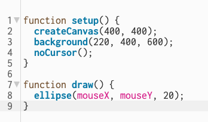

# Creative Coding I - Submissions 1

> Bonita von Gizycki | bonita.gizycki@filmuniversitaet.de

> Film University Babelsberg KONRAD WOLF
  

# Session 01 (20 points)

### Task 01.01

> *Are there any open questions regarding the syllabus and the administration of this course? If so, please mention them next class.*

/

## Topics

### Task 01.02

> *Please answer the following questions truthfully so that I can set up the lecture accordingly.*

* Overall, how would you rate your skill level of programming?
    * [ ] Never done it
    * [x] Novice
    * [ ] Intermediate
    * [ ] Advanced
    * [ ] God-like
* Have you used object-oriented programming before?
    * [x] I don't know what that is
    * [ ] I know the concept, but I have never implemented it
    * [ ] Yes
* Overall, how would you rate your skill level of using web technologies, e.g., have you used a local server setup?
    * [x] Never done it
    * [ ] Novice
    * [ ] Intermediate
    * [ ] Advanced
    * [ ] God-like
* How would you rate your skill level of working with Git and GitHub?
    * [ ] Never done it
    * [x] Novice
    * [ ] Intermediate
    * [ ] Advanced
    * [ ] God-like

### Task 01.02

> *Think a bit about your own personal motivation to learn creative coding. What would you like to do with coding and the topics in this class? What kind of final creative coding project are you envisioning after the first session?* 

* Coding in Blender, an introduction would be nice (I did geometry nodes, but never wrote code, I would like to know a bit more about that)
* Interactive/reactive generative visuals 
- Creating generative (interactive) Visuals - for V-Jaying
- understand general code language, logic and Architecture so I'll be able to code in every program, or at least have an easy start  (if they use a language which I don't know)

### Task 01.03

> *Find an existing creative coding project that you like. Coding needs to play a significant role for the project, also ideally it is web-based (this is not a hard requirement). Describe what you like about the project and why you think that the project represents creative coding.*

**Projekt:** Patatap  
**Link:** https://patatap.com

**Description:**

Patatap is an interactive web project where each keystroke generates a combination of sound and visual animation. Pressing the keys in the browser instantly creates sound and movement experiences—essentially a digital musical instrument combined with generative graphics.

**Why I like it:**

Because it very directly demonstrates how code can be used as a creative medium. Even simple keystrokes lead to complex visual and auditory results. The project combines **sound programming**, **animation**, and **user interaction**, and it's fun to experiment with.

**Why it's Creative Coding:**

Patatap is based entirely on web technologies such as HTML5, JavaScript, and the Web Audio API. The code doesn't simply create static content but generates **real-time audio and dynamic visuals** that react to user input. It's not a "web form" or an "information project" but an **artistic, interactive experience** created through algorithms and programming.

*Quelle*: https://www.creativeapplications.net/project/patatap-portable-animation-and-sound-kit-by-jonobr1-and-lullatone/?utm_source=chatgpt.com

## Task 01.04 - p5 With The Online Editor
I used the p5.js online editor to create a simple interactive sketch. I made a canvas where a circle follows the mouse.

### You can see my sketch here:
[Klick me!](https://editor.p5js.org/Boxnixta/full/t5LJUcVAG)

### Code snippet:

## Task 01.05 - The 10 PRINT pattern

### Notiz: Analyse der Logik 
+ Das Bild besteht aus einem Raster
+ In jedem Feld wird zufällig eine von zwei Linien gezeichnet
+ Das passiert Zeile für Zeile, Spalte für Spalte

[Code Insight](https://editor.p5js.org/Boxnixta/sketches/edyTSXngr)
## Task 01.06 - Greeting Card

> ### Open it in a new tab: [Open Sketch](https://editor.p5js.org/Boxnixta/full/54LQfRluB)

> ### p5.js Web Editor insight: [Open Insight](https://editor.p5js.org/Boxnixta/sketches/54LQfRluB)

  

## Learnings

+ Learned how setup() (runs once) and draw() (runs continuously) work in p5.js.

+ Learned to use conditions (if) to control when things happen (e.g., "A"s appear only while following the button).

+ Understood how variables, Booleans, and loops (for, while) work together for animations and interactions.

+ Challenging part: timing the "A" letters so they spawn correctly while following the button and stop when leaving.

+ Practiced creating interactive elements: button movement, particle effects, and responsive animations.

+ Learned that draw() acts as an automatic loop, so multiple animations can be managed without extra loops.

+ Explored random() to create dynamic visual effects like sweat drops and shaking buttons.

+ I also worked with ChatGPT to debug, optimize, and add features to my code.

---

