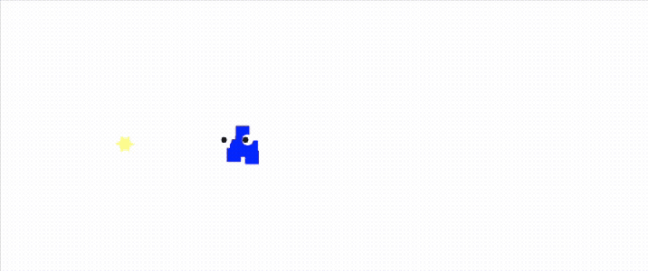
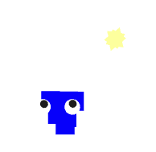
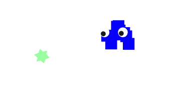
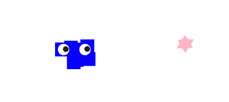

# Creative Coding I

> Bonita von Gizycki | bonita.gizycki@filmuniversitaet.de |
> Film University Babelsberg KONRAD WOLF

# Session 04 - Asynchronism / Space Again (15 points)

## JavaScript Functions & Asynchronism

### Task 04.01

- [Higher Order Functions](../../02_scripts/cc1_ws2526_04_javascript_script.md#higher-order-functions)
- [Anonymous Functions](../../02_scripts/cc1_ws2526_04_javascript_script.md#anonymous-functions)
- [Arrow Functions](../../02_scripts/cc1_ws2526_04_javascript_script.md#arrow-functions)
- [Asynchronism](../../02_scripts/cc1_ws2526_04_javascript_script.md#asynchronism)

_Submission:_ ✅

### Task 04.02 - Coding Practices

Reflect on your usage of resources and Machine Learning tools for coding.

- *What have you used and how has it served you?*
  - I used Claude/Gemini/ChatGPT for my homework. I often switched between these different models because some were better suited to certain queries than others. So I never actually wrote code using only one AI. For reviewing and memorizing the content, I used NotebookLM, among other things. I learned the most when I tackled the visual aesthetics and modified the code until I really liked the output. The AI ​​sometimes gave me very strange advice regarding the visual output, which I then ignored. This led me to modify the code itself a lot and gradually understand the architecture and functions. Of course, I also learned a lot from error messages. I essentially needed the AI ​​for the technical aspects and learned quite a lot without much effort. I always have the code explained to me and write down lots of notes.
- *Do you actually understand the code an ML tool has given to you (in case you have used any)?*
  - The AI ​​helped me understand code and find errors. Sometimes I still don't fully understand the code.
- *Would you be able to re-create it without any help?*
  - Without help, I couldn't yet recreate the code on my own.
- *What can you recommend?*
  - I want to practice more so I can write code more independently. I have the impression that if I do right in the beginning some hard tasks I learn a lot just by trying to do them.
- "How do you want to proceed?"
  - I just want to keep going like this. I've noticed that I'm already writing small parts of the code myself, simply because I know how the structure is. That's pretty amazing for me because at the beginning I didn't understand any of the coding languages ​​at all. I'll soon be taking the Three.js course we bought, and that will help me solidify some of the basics. Right now, I'm trying to fix errors myself, as far as I understand them. I think if I continue like this, I'll soon be able to do less with AI and more writing myself.

## Three.js

### Task 04.03 - Your Own Scene

### 🔗 **Live Demo:**  [here](https://boxnixta.github.io/russmaennchen-cursor/).

### 💻 **Source Code:**  [here](https://github.com/Boxnixta/russmaennchen-cursor.git).

 

  
   
  

  
  
  

  
  <em>Klick and move the cursor to enjoy the cuteness.</em>
 

  
  
  
   

## Learnings

>Please summarize your personal learnings. What was challenging for you in this session? How did you challenge yourself?

- Herausforderung: Dependency-Management & Versionen:

  - Ich habe gelernt, dass die Installation von Bibliotheken (wie @react-three/postprocessing) zu Versionskonflikten führen kann (E-RESOLVE Fehler).

    - Lösung: Die Verwendung von --legacy-peer-deps hilft, wenn Bibliotheken noch nicht für die allerneueste React-Version (v19) aktualisiert wurden.

- Herausforderung: Debugging in Three.js:

  - Eine der größten Hürden war, als die Szene plötzlich "weiß" oder "unsichtbar" wurde. Ich habe gelernt, die Browser-Konsole zu nutzen, um ReferenceErrors (wie fehlende React-Imports) zu finden.

  - Ich habe verstanden, dass Postprocessing-Effekte (wie Bloom) die gesamte Szene unsichtbar machen können, wenn ein Fehler im Setup vorliegt.

- Herausforderung: Mathematische 3D-Logik:

  - Das Erstellen einer organischen Form (Konpeitō-Sternchen) war schwierig. Ich habe gelernt, dass man Geometrien (Kegel) nicht nur platzieren, sondern auch ausrichten (quaternion, lookAt) muss, damit sie vom Zentrum wegzeigen.

  - Die Umrechnung von Maus-Pixeln in 3D-Koordinaten (viewport vs. feste Faktoren) war entscheidend für ein präzises "Maus-Gefühl".
- Asynchronität in der Praxis:

  - Durch die Arbeit mit useEffect und Event-Listenern habe ich praktisch gesehen, wie asynchroner Code (Mausbewegungen) in eine laufende Animation (useFrame) einfließt, ohne das Programm zu blockieren.

---