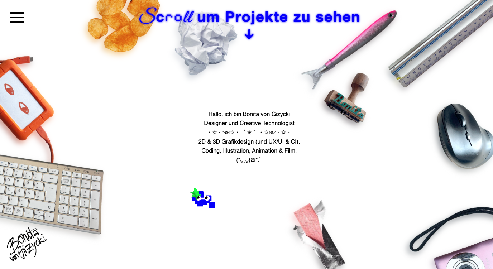
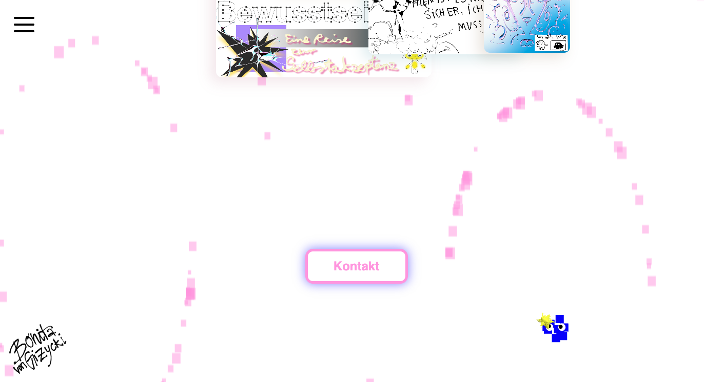

# Creative Coding I

> Bonita von Gizycki | bonita.gizycki@filmuniversitaet.de |
> Film University Babelsberg KONRAD WOLF

# Session 05 - Systems (55 points)

# 🐛 -> 🦋

## Task 05.01 - The Final Project

>The time dedicated to the final project is ~40h.

_Workingperiod: Feb. 1st - Feb. 28th. Deadline: February, 28th._
 
# Creative Coding Portfolio Website 👑

## Description

This is an interactive portfolio landingpage built with React, Vite, and Three.js. The project showcases a collection of creative coding projects through an engaging and dynamic user interface.

### 🔗 **Live Demo:**  [here](https://portfolio-nine-lyart-ad50iq4tj1.vercel.app/).

### 💻 **Source Code:**  [here](https://github.com/Boxnixta/CC1-FinalProject.git).

 

  
  

 

  
  
   

## Key Features

- **Custom 3D Cursor**: A particle-based cursor system with a halftone shader effect that responds to user interactions
- **Physics-based Card Layout**: Project cards are dynamically positioned with physics simulation, floating animations, and mutual repulsion to prevent overlaps
- **Interactive Hover Effects**: Cards scale up on hover with smooth transitions and display project previews (videos or image sequences)
- **Particle Background**: An interactive grain effect that responds to mouse movement, creating a playful desktop environment
- **Responsive Typography**: Mixed-font text effects using Great Vibes, Pixelify Sans, and Helvetica
- **Landing Page**: Features framed PNG graphics with mouse-repulsion physics effects

## Technologies Used

- **Frontend**: React 19, Vite 7
- **3D Graphics**: Three.js, React Three Fiber
- **Styling**: CSS-in-JS
- **Deployment**: Vercel

## Project Structure

The portfolio is organized into a landing page with interactive desktop items and a projects showcase section with 9 featured works across different categories (3D, graphic design, coding, illustration, etc.).

## Task 05.02 - Feedback

- How would you rate the difficulty of this class from 1 (far too easy) to 5 (far too difficult)?
  - 3
- How would you rate the amount of work you had to put into this class so far from 1 (no work at all) to 5 (far too much work)?
  - 4
- How much did you learn in the class and expanded your skill set, from 1 (I am the same) to 5 (learned a lot)?
  - 5
- How much did you enjoy working with p5, from 1 (hate it) to 5 (love it)?
  - 3
- How useful do you consider p5 for you, from 1 (don't need it) to 5 (will use it all the time)?
  - 2
- How much did you enjoy working with tree.js, from 1 (hate it) to 5 (love it)?
  - 5
- How useful do you consider tree.js for you, from 1 (don't need it) to 5 (will use it all the time)?
  - 5
- How much did you enjoy working with React, from 1 (hate it) to 5 (love it)?
  - 4
- How useful do you consider React for you, from 1 (don't need it) to 5 (will use it all the time)?
  - 4
- How much did you enjoy working on the exercise tasks, from 1 (hated it) to 5 (loved it)?
  - 3 I thought it was great, but there wasn't enough time. That's because we have three large deadlines within that period, and unfortunately, there just isn't enough time. And working under unpleasant time pressure isn't fun.
- What do you think about the context expansions, e.g., the brief general discussions of certain topics?
  - Like 
- Which one was your favorite topic, which one your least favorite?
  - Coding 3D stuff, materials, filters, and effects, and experimenting with them is great. Generally, animation in code is so much fun! There were moments when I got out of zone, mostly in the course when it was explicitly about understanding something I'd never done before. I learn better by doing, and in those moments I have to switch off, otherwise I think I don't understand it, when usually all I need is a simple example.
- Was there a topic missing and if so which one?
  - Coding in Blender
- Please feel free to add any feedback you want to give!
  - It was nice I liked it. Especially that we were allowed to ask all kind of questions, I am grateful that no question was portrayed as stupid.

## Learnings

Before, I couldn't code and had zero experience. Now I understand the architecture, and if I don't understand it, I know how to find out where things are. I think I've learned a good foundation. I've always tried to implement what I want directly and bombarded different AIs with questions. In the course, I wrote down everything that seemed important to me, but I can't really connect all the theory with practice yet. I think some "aha" moments will come with time.

---

Bye-bye

