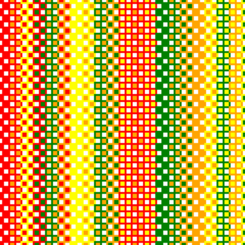
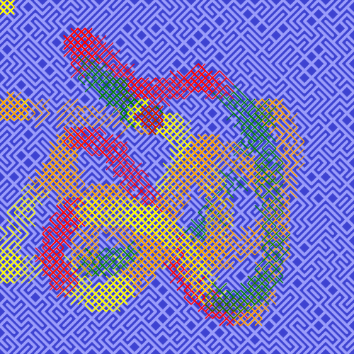

```md
---
layout: default
title: Homework
nav_exclude: true
---
```

# Creative Coding I

Prof. Dr. Lena Gieseke \| l.gieseke@filmuniversitaet.de  \| Film University Babelsberg KONRAD WOLF
  
# Session 01 (20 points)

### Task 01.01

Are there any open questions regarding the syllabus and the administration of this course? If so, please mention them next class.

*Submission*: No

## Task 01.02

* Overall, how would you rate your skill level of programming?
    * [ ] Never done it
    * [x] Novice
    * [ ] Intermediate
    * [ ] Advanced
    * [ ] God-like
* Have you used object-oriented programming before?
    * [ ] I don't know what that is
    * [x] I know the concept, but I have never implemented it
    * [ ] Yes
* Overall, how would you rate your skill level of using web technologies, e.g., have you used a local server setup?
    * [x] Never done it
    * [ ] Novice
    * [ ] Intermediate
    * [ ] Advanced
    * [ ] God-like
* How would you rate your skill level of working with Git and GitHub?
    * [ ] Never done it
    * [x] Novice
    * [ ] Intermediate
    * [ ] Advanced
    * [ ] God-like


* Are there any specific topics that would interest you in the context of this lecture and that haven't been mentioned so far? 

*Answer*: I would love to learn python and a bit of C++ for Unreal Engine.

* Is there anything else that you would like me to know regarding this class? 

*Answer*: Just time to adapt to new learnings


## Task 01.02

Think a bit about your own personal motivation to learn creative coding. What would you like to do with coding and the topics in this class? What kind of final creative coding project are you envisioning after the first session? 

*Answer*: I would be intereseted in developing Pipeline tools but I'm not sure about the final creative coding project yet.

## Task 01.03

Creative coding project that I like: 

*Answer*: While searching for creative coding examples, I found Shadertoy and a project called Bumped Sinusoidal Warp, which uses GLSL shader code to generate a dynamic, metallic-looking surface entirely in real time. I like this project because the visuals are created purely through mathematical algorithms and GPU programming, showing how code itself can be used as a powerful visual and artistic medium. [EXAMPLE](https://www.shadertoy.com/view/4l2XWK)


### Task 01.04 - p5 With The Online Editor

*Submission: 
P5JS: [FirstPattern](https://editor.p5js.org/KazDev/sketches/paj_N13wK)*

  


## Task 01.05 - The 10 PRINT pattern

*Submission: 
P5JS: [PRINT PATTERN](https://editor.p5js.org/KazDev/sketches/dbyNwtNtW)*

  


## Task 01.06 - Greeting Card

*This is my special Christmas [Greeting Card](https://editor.p5js.org/KazDev/sketches/romJyciHX)*

  

## Learnings

*While I struggled with ideas on the 10Print Pattern I had a straigh forward idea here, the main layout was quiet easy to do, the rest was a bit of a challange.
For the Snow i used a Tutorial from "TheCodingTrain".
For the check if all 3 items are the same Ii used AI but i marked it in the code where I used it. I just couldnt get it to work, that it checks which parts are scrubbed off.
I was unsure how to make the reset Button work so that took a lot of time and decided to do a combination of JS and CSS to make it work.
Sadly I moved through this project with a lot of time pressure, so i couldn't really keep that much of what i learned..
Other than that I still learned a lot of keeping the code clean, how the preload function works and how to check and work with the mouse Input*