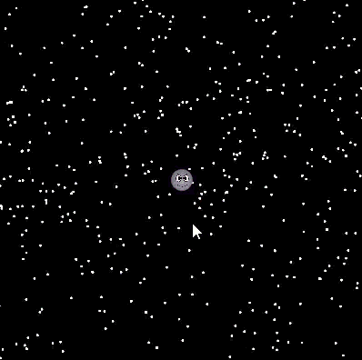

### Task 02.01 - _Coding_

> Circles!

> Description: This sketch draws grid of red circles with a white stroke which are animated in scale using a sine. With the slider you can manipulate the direction of the animation.

  

  🔗 <strong>Sketch:</strong> <a href="https://editor.p5js.org/KazLinDev/sketches/mdShFl9DI">AnimatedCircles</a>

### Task 02.02 - _Coding_

> Happiness.

> Description: This sketch draws a sphere in the middle which is textured with a smiling Moon texture and some points arround it. You are able to orbit arround the moon in 3D space with the help of WebGL.

  

  🔗 <strong>Sketch:</strong> <a href="https://editor.p5js.org/KazLinDev/sketches/zF5V9tbtH">HappyMoon</a>

### Task 02.03 - _Algorithmic Thinking_

Briefly reflect on how you implemented your creative idea. Did you apply algorithmic thinking and if so, how?

_Submission_: 
In both sketches, I implemented my ideas by defining simple rules for position, scale, and movement that are repeatedly applied through iteration.
In Sketch 1 I used time-based variables like "frameCount" and functions such as "sin" to drive my movement.
In my second Sketch I balanced randomness with constraints using random() within specific bounds.
For both Sketches I used for loops to manage thousands of stars and a 2D grid of circles, structuring complex systems with simple logic.

### Task 02.04 - _Creative Instructions_

Write instructions that are in themselves a creative output.

_Submission_: 

/* The 02:00 AM Work ethic */

while (output_quality > exhaustion_level) {
    commit_work(); // Keep the productive work going
}

if (exhaustion_slowly_takes_over) {
    create_save_point; 
    kill_process(CURRENT_WORK);
}

else {
    enter_sleep_mode(); 
    ignore_all_thoughts(); 
}

---

## Learnings

Please summarize your personal learnings. What was challenging for you in this session? How did you challenge yourself?

_Submission_: 

- I tried out a lot of different stuff that i have not done before such as working with WebGL the first time inside of p5js which worked out quiet good.
- I understood how to better structure the code and when and where to use let and const.
- I followed a tutorial before but i learned how to use FrameCount as a input of time for my animations and when and why to use the preload function.
- I also learned how to use an array in a three dimensional space.

---