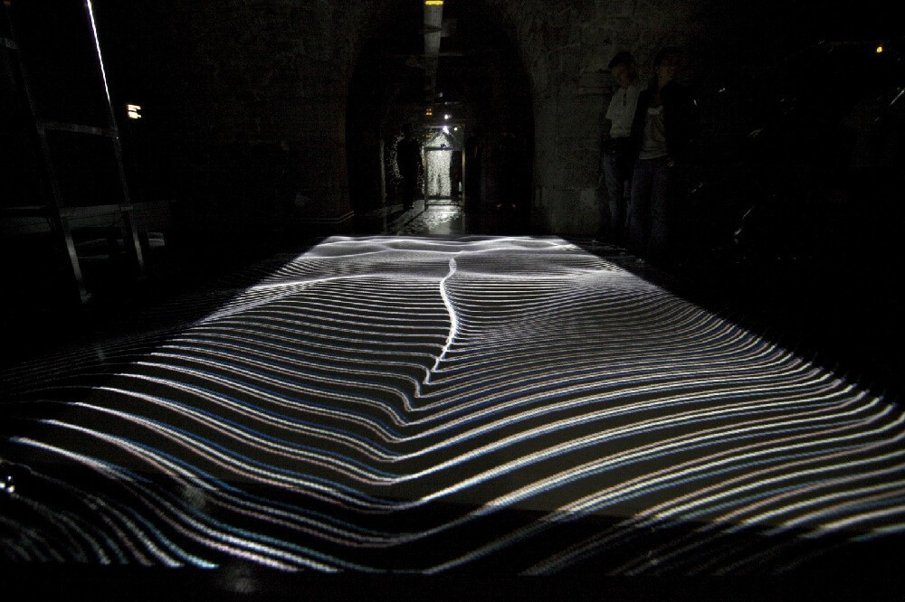
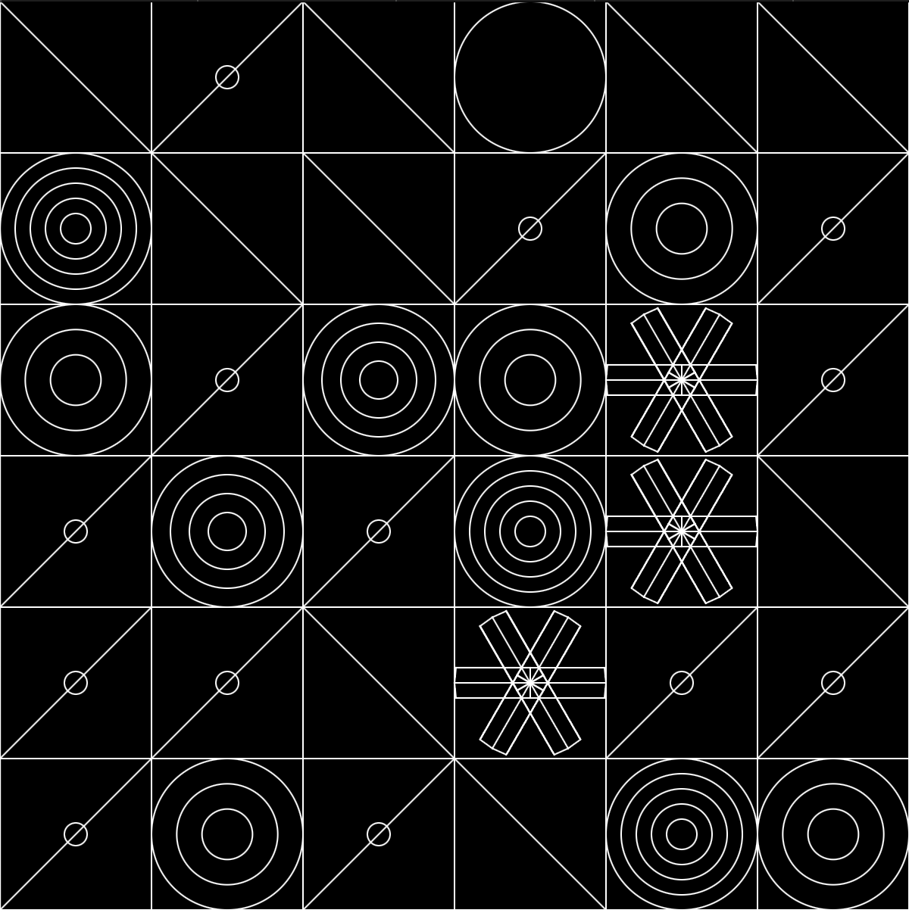
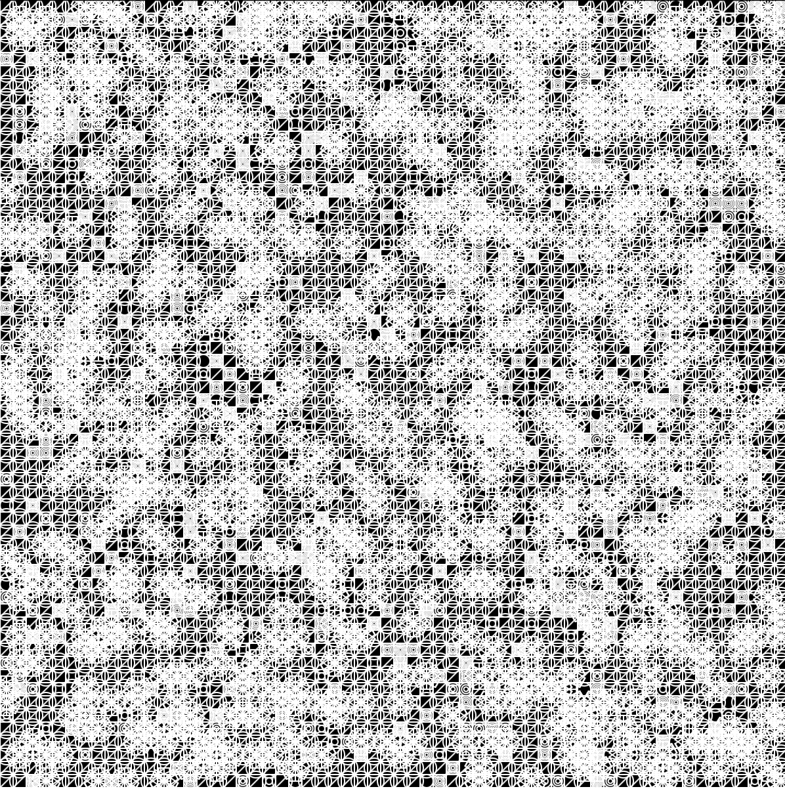
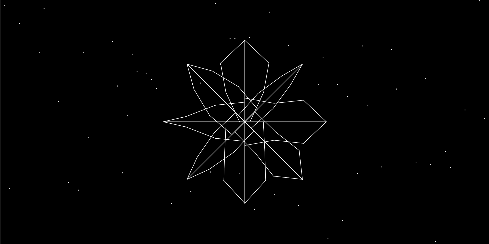
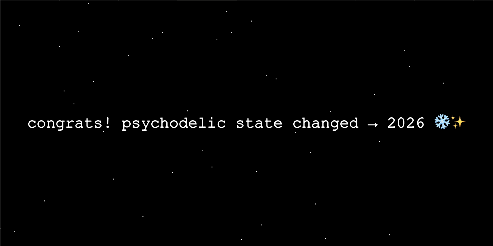

```md
---
layout: default
title: Homework
nav_exclude: true
---
```

# Session 01 (20 points)

### Task 01.02

Please answer the following questions truthfully so that I can set up the lecture accordingly.

- Overall, how would you rate your skill level of programming?
  - [ ] Never done it
  - [x] Novice
  - [ ] Intermediate
  - [ ] Advanced
  - [ ] God-like
- Have you used object-oriented programming before?
  - [ ] I don't know what that is
  - [x] I know the concept, but I have never implemented it
  - [ ] Yes
- Overall, how would you rate your skill level of using web technologies, e.g., have you used a local server setup?
  - [ ] Never done it
  - [ ] Novice
  - [x] Intermediate
  - [ ] Advanced
  - [ ] God-like
- How would you rate your skill level of working with Git and GitHub?
  - [ ] Never done it
  - [x] Novice
  - [ ] Intermediate
  - [ ] Advanced
  - [ ] God-like

<br>

### Task 01.02

*Think a bit about your own personal motivation to learn creative coding. What would you like to do with coding and the topics in this class? What kind of final creative coding project are you envisioning after the first session?*


In general, my biggest interest with creative coding is creating generative art to enhance my posibilities in live VJing and develop my own visual language. As I worked a lot with node-based software like TouchDesigner, I would also get a better understanding of the relationship of concrete words/syntax and moving images. Even though TouchDesigner offers so many possibilities, I sometimes find myself lacking a certain aesthetic when working with nodes. 
For example, I am very interested in morphing, distorted structures such as those that can be achieved with Jumpflood algorithms. With a better understanding of algorithms and creative coding, I hope to create more “individual” images and gain a foundation for writing shaders.

Also, I would aim to improve my general understanding of code so that I will be able to understand and use different coding languages.

One of my first ideas and associations for my final coding project is a study of fractals. I am very fascinated by generative geometry, but I didn't understand the mathematics behind fractals yet. I also would like to visualize growing structures and patterns. What would be especially interesting about fractals is the partly random or chaotic mutations inside the self-similar fractal structure.

<br>

### Task 01.03


**1. XYZT: Abstract Landscapes by Adrien M & Claire B**

[Adrien M & Claire B] https://www.am-cb.net/en




The project I choose is an interactive installation/ exhibition by Adrien M & Claire B. I really like their work and have already been inspired by it for my own projects. I am very interested in working with movement and space, and the investigation of how code can enter into dialogue with the body . XYZT might be not a typicall web-based cretive coding project, but it also represents creative coding because code is not a technical tool only, but the core creative medium. Algorithms define how light, space, and time interact, and create a dynamic respond to visitors’ movements and generate visuals in real time.

<br>

**2. Alexandra Cardenas**

I am also fascinated by real-time coding performances:

[Alexandra Cardenas live at Underground Institute Festival 2022](https://www.youtube.com/watch?v=WvKQo-IqGbs)


<br>

### Task 01.05 - The 10 PRINT pattern

*Link to sketch:*
https://editor.p5js.org/kathaapult/sketches/lDDZyyLGx




<br>

## Task 01.06 - Greeting Card

*Link to sketch:*
https://editor.p5js.org/kathaapult/sketches/zD-FB7TES





## Learnings

*Please summarize your personal learnings. What was challenging for you in this session? How did you challenge yourself?*
<br>
<br>

As already mentioned I am interested in generative structures thats why I first thought about building a recrusive snowflake. I skipped through those YouTube Tutorials:

<br>

**Coding Challenge #127: Brownian Tree Snowflake:**
https://www.youtube.com/watch?v=XUA8UREROYE&t=266s

**Infinite Snowflakes: The Basics of Random Generation with P5js**
https://www.youtube.com/watch?v=kUBvhFIwan8&t=201s

 <br>
 
 Even if I already worked with javaScript in a web context, I realized that using it for creative coding felt nevertheless different and more challenging for me. This is why I decided to start with a less complex approach in the second video. The video helped me to understand the basic process of the randomised snowflake by the tree steps:

 1. creating a line based on random points
 2. mirroring the line
 3. rotating it around the orgin of the coordinate system
 <br>

<br>

 The code in the tutorial did not feel intuitive for me, so I challenged myself to follow this three steps without copying the code. I used ChatGBT for logic questions and did some recherches in the p5.js example or tutorial sections e.g.

 - rotation
 - conditionals and interactivity
 - randomness
 
<br>

 **Help with Chat GBT:**

 * Pattern
    
    *drawCircleCluster - function (circles in circle)*

        function drawCircleCluster(x, y) {
        let cx = x + SPACING / 2;
        let cy = y + SPACING / 2;

        //circle dublicats
        let count = int(random(1, 6));
        let maxSize = 1;

        noFill();

        for (let i = 0; i < count; i++) {
          let size = SPACING * maxSize * (1 - i / count);
          circle(cx, cy, size);
        }
      }

 * Card

    *Snowflake*:

    In general, I used ChatGBT to understand the logical procedure (without writing code) -> Which steps do I have to follow to 
      
      - built the snowflake?
        
            especially function drawArm(): 

            function drawArm() {
              let centerY = 0;

              stroke(255);

              let startX = 0;
              let startY = centerY;

              let prevX = startX;
              let prevY = startY;

              let prevXmirror = startX;
              let prevYmirror = startY;

              for (let x = 0; x < armLength; x += 60) {
                strokeWeight(1);

                let y = centerY + random(-50, -10);
                let yMirror = 2 * centerY - y;

                //line
                point(x, y);
                line(prevX, prevY, x, y);

                //line mirrored
                point(x, yMirror);
                line(prevXmirror, prevYmirror, x, yMirror);

                prevX = x;
                prevY = y;

                prevXmirror = x;
                prevYmirror = yMirror;
              }

              let endX = armLength;
              let endY = centerY;

              point(endX, endY);

              line(prevX, prevY, endX, endY);
              line(endX, endY, startX, startY);
              line(prevXmirror, prevYmirror, endX, endY);

              strokeWeight(1);
              noFill();
              strokeWeight(6);
              //point(170, 300);
            }

            -> I got some problems here to figure out how the variables influence each other and how I connect the dots correctly

      - transform it?
    
    or 

      - where do I have to place my variables / functions?
      - debugging

<br>

**My main challenges:**

- sometimes logical thinking (keep it step by step) :D
- understanding the relations between setup()-function draw()-function, functions
  -> where/ in which do I have to initialize which variable or condition
- working with saved status / don't loose track over dynamic variables (e.g. function drawArm)

<br>

**My main learnings:**

- understanding of the generative loop syntax
- better understanding of the relation of the structure/functions in a sketch
- step by step is the best way for me to slowly develop a sketch! :-)
