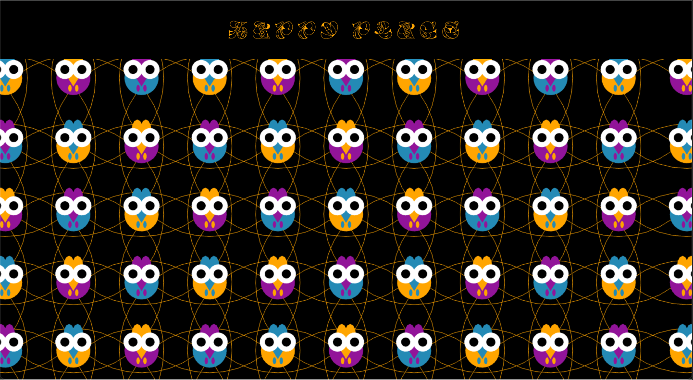

```md
---
layout: default
title: Homework
nav_exclude: true
---
```

---
# Session 02 - Instruction (10 points)

Please complete this session by January 21st. Since we did not cover local server setup yet, you can stop after the Completing the session should take < 5h.

In this session we are going to think about the topic of _instructions_ and what the different forms in which instructions can be given. In terms of tech this session is about continuing programming with p5 and getting some coding done!

- [Creative Coding I](#creative-coding-i)
- [Session 02 - Instruction (10 points)](#session-02---instruction-10-points) \* [Tools and Environments](#tools-and-environments)
  - [Instructions](#instructions)
    - [Task 02.01 - _Coding_](#task-0201---coding)
    - [Task 02.02 - _Coding_](#task-0202---coding)
    - [Task 02.03 - _Algorithmic Thinking_](#task-0203---algorithmic-thinking)
    - [Task 02.04 - _Creative Instructions_](#task-0204---creative-instructions)
  - [The Web](#the-web)
    - [Task 02.05 - _Working With a Local Server_](#task-0205---working-with-a-local-server)
  - [Learnings](#learnings)


### Task 02.01 - _Coding_

[Link to Preview Video](https://owncloud.gwdg.de/index.php/s/JkKJ2rEACLtJNID)

[Access GitHub Project](https://github.com/kathapult/cc1_ws2526_assignments_kleinhans.git)

> Circles!

*water circles*


### Task 02.02 - _Coding_


[Link to Preview Video](https://owncloud.gwdg.de/index.php/s/JkKJ2rEACLtJNID)

[Access GitHub Project](https://github.com/kathapult/cc1_ws2526_assignments_kleinhans.git)


> Happiness.

*my happy place*



<br>

### Task 02.03 - _Algorithmic Thinking_

Briefly reflect on how you implemented your creative idea. Did you apply algorithmic thinking and if so, how?

<br>

**circles:**

*( during this task i focused also to get familiar with Threejs)*

* inspirated by the "animation_lines Scene" i used an array of circles that is constantly growing, but the growing direction changes when it hits the boundary of the window:

  
      circles.forEach(circle => {
        const data = circle.userData;
        data.scale += data.speed * data.dir;
        circle.scale.setScalar(data.scale);
        const radius = geometry.parameters.radius * data.scale;

        if (radius >= width * 0.5 || radius >= height * 0.5) data.dir = -1;
        if (radius <= 0.2) data.dir = 1;
      });

* I implemented a constant shifting of the color by changing the hue value per frame and resetting it back to 0 when it reaches the maximal possible value of 1.

      hue += 0.001;   

      if (hue > 1) hue = 0;
      material.color.setHSL(hue, 0.5, 0.5);

<br>

**happiness:**

Here I dived a little bit more into algorithmic thinking. This scene is inspirated by the three color checkerboard and my creative instructions that I did before! 🥚

* using the 10 PRINT pattern again!
* using the cirles again but with any different boundary
* implemention of three different colors by using

      let pattern = (row + col) % 3;

### Task 02.04 - _Creative Instructions_

<br>

🐓 **Instructions to let chickens safe your mental health** 🐓

*This system assumes you like chickens!*

*This system also assumes you don't have chickens yet*

*do this every day at any time:*
  * Think of a happy chicken.
  * Think about at least three happy chickens living together in a species-appropriate environment.
  * Think about your current life situation: would there be physical space and time caring for this chicken?
    *
    if (space && commitment) < 100% -> search for chicken reels e.g. on instagram
        while watching makes you feel good -> scroll
        if dailyChickenDose = 1 -> quit 

    if (space + commitment) = 1 -> build a stable and get (at least three) chickens! 
        for each chicken choose a worthily name
        choose a time in the morning and the evening where you want to feed your chickens
        your status changed to "ChickenOwner"
    
<br>

*if your status reached ChickenOwner:*
  * think about your chickens several times a day!
  
    if currentTime = choosenTimeforFeeding -> go to the stable
    
    * feed your chickens and refresh the water
    * search for eggs
        if you found an egg -> pick it up and look for another egg
        repeat, until all eggs are picked up
    * check if all chickens are fine and healthy

  * at any time pick one of the following options

    * carefully pick up a chicken
      if the chicken does not protest -> cuddle
      if chicken is loosing a feather -> collect and store in your bag
      while chicken and you are happy -> repeat

      else quit
      rechoose an option or leave
    
    * sit down somewhere and watch your chicken
      if they are funny -> laugh
      take some videos for your memory
      while chicken and you are happy -> repeat
      
      else quit
      rechoose an option or leave

    
## Learnings

Please summarize your personal learnings. What was challenging for you in this session? How did you challenge yourself?

*challenge:*

* using & learning ThreeJs!
* trying out a simplex noise in the circles scene:

      const noise2D = createNoise2D();

* working with a orthogonal camera in the happiness scene

*learnings:*

* understanding the structure of a ThreeJs scene 
* setting up a scene and working on a local server
* understanding the relation between geometry, material and mesh (& it's syntax)
* how to use different shapes for creating e.g. a chicken and place them with responsive relations in the pattern 


After checking out some of the example scenes and writing the creative instructions I think I got a better understanding of algorithmical thinking so it became more intuitive!

