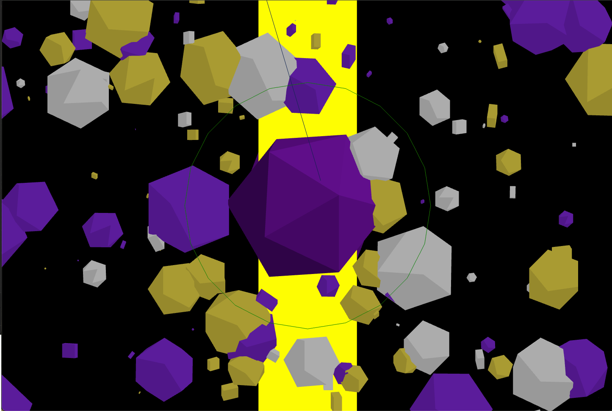

```md
---
layout: default
title: Homework
nav_exclude: true
---
```

## **---- still in progress! ----**
# Session 03 - Space (10 points)

### Task 03.03 - Your First Scene

[text](https://dustinpfister.github.io/2019/12/18/threejs-mesh-copy/)

Build a three dimensional, geometric scene. With geometric I mean that the scene should focus on abstract geometry - also think *sculptural*. Remember: exceptional creativity often emerges out of constraints and refrainment 😎. You could (but don't have to) find inspiration in the following art work. 

> How to translate the above 2D concepts and aesthetics into 3D space?  
  
> How to give the above abstractions an 3D embodiment?  
  
> How to merge 2D and 3D?
   
> How about using time as an creative tool? Could there be movement?

<br >





## Learnings

Please summarize your personal learnings. What was challenging for you in this session? How did you challenge yourself?


