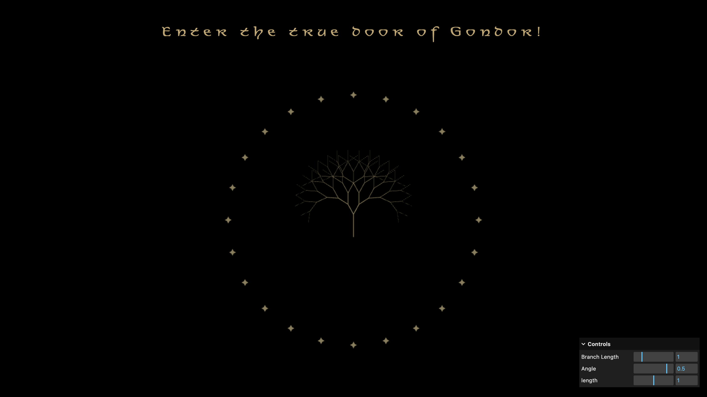

```md
---
layout: default
title: Homework
nav_exclude: true
---
```

# Session 04 - Asynchronism / Space Again (15 points)

Please complete this session by February 11th. Completing the session should take < 6h.

- [Creative Coding I](#creative-coding-i)
- [Session 04 - Asynchronism / Space Again (15 points)](#session-04---asynchronism--space-again-15-points)
  - [JavaScript Functions \& Asynchronism](#javascript-functions--asynchronism)
    - [Task 04.01](#task-0401)
    - [Task 04.02 - Coding Practices](#task-0402---coding-practices)
  - [Three.js](#threejs)
    - [Task 04.03 - Your Own Scene](#task-0403---your-own-scene)
  - [Learnings](#learnings)

In this session we are dealing with the topic of _asynchronism_, where we encounter it in every day life and what it means for us as humans. In terms of tech, this session introduces you to some web-specific JavaScript functionality and syntax, which we will need in the upcoming sessions.

## JavaScript Functions & Asynchronism

### Task 04.01

Re-cap the sections in the script regarding higher order functions and their different syntax formats. As a beginner you can skip the more advanced sections that we haven't covered in class:

- [Higher Order Functions](../../02_scripts/cc1_ws2526_04_javascript_script.md#higher-order-functions)
- [Anonymous Functions](../../02_scripts/cc1_ws2526_04_javascript_script.md#anonymous-functions)
- [Arrow Functions](../../02_scripts/cc1_ws2526_04_javascript_script.md#arrow-functions)
- [Asynchronism](../../02_scripts/cc1_ws2526_04_javascript_script.md#asynchronism)

At the very least make sure that you understand the underlying functionality and that you will be able to work with the syntax when given to you, e.g., from a framework.

If you are more advanced, make sure that your understand Closures, Promises and Async and Await.

_Submission:_ -

### Task 04.02 - Coding Practices

Reflect on your usage of resources and Machine Learning tools for coding.

- What have you used and how has it served you?
- Do you actually understand the code an ML tool has given to you (in case you have used any)?
- Would you be able to re-create it without any help?
- What can you recommend?
- How do you want to proceed?

* Chat GBT
  * explaining given code step by step
  * explaining basic logical thinking / steps / instructions without giving the code
  * syntax problems
  * debugging (when I can not figure it out with the browsers console alone)
  * sometimes for "high-effort" work that would be usually need some simple try and errors (-> like replacing the positions of the differnet shapes to responsive relations in my 02-happiness Scene - I understood the principle but finding our the exact values is just a lot of rearranging)

  * I think now after three assigments of creative coding I got some practice that I can rebuild basic things by myself or at least with the orientation of my earlier codes
  * after a couple of usages recreating on my own gets easier! -> but it feels very important to try to understand, otherwise there will not be a learning process 

  
  *Recommendations:*
  * not to ask for final code but asking for an explaination of the approach / starting point / specific problems/syntax

  *Proceed:* 
  * I would like to copy as less as possible from ML 
  * look more into example files / online shared code instead
  

## Three.js

### Task 04.03 - Your Own Scene

Create a Three.js scene up to your liking. There are no constraints for what the scene should be. The result should be polished and will be graded on concept, form / design and implementation quality.

You are required to use additional functionality that you haven't yet used last week. Check the [three.js manual](https://threejs.org/docs/index.html#manual/en/introduction/Creating-a-scene) or [the examples](https://threejs.org/examples/#webgl_animation_keyframes) for inspiration.

<br>

_Submission_: **The door of Gondor**

[Link to my Git Repository (Folder cc1_ws2526_04_kleinhans)](https://github.com/kathapult/cc1_ws2526_assignments_kleinhans.git)

[Direct Link to Folder](https://github.com/kathapult/cc1_ws2526_assignments_kleinhans/tree/main/cc1_ws2526_04_kleinhans)

[Link to Preview Video ](https://owncloud.gwdg.de/index.php/s/kxTc7OCOBxS2Da6)




## Learnings

In this lesson I focused on the creation of the recruisive tree and understanding (or at least trying to understand) the maths behind it.
Besides this:

- creating instances
- working with click events


