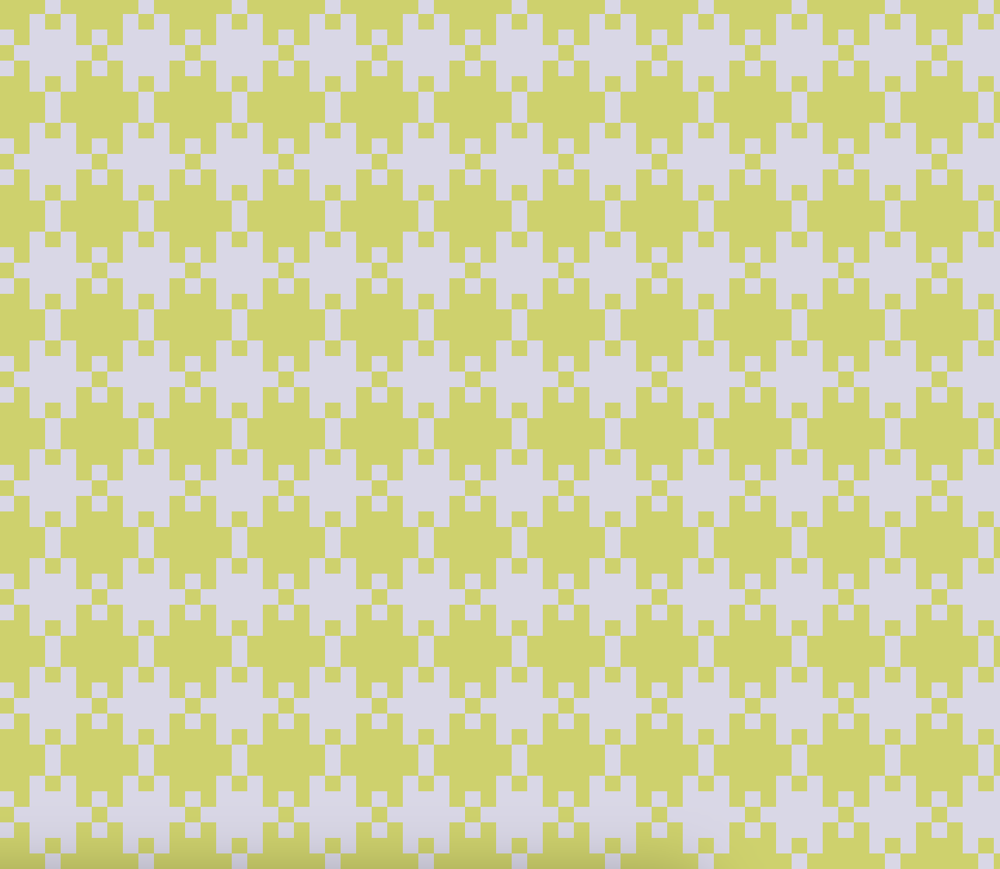

# Session 01 (20 points)
## Topics
### Task 01.02
* Overall, how would you rate your skill level of programming?
    * [ ] Never done it
    * [ ] Novice
    * [ ] Intermediate
    * [x] Advanced
    * [ ] God-like
* Have you used object-oriented programming before?
    * [ ] I don't know what that is
    * [ ] I know the concept, but I have never implemented it
    * [x] Yes
* Overall, how would you rate your skill level of using web technologies, e.g., have you used a local server setup?
    * [ ] Never done it
    * [ ] Novice
    * [ ] Intermediate
    * [x] Advanced
    * [ ] God-like
* How would you rate your skill level of working with Git and GitHub?
    * [ ] Never done it
    * [ ] Novice
    * [ ] Intermediate
    * [x] Advanced
    * [ ] God-like

## Introduction
### Task 01.02 
_Think a bit about your own personal motivation to learn creative coding. What would you like to do with coding and the topics in this class? What kind of final creative coding project are you envisioning after the first session?_

I have prior experience in creative coding as well as in programming more broadly, so my motivation for participating in this course is to gain creative inspiration and to re-engage with sketch-based exploration in Processing. I am interested in using creative coding primarily as a conceptual and experimental tool rather than as a means of technical skill acquisition.

As a final project I could imagine a website portfolio that could incorporate interactive or animated UI elements inspired by creative coding or maybe also something related to shaders (TBD, also unsure if we'll cover those) or something that visualises a dataset. 

### Task 01.03  - Personal Motivation

It's not one specific project, but one creative coding artist I find particularly interesting is Ryoji Ikeda, for example projects [_datamatics_](https://www.ryojiikeda.com/project/datamatics/) and [_test pattern_](https://www.ryojiikeda.com/project/testpattern/). Both of these projects use code to translate large sets of numerical data into very minimal, high-contrast visual and sound compositions. What I like about these is that the visuals are shaped by both the  underlying data distribution and by the design choices for the creative coding part.

### Task 01.04 - p5 With The Online Editor
✅

### Task 01.05 - The 10 PRINT pattern

➡️ [Sketch with just the pattern](https://editor.p5js.org/axlindt/sketches/e4asfGfeV)

➡️ [Sketch with pattern + lens warp effect added to it](https://editor.p5js.org/axlindt/sketches/vTAqFZYmz)

## Task 01.06 - Greeting Card

➡️ [Christmas card sketch](https://editor.p5js.org/axlindt/sketches/5bqMsuBkH)

  

## Learnings

- For the pattern sketch I wanted to do something that also had a fun user interaction, so I added this lens effect on top of this rather basic pattern

- I challenged myself to implement something realistic-looking for the Christmas card and went with this animated knit pattern

