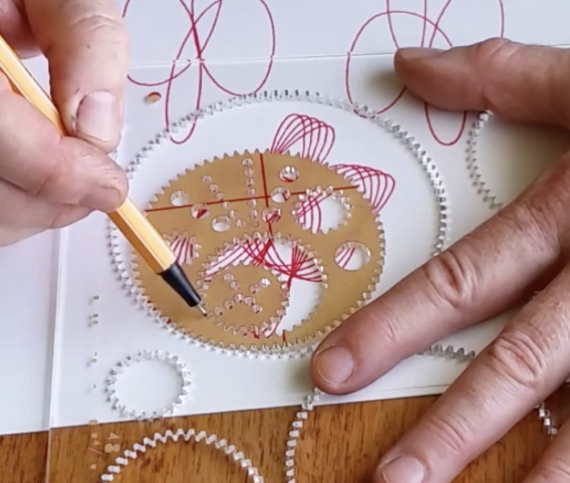
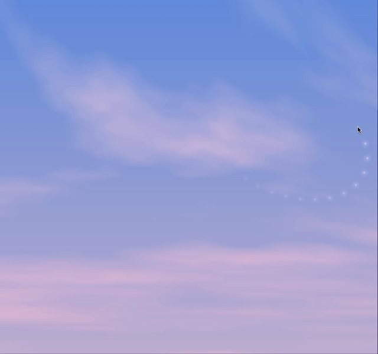

# Session 02 - Instruction (10 points)


## Task 02.01 - Coding: Circles

🔗 **Sketch:** [Irregular Spirograph](https://editor.p5js.org/axlindt/sketches/rcLYipX9T)

This sketch is built from three circles nested within each other:
a large fixed circle, a rolling inner circle, and a smaller satellite circle carrying the pen.
As these circles rotate at different ratios, their combined motion forms irregular circular patterns.
Radii, rotation ratios, and spin divisors are randomized on each reset, producing dense, non-repeating paths.

<p align="center">
  
</p>

Spirograph IRL:

<p align="center">
  
</p>

## Task 02.02 - Coding: Happiness

🔗 **Sketch:** [Glowing Light Chain in the Sky](https://editor.p5js.org/axlindt/sketches/6HNRYWFgg)

Happiness is expressed through softness, light, and interaction.
A calm, pastel sky is generated algorithmically using layered noise, while a glowing chain of light follows the cursor.
The contrast between the static sky and the playful, responsive glow creates a gentle and uplifting experience.

<p align="center">
  
</p>


## Task 02.03 - Algorithmic Thinking

- In both sketches, instead of drawing shapes directly, I focused on describing processes (movement, position, layering) and letting the computer execute them. Randomness is only used to set starting values, while the visuals are created by following the same steps repeatedly.
- In the spirograph sketch, I defined rules for how three circles rotate and interact, then repeated those calculations thousands of times to generate the pattern.
- In the happiness sketch, I used two different instruction loops: one to generate the sky once, and one that updates the glowing chain every frame according to the cursor movement.


## Task 02.04 - Creative Instructions

```
~ Exercise in Temporary Ownership ~

1. Pick up something that does not belong to you
   (The ground owns many things)

2. Hold it until it becomes yours in your mind
      Notice the exact moment when this happens
         If it does not, think of all the great things you could do with it

3. Reject your claim
      Say no, silently or out loud

4. Put the object back down nearby

5. Leave
```


## Learnings
-  Learned how to create an algorithmic sky using layered noise
-  With the light chain in the sky sketch, I challenged myself by adding a new type of mouse interaction and making it feel soft and responsive 
- I replaced direct mouse input in the spirograph sketch with a small spiral motion, which was something new for me
- Writing clear creative instructions was harder than expected 