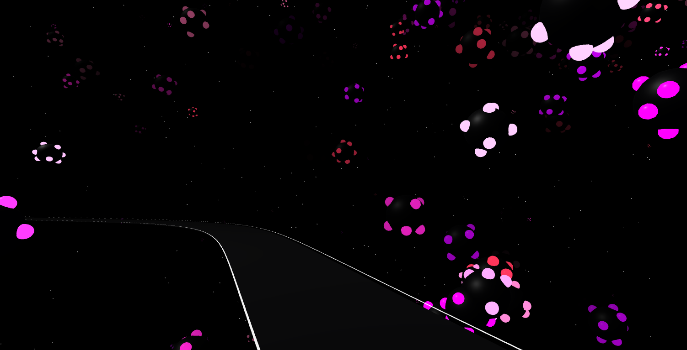
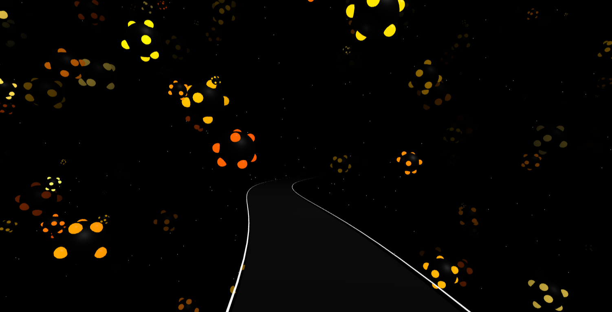
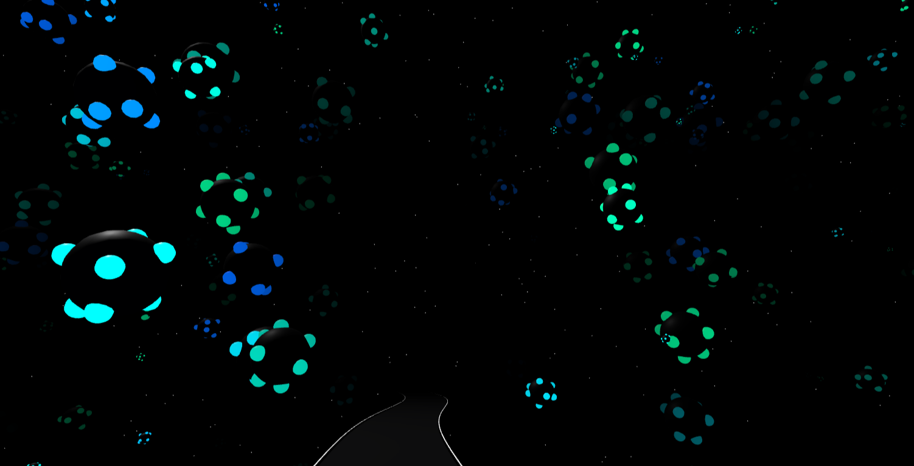

# Session 03 - Space (10 points)

## Task 03.03 - First Three.js Scene

🔗 **Live sketch:**  [Infinity Walkway](https://axlindt.github.io/web-based-sketches/sketch-1-infinity-walkway/)

💻 **Code:** Can be found [here](https://github.com/axlindt/web-based-sketches/tree/main/sketch-1-infinity-walkway).

📼 **Video:** A GIF is included below (the live version shows more detail)

 

  
   
  <em>Scroll-driven movement through the looping Infinity Walkway environment.</em>

*Infinity Walkway* is a scroll-driven, looping 3D environment built with Three.js that explores immersive, non-linear space through simple geometry and continuous movement. The visual language of the scene is inspired by *The Moving Moment When I Went To The Universe* (Yayoi Kusama, 2018), which was listed as a possible reference in the task description.

The viewer moves along a glowing path through three spatial zones defined by distinct color groups of floating spheres: red–pink, yellow–orange, and blue–green. The path forms a seamless loop—when the final zone is reached, the viewer returns to the beginning without a visible transition, creating the impression of an endless space.

Navigation is controlled entirely through scrolling, turning movement into a single, continuous gesture. This interaction was inspired by a website Maria shared earlier in the course ([aquarium.ru](https://www.aquarium.ru/en)) and served as an opportunity to explore scroll-based motion in Three.js.

Although the environment appears three-dimensional, it does not follow real-world spatial logic. The path always moves forward yet eventually leads back to the same zones. Fog, repetition, and lighting are used to limit visibility and structure space, while a static night-sky backdrop and gently animated, randomly distributed spheres reinforce a sense of scale and abstraction.

  
  
  
   
  <em>Three color-based spatial zones defining progression through the environment.</em>

## Learnings

- Since I had never used Three.js before, I gained an initial understanding of how it structures space through scene graphs, cameras, and grouped objects.  
- I learned how repetition, fog, scale, and density can be used to suggest infinite environments.  
- I explored how to design a seamless looping environment without visible transitions by studying the spatial control mechanism of [aquarium.ru](https://www.aquarium.ru/en) and experimenting with scroll input as a navigation method.  
- I learned how to structure a Three.js project for both local development and deployment via GitHub Pages 🙂  

