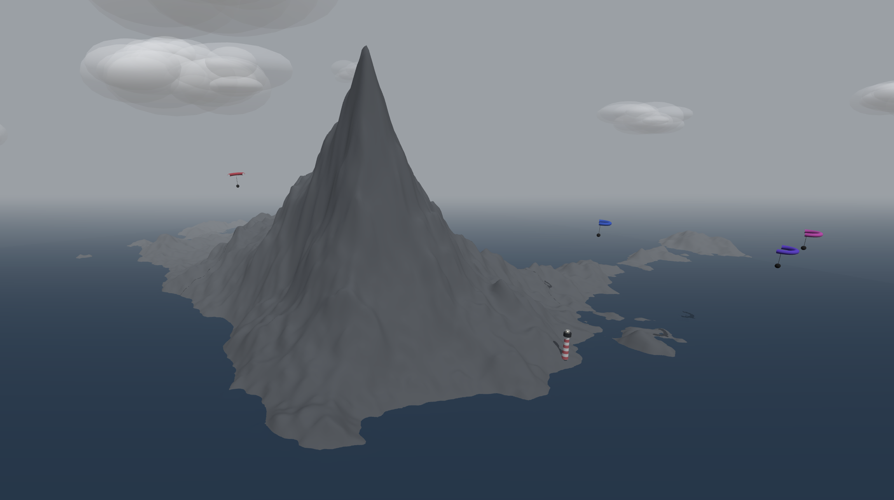

# Session 04 - Asynchronism / Space Again (15 points)

### Task 04.02 - Coding Practices

- **What have you used and how has it served you?**  
  I mainly used ChatGPT while working on this project. I used it to discuss ideas, structure larger systems, and debug specific problems. It helped me think through architecture decisions and saved time when I was stuck. 

- **Do you actually understand the code an ML tool has given to you?**  
  I understand the overall structure and logic, especially scene setup, animation loops, and object organization. For more mathematical parts like noise shaping, I needed to experiment and tweak values before I fully understood how they influenced the result. I wouldn’t say I understand every line, but I make sure I can explain what each part does before keeping it.

- **Would you be able to re-create it without any help?**  
  Not completely from memory. However, with documentation and enough time, I believe I could rebuild the main systems (terrain generation, tile repositioning, animation loop). The conceptual understanding is there, but I would need references for syntax details.

- **What can you recommend?**  
  I think ML tools are useful for accelerating the process and clarifying concepts, but they should not replace understanding. It’s important to modify, test, and simplify generated code instead of accepting it blindly.

- **How do you want to proceed?**  
  I will continue using ML tools as support, especially for debugging and structural questions, but rely on my own reasoning first. Regarding creative questions, I think it's never good to ask a LLM without having any own idea first to build upon, otherwise outputs can get boring pretty fast. 

### Task 04.03 - Your Own Scene

🔗 **Live sketch:**  [Patagonia Mountain](https://axlindt.github.io/web-based-sketches/sketch-3-patagonia-mountain/)

💻 **Code:** Can be found [here](https://github.com/axlindt/web-based-sketches/tree/main/sketch-3-patagonia-mountain).

📸 **Screenshot:**

For this task I created an gray-ish mountain environment surrounded by ocean, inspired by Patagonia landscapes.The core concept was

- A procedurally generated mountain massif using ridged noise
- Endless terrain created by dynamically repositioned tiles around the camera
- Vertical "skirts" on terrain edges to prevent seeing underneath the mesh
- A large animated ocean plane that follows the camera to simulate infinity
- Atmospheric fog for depth
- Fluffy volumetric-style clouds
- Multiple slow paragliders orbiting the massif :)
- A small red-and-white striped lighthouse with a light beacon

The terrain uses a ridged multifractal-style noise function to avoid soft hills and instead create sharper, more dramatic shapes. The paragliders move independently of the camera and orbit a fixed world anchor point. The lighthouse beam rotates continuously and subtly enhances the coastal atmosphere.

## Learnings

This week I tried to challenge myself by building a more natural-looking scene instead of something abstract. To get there, I had to understand how endless terrain actually works using tile repositioning, and how to hide the undersides of the meshes with geometry skirts so the illusion doesn’t break. I also learned more about ridged noise and how it creates sharper mountain forms compared to regular FBM noise.

What I found most difficult was making different animated elements look good together. The ocean, clouds, paragliders and lighthouse all move independently, and balancing their speed and scale so the scene feels calm and consistent took some adjustment.

I definitely learned that small parameter changes can completely change the feeling of a scene. This project made me more aware of how animated scenes work and how much iteration is needed to make them feel intentional rather than random.
