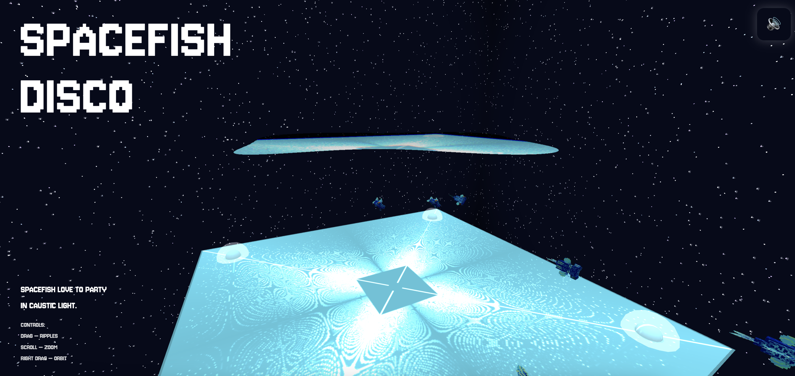
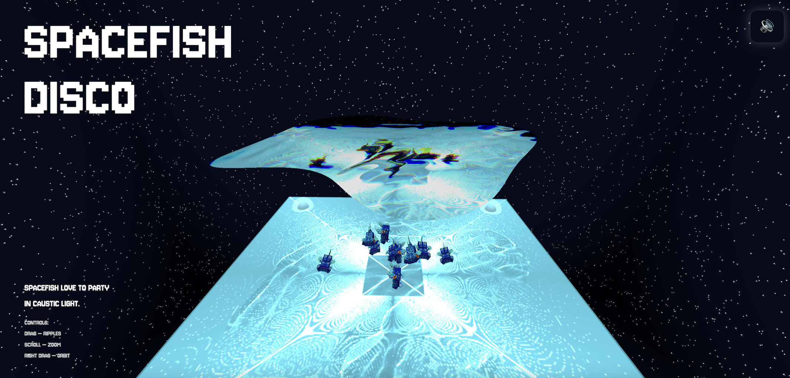

# Session 05 - Systems (55 points)

## Task 05.01 - The Final Project

🔗 **Live sketch:**  [Spacefish Disco](https://axlindt.github.io/web-based-sketches/sketch-4-spacefish-disco/)

💻 **Code:** Can be found [here](https://github.com/axlindt/web-based-sketches/tree/main/sketch-4-spacefish-disco/).

📸 **Screenshot:**

As a final project for this course I chose to go with something a little _useless_, but not really useless, because it was also a learning path for me and part of a larger project.

For my orientation project I want to look into computational caustics (i.e. refractive light patterns) and stylized versions of them. A while ago I found [this Three.js caustics package/repository](https://github.com/martinRenou/threejs-caustics/tree/master) which implements the classic [Evan Wallace real-time WebGL water caustics approach](https://medium.com/@evanwallace/rendering-realtime-caustics-in-webgl-2a99a29a0b2c), including the shaders needed to project caustics and extending it. I wanted to understand these shaders better for my orientation project and I found it quite interesting how this was implemented. The author extended Evan Wallace’s approach by allowing objects underwater to catch caustics. I didn’t actually use that feature here, but experimenting with the system helped me understand the shader pipeline much better.

I experimented with adjusting the shaders in different ways to understand them. The version I submitted allows for a different water shape than just a rectangle, and I removed the reflection of waves at the boundary. Instead, the waves “die” at the shore. Other than that, the core shader logic is mostly the original implementation, but I experimented quite a bit with the package while building this sketch.

I added mouse interaction logic, so dragging across the surface creates ripples. Concept-wise, I found it funny that the first trial with this package already looked like a surreal underwater dancefloor, so I leaned into that and turned it into a dancing ground for a spacey fish species. I added a simple generative skybox, changed the water shape to be irregular, looked for a fitting song on Freesound (which can optionally be turned on via a button), found a CC0 pixel-style fish model, loaded it into the sketch, and created a small swarm system for them. 

The fish only like to dance if we drag the water surface and create caustics on the dancefloor. If we stop interacting and the caustics disappear, they slowly lose interest and drift away again.

Assets used: [Music](https://freesound.org/people/Romariogrande/sounds/452141/), [Fish model](https://sketchfab.com/3d-models/bumplefish-2d1a22c9f5664aa09a06de424abff43e)

## Task 05.02 - Feedback

- **How would you rate the difficulty of this class from 1 (far too easy) to 5 (far too difficult)?**  
Technically for me probably a 1 (which was expected), but creatively more like a 3.

- **How would you rate the amount of work you had to put into this class so far from 1 (no work at all) to 5 (far too much work)?**  
On the lighter side, maybe a 2. Since my goal in joining the course was to get back into sketching with p5.js, I sometimes used the exercises as a starting point and then continued sketching beyond the actual task.

- **How much did you learn in the class and expand your skill set, from 1 (I am the same) to 5 (learned a lot)?**  
Probably a 3. I didn’t know three.js before and hadn’t written JavaScript in the last couple of years, so that was nice :)

- **How much did you enjoy working with p5, from 1 (hate it) to 5 (love it)?**  
4  

- **How useful do you consider p5 for you, from 1 (don't need it) to 5 (will use it all the time)?**  
3  

- **How much did you enjoy working with three.js, from 1 (hate it) to 5 (love it)?**  
5  

- **How useful do you consider three.js for you, from 1 (don't need it) to 5 (will use it all the time)?**  
2  

- **How much did you enjoy working with React, from 1 (hate it) to 5 (love it)?**  
I didn’t really work with it in this class.  

- **How useful do you consider React for you, from 1 (don't need it) to 5 (will use it all the time)?**  
Hard to evaluate for me personally.  

- **How much did you enjoy working on the exercise tasks, from 1 (hated it) to 5 (loved it)?**  
4–5  

- **What do you think about the context expansions, e.g., the brief general discussions of certain topics?**  
They were one of my favorite parts of the class. I really liked them and felt they gave me a different perspective.

- **Which one was your favorite topic, which one your least favorite?**  
My least favorite part was probably the “instructions” section. My favorite part was the one on Three.js 

- **Was there a topic missing and if so which one?**  
I think we could have talked more about generative models in relation to creative coding. Especially around how to approach learning to code when so much can now be written for us, and then also looking at the strengths and shortcomings of LLMs in creative coding tasks

- **Please feel free to add any feedback you want to give!**  
- I really appreciated the open-ended nature of the tasks
- Some parts of the course might work well in a reverse-classroom format: reading and trying things out at home first, then coming to class to discuss open questions and misunderstandings. I could imagine that e.g. learning specific functions might be easier when experimenting directly rather than listening to explanations and it also means that the time together potentially more interactive

## Learnings this Week 
- Deeper understanding of real-time caustics and shader pipelines in Three.js  
- Experience modifying and adapting an existing rendering system  
- Connected interaction (ripples) with behavioral logic (fish swarm)  
- Structuring multiple components into one coherent system (this is where I struggle the most)
