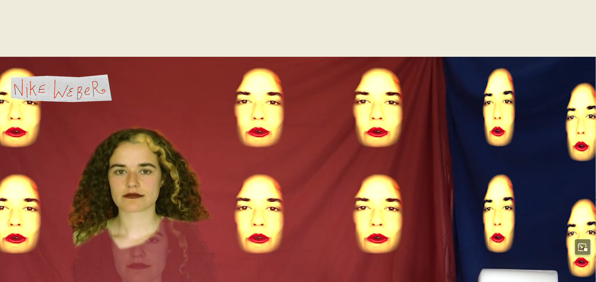
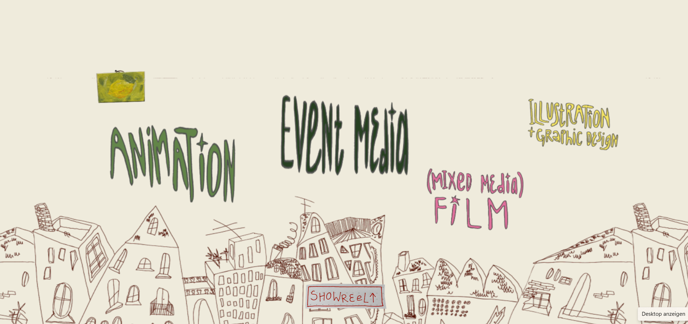
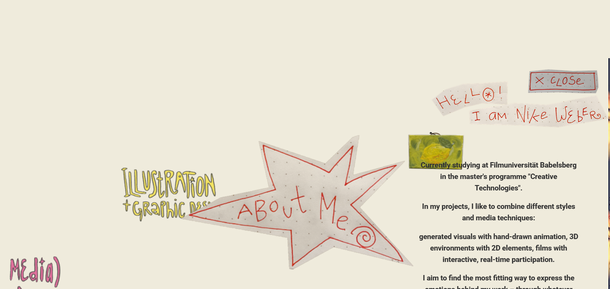

Creative Coding I

Jonathan Ho | jonathan.g.ho@filmuniversitaet.de
Prof. Dr. Lena Gieseke | l.gieseke@filmuniversitaet.de | Film University Babelsberg KONRAD WOLF
Session 05 - Systems (55 points)

## Task 05.01 - The Final Project

### Description of the project

For my final project I created an interactive portfolio landing page using Three.js and Vite. The website opens with a fullscreen video showreel, and scrolling down transitions into a horizontal 3D scene where six category labels are scattered across the screen at different depths. Each label can be clicked to zoom in, and the "About Me" card reveals a short info panel.
The main focus of my work went into building the core mechanics like the infinite horizontal scrolling, smooth camera movement, raycasting for click detection, and the intro-to-portfolio transition. I also worked on the implementation of a visual aesthetic, combining hand-drawn and photographed assets to create a sketchbook-like feel. Still, the project is a work in progress , due to the maximum time limit for this project, individual project pages per category are not yet implemented, and some visual details like the About Me panel still need refinement. I plan to continue developing this into a fully functional portfolio after the deadline.

#### Source Code can be found [here](https://owncloud.gwdg.de/index.php/s/AqoMIsapU6IOz66).
#### Link to Build: [Nikara Portfolio](https://nikara-portfolio.netlify.app/)
### Images

Showreel that is the first thing to show up

"Landing Page"

zoomed in on category "About me"

## Task 05.02 - Feedback

    How would you rate the difficulty of this class from 1 (far too easy) to 5 (far too difficult)?
    3
    How would you rate the amount of work you had to put into this class so far from 1 (no work at all) to 5 (far too much work)?
    2
    How much did you learn in the class and expanded your skill set, from 1 (I am the same) to 5 (learned a lot)?
    5
    How much did you enjoy working with p5, from 1 (hate it) to 5 (love it)?
    5
    How useful do you consider p5 for you, from 1 (don't need it) to 5 (will use it all the time)?
    2.5
    How much did you enjoy working with tree.js, from 1 (hate it) to 5 (love it)? 4
    How useful do you consider tree.js for you, from 1 (don't need it) to 5 (will use it all the time)? 4
    How much did you enjoy working with React, from 1 (hate it) to 5 (love it)?2
    How useful do you consider React for you, from 1 (don't need it) to 5 (will use it all the time)?3
    How much did you enjoy working on the exercise tasks, from 1 (hated it) to 5 (loved it)?4
    What do you think about the context expansions, e.g., the brief general discussions of certain topics?
    Which one was your favorite topic, which one your least favorite?
    Favorite topic: I think the most fascinating and therefore my favorite topic was three.js and the implementation of 3D objects on a website. Every Interaction that is possible through that was so interesting. 
    What I "liked" least: the creation of websites with React. It felt complicated after diving more deep into only threejs/vite and I also felt like there was no "obligation" to learn it through assignements.

    Was there a topic missing and if so which one?
    Please feel free to add any feedback you want to give!
    I feel that everyone in the course was always very engaged because every question was addressed and help was always available when technical problems occured. I believe this laid a very good foundation for us to implement our ideas and homework assignments.

## Learnings
### Personal Learnings of Final Project:
Technical
- implement Scrollanimation 
- Raycasting for interaction
- not too intense, but changing the style of a text in html and adding different kinds of media in html
- why color spaces matter in threejs and how to change them 
- deployed website over Netlify for the first time
- not technical, but I worked very iterative with the final project (started simple and builded up instead of big plans right ahead)

Personal learning in regards of other languages/coding tools

- there are different approaches to a project -> for me it really helps to have a clear version of what you want to achieve/code in the beginning
-  sometimes the unintended accidental results also lead to creative sparks, but in total I found it better to plan strict ahead to not get lost
- the course gave me an broad overview and exercices in various coding tools and it was very valuable to be shown all the options possible (I am thinking about three3js and animation/rigging there for example) and still managed to challenge me for very specifically and concrete projects

